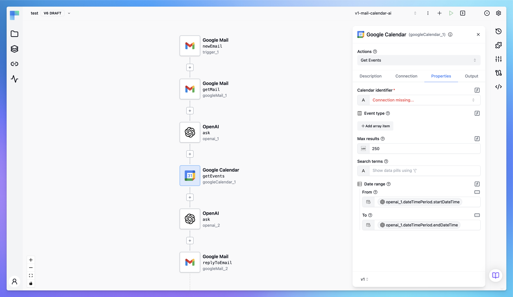

<p align="center">
    <a href="https://www.bytechef.io?utm_source=github&utm_medium=organic&utm_campaign=readme">
        
    </a>
</p>

<h1 align="center" style="border-bottom: none">API integration and workflow automation platform</h1>

<p align="center">
    <a href="https://www.bytechef.io?utm_source=github&utm_medium=organic&utm_campaign=readme">Website</a> - <a href="https://docs.bytechef.io?utm_source=github&utm_medium=organic&utm_campaign=readme">Documentation</a> - <a href="https://discord.gg/VKvNxHjpYx">Discord</a> - <a href="https://twitter.com/bytechefhq">Twitter</a>
</p>

<p align="center">
    <a href="https://github.com/bytechefhq/bytechef/actions/workflows/build_push.yml"></a> <a href="https://github.com/bytechefhq/bytechef/blob/master/LICENSE"></a>
</p>

> UPDATE: ByteChef is under active development. We are in the alpha stage, and some features might be missing or disabled.



## What is ByteChef?

ByteChef is an open-source, low-code, extendable API integration and workflow automation platform. ByteChef can help you as:

- An automation solution that allows you to integrate and build automation workflows across your SaaS apps, internal APIs, and databases.
- An embedded solution targeted explicitly for SaaS products, allowing your customers to integrate applications they use with your product.

### Key Features

- Intuitive UI Workflow Editor: build and visualize workflows via the UI editor by dragging and dropping components and defining their relations.
- Event-Driven & Scheduled Workflows: automate scheduled and real-time event-driven workflows via a simple trigger definition.
- Multiple flow controls: use the range of various flow controls such as condition, switch, loop, each, parallel, etc.
- Built-In Code Editor: if you need to go beyond no-code workflow definition, leverage our low-code capabilities and write workflow definitions in JSON format and blocks of the code executed during the workflow execution in one of the languages: Java, JavaScript, Python, and Ruby with syntax highlighting, auto-completion and real-time syntax validation.
- Rich Component Ecosystem: hundreds of components built in to extract data from any database, SaaS applications, internal APIs, or cloud storage.
- Extendable: develop custom connectors when no built-in connectors exist in the above-mentioned languages.
- AI ready: built-in AI components that can run multiple AI models and other AI algorithms.
- Developer ready: expose your workflows as APIs to be consumed by other applications or call directly APIs of targeted services. The platform handles authentication.
- Version Control Friendly: write your workflows from the UI editor and push them to your preferred Git branch directly from ByteChef, enabling best practices with CI/CD pipelines and version control systems.
- Self-hosted: install ByteChef on the premise to have complete control over execution and data, in addition to being able to use a hosted version.
- Scalable: it is designed to handle millions of workflows with high availability and fault tolerance. Start with one instance only, and scale as required.
- Structure & Resilience: bring resilience to your workflows with labels, sub-flows, retries, timeout, error handling, inputs, outputs that generate artifacts in the UI, variables, conditional branching, advanced scheduling, event triggers, dynamic tasks, sequential and parallel tasks, and skip tasks or triggers when needed by disabling them.

## Getting Started
There are couple ways to give ByteChef a quick spin on your local machine. You can use this to test, learn or contribute.

[//]: # ()
[//]: # (### ByteChef Cloud)
[//]: # ()
[//]: # ([ByteChef Cloud]&#40;https://app.bytechef.io?utm_source=github&utm_medium=organic&utm_campaign=readme&#41; is the fastest way to get started with ByteChef. It provides managed infrastructure as well as an instant and free trial access for development projects and proofs of concept.)
[//]: # ()
[//]: # (<a href="https://app.bytechef.io?utm_source=github&utm_medium=organic&utm_campaign=readme"></a>)
[//]: # ()
[//]: # (For a step-by-step guide on ByteChef Cloud, [see the docs]&#40;https://docs.bytechef.io/cloud/getting-started?utm_medium=organic&utm_campaign=readme&#41;.)
[//]: # ()

### Docker

#### Method 1 - Start Containers With Docker Compose

**Requirement:** [Docker Desktop](https://www.docker.com/products/docker-desktop/) - Docker compose allows you to configure and run several dependent docker containers. Some OS environments may not support it. In that case follow Method 2 described later.

This is the fastest possible way to start Bytechef. There is [docker-compose.yml](https://github.com/bytechefhq/bytechef/blob/master/docker-compose.yml) in the repository root. Either checkout repository locally to your machine or download file. Make sure you execute this command taking care of correct path to `docker-compose.yml` file:
```bashTaskHandler
docker compose -f docker-compose.yml up
```
Both postgres database and bytechef docker container would start.

#### Method 2 - Start Containers With Classic Docker

This option demands pinch of focus as it allows user to profile containers. Run the following commands from your terminal to have ByteChef up and running right away.

##### Create Docker Network
```bashTaskHandler
docker network create -d bridge bytechef_network
```
##### Start Postgres Docker Container
```bashTaskHandler
docker run --name postgres -d -p 5432:5432 \
    --env POSTGRES_USER=postgres \
    --env POSTGRES_PASSWORD=postgres \
    --hostname postgres \
    --network bytechef_network \
    -v /opt/postgre/data:/var/lib/postgresql/data \
    postgres:15-alpine
```
NOTE: `-v` mount option is not mandatory. It mounts local DB storage to make easier access to DB infrastructure files.

##### Start ByteChef Docker Container
```bashTaskHandler
docker run --name bytechef -it -p 8080:8080 \
    --env BYTECHEF_DATASOURCE_URL=jdbc:postgresql://postgres:5432/bytechef \
    --env BYTECHEF_DATASOURCE_USERNAME=postgres \
    --env BYTECHEF_DATASOURCE_PASSWORD=postgres \
    --env BYTECHEF_SECURITY_REMEMBER_ME_KEY=e48612ba1fd46fa7089fe9f5085d8d164b53ffb2 \
    --network bytechef_network \
    docker.bytechef.io/bytechef/bytechef:latest
```
NOTE: `-it` (interactive) flag may be replaced with `-d` (detached). Keep it interactive if you want to track logs which can be handy for troubleshooting. Use `-p 8080:8080` to customize port.

###  Access Bytechef

Use browser and open http://localhost:8080/login (please take care about port - if port setting is modified in docker compose file or docker run command, this URL should be updated). Chose Create Account link to setup user and than use same user and password to sign in.

[//]: # (### Self-Hosted)
[//]: # ()
[//]: # (If you want to self-host ByteChef, we have [guides]&#40;https://docs.bytechef.io/self-hosting?utm_source=github&utm_medium=organic&utm_campaign=readme&#41; for Docker, AWS and more.)
[//]: # ()
## Documentation

Documentation is available at [docs.bytechef.io](https://docs.bytechef.io?utm_source=github&utm_medium=organic&utm_campaign=readme). It covers all the necessary information to get started with ByteChef, including installation, configuration, and usage.

- [Getting Started](https://docs.bytechef.io/automation?utm_source=github&utm_medium=organic&utm_campaign=readme)
- [Developer Guide](https://docs.bytechef.io/developer-guide)
- [Component Reference](https://docs.bytechef.io/reference)

[//]: # (- [Architecture]&#40;https://docs.bytechef.io/architecture?utm_source=github&utm_medium=organic&utm_campaign=readme&#41;)
[//]: # (- [Components Reference]&#40;https://docs.bytechef.io/components&#41;)

## Community support

[//]: # (For general help using ByteChef, please refer to the official [documentation]&#40;https://docs.bytechef.io?utm_source=github&utm_medium=organic&utm_campaign=readme&#41;. For additional help, you can use one of these channels to ask a question:)

[//]: # (- [Discord]&#40;https://discord.gg/VKvNxHjpYx; - Discussions with the community and the team.)
[//]: # (- [GitHub]&#40;https://github.com/bytechefhq/bytechef/issues&#41; - For bug reports and feature requests.)
[//]: # (- [Forum]&#40;https://github.com/bytechefhq/bytechef/discussions&#41; - Ask for help and propose new ideas.)
[//]: # (- [Twitter]&#40;https://twitter.com/bytechefhq&#41; - Get the product updates easily.)

For help, you can use one of these channels to ask a question:

- [Discord](https://discord.gg/VKvNxHjpYx) - Discussions with the community and the team.
- [GitHub](https://github.com/bytechefhq/bytechef/issues) - For bug reports and feature requests.
- [Twitter](https://twitter.com/bytechefhq) - Get the product updates easily.

## Roadmap
Check out our [roadmap](https://github.com/orgs/bytechefhq/projects/3) to get informed of the latest features released and the upcoming ones.

### Contributing

If you'd like to contribute, kindly read our [Contributing Guide](CONTRIBUTING.md) to learn and understand about our development process, how to propose bug fixes and improvements, and how to build and test your changes to ByteChef.

## License
ByteChef is released under Apache License v2.0. See [LICENSE](LICENSE) for more information.

## Contributors
<!-- automd:contributors github="bytechefhq/bytechef" -->

Made by [community](https://github.com/bytechefhq/bytechef/graphs/contributors) 💛
<br><br>
<a href="https://github.com/bytechefhq/bytechef/graphs/contributors">

</a>

<!-- /automd -->

## Note
This project has started as a fork of [Piper](https://github.com/runabol/piper), an open-source, distributed workflow engine.


