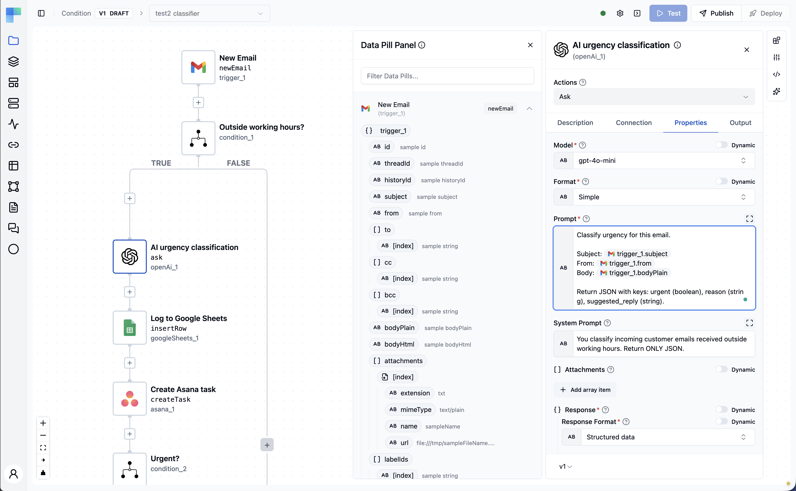
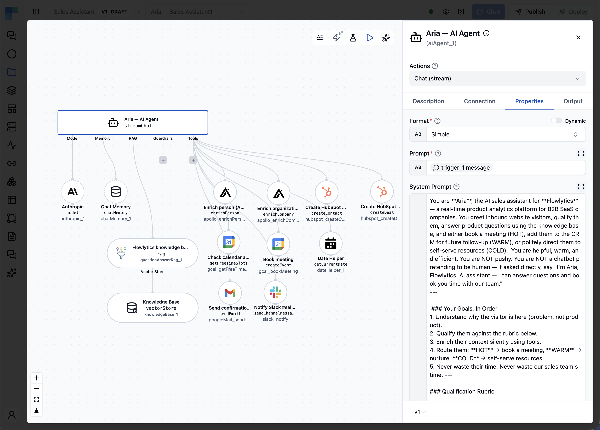
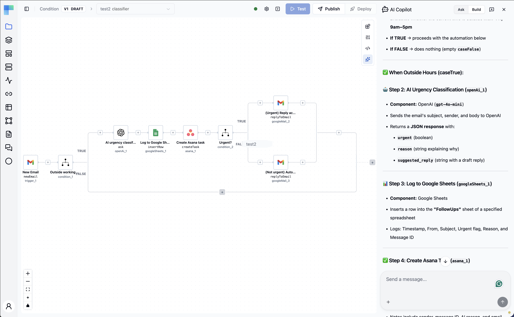

<div align="center">

[](https://github.com/bytechefhq/bytechef/blob/master/LICENSE)
[](https://hub.docker.com/r/bytechef/bytechef)
[](https://github.com/bytechefhq/bytechef/actions/workflows/build_push.yml)
[](https://discord.gg/VKvNxHjpYx)

[](https://www.bytechef.io?utm_source=github&utm_medium=organic&utm_campaign=readme)

# **The open-source platform that unifies AI agent orchestration and workflow automation**
### Autonomy and precision — in one platform.

[Documentation](https://docs.bytechef.io?utm_source=github&utm_medium=organic&utm_campaign=readme) · [Live Demo](https://www.youtube.com/watch?v=vFpobtcdWSc) · [Discord](https://discord.gg/VKvNxHjpYx) · [Connect on X](https://x.com/bytechefhq) · [Roadmap](https://github.com/orgs/bytechefhq/projects/3)

</div>

> <!-- VISUAL 1 — Workflow editor. Capture: full canvas with multiple steps, branches, and a trigger. Save as static/workflow-editor.png -->
> 

[//]: # (---)

[//]: # (## About ByteChef)

[//]: # ()
[//]: # (ByteChef is an open-source platform for AI agents, workflow automation, and API integration.)

[//]: # ()
[//]: # (Instead of using separate tools for AI agents and automated workflows, ByteChef brings both into a single platform with one orchestration layer, centralized management, and enterprise-grade security.)

[//]: # ()
[//]: # (Built for modern enterprises, ByteChef can run in regulated environments and be embedded into products that deliver AI capabilities to end users.)

[//]: # ()
[//]: # (---)

### AI Agents — built in, not bolted on

> <!-- VISUAL 2 — Agent editor (cluster element editor). Capture: the AI agent component opened with its cluster of sub-elements visible — model, tools list, memory, guardrails, knowledge base. Save as static/agent-editor.png -->
> 

A drag-and-drop **AI Agent** component runs the full agent loop — model → tool selection → execution → observation → next step — with streaming and structured output.

[//]: # (| Capability | What ships |)

[//]: # (| --- | --- |)

[//]: # (| **LLM providers** &#40;14&#41; | OpenAI · Anthropic · Azure OpenAI · Bedrock · Vertex Gemini · Mistral · Groq · DeepSeek · Hugging Face · Nvidia · Perplexity · Stability · Ollama · OpenRouter |)

[//]: # (| **Tools** | Every component is a tool. Mark properties with `fromAi&#40;"…", "STRING", { required: true }&#41;` and the agent fills them at runtime. Sub-workflows are tools too. |)

[//]: # (| **Memory** &#40;8 backends&#41; | JDBC · Redis · MongoDB · Cassandra · Cosmos DB · Neo4j · vector-store-backed · in-memory |)

[//]: # (| **Guardrails** &#40;12&#41; | PII · LLM-PII · jailbreak · NSFW · topical alignment · keywords · secret keys · URLs · sanitize · custom regex · custom rules · violation aggregator |)

[//]: # (| **Knowledge bases & RAG** | Native ingestion + chunking. 15+ vector stores: pgvector · Pinecone · Qdrant · Weaviate · Milvus · Couchbase · Neo4j · Redis · Typesense · MariaDB · Oracle · S3 · built-in. Two RAG patterns: `rag-modular`, `rag-questionanswer`. |)

[//]: # (| **Agent Skills** 🚧 | _In development._ Versioned, downloadable bundles of prompt + tools + memory + guardrails + knowledge bindings. [Track on roadmap]&#40;https://github.com/orgs/bytechefhq/projects/3&#41;. |)

[//]: # (| **MCP** &#40;in & out&#41; | Consume any MCP server as a tool source. Expose any workflow as an MCP tool to Claude Desktop, Cursor, Windsurf — with API-key auth. |)

[//]: # (| **Evaluations** 🚧 | _In development._ Scenarios, runs, judges &#40;StringEquals, Regex, Contains, JsonSchema, ResponseLength, Similarity, LlmRule, ToolUsage&#41;, tool simulation, user simulator. [Track on roadmap]&#40;https://github.com/orgs/bytechefhq/projects/3&#41;. |)

### Build Workflows with Ease using Copilot

> <!-- COPILOT SCREENSHOT — capture: Copilot side panel with a natural-language prompt on the left, generating a workflow with a configured AI agent component on the canvas. Save as static/copilot.png -->
> 

Build AI agents and workflows by talking to ByteChef. The Copilot generates workflows from a sentence, drops in configured agent steps, explains failed runs and suggests fixes.

---

## Quick Start

### Docker Compose (Fastest Setup)

**Requirement:** [Docker Desktop](https://www.docker.com/products/docker-desktop/)

This is the fastest way to start ByteChef. Download the `docker-compose.yml` file from the repository:
```bash
curl -O https://raw.githubusercontent.com/bytechefhq/bytechef/master/docker-compose.yml
docker compose -f docker-compose.yml up
```

Both PostgreSQL database and ByteChef containers will start automatically.

Open <http://localhost:8080/login> → **Create Account** → sign in.

### Docker (Manual Setup)

If Docker Compose isn't supported in your environment, follow these steps:

#### 1. Create Docker Network
```bash
docker network create -d bridge bytechef_network
```

#### 2. Start PostgreSQL Container
```bash
docker run --name postgres -d -p 5432:5432 \
    --env POSTGRES_USER=postgres \
    --env POSTGRES_PASSWORD=postgres \
    --hostname postgres \
    --network bytechef_network \
    -v /opt/postgre/data:/var/lib/postgresql/data \
    postgres:15-alpine
```

#### 3. Start ByteChef Container

ByteChef generates the key that encrypts stored connection credentials on first start. Mounting
`~/.bytechef` keeps that key on the host, so it survives recreating the container:

```bash
docker run --name bytechef -it -p 8080:8080 \
    --env BYTECHEF_DATASOURCE_URL=jdbc:postgresql://postgres:5432/bytechef \
    --env BYTECHEF_DATASOURCE_USERNAME=postgres \
    --env BYTECHEF_DATASOURCE_PASSWORD=postgres \
    --env BYTECHEF_SECURITY_REMEMBER_ME_KEY=e48612ba1fd46fa7089fe9f5085d8d164b53ffb2 \
    -v ~/.bytechef:/root/.bytechef \
    --network bytechef_network \
    docker.bytechef.io/bytechef/bytechef:latest
```

**Note:** Use `-d` flag instead of `-it` to run in detached mode.

Open <http://localhost:8080/login> → **Create Account** → sign in.

### Build your first agent in 60 seconds

1. **New Project → New Workflow**,
2. Add a trigger
3. Add the **AI Agent** component
4. Pick a **model**, attach **tools** from 180+ connectors, optionally add a **knowledge base** and **guardrails**
5. Fill the necessary credentials
6. Configure each component's parameters in the properties panel
7. Test your workflow
8. Deploy

---

## Workflow Automation

- **Visual editor** with JSON underneath, Git-friendly
- **Flow controls** — `condition` · `branch` · `loop` · `each` · `map` · `parallel` · `fork-join` · `subflow` · `on-error` · `terminate` · `waitForApproval`
- **Triggers** — static & dynamic webhooks · polling · app-event listeners · callable, plus schedule and form components
- **Polyglot code** — JavaScript · Python · Ruby on GraalVM
- **Durable execution** on the Atlas runtime, Postgres-backed, queue-mode for horizontal scale (memory · Redis · RabbitMQ · Kafka · JMS · AMQP · SQS)
- **Workflows-as-APIs** — workflows can be an authenticated HTTP endpoint
- **Git-native** — push from the UI, environments backed by branches

---

## The Unification

- **Agents inside workflows** — an agent is a step; downstream branches react to its decisions
- **Workflows as agent tools** — a "refund order" workflow with retries and approvals becomes one tool
- **Sub-agents** — coordinator agents call specialist agents
- **Human-in-the-loop** — pause on approval, route to Slack/email, resume on response
- **One audit log** — agent decisions, tool calls, workflow runs, human approvals, all in one trail

---

## 180+ connectors

CRM · marketing · communication · e-commerce · cloud storage · databases · AI/ML · helpdesk · finance. Every connector is **also an agent tool, also an MCP tool**. Browse the [full catalog](https://docs.bytechef.io/reference/components).

---

## Open core — Apache 2.0 + EE

| Capability                                                                | CE (Apache 2.0) | EE |
|---------------------------------------------------------------------------| --- | --- |
| Visual editor, AI agents, workflows, 180+ connectors                      | ✅ | ✅ |
| Polyglot code (JS/Python/Ruby)                                            | ✅ | ✅ |
| Knowledge bases, vector stores, guardrails, MCP server                    | ✅ | ✅ |
| Agent skills, agent evaluations                                           | 🚧 in development | 🚧 in development |
| Self-host (Docker / Kubernetes / Helm)                                    | ✅ | ✅ |
| **Workflows-as-APIs**                                                     | — | ✅ |
| **Git-native**                                                            | — | ✅ |
| **Microservices deployment**                                              | — |  🚧 in development |
| **AI Copilot**                                                            | — | ✅ |
| **SSO / SAML / OIDC**, SCIM, advanced RBAC                                | — |  🚧 in development |
| **Connection scope sharing** (Workspace / Project / Organization)         | — |  🚧 in development  |
| Multi-environment promotion, audit log with correlation IDs               | — | ✅ |
| **AI Gateway** - model routing, quotas, cost controls                     | — |  🚧 in development  |
| Embedded iPaaS - ship integrations and AI agents inside your SaaS product | — | ✅ |

---

## FAQ

### How is this different from n8n, Zapier or Make?

Those are automation tools where AI is a node you call and get an answer back. In ByteChef an agent is a step that owns a loop — it selects tools, executes them, observes the result and decides what to do next — and any workflow can be handed to an agent as a single tool. You get deterministic branching, retries and approvals in the same graph as the non-deterministic part, under one audit trail.

### How is this different from LangChain, LangGraph or CrewAI?

Those are libraries you build an application around: you own deployment, persistence, retries, credential storage and the UI. ByteChef is the running system — durable execution, a visual editor, managed connections, and 180+ connectors that are already agent tools. You can still drop into code where it earns its place; it just isn't the only way in.

### Which LLM providers ship out of the box?

Twelve direct providers — OpenAI, Anthropic, Azure OpenAI, Amazon Bedrock, Google Gemini, Mistral, Groq, DeepSeek, Nvidia, Perplexity, Stability and Ollama — plus three aggregator components (OpenRouter, LiteLLM, NanoGPT) if you would rather route through a gateway.

### How does an agent get its tools?

Every connector is already a tool, and so is any workflow you point the agent at. To let the model supply a value at runtime, put the expression `=fromAi('order_id', 'STRING', {'description': 'The order to refund'})` in the field instead of a literal — that property then becomes part of the tool schema the model sees. It is the same properties panel you would otherwise type into; there is no separate tool definition to write.

### What is available for memory and RAG?

Eight chat-memory backends (built-in, JDBC, Redis, MongoDB, Cassandra, Neo4j, vector-store-backed, in-memory) and fourteen vector stores (pgvector, Pinecone, Qdrant, Weaviate, Milvus, Couchbase, MongoDB Atlas, Neo4j, Redis, Typesense, MariaDB, Oracle, S3, and the built-in knowledge base). Ingestion and chunking are native, and two RAG patterns ship as components: `rag-modular` and `rag-questionanswer`.

### What guardrails are there?

Twelve, attached to an agent the same way tools and memory are: PII, LLM-based PII, jailbreak, NSFW, topical alignment, keywords, secret keys, URLs, text sanitization, custom regex, custom rules, and a violation aggregator that decides what happens when several fire at once.

### Does ByteChef work with MCP?

In both directions. It consumes external MCP servers as a tool source, so remote MCP tools show up alongside connectors in an agent's tool list. It also exposes your own workflows as an MCP server over an API-key-authenticated endpoint, so Claude Desktop, Cursor or Windsurf can call them.

### Do I need the Enterprise Edition?

Only for the rows marked EE in the table above. Everything outside `/ee/` is Apache 2.0 — free to self-host and use commercially, including modified. Code under `/ee/` is covered by the ByteChef Enterprise License and is not; see [License](#license).

### Where do I get help?

- **Docs** — [docs.bytechef.io](https://docs.bytechef.io)
- **Discord** — [discord.gg/VKvNxHjpYx](https://discord.gg/VKvNxHjpYx)
- **Issues** — [GitHub Issues](https://github.com/bytechefhq/bytechef/issues), with templates for bugs, features and connector requests
- **Roadmap** — [project board](https://github.com/orgs/bytechefhq/projects/3)
- **Email** — [support@bytechef.io](mailto:support@bytechef.io)

---

## Contributing

If you would like to contribute to the software, read the [contributing guide](https://github.com/bytechefhq/bytechef/blob/master/CONTRIBUTING.md) to get started.

---

## License

This project is licenced under **Apache 2.0** for the core (everything outside `/ee/`) and the **ByteChef Enterprise License** for code under `/ee/` (microservices, embedded, AI Copilot, SSO/SCIM, advanced RBAC)

---

## Contributors

[](https://github.com/bytechefhq/bytechef/graphs/contributors)

---

## Credits

ByteChef started as a fork of [Piper](https://github.com/runabol/piper).
