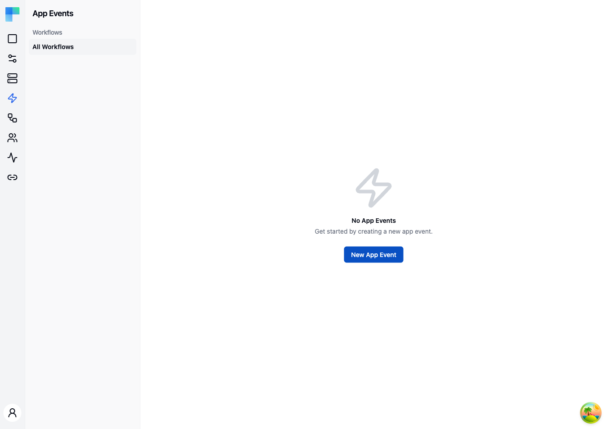

---

## Key Features

| Feature | Description |
|---|---|
| Event-driven triggers | Define events that originate from your application and connect them to workflows. |
| Workflow filtering | Filter app events by the workflows they trigger using the left sidebar. |
| Multiple workflow support | A single app event can trigger multiple workflows simultaneously. |
| Environment awareness | App events respect the current environment setting. |

---

## How to Use

### Creating an App Event

1. Click the **New App Event** button in the top-right corner.
2. Provide a name and schema for the event.
3. Map the event to one or more workflows that should execute when the event fires.
4. Click **Save** to create the app event.

### Firing App Events

App events are triggered programmatically from your application using the ByteChef API. When your application calls the app event endpoint with the event name and payload, ByteChef executes all workflows mapped to that event.

Example use cases:

- **User signup** -- trigger a workflow that syncs the new user to your CRM and sends a welcome email via Mailchimp.
- **Order placed** -- trigger a workflow that creates an invoice in your accounting system and notifies your team on Slack.
- **Record updated** -- trigger a workflow that syncs changes to a third-party database or spreadsheet.

### Filtering App Events

Use the left sidebar to filter app events by workflow. Select "All Workflows" to view every app event, or click a specific workflow to see only the events that trigger it.

### Managing App Events

- **Edit** -- update the event name, schema, or workflow mappings.
- **Delete** -- remove the app event and its workflow associations.
