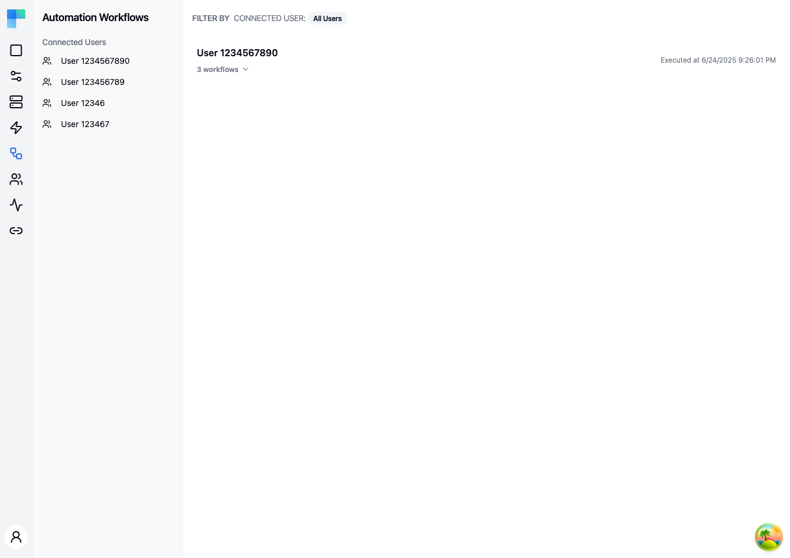

---

## Key Features

| Feature | Description |
|---|---|
| Connected user filtering | Filter automation workflows by connected user using the left sidebar. |
| Environment scoping | Automations are scoped to the current environment (Development, Staging, Production). |
| Workflow visibility | See all workflows associated with each connected user's projects. |
| Execution tracking | View the last execution date for each automation. |

### Automation Entry Details

Each entry in the list displays:

- **User identifier** -- the external ID of the connected user who owns the automation.
- **Workflow count** -- how many workflows are running for this user.
- **Last execution date** -- when the most recent workflow execution occurred.

---

## How to Use

### Viewing Automations

Automations are created automatically when connected users activate integrations through your embedded iPaaS. This page provides a read-only overview of those active automations.

1. Navigate to the **Automations** page from the Embedded sidebar.
2. The main area displays all connected user projects with their associated workflows.
3. Expand a project to see individual workflows and their details.

### Filtering by Connected User

Use the left sidebar to filter the view:

- **All Connected Users** -- shows automation workflows across all users.
- **Specific user** -- click a connected user entry to see only their automations.

### Environment Selection

Use the environment selector to switch between environments. Each environment has its own set of automation workflows based on which connected users are active in that environment.

### Workflow Details

Click on a workflow entry to view its configuration and execution history. From here you can inspect the workflow steps and review recent execution results.
