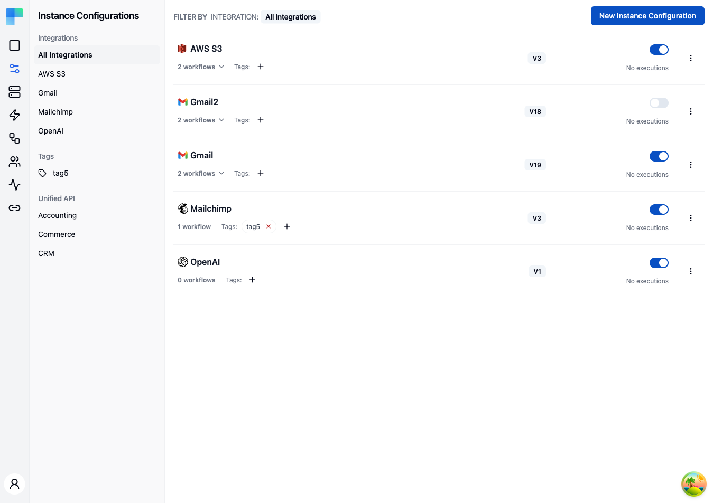

---

## Key Features

| Feature | Description |
|---|---|
| Environment scoping | Each configuration is tied to an environment (Development, Staging, Production). Use the environment selector to switch views. |
| Integration filtering | Filter configurations by integration using the left sidebar. |
| Tag filtering | Filter configurations by tag for quick access. |
| Unified API filtering | When enabled, filter by Unified API category (Accounting, Commerce, CRM). |
| Enable/Disable toggle | Activate or deactivate a configuration without deleting it. |
| Version selection | Choose which published version of an integration to deploy. |

### Configuration Details

Each configuration in the list displays:

- **Integration name** -- the name and icon of the underlying integration.
- **Workflow count** -- number of workflows included in this configuration.
- **Version** -- the published integration version deployed by this configuration.
- **Tags** -- assigned tags for organization and filtering.
- **Enabled/Disabled status** -- whether the configuration is currently active.
- **Execution count** -- how many times workflows in this configuration have been executed.

---

## How to Use

### Creating a Configuration

1. Click the **New Instance Configuration** button in the top-right corner.
2. Select the integration you want to deploy.
3. Choose the published version to use.
4. Configure connection credentials and workflow-specific settings.
5. Assign tags if desired.
6. Click **Save** to create the configuration.

### Managing Configurations

- **Enable/Disable** -- toggle a configuration on or off to control whether its workflows execute.
- **Edit** -- update the version, connections, or workflow settings.
- **Delete** -- remove the configuration entirely.

### Filtering Configurations

Use the left sidebar to narrow the list:

- **Integrations** -- select a specific integration to show only its configurations, or choose "All Integrations" to see everything.
- **Tags** -- click a tag to filter by that tag.
- **Unified API** -- filter by Accounting, Commerce, or CRM category.

### Environment Selection

Configurations are scoped to environments. Use the environment selector in the header to switch between Development, Staging, and Production. Each environment maintains its own set of configurations independently.
