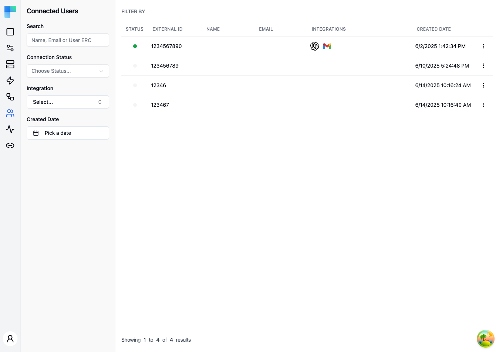

---

## Key Features

| Feature | Description |
|---|---|
| User table | A paginated table of all connected users with key details. |
| Search | Search by name, email, or user ERC (External Reference Code). |
| Status filtering | Filter by connection status (Valid or Invalid). |
| Integration filtering | Filter by specific integration to find users of a particular service. |
| Date range filtering | Filter by the date range when users were created. |
| Pagination | Navigate through large user lists with page controls. |

### Table Columns

| Column | Description |
|---|---|
| Status | Connection credential status indicator -- green for Valid, gray for Invalid. |
| External Id | The external identifier assigned to the user by your application. |
| Name | The user's display name. |
| Email | The user's email address. |
| Integrations | Icons representing which integrations the user has connected. |
| Created Date | When the connected user record was created. |

---

## How to Use

### Viewing Connected Users

1. Navigate to the **Connected Users** page from the Embedded sidebar.
2. The table displays all connected users for the current environment.
3. Click on a user row to open a detail sheet with full information about their connections and integrations.

### Filtering Users

Use the left sidebar filters to narrow the user list:

- **Search** -- enter a name, email address, or user ERC to find specific users.
- **Connection Status** -- select "Valid" or "Invalid" to filter by credential status.
- **Integration** -- select an integration to show only users who have connected that service.
- **Created Date** -- pick a date range to filter users by when they were created.

Click **Filter** to apply the selected filters.

### User Details

Click on a connected user row to open a side panel showing:

- Full user profile information (name, email, external ID).
- List of connected integrations with their status.
- Connection details for each integration.

### Environment Selection

Connected users are scoped to the current environment. Use the environment selector to switch between Development, Staging, and Production to see users in each environment.
