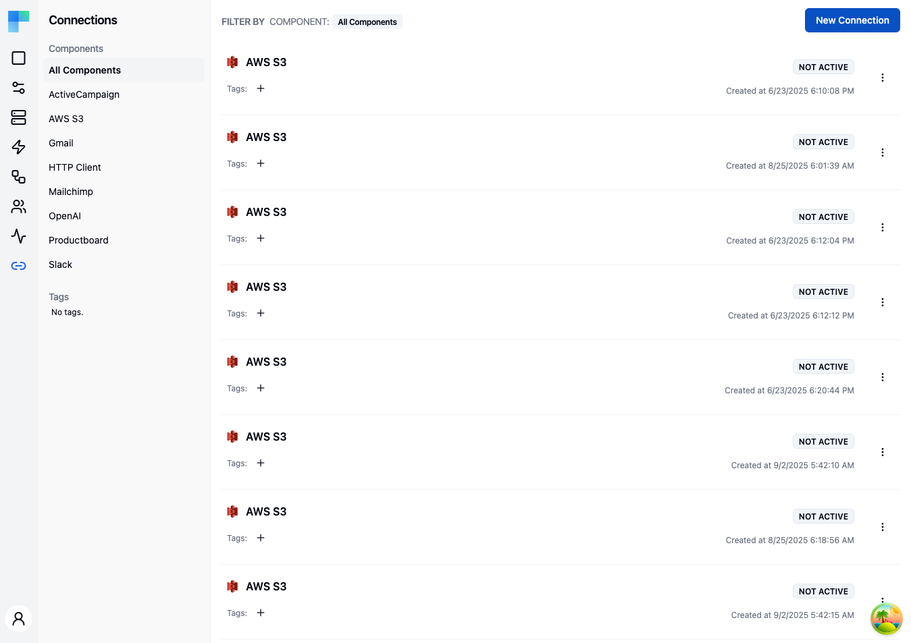

---

## Key Features

| Feature | Description |
|---|---|
| Component filtering | Filter connections by component (third-party service) using the left sidebar. |
| Tag filtering | Organize and filter connections by assigned tags. |
| Environment scoping | Connections are scoped to the current environment (Development, Staging, Production). |
| Status indicator | Each connection shows whether it is ACTIVE or NOT ACTIVE. |
| Creation date | See when each connection was created. |

### Connection Details

Each connection in the list displays:

- **Component icon** -- the icon of the third-party service.
- **Component name** -- the name of the connected service (e.g., Gmail, Slack, AWS S3).
- **Status** -- ACTIVE (credentials are valid) or NOT ACTIVE (credentials need attention).
- **Tags** -- assigned tags for organization.
- **Creation date** -- when the connection was created.

---

## How to Use

### Creating a Connection

1. Click the **New Connection** button in the top-right corner.
2. Select the component (third-party service) you want to connect to.
3. Provide the required authentication credentials (API key, OAuth, etc.).
4. Assign tags if desired.
5. Click **Save** to create the connection.

The connection will be validated and its status set to ACTIVE if the credentials are correct.

### Managing Connections

- **Edit** -- update credentials or tags for an existing connection.
- **Delete** -- remove a connection. Workflows using this connection will need a replacement.
- **Tag** -- add or remove tags to organize connections.

### Filtering Connections

Use the left sidebar to filter the connection list:

- **Components** -- the sidebar lists all components that have at least one connection. Click a component name to show only its connections, or select "All Components" to view everything.
- **Tags** -- click a tag to filter by that tag.

### Environment Selection

Connections are scoped to environments. Use the environment selector to switch between Development, Staging, and Production. Each environment maintains its own set of connections, allowing you to use different credentials for testing and production.

### Connection Status

| Status | Description |
|---|---|
| ACTIVE | The connection credentials are valid and the integration can communicate with the service. |
| NOT ACTIVE | The credentials are missing, expired, or invalid. Update the connection to restore functionality. |
