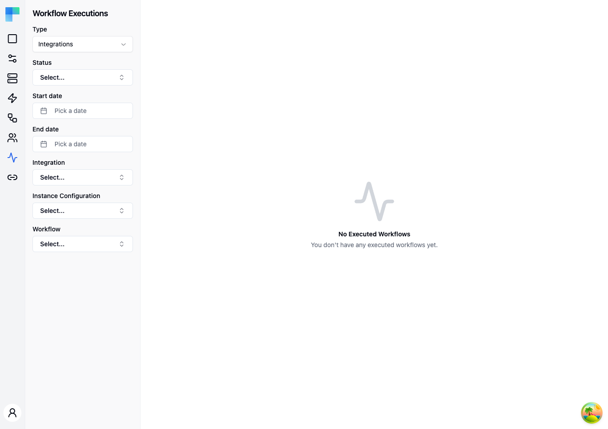

---

## Key Features

| Feature | Description |
|---|---|
| Type filtering | Switch between Integration executions and Automation executions. |
| Status filtering | Filter by execution status: Started, Completed, Created, Stopped, or Failed. |
| Date range filtering | Filter by start date and end date to narrow the time window. |
| Integration filtering | Filter by a specific integration (available in Integrations mode). |
| Instance Configuration filtering | Filter by a specific instance configuration (available in Integrations mode). |
| Workflow filtering | Filter by a specific workflow (available in Integrations mode). |
| Connected User filtering | Filter by connected user (available in Automations mode). |
| Pagination | Navigate through large execution lists with page controls. |

### Execution Details

Each execution entry shows:

- **Status** -- the current state of the execution (Started, Completed, Failed, etc.).
- **Duration** -- how long the execution took.
- **Timestamps** -- when the execution started and ended.
- **Step-by-step results** -- click an execution to view detailed results for each workflow step.

---

## How to Use

### Viewing Executions

1. Navigate to the **Executions** page from the Embedded sidebar.
2. The table displays all workflow executions for the current environment.
3. Click on an execution row to open a detail sheet with full step-by-step results.

### Filtering Executions

Use the left sidebar to apply filters:

| Filter | Applies To | Description |
|---|---|---|
| Type | Both | Switch between "Integrations" and "Automations" mode. |
| Status | Both | Select a status to show only executions in that state. |
| Start date | Both | Show only executions that started on or after this date. |
| End date | Both | Show only executions that started on or before this date. |
| Integration | Integrations | Select an integration to filter by. |
| Instance Configuration | Integrations | Select a specific instance configuration. |
| Workflow | Integrations | Select a specific workflow. |
| Connected Users | Automations | Select a connected user to see their executions. |

### Execution Detail View

Click on any execution row to open a detail sheet that shows:

- The overall execution status and timing.
- Each workflow step with its input, output, and status.
- Error messages and stack traces for failed steps.
- The data passed between steps in the workflow.

### Environment Selection

Executions are scoped to the current environment. Use the environment selector in the header to switch between Development, Staging, and Production.
