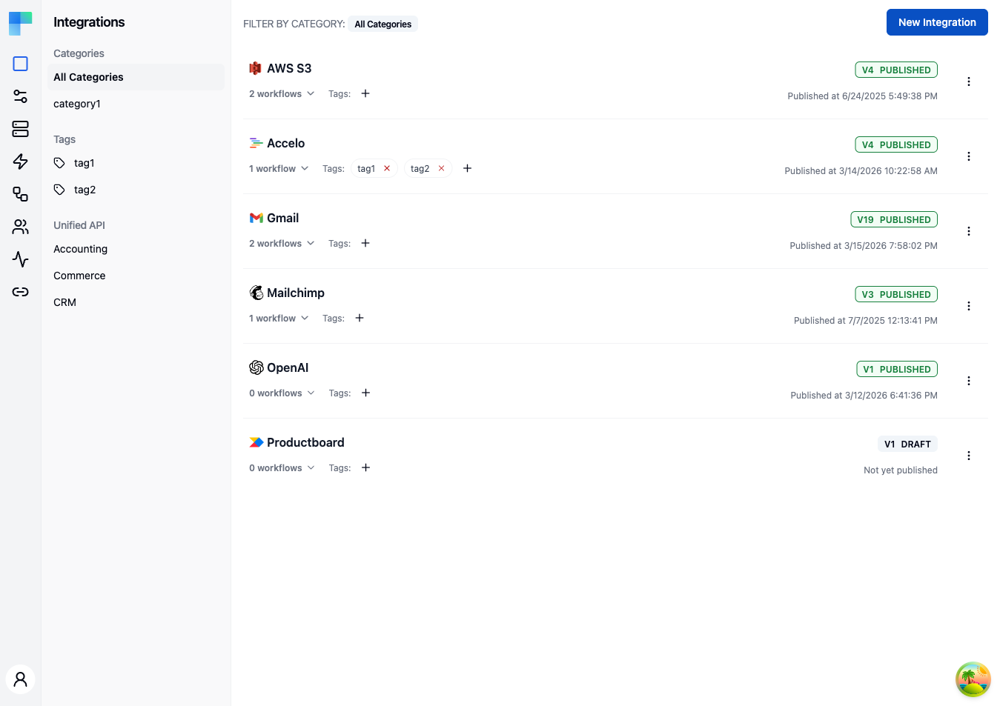

---

## Key Features

| Feature | Description |
|---|---|
| Categories | Organize integrations by category for easy discovery. The left sidebar lists all available categories. |
| Tags | Assign tags to integrations for flexible grouping and filtering. |
| Unified API | Filter integrations by Unified API category (Accounting, Commerce, CRM) when the feature is enabled. |
| Versioning | Each integration tracks versions with a status of DRAFT or PUBLISHED. |
| Workflow count | The integration card shows how many workflows belong to that integration. |
| Publish date | Displays when the integration was last published, or "Not yet published" for drafts. |

### Integration Card Details

Each integration in the list displays:

- **Icon and name** -- the component icon and integration name, linking to the workflow editor.
- **Workflow count** -- the number of workflows contained in the integration, expandable to view the list.
- **Tags** -- assigned tags shown as badges; click to add or remove tags.
- **Version badge** -- shows the current version number and status (e.g., `V1 PUBLISHED` or `V2 DRAFT`).
- **Last published date** -- timestamp of the most recent publish, or a "Not yet published" notice.

---

## How to Use

### Creating an Integration

1. Click the **New Integration** button in the top-right corner of the Integrations page.
2. In the dialog, select the component (third-party service) you want to integrate with.
3. Provide a name and optional category and tags.
4. Click **Save**. ByteChef creates the integration with a default workflow and opens the workflow editor.

### Managing Integrations

Use the three-dot menu on each integration card to:

| Action | Description |
|---|---|
| Edit | Update the integration name, category, or tags. |
| View Workflows | Open the workflow editor for this integration. |
| New Workflow | Add another workflow to the integration. |
| Publish | Publish the current draft version, making it available to connected users. |
| Import Workflow | Import a workflow from a JSON or YAML file. |
| Delete | Permanently delete the integration and all its workflows. |

### Filtering Integrations

Use the left sidebar to filter the integration list:

- **Categories** -- click a category name to show only integrations in that category, or select "All Categories" to view everything.
- **Tags** -- click a tag to filter by that tag.
- **Unified API** -- when enabled, filter by Accounting, Commerce, or CRM to find integrations that support unified API access.

### Publishing an Integration

Publishing creates a new version of the integration that can be deployed to connected users through Instance Configurations. The version number increments with each publish. Only published versions can be activated in production environments.
