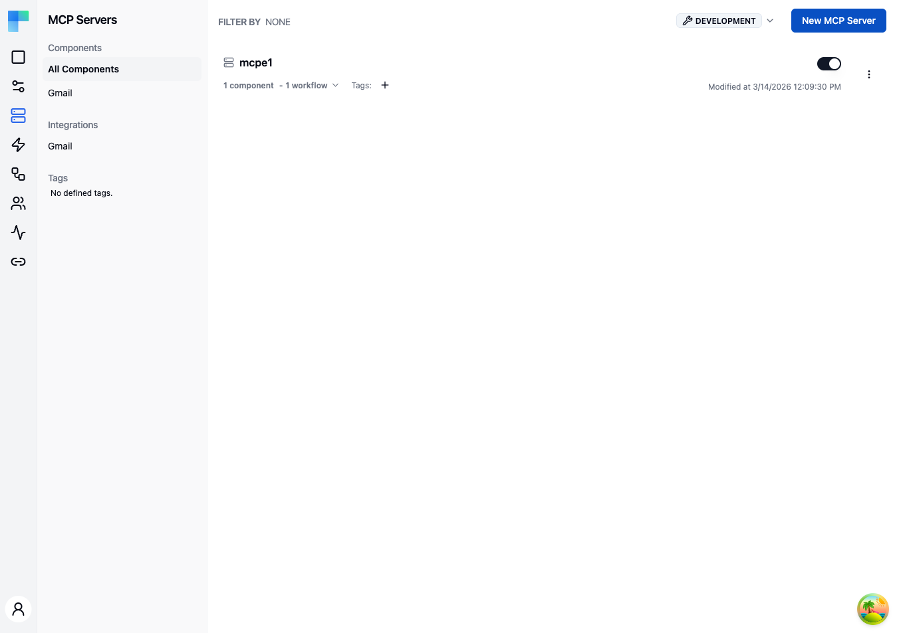

---

> **Coming soon.** Embedded MCP Servers are on the upcoming release track and are not yet available in the latest released version of ByteChef.

## Key Features

| Feature | Description |
|---|---|
| Component filtering | Filter MCP servers by the components they expose using the left sidebar. |
| Integration filtering | Filter by the integrations associated with the server. |
| Tag filtering | Organize and filter servers by assigned tags. |
| Environment selector | Choose the environment (e.g., Development) in the header. |
| Enable/Disable toggle | Activate or deactivate an MCP server without removing it. |

### MCP Server Details

Each server in the list displays:

- **Name** -- the server name.
- **Component count** -- how many components the server exposes as MCP tools.
- **Workflow count** -- how many workflows are associated with the server.
- **Tags** -- assigned tags shown as badges.
- **Enabled/Disabled status** -- whether the server is currently active.
- **Last modified date** -- when the server was last updated.

---

## How to Use

### Creating an MCP Server

1. Click the **New MCP Server** button in the top-right corner.
2. Provide a name for the server.
3. Select the components and workflows to expose.
4. Assign tags if desired.
5. Click **Save** to create the server.

For each exposed component action, you choose which parameters you fix yourself and which the connected agent fills at call time, using the `fromAi(...)` expression — the same mechanism as attaching tools to an AI Agent. See [Supplying tool parameters with fromAi](/platform/ai/agent#supplying-tool-parameters-with-fromai) for the syntax.

### Managing MCP Servers

- **Enable/Disable** -- toggle a server on or off to control availability.
- **Edit** -- update the server name, components, or workflows.
- **Delete** -- remove the server.

### Filtering MCP Servers

Use the left sidebar to filter the server list:

- **Components** -- select a component name to show only servers that expose that component.
- **Integrations** -- filter by integration.
- **Tags** -- click a tag to filter by that tag.

### Environment Selection

Use the environment selector at the top of the page (or the global one in the left sidebar) to switch between environments. MCP server configurations are scoped per environment.
