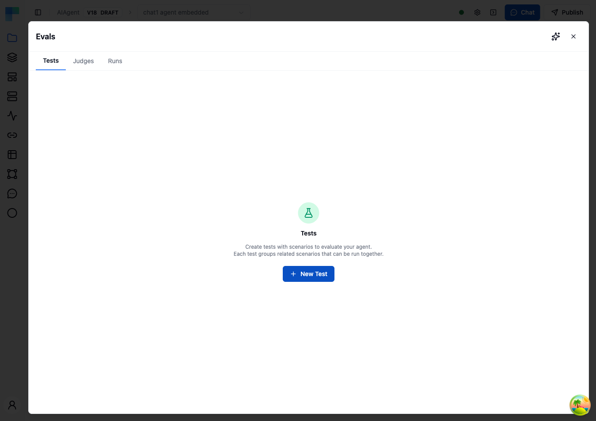
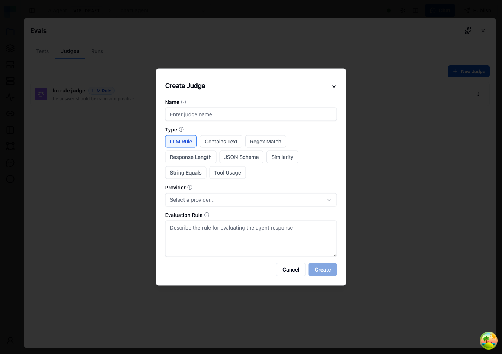
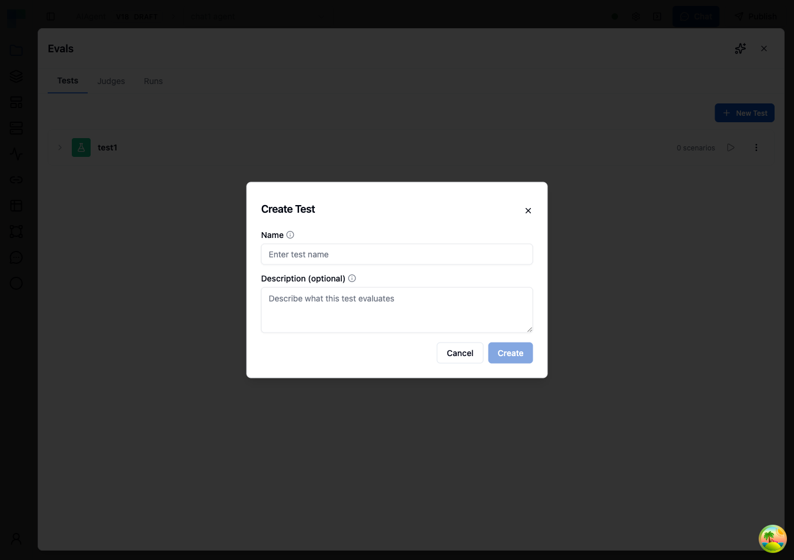
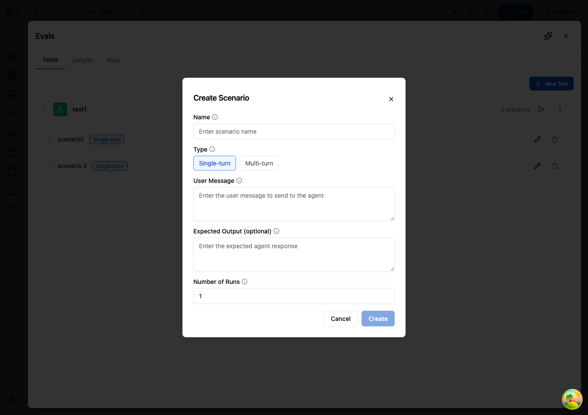
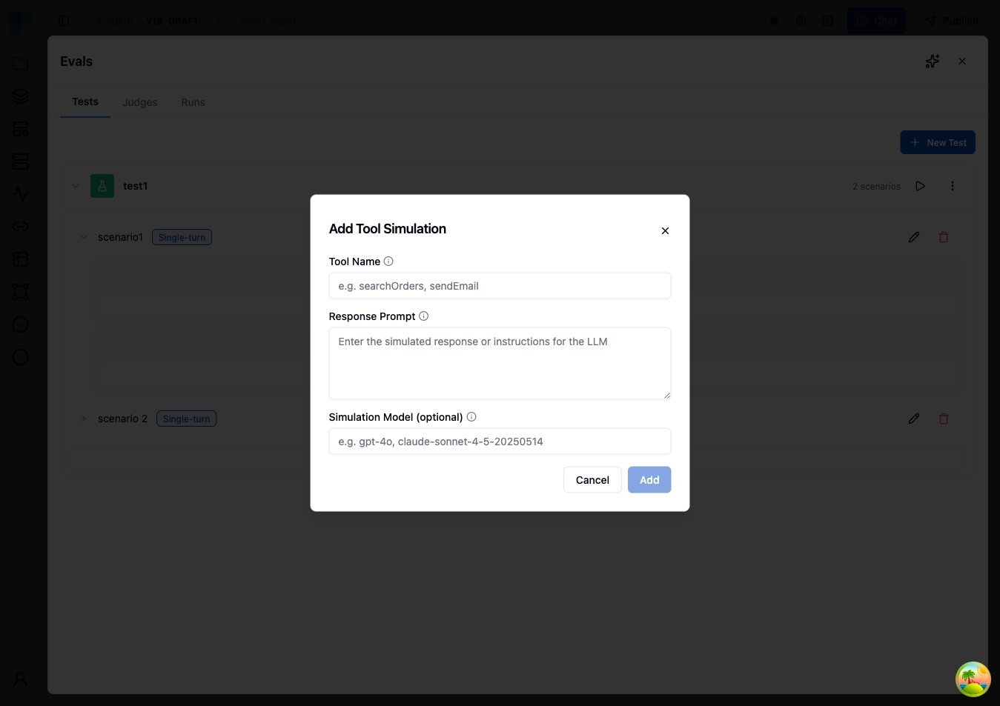
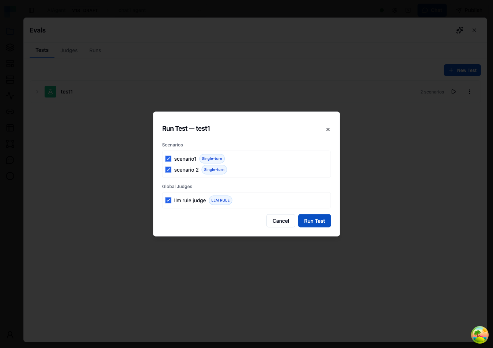
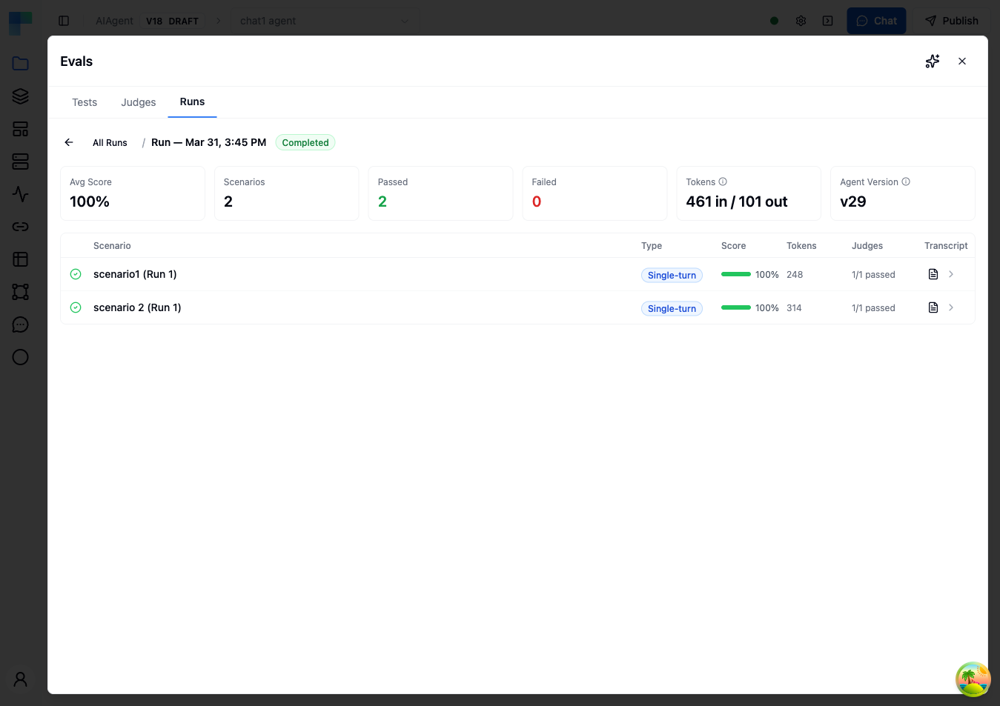
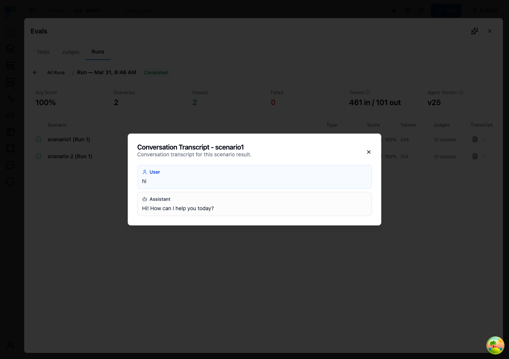
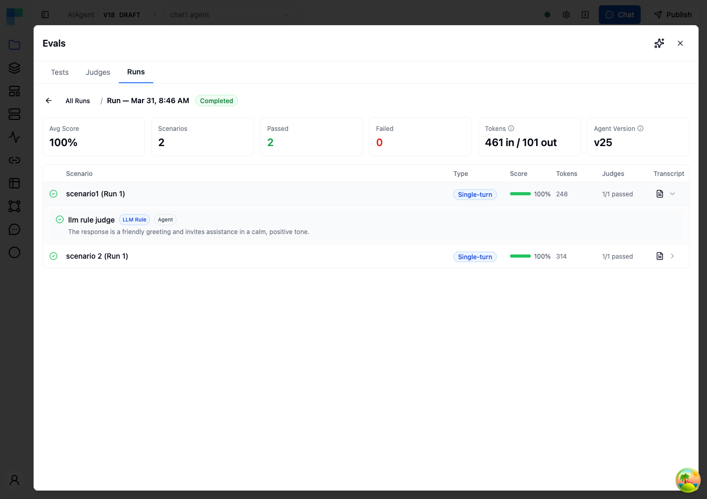

The Evals section is your command center for testing and evaluating AI agent performance. Located in the **Evals** tab within the AI Agent node editor, Evals enables you to create tests, define evaluation criteria (judges), run automated evaluations, and review detailed results — all without manual testing.



---

## What You Can Do with Evals

### Conduct Tests

Create tests with scenarios that simulate real user interactions. Combine scenarios with judges to measure accuracy and evaluate agent performance automatically.

### Create Judges

Define evaluation criteria that automatically assess agent responses. Judges look for specific conditions and score conversations based on your defined rules.

### Track Results

Review detailed results with per-scenario scores, judge verdicts with explanations, full conversation transcripts, and token usage analytics.

---

## Evals Sections

The Evals panel contains three tabs, accessible from the top of the panel:

- **Tests** — Create and manage groups of test scenarios for your agent. Each test can contain multiple scenarios with different prompts and evaluation criteria.
- **Judges** — Configure agent-level evaluation criteria that apply across all scenarios. These are reusable judges you want checked every time — such as professional tone, no hallucinations, or safety compliance.
- **Runs** — View your evaluation run history and results. See average scores, number of scenarios evaluated, progress status, token usage, and timestamps for all past runs.

---

## Understanding Judges

Judges are evaluation criteria that automatically assess agent conversations. There are two scopes of judges:

### Scenario Judges

Scenario judges are created within individual test scenarios. They evaluate the specific conversation generated by that scenario's prompt.

- Created inside a test scenario
- Only apply to the scenario they're defined in
- Best for scenario-specific evaluation criteria

### Agent Judges

Agent judges are configured in the **Judges** tab. They apply to every scenario across all tests for this agent — think of them as reusable defaults.

- Created in the **Judges** tab (separate from tests)
- Automatically included when running any test
- Useful for standard criteria you want checked across scenarios, such as professional tone, no hallucinations, or brand voice compliance

### Judge Types

When creating a judge (either scenario-level or agent-level), you choose from the following types:

#### LLM Rule

Uses an LLM to evaluate conversations against a rule you define in natural language. This is the most flexible judge type — use it when evaluation criteria are subjective or complex.

| Field | Description |
|---|---|
| **Rule** | Describe the criteria for passing. Be specific — include examples of what passing looks like. |
| **Truncate Long Conversations** | When enabled, conversations exceeding 100,000 characters are trimmed from the oldest messages first, and the eval runs on the remaining portion. When disabled, oversized conversations fail with an error instead. Note that trimming removes early context, which can affect score accuracy if your evaluation criteria depend on the beginning of the conversation. |

#### Contains Text

Checks whether the agent's response includes specific text.

| Field | Description |
|---|---|
| **Text** | The text that must appear in the response |
| **Mode** | Matching mode (e.g., exact or contains) |

#### Regex Match

Validates the agent's response against a regular expression pattern. Useful for checking response format — dates, order numbers, URLs, or structured templates.

| Field | Description |
|---|---|
| **Pattern** | Regular expression pattern to match |
| **Mode** | Matching mode |

#### Response Length

Validates that the response falls within acceptable length bounds. At least one of Min Length or Max Length must be specified.

| Field | Description |
|---|---|
| **Min Length** | Minimum number of characters |
| **Max Length** | Maximum number of characters |

#### JSON Schema

Validates the structure of the response against a JSON Schema definition. Use this for agents that return structured JSON output.

| Field | Description |
|---|---|
| **Schema** | A JSON Schema definition object |

#### Similarity

Compares the response to an expected output using a text similarity algorithm. This lets you allow for natural variation while ensuring the core content matches.

| Field | Description |
|---|---|
| **Expected Output** | Reference text to compare against |
| **Threshold** | Minimum similarity score (0.0 to 1.0) to pass |
| **Algorithm** | The similarity algorithm to use |

#### String Equals

Performs an exact string comparison between the agent's response and an expected value.

| Field | Description |
|---|---|
| **Expected Value** | The exact string the response must match |
| **Case Sensitive** | Whether comparison is case-sensitive (default: true) |

#### Tool Usage

Checks whether a specific tool was used during the conversation, and how many times.

| Field | Description |
|---|---|
| **Tool Name** | The tool to check for |
| **Position** | Whether the tool was used anywhere, first, or last |
| **Comparison** | Check if the tool was used at least, exactly, or at most X times |
| **Count** | Expected number of tool calls |

To create an agent-level judge:

1. Go to the **Judges** tab
2. Click **Create Judge**
3. Select a **Type** (LLM Rule, Contains Text, Regex Match, Response Length, JSON Schema, Similarity, String Equals, or Tool Usage)
4. Enter a **Name** for the judge (e.g., "Professional Tone")
5. Configure the type-specific settings (see tables above)
6. Click **Create**



When you run a test scenario, scenario-level judges are always included automatically. Agent judges are also included by default, but you can select or deselect specific agent judges before each run.

---

## Creating a Test with Scenarios

Follow these steps to create your first evaluation test:

1. Open your workflow, click the **AI Agent** node, and select the **Evals** tab. Then select the **Tests** tab.
2. Click **Create Test**. Enter a name for your test and an optional description, then click **Create**.



3. Click on the test you just created to expand it.
4. Click **Add Scenario** to create a scenario within your test.
5. Fill in the scenario details:

| Field | Description | Example |
|---|---|---|
| **Name** | A descriptive name for this test case | "Shipping Delay Response" |
| **Type** | Single Turn (one exchange) or Multi Turn (simulated conversation) | Single Turn |
| **User Message** | The message sent to your agent (Single Turn) | "My package hasn't arrived and it's been two weeks." |
| **Expected Output** | The expected response for comparison judges (optional) | "An apology with tracking info and next steps." |
| **Persona Prompt** | The persona the simulated user will adopt (Multi Turn) | "You are a concerned customer whose shipment is overdue." |
| **Max Turns** | Maximum conversation turns, 1-50 (Multi Turn) | 10 |
| **Number of Runs** | How many times this scenario should be executed per run | 3 |



6. Add **judges** to define how this specific scenario should be evaluated:

| Field | Description | Example |
|---|---|---|
| **Type** | The judge type | LLM Rule |
| **Name** | Name of the evaluation criterion | "Acknowledgment and Next Steps" |
| **Type-specific config** | Settings based on the chosen type (see [Judge Types](#judge-types)) | *Rule*: "Did the agent apologize for the delay, provide tracking information or explain the status, and offer a clear next step such as a replacement or refund?" |

Click **Create** to save the judge. You can add multiple judges to evaluate different aspects of the scenario.

7. (Optional) Add **tool simulations** to emulate tool usage without actually calling external services. Tool simulations are configured at the scenario level:
   - Select a tool to simulate
   - Provide a prompt describing what the tool should return (a simulated response is generated based on your prompt)
   - Optionally, select a **Simulation Model** to control which model generates the simulated response



8. Click **Save** to save your scenario.

You can add multiple scenarios to a single test to evaluate different aspects of your agent's behavior. Each scenario can have its own prompt, max turns, number of runs, judges, and tool simulations.

---

## Example Scenarios

Here are some example test scenarios you might create:

### IT Helpdesk — Troubleshooting Accuracy

**Scenario name**: Password Reset Guidance
**Type**: Single Turn
**User Message**: "I can't log into my account. It says my password is incorrect but I'm sure it's right."
**Judge**: Correct Troubleshooting Steps (LLM Rule)

- *Rule*: Did the agent suggest appropriate troubleshooting steps such as checking caps lock, clearing browser cache, or initiating a password reset? The response should not assume the user is at fault and should guide them through steps in a logical order.

### E-Commerce — Order Issue Handling

**Scenario name**: Missing Item Resolution
**Type**: Multi Turn
**Persona Prompt**: "You are a repeat customer who received an order with one item missing from a 5-item purchase. You have the order confirmation email and want the missing item shipped, not a refund. You're patient but want a clear timeline for resolution."
**Max Turns**: 12
**Number of Runs**: 3
**Judge**: Resolution Quality (LLM Rule)

- *Rule*: Did the agent verify the order details, acknowledge the missing item, and provide a concrete resolution with an estimated timeline? The agent should not offer a generic apology without taking action or ask the customer to re-order the item.

### HR Assistant — Policy Compliance

**Scenario name**: Time-Off Policy Inquiry
**Type**: Single Turn
**User Message**: "How many vacation days do I get in my first year, and can I take them all at once?"
**Judge 1**: Accurate Policy Reference (LLM Rule)

- *Rule*: Did the agent reference the actual company policy rather than inventing or guessing numbers? The response should include specific day counts and any relevant restrictions on consecutive days off.

**Judge 2**: Policy Tool Called (Tool Usage)

- *Tool Name*: lookupPolicy
- *Comparison*: At least 1

### Sales — Lead Qualification

**Scenario name**: Enterprise Qualification
**Type**: Multi Turn
**Persona Prompt**: "You are a CTO at a 200-person fintech company evaluating workflow automation tools. You need to understand data residency options, SOC 2 compliance, and whether the platform supports custom connectors. You're comparing with two other vendors and will push back if answers are vague."
**Max Turns**: 15
**Judge**: Qualification Handling (LLM Rule)

- *Rule*: Did the agent ask qualifying questions about the prospect's requirements, provide accurate information about the product's capabilities, and offer a clear next step such as scheduling a demo or connecting with a solutions engineer? The agent should acknowledge when it doesn't have specific information rather than guessing.

---

## Running Evaluations

You can run an entire test or select specific scenarios within a test by clicking the **Run Test** button in the **Runs** tab.

1. Enter a **name** for the evaluation run (e.g., "v2.1 Prompt Update — March 31"). A default name with timestamp is provided.
2. Select the **environment** to use for connections and configuration.
3. (Optional) Select which **scenarios** to include — by default all scenarios in the test are run.
4. (Optional) Select which **agent judges** to include — by default all agent judges apply. Scenario-level judges are always included automatically.
5. Click **Run** to begin. The system will execute your agent with each scenario's input, then evaluate the responses with your selected judges.



While a run is in progress, the UI shows real-time progress with a completion counter and progress bar.



You can **cancel** a running eval at any time. Already-completed scenarios retain their results; remaining scenarios are skipped.

---

## Understanding Results

After running an evaluation, you'll see a detailed results screen.

### Run Summary

The top of the results page shows key metrics:

| Metric | Description |
|---|---|
| **Average Score** | Overall pass rate across all scenarios and judges |
| **Total Scenarios** | How many test scenarios were evaluated |
| **Completed / Failed** | Breakdown of scenario completion statuses |
| **Input Tokens** | Total input tokens consumed across all scenarios |
| **Output Tokens** | Total output tokens generated across all scenarios |
| **Agent Version** | The version of the agent that was tested |


### Scenario Results

Each scenario displays:

| Column | Description |
|---|---|
| **Status** | Running, Completed, or Failed |
| **Scenario** | The scenario name |
| **Run Index** | Repetition number (if Number of Runs > 1) |
| **Score** | Percentage of judges that passed |
| **Tokens** | Input and output tokens consumed for this scenario |


### Viewing Conversation Details

Click the **transcript** icon on any scenario to see:

1. **The full conversation** between the simulated user (or single message) and your agent
2. **Judge verdicts** from all judges included in the run, with detailed explanations of why each judge passed or failed



For example, an "Acknowledgment and Next Steps" judge might show:

> **Pass**: The agent acknowledged the shipping delay and apologized without making excuses. It proactively looked up the tracking number, explained the package was delayed at a distribution center, and offered two options: wait for delivery with a $10 credit, or have a replacement shipped overnight. The customer was given a clear timeline of 2-3 business days for the replacement.

Each verdict includes the judge name, type, scope (Agent or Scenario), pass/fail status, numerical score, and explanation.



### Token Usage

Each run tracks token consumption at two levels:

- **Per-result**: Input and output tokens for each scenario execution, including user simulation tokens for multi-turn scenarios
- **Run-level**: Aggregated totals across all results

Use token tracking to estimate evaluation costs, compare token efficiency across agent versions, and identify scenarios that might benefit from optimization.

---

## Tool Simulations

Tool simulations let you test your agent without calling real external services. Instead of executing actual tool calls, the agent receives simulated responses generated by an LLM based on a prompt you provide.

### When to Use Tool Simulations

- **Avoid side effects** — Prevent test runs from creating real tickets, sending real emails, or modifying real data
- **Control tool output** — Provide specific tool responses to test how the agent handles different situations
- **Test without credentials** — Run evaluations in environments where external service credentials aren't configured
- **Simulate error conditions** — Use response prompts that generate error responses to test agent error handling

### How It Works

Tool simulations are configured at the scenario level:

1. Expand a scenario in the **Tests** tab
2. Click **Add Tool Simulation**
3. Select the **tool** to simulate (must match a tool configured on the agent)
4. Provide a **response prompt** describing what the tool should return
5. (Optional) In **Advanced**, select a **Simulation Model** to control which model generates the simulated response

When the agent calls a tool that has a simulation configured, the actual call is intercepted and the simulation's response prompt is sent to an LLM, which generates a realistic response. The agent receives this simulated response and continues as if the real tool had responded.

Tool simulations are scenario-specific — the same agent can have different simulations in different scenarios.

---

## Multi-Turn Conversations

Multi-turn scenarios simulate a back-and-forth conversation between a user persona and your agent. This lets you test conversational abilities that single-turn scenarios cannot capture — such as context retention, follow-up handling, and multi-step problem resolution.

### How It Works

1. The scenario's **User Message** is sent as the opening message (if provided), or the persona prompt drives the first message
2. The agent responds
3. A **User Simulator** (LLM-powered) generates the next user message based on the conversation history and persona prompt
4. Steps 2–3 repeat until **Max Turns** is reached or the simulator outputs `[CONVERSATION_COMPLETE]`

### Writing Effective Persona Prompts

Good persona prompts produce realistic, goal-oriented conversations. Be specific about the persona's background, their goal, and how they should react:

```
You are the operations lead at a logistics company that processes
500+ shipments daily. Your team has been entering tracking updates
manually into spreadsheets and you want to automate this. You have
a REST API from your shipping provider but no experience building
integrations. Push back if the agent suggests overly technical
solutions without explaining them.
```

Avoid vague personas like "You are a user who asks questions." Instead, include:

- The persona's role and background
- Their specific goal or problem
- Their knowledge level and communication style
- Any constraints (e.g., "You have a meeting in 10 minutes and need quick answers")

### Token Considerations

Multi-turn scenarios consume more tokens than single-turn because each turn adds to the growing conversation context, the user simulator makes additional LLM calls, and longer conversations mean more tokens per judge evaluation. Monitor token usage in the run results and adjust Max Turns to balance thoroughness with cost.

---

## Best Practices

### Start Simple

Begin with a few core scenarios that test your agent's primary use cases. Add complexity as you learn what matters most.

### Be Specific with Judges

Write detailed evaluation rules. Vague criteria like "the response should be good" lead to inconsistent results. Include specific conditions for what passing looks like — for example: "The agent should acknowledge the customer's issue, provide the order status, and offer at least one resolution option."

### Test Edge Cases

Create scenarios for difficult situations: angry customers, off-topic requests, requests that try to bypass rules, ambiguous inputs, and questions the agent shouldn't be able to answer.

### Use Multiple Runs per Scenario

Since AI agents are non-deterministic, set Number of Runs to 3–5 for important scenarios. This helps you distinguish between consistently good behavior and lucky single responses.

### Name Runs Meaningfully

Include the change context in the run name (e.g., "baseline", "v2-updated-prompt", "after-tool-addition"). This makes comparing runs over time much easier.

### Combine Judge Types

Use LLM Rule judges for subjective quality assessment and deterministic judges (Contains Text, Tool Usage, String Equals) for functional correctness. A good evaluation uses both.

---

## Frequently Asked Questions (FAQs)

#### How many scenarios can I have in a test?

You can add as many scenarios as you need to a single test. Each scenario is evaluated independently and can have its own judges and tool simulations.

#### How is token usage calculated for evaluations?

Tokens consumed for each scenario include:

- **The agent task** — the conversation between the simulated user and your agent
- **The user simulator** (multi-turn only) — uses an LLM to generate user messages based on the persona prompt
- **The judge evaluations** — each LLM-based judge uses an LLM to evaluate the conversation

Each scenario shows its token usage in the results, and the run shows aggregated totals.

#### Can I rerun a previous evaluation?

Yes, you can run the same test again at any time. Each run is saved in your **Runs** history, allowing you to compare results across different agent versions.

#### What's the difference between scenario judges and agent judges?

Scenario judges are created within test scenarios and only evaluate conversations generated by that specific scenario. Agent judges are created in the **Judges** tab and are included in every run by default, providing reusable evaluation criteria across all your tests.

#### Can the LLM Rule judge evaluate long conversations?

Yes, with configuration. The LLM Rule judge includes a **Truncate Long Conversations** option. When enabled, conversations exceeding 100,000 characters are trimmed from the oldest messages first and evaluated on the remaining portion. When disabled, oversized conversations fail with an error rather than producing a partial result.

#### What happens when a conversation is truncated?

The oldest messages are removed from the start of the conversation until it fits within the limit. The judge evaluates the remaining portion. If your evaluation criteria depend on early context — such as the user's original request or instructions given at the start — the result may be less accurate. In those cases, consider disabling truncation and keeping Max Turns lower.

#### What happens when a scenario fails?

When a scenario encounters an error during execution, its status is set to **Failed** and the error message is captured in the result. Other scenarios in the run continue executing normally. Failed scenarios do not count toward the average score.

#### Can I run only some scenarios from a test?

Yes. When starting a run, you can select specific scenarios to include. This is useful for quick iteration — when you're debugging a specific scenario, run only that one to save time and tokens.
