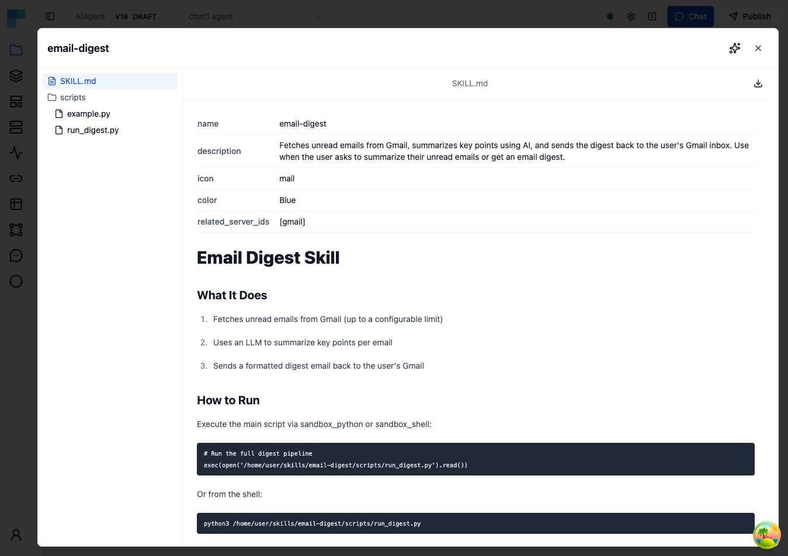
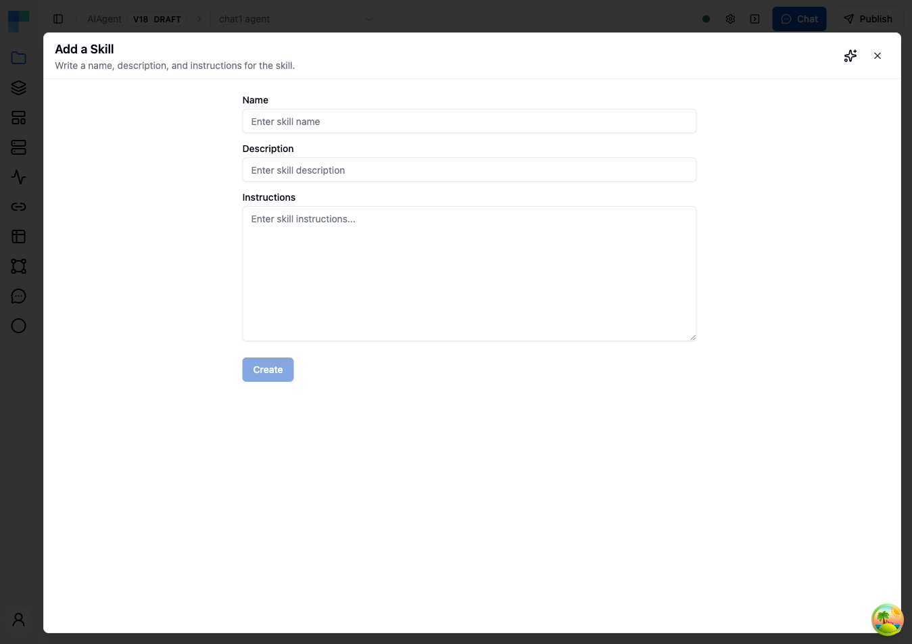

Skills are your way of giving AI agents domain expertise. Located in the **Skills** panel within the AI Agent node editor, Skills let you create, manage, and attach knowledge modules — covering anything from coding standards and troubleshooting runbooks to business process documentation — so your agents respond with context-specific accuracy.


---

## What You Can Do with Skills

### Capture Domain Expertise

Package specialized knowledge — coding guidelines, API references, troubleshooting runbooks, compliance rules — into standalone skill modules that any agent can reference.

### Reuse Across Agents

Skills are shared across all agents in your workspace. Create a skill once and attach it to any agent that needs that knowledge.

### Choose Your Creation Method

Create skills the way that works best for you: write instructions directly, upload existing documentation files, or let AI generate a skill from a conversation.

---

## Accessing Skills

To open the Skills panel:

1. Open your workflow and click the **AI Agent** node to open the AI Agent Editor.
2. Click the **Skills** icon (lightning bolt) in the top toolbar.

The Skills panel displays all available skills with a search bar and a **Create Skill** button.

---

## Viewing Skills

The Skills list shows all skills in your workspace. Each skill displays:

| Field | Description |
|---|---|
| **Name** | The skill's name |
| **Description** | A brief summary of what the skill covers |
| **Modified Date** | When the skill was last updated |

Use the **search bar** at the top to filter skills by name.

Click on any skill to view its contents in the **detail view**. The detail view includes:

- A **file tree** on the left showing all files and folders in the skill archive
- A **content viewer** on the right with syntax highlighting for code files and rendered markdown for `.md` files
- A **Download** button (top-right corner) to download the entire skill as a `.skill` file

Markdown files display YAML frontmatter as a metadata table above the rendered content.



---

## Creating Skills

Click the **Create Skill** dropdown button to choose a creation method:


### Write Skill Instructions

The simplest way to create a skill. Enter a name, description, and markdown instructions directly in the editor.



| Field | Description |
|---|---|
| **Name** | A descriptive name for the skill (e.g., "Email Triage Rules") |
| **Description** | A short summary of what the skill covers — helps agents decide when to use it |
| **Instructions** | The full skill content in markdown format. Include guidelines, examples, rules, and any context the agent needs. |

Click **Create** to save. The instructions are packaged into a skill archive and added to your skills library.

### Upload Files

Upload existing documentation files to create skills. This is useful when you already have knowledge documented in files.


Supported file formats:

| Format | Description |
|---|---|
| `.zip` | ZIP archive containing multiple files (documentation, code, configs) |
| `.skill` | ByteChef skill archive format (ZIP-based) |
| `.md` | Markdown file — automatically converted into a skill |

You can drag and drop files or click to browse. Multiple files can be uploaded at once — each file creates a separate skill. For `.md` files, the skill name and description are automatically extracted from YAML frontmatter if present.

### Create With AI

Let AI generate a skill for you through a conversational interface. Describe the domain knowledge you want to capture, and the AI assistant will help you build a comprehensive skill.

---

## Managing Skills

### Downloading a Skill

You can download a skill in two ways:

- **From the detail view**: Click the **Download** button in the top-right corner to download the entire skill as a `.skill` file (ZIP archive).
- **From the skill list**: Click the **menu** (three dots icon) on any skill and select **Download**.

Downloaded `.skill` files can be shared with others or uploaded to a different workspace.

### Skill Actions

Each skill in the list has a **menu** (three dots icon) with the following actions:

| Action | Description |
|---|---|
| **Download** | Download the skill as a `.skill` file (ZIP archive) |
| **Rename** | Change the skill's name and description |
| **Delete** | Permanently remove the skill |

---

## Skill File Format

Skills are stored as ZIP archives containing one or more files. When you create a skill using the "Write Skill Instructions" method, your instructions are saved as a markdown file inside the archive.

### Frontmatter

Markdown files in skill archives can include YAML frontmatter to define metadata:

```markdown
---
name: email-triage-rules
description: Rules for categorizing and prioritizing incoming support emails
---

# Email Triage Rules

## Priority Levels
...
```

When uploading a `.md` file, ByteChef automatically extracts the `name` and `description` fields from frontmatter to populate the skill metadata.

### Archive Structure

A skill archive can contain any combination of files:

```
my-skill.skill
├── instructions.md      # Main skill instructions
├── examples/
│   ├── good-response.md # Example of a good response
│   └── bad-response.md  # Example of what to avoid
├── reference/
│   └── api-spec.json    # API reference documentation
└── templates/
    └── email-template.txt
```

All files in the archive are available to the agent when the skill is attached.

---

## Writing Effective Skills

### Be Specific and Structured

Write clear, well-organized instructions. Use headings, bullet points, and tables to make the content easy for the agent to parse.

```markdown
# Customer Support Escalation Rules

## When to Escalate
- Customer mentions legal action
- Issue involves data loss or security breach
- Customer has been waiting more than 48 hours
- Issue requires access to internal systems

## Escalation Process
1. Acknowledge the customer's concern
2. Inform them that a specialist will follow up
3. Create a ticket with priority: HIGH
4. Include full conversation history
```

### Include Examples

Show the agent what good and bad responses look like. Concrete examples are more effective than abstract rules.

### Define Boundaries

Specify what the agent should and should not do. Clear boundaries prevent the agent from overstepping or making assumptions.

### Use Descriptive Names

Choose skill names that clearly communicate the skill's purpose. The name and description help the agent understand when to apply the skill's knowledge.

---

## Best Practices

### Start with Core Knowledge

Begin by creating skills for your agent's most critical responsibilities. Add specialized skills as you identify gaps in agent performance.

### Keep Skills Focused

Each skill should cover a single domain or topic. Smaller, focused skills are easier to maintain and can be combined as needed.

### Update Regularly

Review and update skills when processes change, new edge cases are discovered, or agent performance reveals gaps in the current instructions.

### Test with Evals

Use [Evals](evals) to verify that your skills are working as intended. Create test scenarios that exercise the knowledge in your skills and confirm the agent responds correctly.

### Version Control Your Skills

Download skills as `.skill` files and store them in version control alongside your code. This lets you track changes, review updates, and roll back if needed.

---

## Frequently Asked Questions (FAQs)

#### How many skills can I create?

There is no hard limit on the number of skills you can create. However, keep in mind that attaching many large skills to a single agent increases the context size and may affect performance.

#### Can I share skills between agents?

Yes. Skills are shared across your workspace. Any skill you create is available to attach to any AI agent in any workflow.

#### What file types are supported in skill archives?

Skill archives can contain any file type. The built-in viewer provides syntax highlighting for common formats including JavaScript, TypeScript, Python, Java, JSON, YAML, HTML, CSS, SQL, and Markdown.

#### How are skills used by the agent at runtime?

When a skill is attached to an agent, its contents are included in the agent's context. The agent can reference the skill's instructions, examples, and documentation when generating responses.

#### Can I edit a skill after creating it?

You can rename a skill and update its description. To modify the skill's contents, download it, edit the files, and re-upload the updated archive.

#### What happens if I delete a skill that's attached to an agent?

The skill is removed from all agents that reference it. The agents will continue to function but without the knowledge that skill provided.
