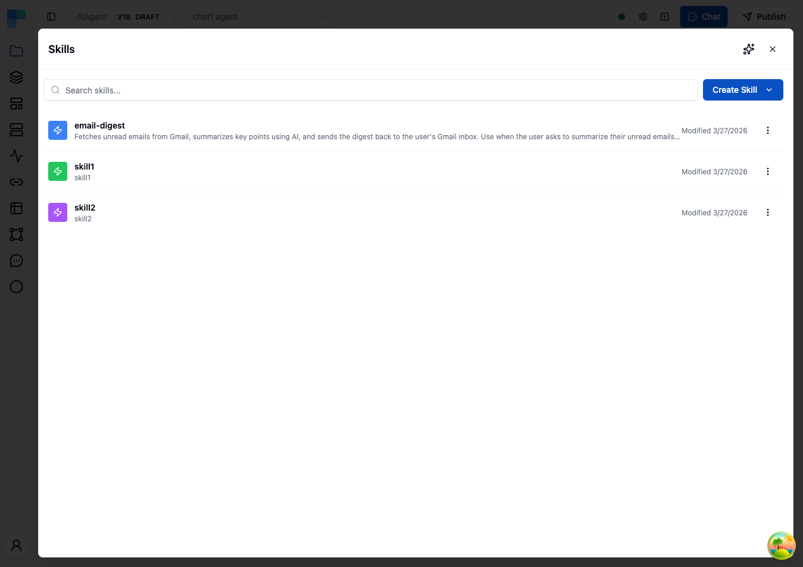
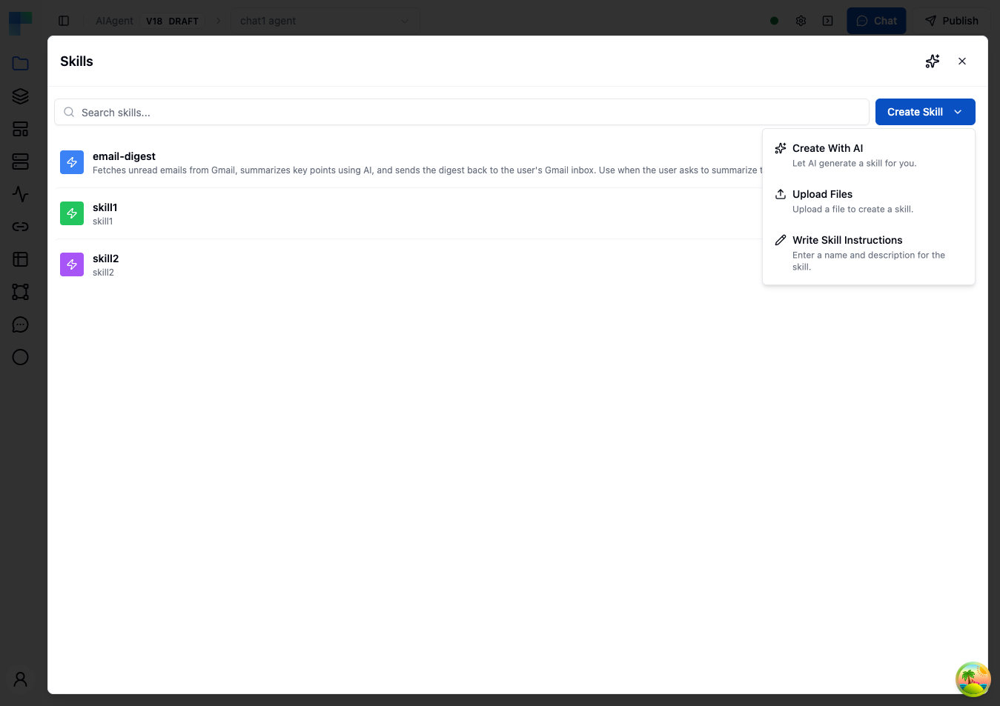
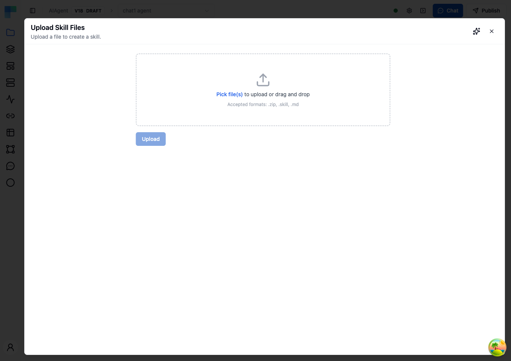

Skills are your way of giving AI agents domain expertise. The **Skills** workspace lets you create, edit, and manage knowledge modules — covering anything from coding standards and troubleshooting runbooks to business process documentation — and attach them to any AI Agent so it responds with context-specific accuracy.

Skills follow the [agentskills.io](https://agentskills.io) SKILL.md format, so a `.skill` archive you author in ByteChef can be shared with other agentskills.io-compatible tooling and vice-versa.



---

## What You Can Do with Skills

### Capture Domain Expertise

Package specialized knowledge — coding guidelines, API references, troubleshooting runbooks, compliance rules — into standalone skill modules that any agent can reference.

### Reuse Across Agents

Skills are shared across all agents in your workspace. Create a skill once and attach it to any agent that needs that knowledge.

### Edit in Place

Open any skill, switch between a rendered **Preview** and the raw **Source**, edit either markdown or arbitrary archive files inline, and save without leaving the page. Frontmatter (`name`, `description`) syncs to the database on save, so renames are reflected immediately in the sidebar, search, and skill list.

### Choose Your Creation Method

Create skills the way that works best for you: write instructions directly, upload existing documentation files, or let the AI **Copilot** generate one for you through a conversation.

---

## Accessing Skills

Skills live under **AI → Skills** in the automation navigation. The page has two layouts:

- **List view** — opens by default. Shows every skill in the workspace as a clickable row with name, description, and modified date.
- **Detail view** — opens when you click a skill. Replaces the AI section nav with a **Skills sidebar** (search + clickable entries with the current skill highlighted) so you can switch between skills without going back to the list.

The sidebar header has a **+** icon that opens the same **Create Skill** dropdown as the list page, so you can create a new skill without leaving the detail surface.

---

## Viewing Skills

The Skills list shows all skills in your workspace. Each row displays:

| Field | Description |
|---|---|
| **Name** | The skill's name (must follow the agentskills.io format — see [Skill File Format](#skill-file-format)) |
| **Description** | A brief summary of what the skill covers |
| **Modified Date** | When the skill was last updated |

Use the **search bar** at the top to filter skills by name.

Click any skill to open the **detail view**. The detail view contains:

- A **file tree** on the left showing every file and folder in the skill archive.
- A **content viewer / editor** on the right with syntax highlighting (Monaco) for code files and a rendered TipTap preview for `.md` files. Markdown files show their YAML frontmatter as a metadata table above the rendered body.
- A **page-header toolbar** with **Preview / Source toggle**, **Save**, **Open Copilot**, and a **⋮ menu** containing **Download Skill** and **Delete Skill**.


---

## Editing Skills

You can edit any file in a skill archive directly from the detail view — no download / re-upload round-trip required.

### Switching Between Preview and Source (Markdown only)

The **Preview / Source toggle** in the header is visible whenever the selected file is markdown.

- **Preview** (default on file load) — read-only TipTap render of the body, with frontmatter shown as a metadata table.
- **Source** — Monaco editor with the `markdown` language. Edit the raw markdown, including frontmatter.

The toggle resets to **Preview** every time you switch files.

For non-markdown files (`.json`, `.yaml`, `.txt`, code files, etc.) the Monaco editor is shown directly with the language inferred from the file extension.

### Saving Changes

The **Save** button in the header enables as soon as the editor content differs from what was last loaded. Click it to persist the change.

When you save a `SKILL.md` file, ByteChef parses the YAML frontmatter and writes the `name` / `description` fields back to the database **before** writing the file body — so any validation error (invalid kebab-case name, description over 1024 chars, etc.) surfaces *before* the on-disk file is touched. The sidebar, page header, and skill list all read the DB-backed metadata, so a frontmatter rename is reflected everywhere immediately.

### Skill Actions

Each skill in the list has a **⋮ menu** with the following actions:

| Action | Description |
|---|---|
| **Download** | Download the skill as a `.skill` file (ZIP archive). |
| **Rename** | Edit the skill's name and description through a dialog. |
| **Delete** | Permanently remove the skill (confirmation dialog). |

The same actions are available on the detail page header — **Download** and **Delete** live under the **⋮ menu** next to **Save** and **Open Copilot**.

---

## Creating Skills

Click the **Create Skill** dropdown button to choose a creation method:



### Write Skill Instructions

The simplest way to create a skill. A dialog opens where you enter a name, description, and markdown instructions; ByteChef wraps them into a SKILL.md file and packages it into a new skill archive.


| Field | Description |
|---|---|
| **Name** | A descriptive name for the skill. Must match the [agentskills.io format](#skill-file-format) — lowercase letters, digits, and single hyphens, 1–64 characters. |
| **Description** | A short summary (max 1024 characters) of what the skill covers — helps agents decide when to use it. |
| **Instructions** | The full skill content in markdown format. Include guidelines, examples, rules, and any context the agent needs. |

Click **Create** to save. The instructions are packaged into a skill archive and added to your skills library.

### Upload Files

Upload existing documentation files to create skills. Useful when you already have knowledge documented in files or want to import a `.skill` archive from another agentskills.io-compatible tool.



Supported file formats:

| Format | Description |
|---|---|
| `.zip` | ZIP archive containing multiple files (documentation, code, configs). |
| `.skill` | ByteChef skill archive format (ZIP-based, agentskills.io-compatible). |
| `.md` | Markdown file — automatically converted into a skill. |

You can drag and drop or click to browse. Multiple files can be uploaded at once — each file creates a separate skill. For `.md` files, the skill `name` and `description` are extracted from YAML frontmatter when present.

If you upload a single file from the **detail view**, ByteChef navigates straight to the newly-created skill once the upload completes. Multi-file uploads instead refresh the sidebar and leave you on the current skill.

### Create With AI

Let the AI Copilot generate a skill for you through a conversational interface. Selecting this option opens a full-page chat where you describe the domain knowledge you want to capture and the Copilot iterates with you, validates the SKILL.md format, and creates the skill via the `createAiSkill` tool when you're satisfied.

The Copilot runs in **BUILD mode** here — it has write access to skills. The list refreshes automatically after each assistant turn so newly-created skills appear without a manual reload. When the create page detects a new skill in the workspace, it navigates either to the skill list (if you launched from there) or to the newly-created skill (if you launched from another skill's detail page).

> **Note** — *Create With AI* requires the Copilot to be enabled in your deployment. See [AI Copilot](/platform/copilot) for setup.

---

## The Skills Copilot

The same AI Copilot you use in the workflow editor is available on the Skills page, with a Skills-specific toolset and a split between **Ask** and **Build** agents.

### Ask Mode

Read-only. The Ask agent exposes only the four read methods of the Skills toolset (`getAiSkill`, `getAiSkills`, `getAiSkillFilePaths`, `getAiSkillFileContent`) and is scoped to *explaining* and *auditing* skills:

- Summarize what a skill does.
- Diff an attached SKILL.md against the agentskills.io format.
- Suggest improvements to wording, structure, or examples.
- Surface broken cross-file references inside the archive.

Ask mode refuses mutations and directs you to BUILD mode when you ask it to change something.

### Build Mode

Full read/write. The Build agent has the entire Skills toolset — create, update content, update metadata, delete — plus the read methods. Build mode is what powers **Create With AI** and what opens when you click the **Open Copilot** button from a skill's detail page.

Both agents are **context-aware**: when you have a skill open in the detail view, the client injects `currentSelectedSkillId` and `currentSelectedSkillName` into every chat turn. Saying "explain this skill" or "tighten the description" works without naming the skill — the Copilot resolves "this" against the currently-viewed skill.

### Skills as Tools for Other Agents

Beyond the Copilot, any AI Agent in any workflow can attach the **Skills tool** ([agentUtils/v1](/reference/components/agent-utils_v1)) as a child of its **Tools** slot. That tool surfaces the chosen skills to the agent at runtime, so the model can read skill content on demand instead of carrying it in every prompt. See the [AI Agent overview — Tools slot](.) for wiring.

---

## Skill File Format

Skills are stored as ZIP archives following the [agentskills.io](https://agentskills.io) SKILL.md specification. The archive **must** contain a top-level `SKILL.md` file whose YAML frontmatter defines the skill's identity.

### SKILL.md Frontmatter

```markdown
---
name: email-triage-rules
description: Rules for categorizing and prioritizing incoming support emails
---

# Email Triage Rules

## Priority Levels
...
```

ByteChef validates the frontmatter against the agentskills.io spec on every create and update path — whether the value arrives from the **Create Skill** form, the `.md`/`SKILL.md` upload, or a Copilot tool call:

| Field | Rule |
|---|---|
| `name` | 1–64 characters; lowercase `a-z` / `0-9` / single hyphens only. No leading, trailing, or consecutive hyphens. |
| `description` | Optional. Max 1024 characters when present. |

When two skills end up with the same name, ByteChef auto-disambiguates with a `-N` suffix (e.g. `email-triage-rules-2`) so the result still passes spec validation.

### Archive Structure

A skill archive must contain `SKILL.md` and may contain any other files:

```
my-skill.skill
├── SKILL.md            # Required — name + description in frontmatter, body is the main instructions
├── examples/
│   ├── good-response.md
│   └── bad-response.md
├── reference/
│   └── api-spec.json
└── templates/
    └── email-template.txt
```

All files in the archive are accessible to the agent when the skill is attached. The agent decides which files to read based on the SKILL.md instructions and the file names.

---

## Writing Effective Skills

### Be Specific and Structured

Write clear, well-organized instructions. Use headings, bullet points, and tables so the agent can parse the structure.

```markdown
# Customer Support Escalation Rules

## When to Escalate
- Customer mentions legal action
- Issue involves data loss or security breach
- Customer has been waiting more than 48 hours
- Issue requires access to internal systems

## Escalation Process
1. Acknowledge the customer's concern
2. Inform them that a specialist will follow up
3. Create a ticket with priority: HIGH
4. Include full conversation history
```

### Include Examples

Show the agent what good and bad responses look like. Concrete examples are more effective than abstract rules.

### Define Boundaries

Specify what the agent should and should not do. Clear boundaries prevent the agent from overstepping or making assumptions.

### Use Descriptive Names

Choose skill names that clearly communicate the skill's purpose. The agentskills.io constraints push you toward short kebab-case names like `email-triage-rules` or `pr-review-checklist` — name + description together help the agent decide *when* to consult the skill.

---

## Best Practices

### Start with Core Knowledge

Begin by creating skills for your agent's most critical responsibilities. Add specialized skills as you identify gaps in agent performance.

### Keep Skills Focused

Each skill should cover a single domain or topic. Smaller, focused skills are easier to maintain and can be combined as needed.

### Edit Inline, Download for Backup

For day-to-day tweaks, edit the SKILL.md directly in the detail view — the Preview/Source toggle plus DB-synced frontmatter make it a fast loop. Use **Download Skill** to take a snapshot before risky edits or to store an offline backup in version control.

### Update Regularly

Review and update skills when processes change, new edge cases are discovered, or agent performance reveals gaps in the current instructions.

### Test with Evals

Use [Evals](evals) to verify that your skills are working as intended. Create test scenarios that exercise the knowledge in your skills and confirm the agent responds correctly.

### Version Control Your Skills

Download skills as `.skill` files and store them in version control alongside your code. This lets you track changes, review updates, and roll back if needed.

---

## Frequently Asked Questions (FAQs)

#### How many skills can I create?

There is no hard limit. Keep in mind that attaching many large skills to a single agent increases the context size and may affect performance — prefer many small, focused skills over a few sprawling ones.

#### Can I share skills between agents?

Yes. Skills are shared across your workspace. Any skill you create is available to attach to any AI agent in any workflow, and to the Skills tool in [agentUtils/v1](/reference/components/agent-utils_v1).

#### What file types are supported in skill archives?

Skill archives can contain any file type. The built-in viewer provides syntax highlighting for common formats including JavaScript, TypeScript, Python, Java, JSON, YAML, HTML, CSS, SQL, and Markdown.

#### How are skills used by the agent at runtime?

When a skill is attached to an agent (via the Skills tool), the agent receives the skill's name and description in its tool catalogue and can call the tool to fetch SKILL.md or any other archive file on demand. The agent decides *which* skill to read based on the user's request.

#### Can I edit a skill after creating it?

Yes — both metadata (name, description) and file contents are editable directly from the detail view. Renames sync to the database on save so the change is reflected in the sidebar and skill list immediately.

#### What happens if I delete a skill that's attached to an agent?

The skill is removed from the workspace and no longer appears in the agent's Skills tool catalogue. Agents continue to function but without the knowledge that skill provided.

#### Why does ByteChef enforce the agentskills.io name/description rules?

Two reasons. First, it keeps `.skill` archives portable to (and from) any agentskills.io-compatible tool. Second, the constraints — short kebab-case names, bounded descriptions — keep the agent's tool catalogue legible at scale; a workspace with 200 skills is still skimmable when names follow a predictable shape.
