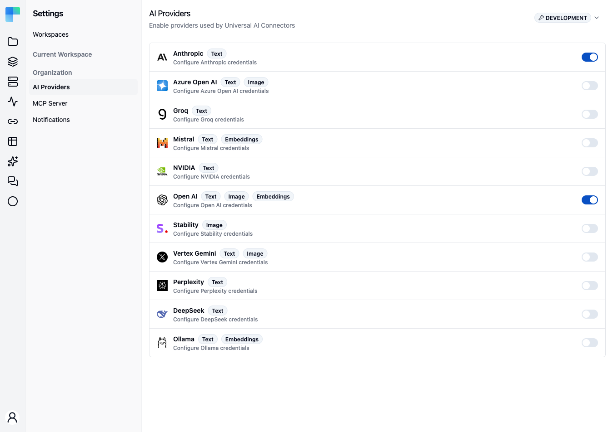
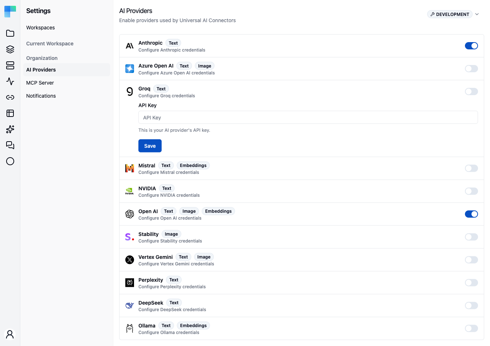
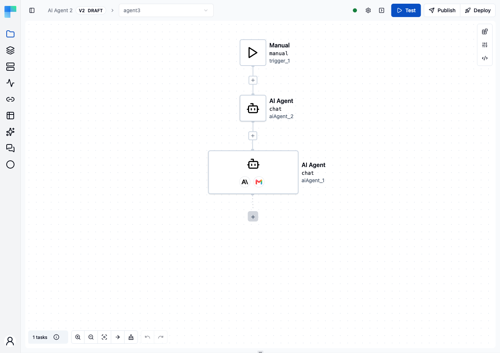

This is a guide to using universal AI components like **AI Text** or **AI Image**. Universal components let you pick a provider and model from the activated [AI Providers](/platform/settings/ai-providers) catalog per step, instead of managing a separate connection per provider.

## Setting up API keys

<Steps>
<Step>

Click on the user picture

</Step>
<Step>

Click on **Settings**. As a requirement for having access most settings, you have to have administrator privileges.

</Step>
<Step>

Go to **AI Providers**

</Step>
<Step>

Toggle the provider that you have API keys for

</Step>
<Step>

Paste the API key

</Step>
<Step>

Click **Save**

</Step>
</Steps>

Select a provider to reveal its credentials form, then paste the key and save.

After that, you should be able to work with **AI Text** and **AI Image** components. You should be able to see the configured providers in the **Properties** tab under the dropdown attribute called **Provider**.

## AI Text actions

| Action | What it does |
|---|---|
| **Text Generation** | Produce free-form text from a prompt. |
| **Classify Text** | Assign the input to one of your categories. |
| **Extract Data** | Pull structured fields out of unstructured text. |
| **Summarize Text** | Condense a document into a summary. |
| **Sentiment Analysis** | Score the emotional tone of the input. |
| **Similarity Search** | Find the closest matches to a query among candidate texts. |
| **Score** | Rate the input against criteria you define. |
| **Mask** | Replace sensitive spans with placeholders. |
| **Unmask** | Restore previously masked spans to their original values. |

## AI Image actions

| Action | What it does |
|---|---|
| **Generate Image** | Create an image from a text prompt with the selected provider and model. |

## Beyond single steps: the AI Agent

AI Text and AI Image are single-shot steps. When you need a step that reasons over a goal, calls tools, and remembers context across turns, use the **AI Agent** component instead - a cluster-root node with its own full-screen editor for the model, instructions, tools, chat memory, and guardrails. See [AI Agent](/platform/automation/build/workflows/ai/agent) to build one, [Skills](/platform/automation/ai/skills) to give it reusable know-how, [Evals](/platform/automation/build/workflows/ai/agent/evals) to test it, and [Guardrails](/platform/automation/build/workflows/ai/agent/guardrails) to constrain it.

