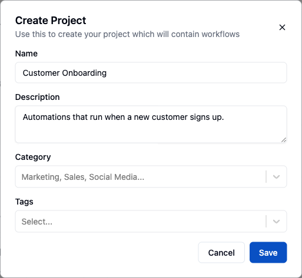
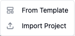
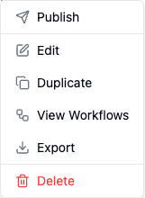
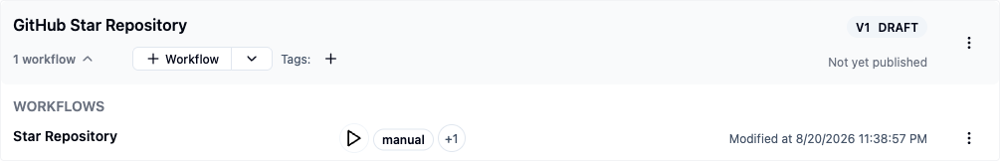
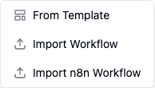
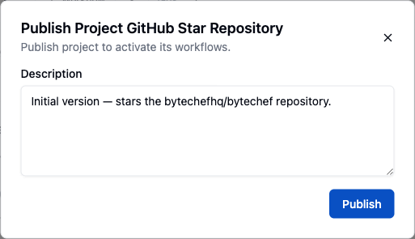
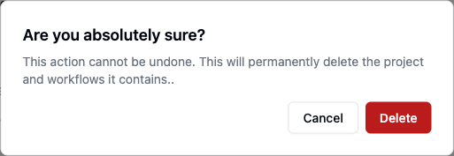

Every project on ByteChef consists of one or more workflows. Projects help organize and manage workflows, making it
easier to group related automation processes together.

## A project is the unit you publish

A project is not only a folder. It is the thing that gets versioned and deployed, so where you draw
the project boundary decides what ships together.

- **Workflows in one project are published together.** Publishing snapshots *every* workflow in the
  project into one immutable version — you cannot publish half a project.
- **Versions are immutable.** Once a version is published, its workflows are frozen; further edits
  go to a fresh draft. A published version is what a deployment runs, and it stays available for
  rolling back. See [Deploy Workflows](/platform/automation/deploy/workflows).
- **Deployment is separate from publishing.** A project deployment binds one published version to
  one [environment](/platform/automation/deploy/environments), with its own connections and its own
  set of enabled workflows. The same version can be deployed to several environments.
- **A project belongs to exactly one workspace.** Data tables, knowledge bases, and connections are
  workspace-scoped, so they are shared across the workspace's projects rather than owned by one of
  them. See [Workspaces](/platform/settings/workspaces).

Access is governed by [workspace roles](/platform/settings/users#roles-and-permissions) — Admin,
Editor, or Viewer — granted per member on the workspace and applying to every project inside it.
There are no per-project roles.

A project has two states, not three: a live **draft** that the editor writes to, and any number of
**published** versions. Deleting a project is permanent — export it first if you might want it back.

## Create Project

<Steps>
<Step>

Navigate to the **Projects** tab.

</Step>
<Step>

Click on the **New Project** button located in the top right corner.

</Step>
<Step>

Enter a name for your project. Optionally, provide a description, select a category, and add relevant tags.

</Step>
<Step>

Click **Save**.

</Step>
</Steps>

The dropdown arrow next to the **New Project** button offers two more ways to start a project: **From Template** and **Import Project**.

## Create Project from Template

<Steps>
<Step>

Click the dropdown arrow next to the **New Project** button in the top right corner.

</Step>
<Step>

Select **From Template** from the dropdown menu.

</Step>
<Step>

Browse the template gallery, pick a pre-built or community-shared project template, and import it.

</Step>
</Steps>

For details on the gallery and the import flow, see [Templates](/platform/automation/build/workflows/templates).

## Import Project

<Steps>
<Step>

Click the dropdown arrow next to the **New Project** button in the top right corner.

</Step>
<Step>

Select **Import Project** from the dropdown menu.

</Step>
<Step>

Choose the project archive (`.zip`) file exported from ByteChef.

</Step>
<Step>

The imported project, together with its workflows, appears in the project list.

</Step>
</Steps>

## New Code Workflow

<Callout type="warn" title="Coming soon">
    Creating a code workflow from the Projects page is on the upcoming release track and is not yet
    available in the latest released version of ByteChef. Today a code workflow is authored outside
    the product and deployed through the API — see
    [Code Workflows](/platform/automation/build/workflows/code-workflows).
</Callout>

<Steps>
<Step>

Click the dropdown arrow next to the **New Project** button in the top right corner.

</Step>
<Step>

Select **New Code Workflow** from the dropdown menu.

</Step>
<Step>

Give the code workflow a name and pick its language, then edit the workflow definition directly in code.

</Step>
</Steps>

A code workflow runs on the same engine as a visually built one — see [Build Approaches](/platform/automation/build/workflows/build-approaches) for when to choose full-code.

## Edit Project

<Steps>
<Step>

Locate the project you wish to edit and click on the three dots next to its name.

</Step>
<Step>

Select **Edit** from the dropdown menu.

</Step>
<Step>

Modify the project name, description, category, or tags as needed.

</Step>
<Step>

Click **Save** to apply your changes.

</Step>
</Steps>

## Duplicate Project

<Steps>
<Step>

Find the project you want to duplicate and click on the three dots next to its name.

</Step>
<Step>

Select **Duplicate** from the dropdown menu.

</Step>
<Step>

The duplicated project will appear in the project list with the same name followed by a numerical suffix (e.g., Project Name (1)).

</Step>
</Steps>

## Export Project

<Steps>
<Step>

Click on the three dots next to the project name you wish to export.

</Step>
<Step>

Select **Export** from the dropdown menu.

</Step>
<Step>

A project archive (`.zip`) containing the project and all of its workflows downloads to your computer. Use it to back up a project or import it into another workspace or ByteChef instance.

</Step>
</Steps>

## Create Workflow

<Steps>
<Step>

Click **+ Workflow** on the row of the project you want to add a workflow to.

</Step>
<Step>

Enter a label for your workflow and optionally provide a description.

</Step>
<Step>

Click **Save** to create the workflow.

</Step>
</Steps>

## Import Workflow

<Steps>
<Step>

Click the dropdown arrow next to the **Workflow** button on the project where you want to import a workflow.

</Step>
<Step>

Select **Import Workflow** from the dropdown menu.

</Step>
<Step>

Choose the JSON file containing the workflow you wish to import.

</Step>
</Steps>

## Import n8n Workflow

<Steps>
<Step>

Click the dropdown arrow next to the **Workflow** button on the project where you want to import a workflow.

</Step>
<Step>

Select **Import n8n Workflow** from the dropdown menu.

</Step>
<Step>

Choose the JSON file exported from n8n.

</Step>
<Step>

ByteChef converts the n8n workflow and adds it to the selected project.

</Step>
</Steps>

## Publish Project

<Steps>
<Step>

Click on the three dots next to the project name you wish to publish.

</Step>
<Step>

Select **Publish** from the dropdown menu.

</Step>
<Step>

Provide a description for this published version to document any changes or updates.

</Step>
<Step>

Click **Publish** to make the project available.

</Step>
</Steps>

## Share Projects and Workflows as Templates

<Callout type="warn" title="Coming soon">
    Sharing as a template is behind a feature flag that is not enabled in the latest released
    version of ByteChef, so the **Share** and **Share with Community** menu items described below
    are not visible yet. To move a project between workspaces or instances today, use
    [Export Project](#export-project) and [Import Project](#import-project).
</Callout>

Beyond [exporting a project](#export-project) to a `.zip` file for your own backups, a project — or
an individual workflow, from its own three-dot menu — can be shared as a **template** that anyone
with the link can import into their own workspace.

<Steps>
<Step>

Click on the three dots next to the project (or workflow) name and choose **Share**.

</Step>
<Step>

Write a **Description** of what it does — this is required before you can export it.

</Step>
<Step>

Click **Export and generate template link**. The dialog turns into a link card with a **Copy link** button; anyone who opens the link can import it through `/import/shared/projects/{uuid}` (workflows use `/import/shared/workflows/{uuid}`).

</Step>
<Step>

Use the toggle at the top of the dialog to **disable** the link at any time — the existing link stops working — and to re-enable it later, which generates a fresh export.

</Step>
<Step>

If you keep editing the project after sharing it, the dialog notes that "an older version... is shared as a template" and offers an **Update template based on the current version** button, so the link always points at what you intend.

</Step>
</Steps>

A second, separate action — **Share with Community** — opens ByteChef's public template submission
form in a new tab, for projects and workflows you want listed in the official gallery (see
[Templates](/platform/automation/build/workflows/templates)) rather than shared privately by link.

## Delete Project

<Steps>
<Step>

Locate the project you want to delete and click on the three dots next to its name.

</Step>
<Step>

Select **Delete** from the dropdown menu.

</Step>
<Step>

Confirm the deletion if prompted.

</Step>
</Steps>

