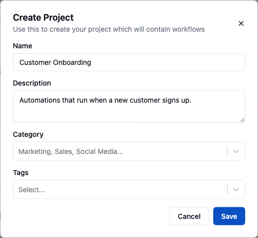
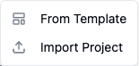
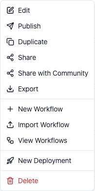
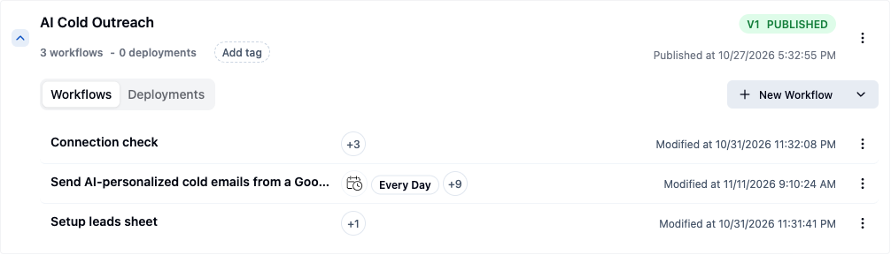
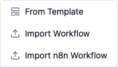
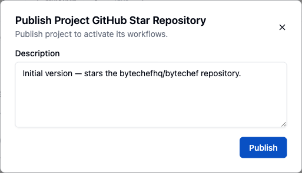
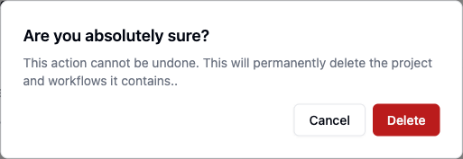

A project groups related workflows. It is also the unit that ByteChef versions, publishes and deploys. This page
describes how to create and manage projects and add workflows to them.

## A project is the unit you publish

The project boundary decides which workflows are released together.

- **Workflows in one project are published together.** Publishing saves every workflow in the project
  into one immutable version. You cannot publish part of a project.
- **Versions are immutable.** After a version is published, its workflows do not change; further edits
  go to a new draft. A published version is what a deployment runs, and it stays available for
  rolling back. See [Deploy Workflows](/platform/automation/deploy/workflows).
- **Deployment is separate from publishing.** A project deployment binds one published version to
  one [environment](/platform/automation/deploy/environments), with its own connections and its own
  set of enabled workflows. The same version can be deployed to several environments.
- **A project belongs to exactly one workspace.** Data tables, knowledge bases, and connections are
  workspace-scoped, so they are shared across the workspace's projects rather than owned by one of
  them. See [Workspaces](/platform/automation/settings/workspaces).

Access is governed by [workspace roles](/platform/settings/users#roles-and-permissions) - Admin,
Editor, or Viewer - granted per member on the workspace and applying to every project inside it.
There are no per-project roles.

A project has a **draft** that the editor writes to, and any number of **published** versions.
Deleting a project is permanent; export it first if you might need it again.

## Create Project

<Steps>
<Step>

Navigate to the **Projects** tab.

</Step>
<Step>

Click on the **New Project** button located in the top right corner.

</Step>
<Step>

Enter a name for your project. Optionally, provide a description, select a category, and add relevant tags.

</Step>
<Step>

Click **Save**.

</Step>
</Steps>

The dropdown arrow next to the **New Project** button offers two more ways to start a project: **From Template** and **Import Project**.

## Create Project from Template

<Steps>
<Step>

Click the dropdown arrow next to the **New Project** button in the top right corner.

</Step>
<Step>

Select **From Template** from the dropdown menu.

</Step>
<Step>

Browse the template gallery, pick a pre-built or community-shared project template, and import it.

</Step>
</Steps>

For details on the gallery and the import flow, see [Templates](/platform/automation/build/workflows/templates).

## Import Project

<Steps>
<Step>

Click the dropdown arrow next to the **New Project** button in the top right corner.

</Step>
<Step>

Select **Import Project** from the dropdown menu.

</Step>
<Step>

Choose the project archive (`.zip`) file exported from ByteChef.

</Step>
<Step>

The imported project, together with its workflows, appears in the project list.

</Step>
</Steps>

## New Code Workflow

<Callout type="warn" title="Coming soon">Creating a code workflow from the Projects page is not available yet; deploy code workflows through the API as described in [Code Workflows](/platform/automation/build/workflows/code-workflows).</Callout>

<Steps>
<Step>

Click the dropdown arrow next to the **New Project** button in the top right corner.

</Step>
<Step>

Select **New Code Workflow** from the dropdown menu.

</Step>
<Step>

Give the code workflow a name and pick its language, then edit the workflow definition directly in code.

</Step>
</Steps>

A code workflow runs on the same engine as a visually built one. See [Build Approaches](/platform/automation/build/workflows/build-approaches) for when to choose full-code.

## Edit Project

<Steps>
<Step>

Locate the project you wish to edit and click on the three dots next to its name.

</Step>
<Step>

Select **Edit** from the dropdown menu.

</Step>
<Step>

Modify the project name, description, category, or tags as needed.

</Step>
<Step>

Click **Save** to apply your changes.

</Step>
</Steps>

The project actions menu (three dots on the project row) contains:

| Group | Items |
|---|---|
| Project | **Edit**, **Publish**, **Duplicate**, **Share**, **Share with Community** (only when a template submission form is configured), **Export** |
| Workflows | **New Workflow**, **Import Workflow**, **View Workflows** (only when the project has workflows) |
| Deployments | **New Deployment** |
| | **Delete** |

## Duplicate Project

<Steps>
<Step>

Find the project you want to duplicate and click on the three dots next to its name.

</Step>
<Step>

Select **Duplicate** from the dropdown menu.

</Step>
<Step>

The duplicated project will appear in the project list with the same name followed by a numerical suffix (e.g., Project Name (1)).

</Step>
</Steps>

## Export Project

<Steps>
<Step>

Click on the three dots next to the project name you wish to export.

</Step>
<Step>

Select **Export** from the dropdown menu.

</Step>
<Step>

A project archive (`.zip`) containing the project and all of its workflows downloads to your computer. Use it to back up a project or import it into another workspace or ByteChef instance.

</Step>
</Steps>

## Workflows and Deployments

Each project row shows a summary such as **2 workflows - 1 deployment**. Click it, or the empty space
on the row, to expand the project. An expanded row has two tabs:

- **Workflows** - the project's workflows, with **New Workflow** on the right. The row always opens
  on this tab.
- **Deployments** - the project's deployments in the Development environment, with **New Deployment**
  on the right. See [View a Project's Deployments](/platform/automation/deploy/workflows#view-a-projects-deployments).

The deployment count covers all of the project's Development deployments, enabled or not.

## Create Workflow

<Steps>
<Step>

Expand the project you want to add a workflow to.

</Step>
<Step>

On the **Workflows** tab, click **New Workflow**.

</Step>
<Step>

Enter a label for your workflow and optionally provide a description.

</Step>
<Step>

Click **Save** to create the workflow.

</Step>
</Steps>

## Import Workflow

<Steps>
<Step>

Expand the project and, on the **Workflows** tab, click the dropdown arrow next to **New Workflow**.

</Step>
<Step>

Select **Import Workflow** from the dropdown menu.

</Step>
<Step>

Choose the JSON file containing the workflow you wish to import.

</Step>
</Steps>

## Import n8n Workflow

<Steps>
<Step>

Expand the project and, on the **Workflows** tab, click the dropdown arrow next to **New Workflow**.

</Step>
<Step>

Select **Import n8n Workflow** from the dropdown menu.

</Step>
<Step>

Choose the JSON file exported from n8n.

</Step>
<Step>

ByteChef converts the n8n workflow and adds it to the selected project.

</Step>
</Steps>

## Publish Project

<Steps>
<Step>

Click on the three dots next to the project name you wish to publish.

</Step>
<Step>

Select **Publish** from the dropdown menu. **Publish** is disabled until the project has at least one workflow.

</Step>
<Step>

In the **Publish Project** dialog, enter a **Description** of the changes in this version.

</Step>
<Step>

Click **Publish**. The new version can now be deployed.

</Step>
</Steps>

## Share Projects and Workflows as Templates

A project, or a single workflow from its own actions menu, can be shared as a **template**. Anyone
with the link can import it into their own workspace. To back up a project instead, [export it](#export-project).

<Steps>
<Step>

Click on the three dots next to the project (or workflow) name and choose **Share**.

</Step>
<Step>

Enter a **Description** of what it does. The description is required.

</Step>
<Step>

Click **Export and generate template link**. The dialog shows the link and a **Copy link** button. The link has the form `/import/shared/projects/{uuid}` (workflows use `/import/shared/workflows/{uuid}`).

</Step>
<Step>

To disable the link, turn off the switch at the top of the dialog. The existing link stops working. Turn the switch on again to export the current version and re-enable the link.

</Step>
<Step>

If you change the project after sharing it, the dialog shows that an older version is shared. Click **Update template based on the current version** to share the current version.

</Step>
</Steps>

**Share with Community** is a separate action. It opens the template submission form in a new tab, for
projects and workflows that you want listed in the public gallery (see
[Templates](/platform/automation/build/workflows/templates)).

## Delete Project

<Steps>
<Step>

Locate the project you want to delete and click on the three dots next to its name.

</Step>
<Step>

Select **Delete** from the dropdown menu.

</Step>
<Step>

Confirm the deletion. The project and its workflows are deleted permanently.

</Step>
</Steps>

