## Create Workflow

<Steps>
<Step>

Click **+ Workflow** on the row of the project you want to add a workflow to.

</Step>
<Step>

Provide a label for your workflow. Optionally, add a description to explain its purpose.

</Step>
<Step>

Click **Save** to create the workflow.

</Step>
</Steps>

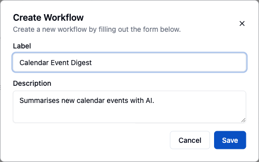


### Add Component

<Steps>
<Step>

Click on the **+** icon to add a new component to the workflow.

</Step>
<Step>

Find and select **Math Helper** component.

</Step>
<Step>

Select the **Addition** action from the list.

</Step>
<Step>

In the **Properties** tab, enter the numbers you want to add.

</Step>
<Step>

For **First Number**, input the first value (e.g., `2`).

</Step>
<Step>

For **Second Number**, input the second value (e.g., `3`).

</Step>
<Step>

Click **Run**.

</Step>
<Step>

In the lower panel, examine the input and output for the addition action to verify the results.

</Step>
</Steps>

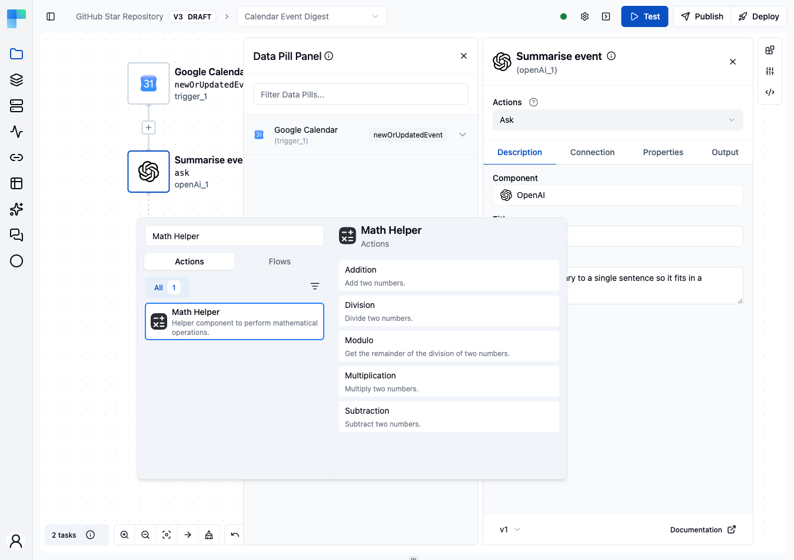


### Use Data Pill

<Steps>
<Step>

Click on the **+** icon to add a new component to the workflow.

</Step>
<Step>

Find and select **OpenAI** component.

</Step>
<Step>

Select the **Ask** action from the list.

</Step>
<Step>

Click on the **OpenAI** component to open its configuration panel.

</Step>
<Step>

In the **Connection** tab, click **Create Connection**.

</Step>
<Step>

Enter a connection name and paste the **API Token** from OpenAI.

</Step>
<Step>

Click **Save**.

</Step>
<Step>

Click on **Choose Connection**.

</Step>
<Step>

Select the connection you just created.

</Step>
<Step>

Go to the **Properties** tab.

</Step>
<Step>

For **Model**, choose the desired model (e.g., `gpt-4`).

</Step>
<Step>

Leave **Format** on **Simple** - the default, which asks for a prompt rather than a full message list.

</Step>
<Step>

For **Prompt**, enter the prompt text, such as `Tell me something about this number:`.

</Step>
<Step>

After clicking on the prompt field, the Data Pill Panel will open on the left. Use the data pill to insert output from a previous component.

</Step>
<Step>

Click on **Math Helper** component in Data Pill Panel.

</Step>
<Step>

Click on **mathHelper_1**, which is the output of the addition action for the Math Helper component.

</Step>
<Step>

Output of Math Helper component is now inserted into the prompt field. Click **Run**.

</Step>
<Step>

In the lower panel, review the input and output for each action in the workflow. Click on **OpenAI**.

</Step>
<Step>

Verify that the result of the addition action is correctly inserted in the prompt field.

</Step>
</Steps>


### Output

Each component in a workflow can be tested individually to verify its output. In the Configuration Panel, you can explore the output structure of an action through the **Output** tab.

<Steps>
<Step>

Click on the component you want to test within your workflow.

</Step>
<Step>

Go to the **Output** tab to view the output of the component.

</Step>
<Step>

The output schema is displayed here, illustrating the structure of the output data. For example, the output of the **Addition** action is represented as a number, indicated by hashtag icons.

</Step>
<Step>

Note that the value `23.34` shown in the output schema is a placeholder and not the actual result of the action.

</Step>
<Step>

Use **Test Action** to run the action for real, or the **…** menu beside it for **Upload Sample Output** and **Reset**.

</Step>
<Step>

**Test Action** executes the action and shows its real output - in this case, `5`.

</Step>
<Step>

**Upload Sample Output** lets you supply your own sample payload instead of running the action.

</Step>
<Step>

**Reset** returns the tab to the generated schema with sample values.

</Step>
</Steps>

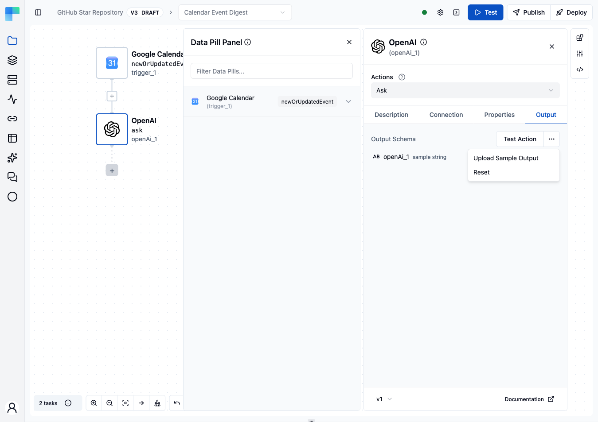

To summarize:

- **Test Action**: Executes the action and displays the real output.
- **Upload Sample Output Data**: Allows you to upload your own sample output data.
- **Reset**: Displays the structure of the output data with sample values.

**Note:** Some components does not have predefined output schema because their output is dynamic. In that case you have to test the component to see the output.


### Add Trigger

<Steps>
<Step>

Hover the trigger node, open its **⋮ Node actions** menu, and choose **Replace**.

</Step>
<Step>

Search for and select Schedule.

</Step>
<Step>

Select **Cron**.

</Step>
<Step>

Click on "Properties".

</Step>
<Step>

Enter "* * ? * *" as the expression.

</Step>
<Step>

Select your timezone.

</Step>
</Steps>

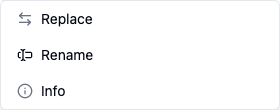

After picking **Schedule → Cron**, set the expression and timezone on the **Properties** tab.

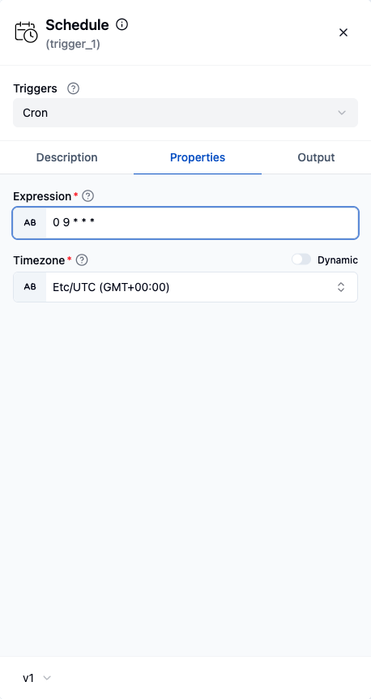


#### Multiple triggers

> **Coming soon.** Multiple triggers per workflow are on the upcoming release track and are not yet available in the latest released version of ByteChef.

A workflow can have **more than one trigger** - for example, run on a schedule *and* on an incoming webhook. Use the add-trigger button next to the existing trigger to attach another one; on deployment every trigger is enabled, and any of them can start a run of the same workflow.

### Edit Component

<Steps>
<Step>

Click on the component you want to edit.

</Step>
<Step>

Change title and add some notes.

</Step>
</Steps>

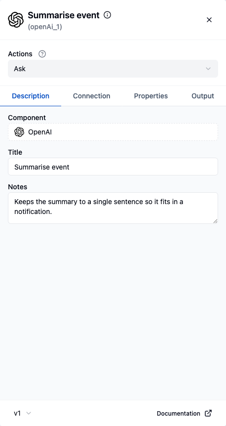


### Stream data in bulk

For moving large volumes of records between systems (bulk sync, export, migration), use a **[Data Stream](/platform/automation/build/workflows/data-streams)** node *(coming soon)* instead of looping over single-record actions.

### Canvas Layout

The editor arranges your nodes automatically in a tidy top-down flow as you build. You can still drag any node to a custom position - those positions are saved with the workflow.

To discard your manual positions and snap everything back to the automatic layout, click the **Reset layout** button (the broom icon) in the canvas toolbar. To reset a single node instead, open that node's menu and choose **Reset position** (shown only when the node has been moved).

### Add Sticky Notes

> **Coming soon.** Sticky notes are on the upcoming release track and are not yet available in the latest released version of ByteChef.

Sticky notes let you annotate the workflow canvas - describe what a section does, leave review comments, or link a walkthrough video. They are documentation only and are never executed.

<Steps>
<Step>

Click the **sticky note icon** (Add note) in the editor toolbar. A note appears on the canvas.

</Step>
<Step>

**Double-click** the note to edit its text - Markdown is supported, and pasted YouTube links render as embedded videos.

</Step>
<Step>

Drag the note anywhere on the canvas and resize it from its edges.

</Step>
<Step>

Use the note's color swatches to pick a preset color, or choose a custom one; recently used custom colors are remembered.

</Step>
</Steps>

Sticky notes are saved with the workflow, so everyone who opens it sees the same annotations.

### Canvas Controls

A toolbar in the corner of the canvas gives you control over how the workflow is laid out and viewed. None of these controls change what the workflow does - they only affect the editing view.

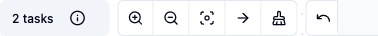

| Control | What it does |
|---|---|
| **Zoom in** / **Zoom out** | Scale the canvas up or down. |
| **Fit to screen** | Frame the whole workflow in the viewport. |
| **Switch to horizontal / vertical layout** | Flip the auto-layout direction; the choice is remembered per workflow. |
| **Reset layout** | Re-run auto-layout to tidy the nodes back into place. |
| **Undo** / **Redo** | Step backward or forward through your recent edits. |

> **Coming soon.** Three further toolbar controls are on the upcoming release track and are not yet
> available in the latest released version of ByteChef: **Switch layout engine** (toggle between the
> standard and the experimental layout engine), **Lock / Unlock node movement** (prevent, or
> re-allow, dragging nodes), and **Add note** (drop a [sticky note](#add-sticky-notes) on the
> canvas).

## Workflow Inputs

Workflow inputs are values supplied to a run from the outside - a caller's parameters, a deployment configuration, or a test value you enter in the editor. Open the **Workflow Inputs** panel from the right sidebar to define them.

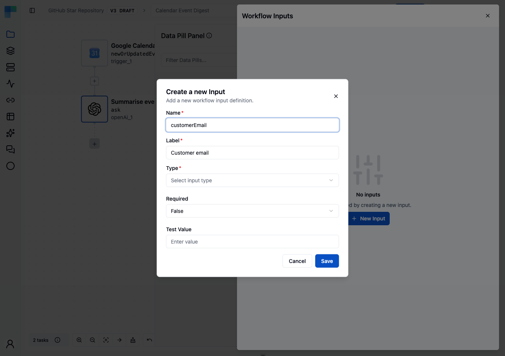

<Steps>
<Step>

In the workflow editor, click the **Workflow Inputs** icon in the right sidebar.

</Step>
<Step>

Click **+** to add an input, then set its fields: - **Type** - one of Boolean, Date, Date Time, Integer, Number, String, or Time. (Two further types, **Field Mapping** and **Component property**, are on the upcoming release track and are not yet available in the latest released version of ByteChef.) - **Name** - the key used to reference the input as a dynamic value. - **Label** - the human-readable label shown when the input is filled in. - **Required** - whether a value must be provided. - **Test Value** - a value used only when you run the workflow in the editor's test mode.

</Step>
<Step>

Use the row actions to edit or delete an existing input.

</Step>
</Steps>

Defined inputs are available downstream as [data pills](/platform/automation/build/workflows/data-pills) under the workflow's inputs.

## Workflow Outputs

Workflow outputs declare what the workflow returns to its caller. Open the **Workflow Outputs** panel from the right sidebar.

<Steps>
<Step>

In the workflow editor, click the **Workflow Outputs** icon in the right sidebar.

</Step>
<Step>

The panel lists each output as a **Name** / **Value** row.

</Step>
<Step>

Click **+** to add an output, then set its **Name** and **Value**. The value is built with data pills or a [formula expression](/platform/automation/build/workflows/data-pills#input-modes), so an output can reference the result of any earlier step.

</Step>
<Step>

Use the row actions to edit or delete an existing output.

</Step>
</Steps>

## Edit Workflow

<Steps>
<Step>

Click on the settings icon in the top right corner.

</Step>
<Step>

Choose **Edit** from the dropdown menu.

</Step>
<Step>

Change the workflow name or description as needed.

</Step>
<Step>

Click **Save** to apply your changes.

</Step>
</Steps>

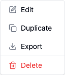


## Duplicate Workflow

<Steps>
<Step>

Click on the settings icon in the top right corner.

</Step>
<Step>

Choose **Duplicate** from the dropdown menu.

</Step>
</Steps>

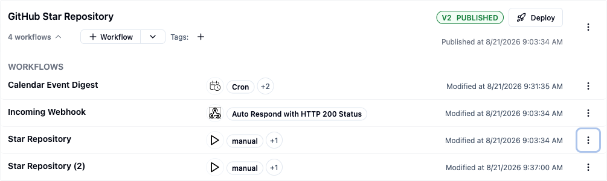


## Export Workflow

<Steps>
<Step>

Click on the settings icon in the top right corner.

</Step>
<Step>

Choose **Export** from the dropdown menu to download the workflow JSON file.

</Step>
</Steps>


## Publish Workflow

<Steps>
<Step>

Click on **Publish**.

</Step>
<Step>

Enter description of the published project.

</Step>
<Step>

Click on **Publish**.

</Step>
</Steps>


## Editor Header Controls

The project editor's header, next to **Publish**, carries the rest of the run/deploy loop for the
project you're currently editing.

### Deploy

**Deploy** opens the same [Create Deployment](/platform/automation/build/workflows/projects) dialog
used from the Project Deployments page, pre-scoped to the current project. It's disabled - with a
"Publish the project to enable deployment" tooltip - until the project has at least one published
version, since a deployment always targets a published version, never a draft. Its **New** tab
creates a fresh deployment (**Environment**, **Version**, **Name**, **Description**, **Tags**); its
**Change Version** tab repoints an existing deployment at a different published version.

### Run, Test, and the Output panel

The header's **Test** button runs the current workflow from its trigger and streams the run's
progress and result into the **Output panel** at the bottom of the editor; while a run is
in-flight, the button turns into a **Stop** button that cancels it. If the workflow's trigger is a
chat trigger, the same button is labeled **Chat** instead - clicking it opens the
[test chat panel](#test-with-chat) rather than starting a run immediately, and you drive the run by
sending it messages.

The icon button beside Test/Chat (tooltip: "Show the current workflow test execution output")
toggles the Output panel open or closed on its own, so you can revisit the last run's result
without triggering a new one.

### Project History

The settings menu's **Project** tab has a **Project History** entry that opens a side sheet listing
every version of the project - version number, publish date, a **Published**/**Draft** badge, and
the version's description. It's the project-scoped, always-available counterpart to the
environment-pinning story covered in
[Deploying workflows](/platform/automation/deploy/workflows): Project History shows
every version regardless of which environment, if any, currently has it pinned.

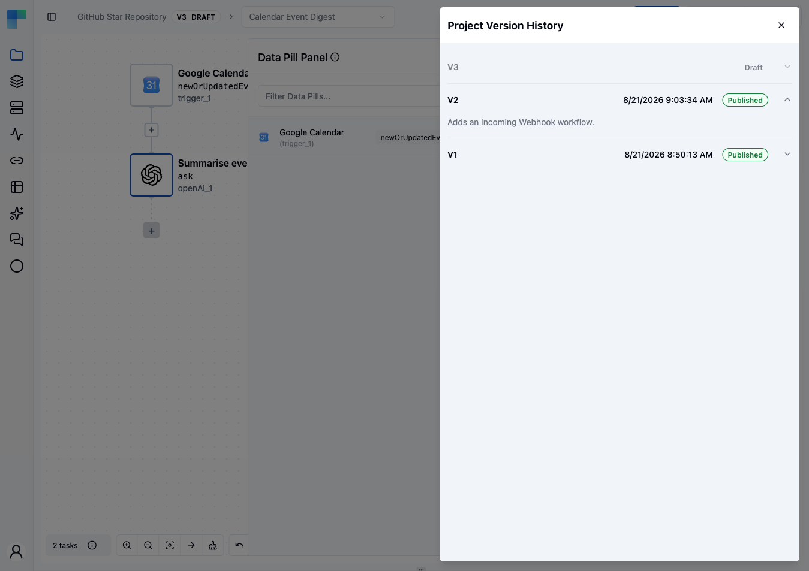

### Test with Chat

For a chat-triggered workflow, the test chat panel lets you exchange messages with the workflow the
same way an end user would through a deployed [chat](/platform/automation/deploy/chats) - type a
message, send it, and the reply streams into the same thread as the run executes.

{/* Voice test sessions are coming soon - not in the latest released version, so this section is
commented out until the browser/v1/voiceSession trigger ships. Tracked in
.agents/coming-soon-inventory.md.

On top of typed messages, the panel offers a voice test session. A round mic button appears next to
the composer only when your browser supports the required APIs (AudioContext, AudioWorklet,
microphone access, and WebSocket, over a secure connection) and the trigger you're testing is one
that supports a live, streaming connection. Starting a session asks for microphone permission,
streams your audio to the workflow over a WebSocket, and speaks the assistant's replies back while
transcribing both sides into the same chat thread as typed messages. Click the button again - now
shown as a red stop icon - to end the session; a red banner surfaces any connection or permission
error inline in the panel. */}

## Delete Workflow

<Steps>
<Step>

Click on the settings icon in the top right corner.

</Step>
<Step>

Choose **Delete** from the dropdown menu.

</Step>
<Step>

Click **Delete**.

</Step>
</Steps>

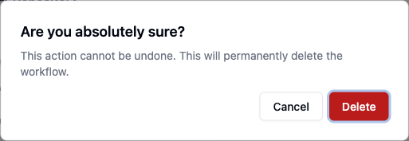


## Code Editor

Every workflow is represented as a JSON file, allowing you to edit it using the code editor. Changes made in the code editor are reflected in the UI and vice versa. This feature is particularly useful for resolving UI issues or making bulk changes to the workflow.

### Access the Code Editor

<Steps>
<Step>

Click on the code icon in the right panel.

</Step>
<Step>

The code editor will open, displaying the JSON representation of the workflow. Review this structure to understand how the workflow is organized.

</Step>
</Steps>

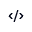


### Add Component

Adding components to your workflow allows you to extend its functionality and tailor it to your specific needs. Each component comes with detailed documentation that guides you through its features and actions. By following these steps, you can seamlessly integrate new components into your workflow.

<Steps>
<Step>

Go to the [Component Reference](/reference) page.

</Step>
<Step>

Search for the component you want to add. For this example, we'll add the **Random Helper** component.

</Step>
<Step>

Click on the **Random Helper** component to view its documentation.

</Step>
<Step>

In the Actions section, find the list of available actions. We'll choose the **Random Integer** action.

</Step>
<Step>

Let's write code to add the **Random Integer** action to the workflow.

</Step>
<Step>

Under the `tasks` key, add a new object for the **Random Integer** action.

</Step>
<Step>

Enter the `label` for the UI display, e.g., `Generate Integer`.

</Step>
<Step>

Set the `name` as the action key, e.g., `generatedInt`.

</Step>
<Step>

Under `parameters`, specify the required properties. Here, we need `startInclusive` and `endInclusive` to generate a random integer between two numbers. Set `startInclusive` to `1` and `endInclusive` to `100`.

</Step>
<Step>

Add the `type` for this task: `randomHelper/v1/randomInt`. The `randomHelper/v1` is the component type, and `randomInt` is the action name.

</Step>
</Steps>

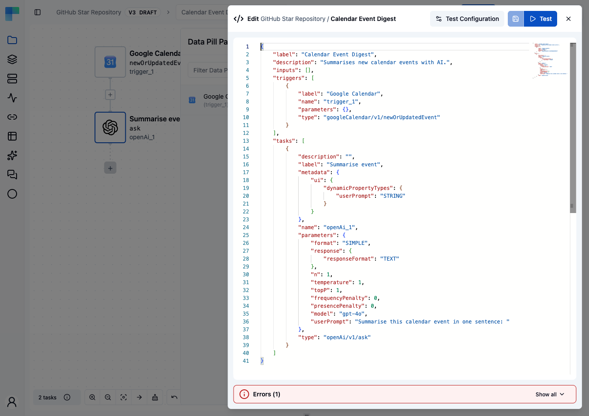

This part of code will look like this:

 ```json
  {
    "label": "Generate Integer",
    "name": "generatedInt",
    "parameters": {
        "startInclusive": 1,
        "endInclusive": 100
    },
    "type": "randomHelper/v1/randomInt"
}
 ```

<Steps>
<Step>

Click on save icon to add the component to your workflow.

</Step>
</Steps>

