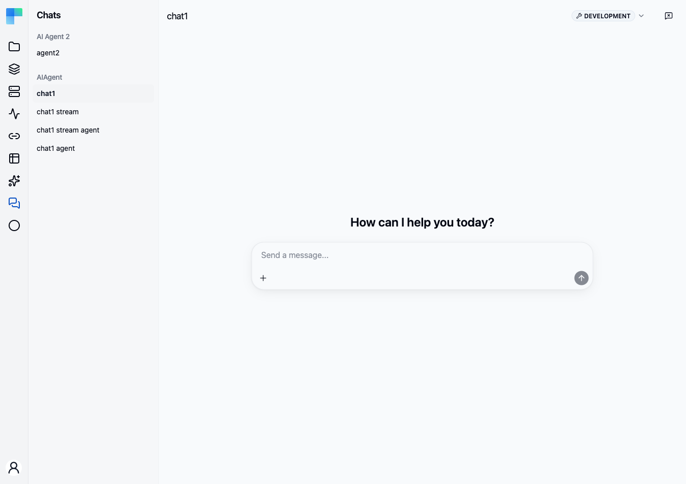

**Chats** in the automation sidebar is ByteChef's hosted chat interface: a page that lists every
deployed workflow you can hold a conversation with, and lets you exchange messages and files with
one. It is the end-user counterpart to the editor's **Test with Chat** panel — same conversation,
but against a deployed workflow rather than a draft.

## What makes a workflow appear here

The sidebar is not a list of everything you have deployed. A workflow shows up only when **all** of
the following hold, and it disappears the moment any one of them stops:

1. Its **project deployment is enabled**, in the environment selected in the page header.
2. The **workflow itself is enabled** within that deployment — a deployment can carry workflows that
   are individually switched off.
3. The workflow has a **[Chat](/reference/components/chat_v1) trigger**.
4. That trigger's **Mode** is **Hosted Chat**. Choosing *Embedded Chat* deliberately keeps the
   workflow off this page — that mode exists for chat interfaces you build yourself.
5. The trigger resolves to a webhook URL, which it does once the workflow is deployed.

<Callout title="Nothing listed?">
  Work back through that list in order. An enabled project deployment whose workflow is switched
  off, and a chat trigger left on *Embedded Chat*, are the two that most often look correct at a
  glance. The list is also environment-specific: a workflow deployed only to Development will not
  appear while the header is set to Production.
</Callout>

Matching workflows are grouped by project, and each entry is labelled with the workflow's label.

## Holding a conversation

Pick a workflow from the sidebar and type into the composer. Each message starts a run of that
workflow, with your text and any attachments delivered as the trigger's output, so the workflow
sees the same payload it would from any other caller.

**Attachments.** Images and text files can be attached to a message and arrive as the trigger's
`attachments`.

**Streaming.** If the workflow contains an action that streams its response — an AI chat action, for
example — the reply appears token by token as the run produces it. Otherwise the reply appears in one
piece when the run finishes. You do not configure this: ByteChef detects it from the actions in the
workflow.

**Questions from the workflow.** A workflow that pauses to ask you something renders the question in
the thread; your next message answers it and the run resumes where it stopped, instead of starting a
new one.

## One conversation at a time

A run in progress locks the page: the other chats in the sidebar are disabled until it finishes, and
navigating to one sends you back to the running conversation. This is deliberate — it keeps a reply
from arriving in a thread you have already left.

## What is kept, and what is not

This is the part worth knowing before you rely on the page.

**Conversation history is held in the browser, not on the server.** Switching between chats in the
sidebar preserves each thread, so you can move between them and come back. But leaving the Chats
page entirely discards every thread — navigating to Projects and back gives you empty conversations.
Nothing is persisted for later retrieval.

**"Clear messages" starts a new conversation, not just a clean view.** The button in the page header
(enabled only when no run is in progress) drops the transcript *and* mints a new conversation id.
For a workflow that keeps chat memory keyed on that id, the next message begins a genuinely fresh
conversation with no recollection of what came before — which is usually what you want when
testing, and worth knowing when you did not intend it.

If you need a durable record of what a chat run did, look at the run itself under
[Workflow Executions](/platform/automation/monitor/workflow-executions) rather than at the chat
thread.

## Related

- [Chat trigger reference](/reference/components/chat_v1) — the trigger's modes and output shape
- [Deploy Workflows](/platform/automation/deploy/workflows) — enabling a deployment and its workflows
- [Workflow Executions](/platform/automation/monitor/workflow-executions) — the runs a chat produces
