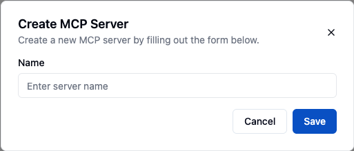
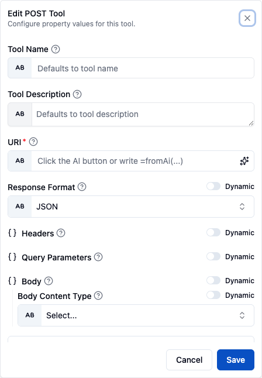
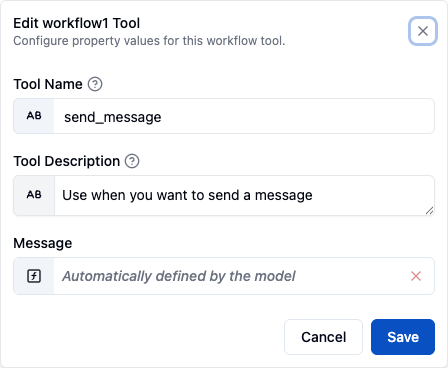

An **MCP Server** turns the things you build in ByteChef into tools that AI assistants can call. You choose which component actions and which workflows to expose, ByteChef gives you a single [Model Context Protocol (MCP)](https://modelcontextprotocol.io) URL, and any MCP-aware client - Claude, Cursor, Windsurf, or your own agent - can discover and invoke them.

A server can expose two kinds of tools:

- **Component actions** - individual actions from a connected component (for example, "send a Slack message" or "create a HubSpot contact"), optionally backed by one of your connections so the assistant can act as you.
- **Workflows** - whole workflows from a published project version, each exposed as a single tool the assistant runs with the inputs you define.

> **MCP Servers vs. the Management MCP Server.** This page is about *publishing your own tools* to external assistants. If you instead want an assistant to *manage* ByteChef itself - create and edit projects, workflows, and components - see the [Management MCP Server](/platform/settings/mcp-server).

The MCP servers you create here need no server-side switch - the per-server endpoint is always mounted. (The separate
`BYTECHEF_AI_MCP_SERVER_ENABLED` variable gates the [Management MCP Server](/platform/settings/mcp-server), which is on
by default; setting it to `false` turns that one off and leaves these unaffected.)

For exposing integrations to your product's own customers instead, see [Embedded → MCP Servers](/platform/embedded/configure/mcp-servers).

---

## Create an MCP server



1. In the Automation workspace, open **MCP Servers** from the sidebar.
2. Click **New MCP Server**.
3. Give it a **name** and decide whether to **Require authentication** (see [Authentication](#authentication) below).

A server created from the dialog starts **disabled**; turn it on with the **Enabled** switch on the server's row in the list, once its tools are in place (see [Turning the server on](#turning-the-server-on) below). Each server belongs to your workspace and a single environment (Development, Staging, or Production), so you can publish a different set of tools - with different credentials - per environment. Tags are assigned from the server row and let you filter the list as it grows.

A server exposes nothing until you add components or workflows to it.

---

## Expose component actions

1. Expand the server's row, open its **Component Tools** tab and click **Add Component**.
2. **Select a component** from the available components.
3. **Select the actions** (tools) from that component you want to expose. Only the actions you pick become callable; everything else stays hidden.
4. If the actions need authentication, attach one of your **connections** to the component. The assistant then runs those actions using that connection's credentials.
5. Optionally pick the component's **Required Authorities** - the roles a caller must hold, one of them at least, to see this component's tools when the server has [Enforce tool authorization](#enforce-tool-authorization) on. The list of authorities is available on the Enterprise Edition.

You can add multiple components to one server, and enable or disable individual tools at any time: each tool row has its own **Enabled** toggle, and a disabled tool disappears from the server's tool list - connected assistants no longer see or can call it, as if it did not exist. Existing and newly added tools default to enabled. Switching a tool is a change to the workspace's MCP server, so it needs permission to edit that workspace's MCP servers. This complements the server-level toggle, which turns the whole server on or off at once.



For each exposed action you decide which parameters you fix yourself (a constant the assistant can't change) and which the assistant fills at call time, using the `fromAi(...)` expression - the same mechanism as attaching tools to an AI Agent. See [Supplying tool parameters with fromAi](/platform/automation/build/workflows/ai/agent#supplying-tool-parameters-with-fromai) for the syntax.

The same properties control also offers a **Tool Name** and a **Tool Description**, both optional and both what the model sees. Left blank, the name falls back to `COMPONENT_ACTION` in upper snake case - `sendChannelMessage` on Slack becomes `SLACK_SEND_CHANNEL_MESSAGE` - and the description falls back to the action's own. A tool name is limited to 64 characters made up of letters, digits, `_`, `-`, `.` and `/`; anything else, a space included, is rejected as you type.

Rename an action when its generated name would not tell the model what it does in your context, or when two servers should surface the same action differently. The override is stored on the server's attachment to the tool, not on the component, so it does not follow the action anywhere else.

---

## Expose workflows



1. Expand the server's row, open its **Workflow Tools** tab and click **Add Workflows**.
2. **Select a project** and a **published version**.
3. **Select the workflows** from that version you want to expose. Only workflows that start with the **Workflow → New Workflow Call** trigger are listed; a version without any says so.
4. Complete each workflow's **tool mapping**, from the properties control on its row in the expanded server. The mapping offers a **Tool Name** and a **Tool Description** - both what the model sees - plus one field per input declared on the workflow's trigger schema. A tool name is limited to 64 characters made up of letters, digits, `_`, `-`, `.` and `/`; anything else, a space included, is rejected as you type.

Adding a project version does not touch your own deployments. The server deploys the selected workflows itself, in a deployment of its own in the server's environment that does not appear in the Deployments list. The attachment stays pinned to that version: to expose a newer version, remove the project from the server and add it again with the new version.

Each exposed workflow becomes one tool. Per-input values can be fixed constants or `fromAi(...)` expressions the assistant fills at call time. When the assistant calls the tool, ByteChef runs the workflow with those inputs and waits up to 300 seconds for it to finish. It returns the workflow's response if the workflow sends one, and otherwise the run's outputs. A run that pauses on an [approval](/platform/automation/build/workflows/human-in-the-loop) step returns `status: approval_required` together with the approval form link; MCP clients that support elicitation ask the user to approve or reject inline instead.

The mapping lives on the MCP server's attachment to the workflow, not in the workflow definition - so the same workflow can be exposed under different tool names on different servers, and adding a workflow does not by itself make it callable.

<Callout type="warn" title="Why a workflow might not appear in the tool list">
    A workflow is silently skipped when the server lists its tools if any of these is true:

    - It does **not** start with the **Workflow → New Workflow Call** trigger
      (`workflow/v1/newWorkflowCall`). Only that trigger makes a workflow callable as a tool.
    - Its tool name is blank and its label has no letters or digits to build one from. A blank tool
      name otherwise falls back to the workflow's label, with every run of characters other than
      letters, digits, `_` and `-` replaced by `_`.
    - The server has [Enforce tool authorization](#enforce-tool-authorization) on, which hides every
      workflow tool.
</Callout>

### Choosing what to expose

Prefer exposing a workflow over pointing an assistant at the upstream API it wraps. The practical
differences:

- The assistant is handed a tool, never a credential.
- Retry and error handling live in the workflow, so every caller behaves the same way without each
  client reimplementing them.
- Every tool call runs as an ordinary workflow execution and appears in
  [Workflow Executions](/platform/automation/monitor/workflow-executions) with its inputs, outputs,
  and per-step trace, so a misbehaving assistant is debugged like anything else.
- Changing what a tool does is a new project version attached to the server, not an update to every
  connected client.

### Turning the server on

Switching a server on is refused with an *incomplete tool mapping* error, naming the workflows at
fault, while any exposed workflow has a blank **Tool Name** or leaves a required trigger input
unmapped. Complete those mappings first, then flip the **Enabled** switch.

---

## Get the server URL

Expand the server's row and open its **Connect** tab. It presents the URL inside ready-to-copy configuration snippets, grouped into per-client tabs - **Claude**, **Cursor**, **Windsurf**, and **Other**. The URL has the form:

```
https://<your-host>/api/automation/<secret-key>/mcp
```

> **Keep this URL private.** The secret key identifies this server and selects which tools are exposed. Each snippet has a **refresh** control, available to tenant admins, that rotates the secret in the URL, invalidating the old one.

Whether the URL alone is enough to connect depends on the server's [Require authentication](#require-authentication) setting.

---

## Authentication

The URL secret identifies the server. When the server has **Require authentication** enabled, a separate credential also authenticates the caller, and requests without a valid one are rejected with `401`. Whether a credential is required is a per-server setting - see [Require authentication](#require-authentication) below.

### Require authentication

Each MCP server has a **Require authentication** checkbox, in both the create and the edit dialog:

- **On** - every request must carry a valid API key or a JWT from a trusted issuer; token-less requests get `401`. This is the default for **newly created** servers.
- **Off** - the URL secret alone is enough; requests are served without a credential, and an API key that *is* sent is ignored. Servers created before this setting existed default to **off**, so they keep working unchanged - except servers that already had **Enforce tool authorization** on, which default to **on**.

Keep the URL secret private in both modes - it is the server's only protection when authentication is off.

### Enforce tool authorization

Editing an existing server also offers **Enforce tool authorization**. With it on, a component's tools are listed and callable only for callers holding at least one of the component's [Required Authorities](#expose-component-actions); a component without any is hidden, and so is every workflow tool. The caller's authorities are those of the API key's owner, or those mapped from the JWT.

It depends on authentication: an anonymous caller has no identity to authorize, so turning **Require authentication** off clears and disables it, and the server rejects the combination.

### API key (default)

Create a workspace API key under **Settings** → **API Keys** in the Automation workspace (an Enterprise Edition page, available to admins) and send it with every request as a Bearer header:

```
Authorization: Bearer <your-api-key>
```

Only workspace API keys are accepted; an admin API key is rejected with `401`. When the server requires authentication, the connection snippets below include this header. API keys are bound to an environment - the key's environment must match the MCP server's environment. Because the key is bound to your user account, you can revoke a single client by deleting its key without regenerating the server URL or touching other clients.

### JWT from a trusted issuer (optional)

The MCP endpoints can also accept JWTs issued by an identity provider you trust. List each trusted issuer under the `BYTECHEF_OAUTH2_RESOURCE_SERVER_ISSUERS_*` properties - see [Environment Variables](/platform/use-bytechef/self-hosted/configuration/environment-variables#oauth2-configuration). JWT support stays off until at least one issuer is configured. A token from an issuer that is not listed is rejected with `401`, and a token for these endpoints must carry the `mcp:automation` scope. API keys keep working alongside JWTs.

---

## Connect an AI assistant

<Tabs items={['Claude', 'Cursor', 'Windsurf', 'Other clients']}>
<Tab value="Claude">

**Claude.ai (web)**

> Requires a Claude Pro subscription. claude.ai integrations cannot send custom headers, so they can only reach a server that has **Require authentication** turned off.

1. Go to [claude.ai/settings/integrations](https://claude.ai/settings/integrations)
2. Click **Add More**
3. Paste your MCP server URL and save

**Claude Desktop**

1. Open Claude Desktop
2. Go to **Settings** → **Developer** → **Edit Config** → **Open `claude_desktop_config.json`**
3. Add the following, replacing the URL with yours and `YOUR_API_KEY` with your API key:

   ```json
   {
     "mcpServers": {
       "ByteChef": {
         "command": "npx",
         "args": [
           "-y",
           "mcp-remote",
           "https://<your-host>/api/automation/<secret-key>/mcp",
           "--header",
           "Authorization: Bearer YOUR_API_KEY"
         ]
       }
     }
   }
   ```

4. Save the file, then quit and restart Claude Desktop

</Tab>
<Tab value="Cursor">

1. Open Cursor → **Settings** → **Cursor Settings** → **MCP** → **Add new global MCP server**
2. Paste the following, replacing the URL with yours and `YOUR_API_KEY` with your API key:

   ```json
   {
     "mcpServers": {
       "ByteChef": {
         "headers": {
           "Authorization": "Bearer YOUR_API_KEY"
         },
         "url": "https://<your-host>/api/automation/<secret-key>/mcp"
       }
     }
   }
   ```

3. Save

</Tab>
<Tab value="Windsurf">

1. Open Windsurf → **Settings** → **Advanced** → **Cascade** → **Add Server** → **Add custom server**
2. Paste the following, replacing the URL with yours and `YOUR_API_KEY` with your API key:

   ```json
   {
     "mcpServers": {
       "ByteChef": {
         "headers": {
           "Authorization": "Bearer YOUR_API_KEY"
         },
         "url": "https://<your-host>/api/automation/<secret-key>/mcp"
       }
     }
   }
   ```

3. Save

</Tab>
<Tab value="Other clients">

Any MCP-compatible client that supports Streamable HTTP transport can connect using the raw server URL:

```
https://<your-host>/api/automation/<secret-key>/mcp
```

When the server requires authentication, send an API key with every request as an `Authorization: Bearer` header, or a JWT from a [trusted issuer](#jwt-from-a-trusted-issuer-optional).

</Tab>
</Tabs>

---

## How requests are handled

When a client connects, ByteChef authenticates the caller's credential (when the server requires one), identifies the server from the secret key in the URL, and returns **only** the tools that server exposes - the enabled actions and workflows you selected, in that server's environment. Disabling the server, disabling a tool, removing a tool, or regenerating the secret key takes effect immediately for new requests.
