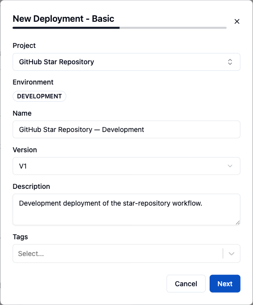
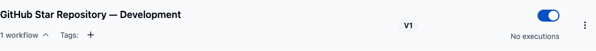
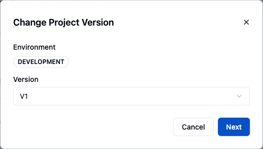
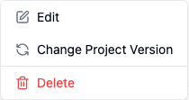
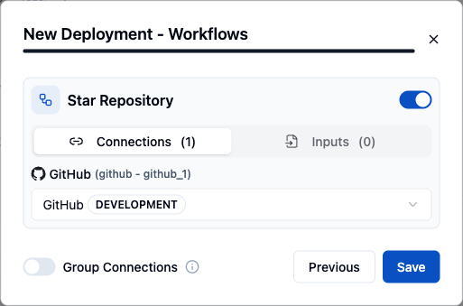
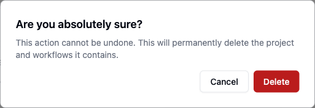
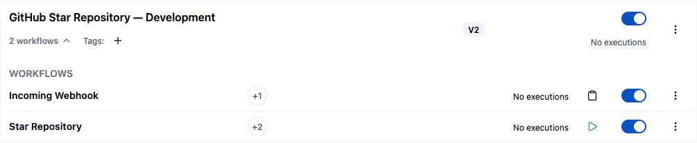

Deploying workflows inside a project in ByteChef brings your automation to life. Deployment allows workflows to run
independently without further user input, enabling seamless, hands-off execution of your automated processes.

## Publishing and deploying are two operations

Building a workflow and running it in an environment are deliberately separate steps:

- **Publish** takes the project's current draft and freezes it as a numbered, immutable **version**.
  Every workflow in the project is snapshotted together; the editor then continues on a fresh draft,
  so nothing you type afterwards changes the published version.
- **Deploy** creates a **project deployment**: one published version bound to one
  [environment](/platform/automation/deploy/environments), with its own name, tags, its own set of
  enabled workflows, and its own connection wiring.

That split is what lets you edit all afternoon without touching what is running, and what lets the
*same* version run in Staging and in Production against different credentials - the artifact is
identical, only the deployment around it differs.

### What a version does and doesn't carry

A published version holds the workflow definitions - tasks, ordering, parameters, expressions, the
component versions they reference, trigger configuration, and input and output schemas - plus the
publish description and timestamp.

It does **not** hold connections or credentials. Connections are wired on the deployment, so the same
version runs in Development against a sandbox account and in Production against the live one, and a
credential rotation does not invalidate any version.

### Reviewing versions

Open a project in the editor and use the **Settings** menu → **Project** tab → **Project History**.
Each entry shows the version number, its published date, a Draft or Published badge, and the
description supplied at publish time - which is why writing a real description at publish time is
worth the ten seconds.

### Rolling back

There is nothing to rebuild. Use **Change Project Version** on the deployment (below) to point it at
the earlier version; the version is still stored and still runnable. Rolling forward again is the
same operation in the other direction.

### Hotfixes

Deployments run published versions, so a fix is not applied in place. Edit the draft, publish it, and
change the affected deployment to the new version - a Production deployment can be pointed at a new
version without first deploying it anywhere else, so this is no slower than editing live would be,
and it leaves a version history behind.

## Deploy Project

Once saved, the deployment appears in the list. Use the toggle on its row to enable it.

<Steps>
<Step>

Go to **Project Deployments**.

</Step>
<Step>

Click on **New Deployment** (the button reads **Create Deployment** when no deployment exists yet).

</Step>
<Step>

Select **Project** you want to deploy.

</Step>
<Step>

Select **Version** you want to deploy.

</Step>
<Step>

Enter **Name** and **Description** of the deployment.

</Step>
<Step>

Select **Environment** to which you want to deploy the project.

</Step>
<Step>

Enter **Tags** for easier organization of deployments.

</Step>
<Step>

Enable desired workflows.

</Step>
<Step>

Set up required connections for the enabled workflows.

</Step>
<Step>

Click on **Save**.

</Step>
<Step>

Enable the project deployment.

</Step>
<Step>

Project is now deployed.

</Step>
</Steps>

## Update Project Version

<Steps>
<Step>

Click on the three dots next to the name of the project deployment you want to update.

</Step>
<Step>

Click on **Change Project Version**.

</Step>
<Step>

Select desired project version.

</Step>
<Step>

Click on **Next**.

</Step>
<Step>

Enable workflows you want to deploy.

</Step>
<Step>

Update connections if necessary.

</Step>
<Step>

Click on **Save**.

</Step>
</Steps>

## Update Project Deployment

<Steps>
<Step>

Click on the three dots next to the name of the project deployment you want to edit.

</Step>
<Step>

Click on **Edit**.

</Step>
<Step>

Change name, description or tags.

</Step>
<Step>

Click on **Save**.

</Step>
</Steps>

## Update Workflow Connections

<Steps>
<Step>

Click on the arrow under the project deployment name.

</Step>
<Step>

Click on three dots next to the name of the workflow you want to edit.

</Step>
<Step>

Click on **Edit**.

</Step>
<Step>

Click on **+** button.

</Step>
<Step>

Create new connection.

</Step>
<Step>

Click on **Save**.

</Step>
<Step>

Choose the new connection.

</Step>
</Steps>

## Promote to another environment

Promoting to another environment is an **Enterprise Edition** feature, and the menu item is hidden until your workspace has at least two environments. It applies to plain project deployments only — a deployment created behind an API collection, MCP server, or A2A server has no promote option of its own; promote the owning collection or server from its own page instead.

1. Click on the three dots next to the name of the project deployment you want to promote.
2. Click on **Promote to environment…**.
3. Choose the **target environment**.
4. Review the preview: create vs. update, and the project version move.
5. For any connection listed as **Unresolved**, pick a match in the target environment, or leave it unresolved.
6. Click on **Promote**.

The first promotion creates a new deployment in the target environment, pinned to the same project version with the same connection bindings — created **disabled**. Re-promoting only moves the target's pinned project version and refreshes connections for workflows new to that version; the target's own name, description, tags, and enabled state are left alone. Unlike API collections, MCP servers, and A2A servers, a plain deployment has no exposed URL or secret key of its own to mint, so promoting it never changes how it's reached.

## Delete Project Deployment

<Steps>
<Step>

Click on the three dots next to the name of the project deployment you want to delete.

</Step>
<Step>

Select **Delete** from the dropdown menu.

</Step>
<Step>

Confirm the deletion if prompted.

</Step>
</Steps>

## Get Webhook URL

A workflow that starts with a webhook (static) trigger exposes a webhook URL once its deployment is enabled. In the example below we added a static trigger to a workflow and deployed it to show how to retrieve that URL.

<Steps>
<Step>

Click on the arrow under the project deployment name to expand its workflow list.

</Step>
<Step>

Find the workflow that uses a static webhook trigger.

</Step>
<Step>

Hover over the clipboard icon on that workflow row (tooltip: **Copy static workflow webhook trigger url**).

</Step>
<Step>

Click the icon to copy the webhook URL to your clipboard. Use this URL in the external service that should trigger the workflow.

</Step>
</Steps>

<Callout type="info">
  Workflows that start with a **form** or **chat** trigger show a form or chat icon instead of the clipboard icon - clicking it opens the hosted page rather than copying a URL.
</Callout>

