In this guide you build the same workflow as the [Build your first agent](https://www.bytechef.io/workflow-templates/build-your-first-agent) template: an **AI Agent** step with an OpenAI model and one tool, followed by a logger. The agent fetches a random quote through the tool and explains it in one sentence. The only thing to set up is an OpenAI connection.

You will learn:

- How to add an AI Agent step and open the AI Agent Editor
- How to pick a model and create a connection for it
- How to give an agent a tool and tell it when to use it
- How to try an agent in the playbook and read its tool calls

## Before you start

- Finish [Build First Workflow](/platform/automation/get-started/quick-start/build-first-workflow) if you have not. This guide starts where it ends: signed in, with a project.
- Have an [OpenAI API key](https://platform.openai.com/api-keys) ready.

## 1. Create a workflow

On your project's row, click **+ Workflow**, enter the label `Build your first agent`, and click **Save**. The editor opens with a **Manual** trigger in place.

## 2. Add the AI Agent

<Steps>
<Step>

Click the **+** button below the trigger, search for **AI Agent**, select it, and choose the **Chat** action.

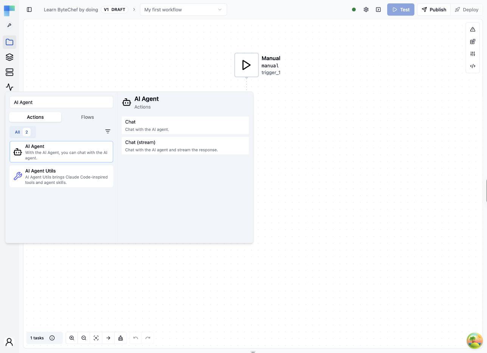

</Step>
<Step>

The agent step appears on the canvas with a warning: it has no model yet.

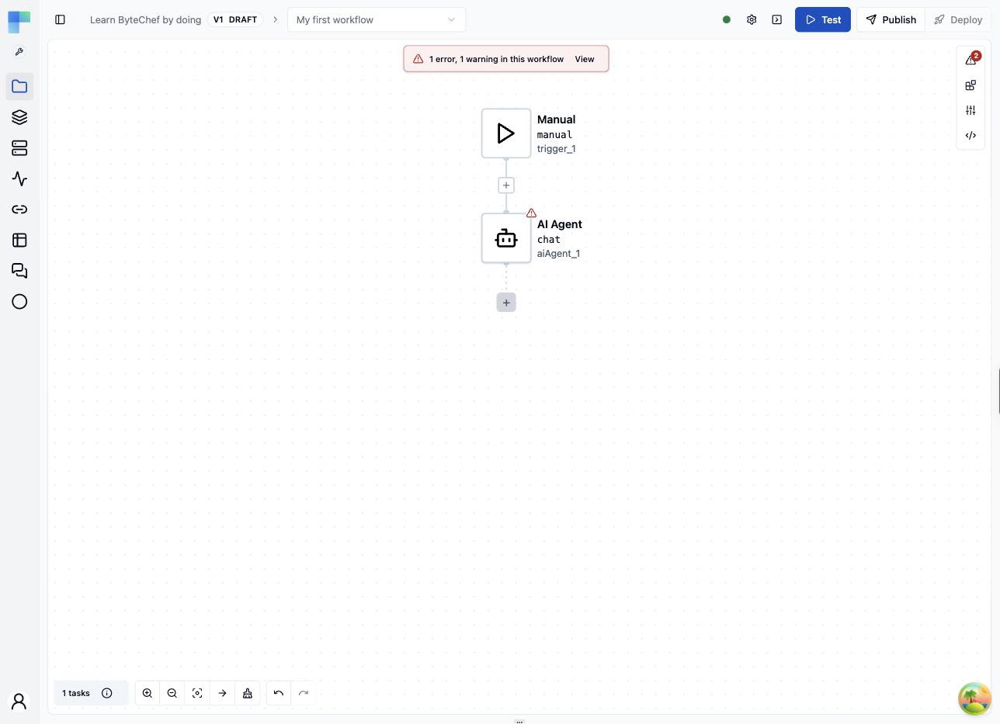

</Step>
<Step>

Click the agent step. The **AI Agent Editor** opens: configuration on the left, an **Agent Playbook** for trying the agent on the right.

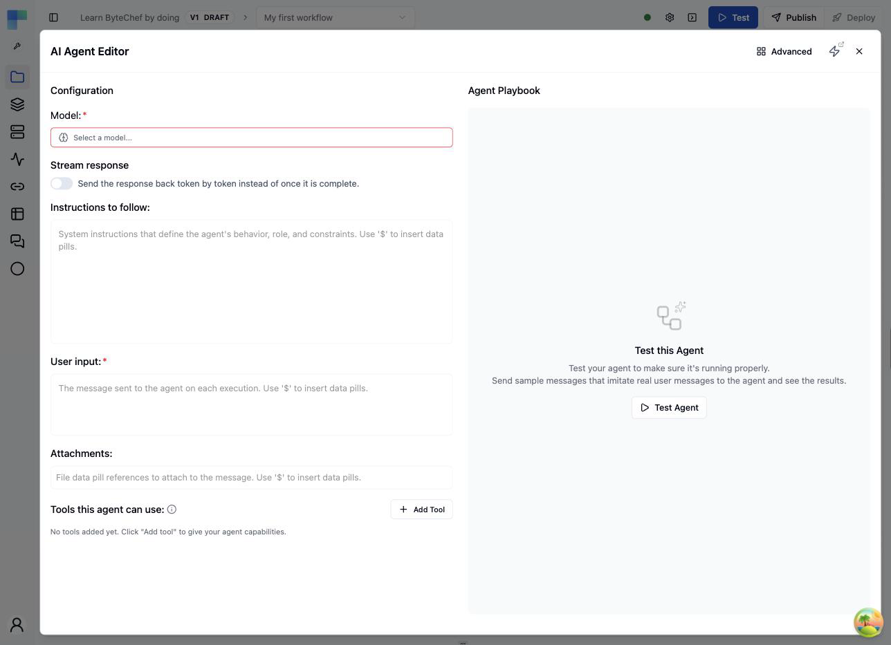

</Step>
</Steps>

## 3. Pick the model and connect OpenAI

<Steps>
<Step>

Click **Select a model...** and choose **OpenAI** from the list of providers.

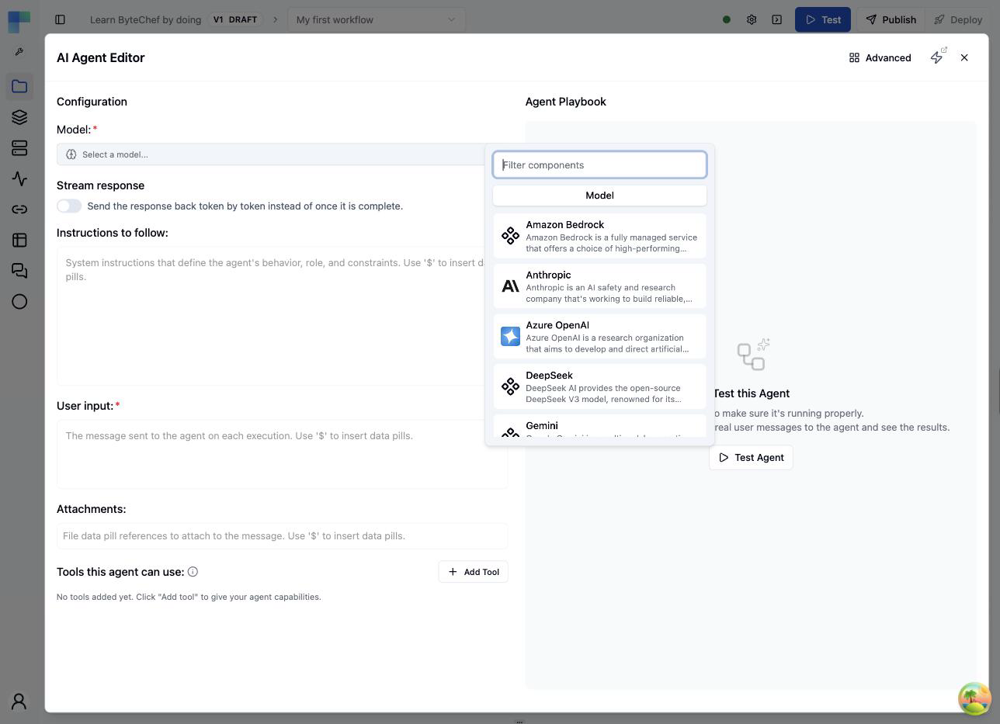

</Step>
<Step>

Click the gear icon next to the model to open its settings, then open the **Connection** tab and click **+**. In the **Create Connection** dialog, give the connection a name such as `OpenAI`, paste your API key into **Token**, and click **Save**. The connection is stored once and reused by every step that needs OpenAI.

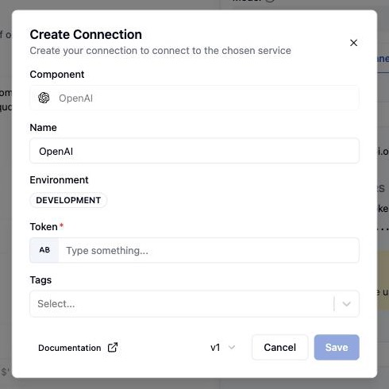

</Step>
<Step>

Open the **Properties** tab and choose a model, for example **gpt-5-mini**. Leave the rest at its defaults, then close the settings panel with the **X**.

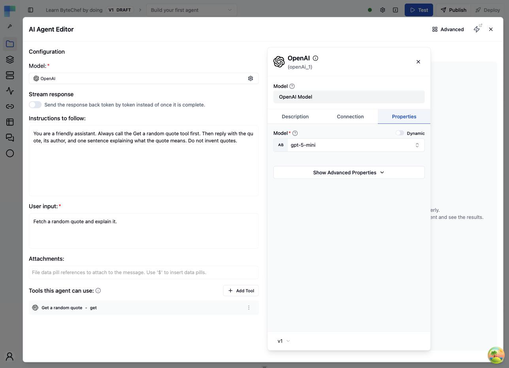

</Step>
</Steps>

## 4. Write the prompts

<Steps>
<Step>

In **Instructions to follow**, enter the system prompt:

```
You are a friendly assistant. Always call the Get a random quote tool first. Then reply with the quote, its author, and one sentence explaining what the quote means. Do not invent quotes.
```

</Step>
<Step>

In **User input**, enter the message the agent gets on each run:

```
Fetch a random quote and explain it.
```

</Step>
</Steps>

## 5. Give the agent a tool

<Steps>
<Step>

Click **Add Tool**, type `HTTP` in the filter, select **HTTP Client**, and choose its **GET** action.

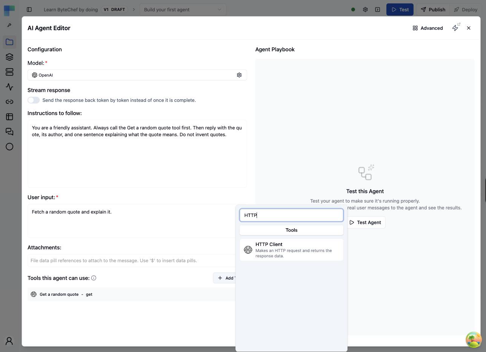

</Step>
<Step>

Open the tool's **⋮** menu and click **Configure**. On the **Properties** tab, set **URI** to:

```
https://dummyjson.com/quotes/random
```

Leave **Response Format** on **JSON**. No connection is needed, the API is public. **Tool Name** and **Tool Description** can stay empty: they default to the action's own.

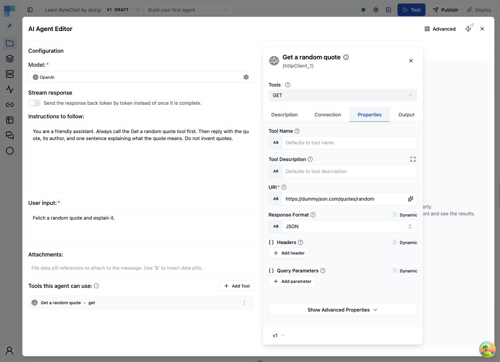

</Step>
<Step>

On the **Description** tab, set **Title** to `Get a random quote`, then close the panel. The agent sees tool titles, and the system prompt refers to this one by name.

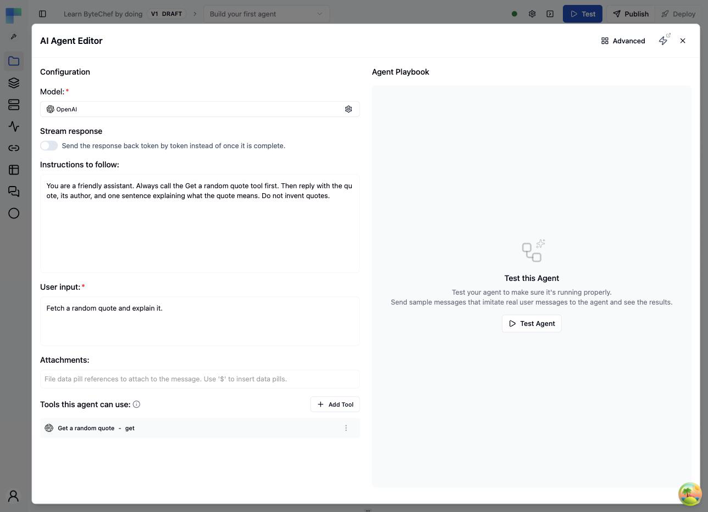

</Step>
</Steps>

## 6. Try it in the playbook

Click **Test Agent** on the right. The playbook opens a chat with your user input already filled in. Send it. The agent reads the prompts, decides to call the tool, receives the quote, and writes its explanation. Expand the **HTTP Client: GET** entry above the reply to see why the agent called the tool, what it sent, and the JSON it got back.

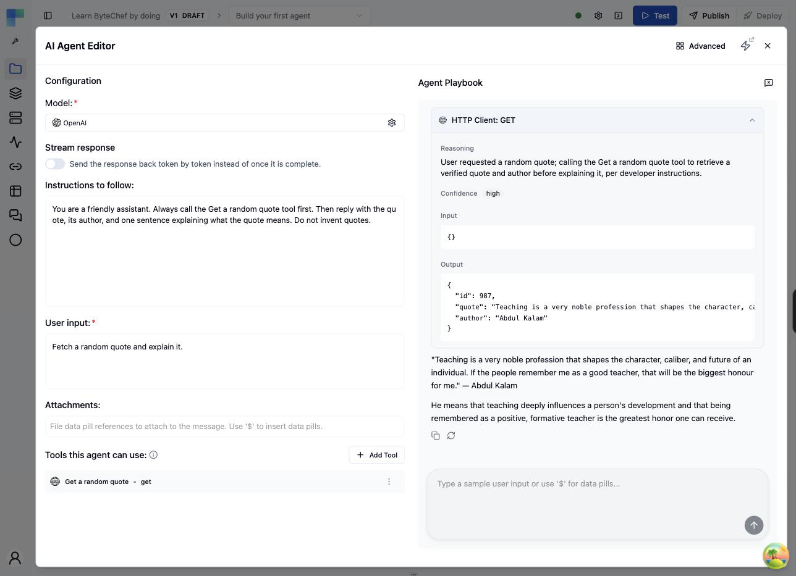

Send the same message again and the agent explains a different quote. Close the editor with the **X** when you are done.

## 7. Log the answer and test the workflow

<Steps>
<Step>

On the canvas, the agent step now shows the OpenAI and HTTP Client icons for its model and tool.

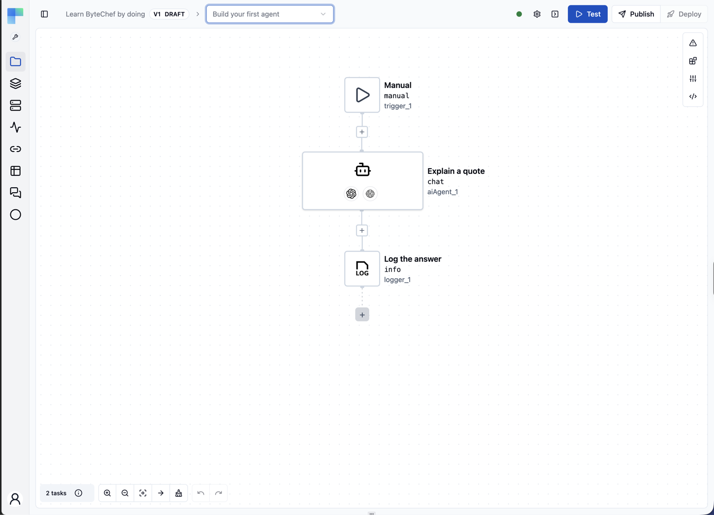

</Step>
<Step>

Click the **+** button below the agent step, search for **Logger**, choose the **Info** action, and enter this in the **Text** field:

```
${aiAgent_1}
```

This logs the agent's reply.

</Step>
<Step>

Click **Test** at the top right of the editor. The execution panel opens below the canvas. Click the agent step to read its reply on the **Output** tab.

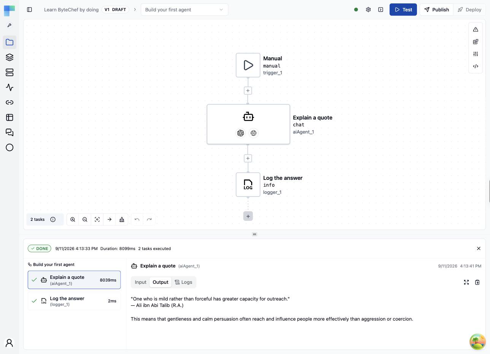

</Step>
</Steps>

## What you have built

```
Manual Trigger → AI Agent (OpenAI model + HTTP Client tool) → Logger
```

- **Model**: the agent's reasoning. Any of the supported providers plugs into the same slot.
- **Tools**: every component action can be a tool. The agent decides when to call it and fills in its parameters. See [AI Agent](/platform/automation/build/workflows/ai/agent) for tools whose parameters the model supplies at runtime.
- **Connection**: created once, reused everywhere, and never part of an exported workflow.

The same workflow is available as a template. To import it instead of building it, open the [Build your first agent](https://www.bytechef.io/workflow-templates/build-your-first-agent) page, click **Use template**, select your OpenAI connection on the model, and click **Test**.

## Next steps

- [Star Repository on GitHub](/platform/automation/get-started/quick-start/star-repository-on-github): a workflow with an OAuth connection
- [Configure Workflow Trigger](/platform/automation/get-started/quick-start/configure-workflow-trigger): a real trigger, a deployment and monitoring
- Add **Memory** or **Guardrails** to the agent from the **Advanced** view of the AI Agent Editor
