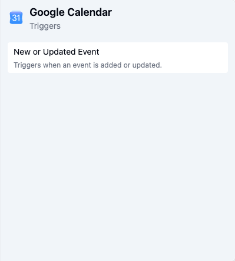
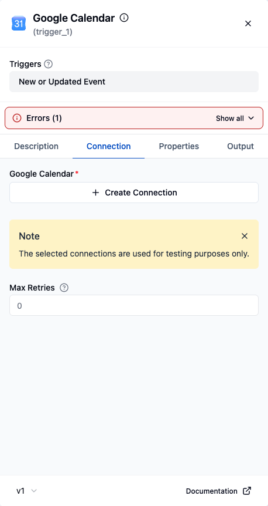
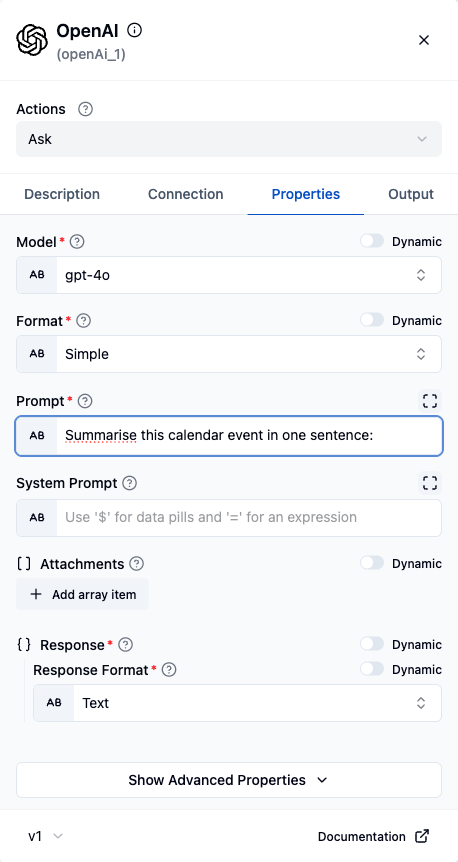
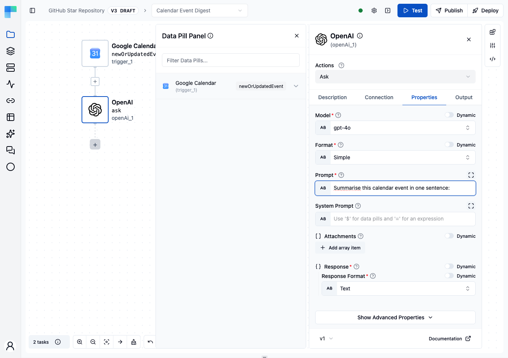
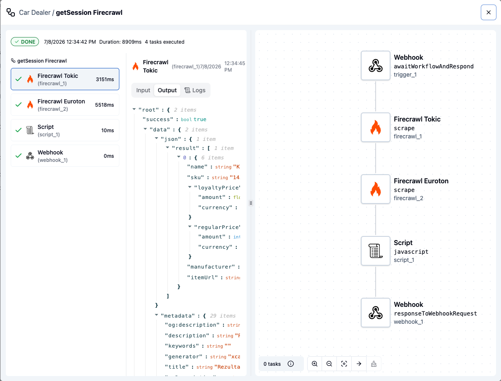

In this guide, you will learn how to create a workflow in ByteChef and configure it with a trigger. We will walk you
through the steps to add a trigger, connect it to a Google Calendar component, set up an action using the OpenAI
component, publish the project, create a deployment, and monitor the workflow execution.

**Note**: If you are testing ByteChef locally, be sure to check out our [Working with Triggers](/developer-guide/working-with-triggers) guide for detailed instructions.

## 1. Create Workflow

<Steps>
<Step>

Click **+ Workflow** on the row of the project you want to add a workflow to.

</Step>
<Step>

Enter a label for your workflow and optionally provide a description.

</Step>
<Step>

Click **Save**.

</Step>
</Steps>

## 2. Add Trigger

<Steps>
<Step>

Hover the trigger node, open its **⋮ Node actions** menu, and choose **Replace**.

</Step>
<Step>

Find and select **Google Calendar** component.

</Step>
<Step>

Select **New or Updated Event** trigger.

</Step>
<Step>

Go to the **Connection** tab.

</Step>
<Step>

Click **Create Connection**.

</Step>
<Step>

Enter a connection name and paste the **Client ID** and **Client Secret** from Google.

</Step>
<Step>

Click **Next**.

</Step>
<Step>

Click **Connect**.

</Step>
<Step>

Select your account.

</Step>
<Step>

Click **Continue**.

</Step>
<Step>

Select all and click **Continue** (allow Bytechef access to your Google account).

</Step>
<Step>

Click on **Choose Connection** and select the connection you just created.

</Step>
<Step>

Go to the **Properties** tab.

</Step>
<Step>

For **Calendar Identifier**, select the calendar you want to monitor.

</Step>
</Steps>

With the trigger in place, open its **Connection** tab and click **Create Connection**.

## 3. Add Action

<Steps>
<Step>

Click on the **+** button to add component.

</Step>
<Step>

Find and select the **OpenAI** component and choose the **Ask** action.

</Step>
<Step>

Click on the **OpenAI** component to open its configuration panel.

</Step>
<Step>

In the **Connection** tab, click **Create Connection**.

</Step>
<Step>

Enter a connection name and paste the **API Token** from OpenAI.

</Step>
<Step>

Click **Save**.

</Step>
<Step>

Click on **Choose Connection** and select the connection you just created.

</Step>
<Step>

Go to the **Properties** tab.

</Step>
<Step>

For **Model**, choose the desired model (e.g., `gpt-4`).

</Step>
<Step>

For **Prompt**, enter the prompt text, such as `Describe this event:`.

</Step>
</Steps>

## 4. Use Data Pill

<Steps>
<Step>

After clicking on the content field, the Data Pill Panel will open on the left. Use the data pill to insert output from a previous component.

</Step>
<Step>

Click on **Google Calendar** component in Data Pill Panel.

</Step>
<Step>

Click on **trigger_1**, which is the output of the trigger for the Google Calendar component.

</Step>
<Step>

Output of Google Calendar trigger is now inserted into the content field.

</Step>
</Steps>

## 5. Publish Project and Create Deployment

<Steps>
<Step>

Click **Publish**.

</Step>
<Step>

Optionally, provide a description for this published version and click **Publish**.

</Step>
<Step>

Navigate to the **Project Deployments**.

</Step>
<Step>

Click **Create Deployment**.

</Step>
<Step>

Select the project you want to deploy.

</Step>
<Step>

Choose the published version you want to deploy.

</Step>
<Step>

Click **Next**.

</Step>
<Step>

Turn on all workflows you want to include in the deployment.

</Step>
<Step>

Setup connection for each component.

</Step>
<Step>

Click **Save**.

</Step>
<Step>

Enable the deployment. Your workflow will now run whenever a new or updated event is detected in your Google Calendar.

</Step>
</Steps>

## 6. Monitor Workflow Execution

<Steps>
<Step>

Navigate to the **Workflow Execution History** view. Here you can see the status of your workflow executions.

</Step>
<Step>

Click on an execution to see the details of each component in the workflow.

</Step>
<Step>

Review the input and output of the Google Calendar trigger. Click on the **OpenAI** component to see the result of the Ask action.

</Step>
<Step>

Click on the icon to view the entire output.

</Step>
</Steps>

## Additional Instructions

### Create OAuth 2.0 Application

<Steps>
<Step>

Go to the [Google Cloud Console](https://console.cloud.google.com/).

</Step>
<Step>

Click on the project dropdown in the top navigation bar.

</Step>
<Step>

Click **New Project**.

</Step>
<Step>

Enter a project name and click **Create**.

</Step>
<Step>

Click on the project dropdown again.

</Step>
<Step>

Select the project you just created.

</Step>
<Step>

Go to the **APIs & Services**.

</Step>
<Step>

Go to the **OAuth consent screen**.

</Step>
<Step>

Click **Get Started**.

</Step>
<Step>

Enter an App name and add user support email. Click **Next**.

</Step>
<Step>

Select your Audience and click **Next**.

</Step>
<Step>

Add email addresses and click **Next**.

</Step>
<Step>

Agree to the terms and click **Create**.

</Step>
<Step>

Go to **Data Access**.

</Step>
<Step>

Click on **Add or Remove Scopes**.

</Step>
<Step>

Select all necessary scopes.

</Step>
<Step>

Click **Update**.

</Step>
<Step>

Click **Save**.

</Step>
<Step>

Go to the **Clients**.

</Step>
<Step>

Click on **Create Client**.

</Step>
<Step>

Click on application type dropdown.

</Step>
<Step>

Choose **Web application** as the application type.

</Step>
<Step>

Click on **Add Uri**.

</Step>
<Step>

Enter a redirect URI, e.g., `https://app.bytechef.io/callback`, `http://127.0.0.1:5173/callback`. Click **Create**.

</Step>
<Step>

Click on the client you just created.

</Step>
<Step>

Copy the **Client ID** and **Client Secret**. Use these credentials to create a connection in ByteChef.

</Step>
</Steps>

### Enable Google Calendar API

<Steps>
<Step>

In the [Google Cloud Console](https://console.cloud.google.com/), select your project.

</Step>
<Step>

Go to the **APIs & Services**.

</Step>
<Step>

Click on **ENABLE APIS AND SERVICES**.

</Step>
<Step>

Search for "calendar" in the search bar.

</Step>
<Step>

Click on **Google Calendar API**.

</Step>
<Step>

Click **Enable**.

</Step>
</Steps>

### Create OpenAI Connection

<Steps>
<Step>

Go to the [OpenAI API](https://platform.openai.com/settings/organization/general).

</Step>
<Step>

In the left sidebar, click on **API Keys**.

</Step>
<Step>

Click **Create new secret key**.

</Step>
<Step>

Enter a name and select the project for the key and click **Create secret key**.

</Step>
<Step>

Copy the API key and use it to create a connection in ByteChef.

</Step>
</Steps>

