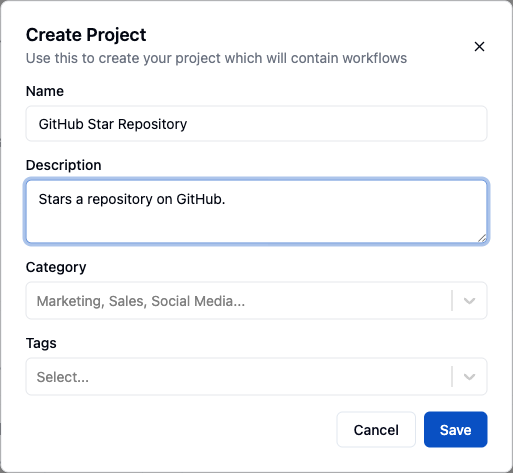
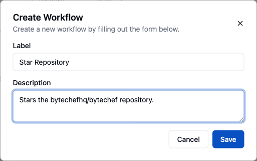
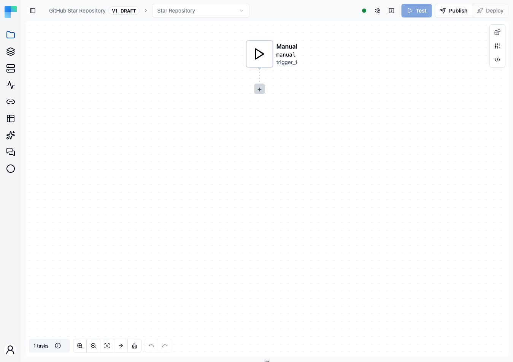
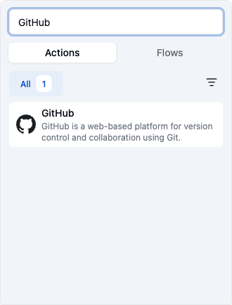
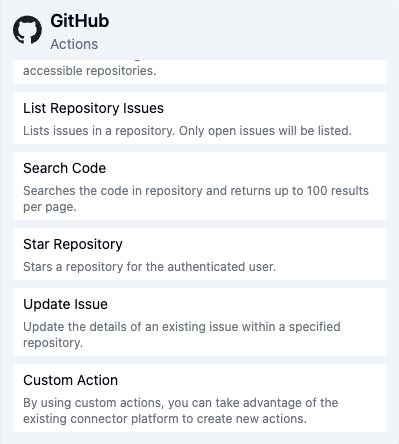
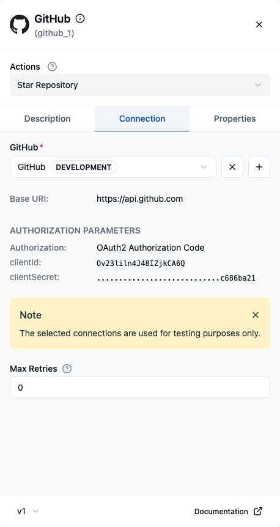
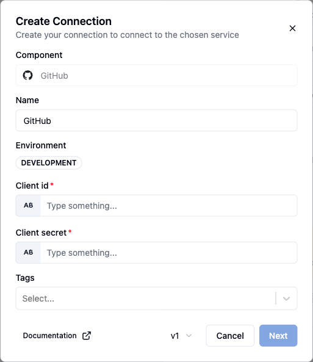
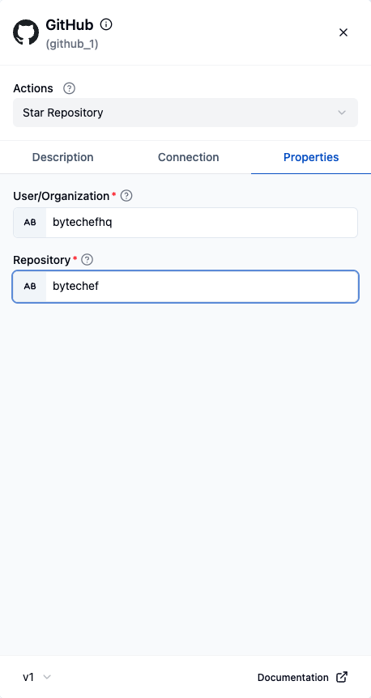
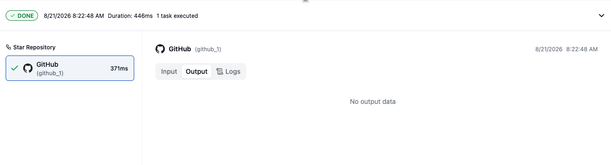

In this guide you will connect your GitHub account to ByteChef and automate starring a repository. You will create a project, add a workflow to it, configure the GitHub **Star Repository** action, and run it.

<Callout type="info">
  Step 3 asks for a GitHub **Client ID** and **Client Secret**. If you do not have them yet, create an OAuth app first — see [Connect your GitHub account](#connect-your-github-account) at the end of this guide.
</Callout>

## 1. Create a project

A project is the container that holds your workflows.

<Steps>
<Step>

Open the **Projects** page and click **Create Project** — the button reads **New Project** once you already have projects.

</Step>
<Step>

Enter a project name. Optionally add a description, choose a category, and add tags. Then click **Save**.

</Step>
</Steps>

## 2. Create a workflow

<Steps>
<Step>

On your new project's row, click **+ Workflow**.

<Callout type="info">
  The chevron next to **+ Workflow** opens additional creation options, such as importing an existing workflow definition.
</Callout>

</Step>
<Step>

Enter a label for the workflow and an optional description, then click **Save**. ByteChef opens the new workflow in the editor.

</Step>
</Steps>

## 3. Add the GitHub component

<Steps>
<Step>

In the workflow editor, click the **+** button to add a component.

</Step>
<Step>

Search for and select the **GitHub** component, then choose the **Star Repository** action.

With GitHub selected, its actions are listed on the right.

</Step>
<Step>

Open the **Connection** tab and click **Create Connection**.

</Step>
<Step>

Enter a connection name, paste the **Client ID** and **Client Secret** from your GitHub OAuth app, and click **Next**. Then click **Connect** and authorize ByteChef in the GitHub window that opens.

</Step>
<Step>

Back in the **Connection** tab, click **Choose Connection** and select the connection you just created.

</Step>
<Step>

Switch to the **Properties** tab and fill in the repository you want to star:

- **User/Organization** — the account that owns the repository, for example `bytechefhq`
- **Repository** — the repository name, for example `bytechef`

</Step>
</Steps>

## 4. Test the workflow

<Steps>
<Step>

Click **Test** to run the workflow. ByteChef executes the **Star Repository** action against the repository you configured.

<Callout type="info">
  The **Output** tab reads *No output data*, which is expected — GitHub's star endpoint returns an
  empty `204 No Content` response. The green **DONE** badge and the task's green check are what tell
  you the call succeeded.
</Callout>

</Step>
<Step>

Verify the result by opening the **Stars** tab on your GitHub profile — the repository you configured now appears there.

</Step>
</Steps>

## Connect your GitHub account

The GitHub connection in step 3 authenticates through an OAuth app that you own. Create one as follows.

<Steps>
<Step>

Sign in to GitHub, click your profile icon in the top-right corner, and select **Settings**.

</Step>
<Step>

In the left sidebar, click **Developer settings**, then **OAuth Apps**, then **New OAuth App**.

</Step>
<Step>

Fill in the application details:

| Field | Value |
|---|---|
| **Application name** | A name for your app, for example `Test App` |
| **Homepage URL** | Your application's homepage, for example `https://www.bytechef.io/` |
| **Authorization callback URL** | Where GitHub returns users after authorization, for example `http://127.0.0.1:5173/callback` |

Then click **Register application**.

</Step>
<Step>

Click **Generate a new client secret**, then copy both the **Client ID** and the **Client Secret** — you will paste them into ByteChef in step 3.

<Callout type="warn">
  GitHub shows the client secret only once. Copy it before leaving the page.
</Callout>

</Step>
</Steps>
