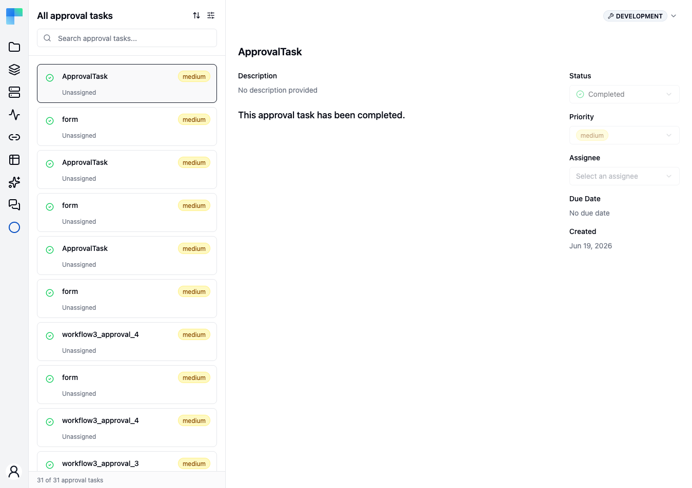

When a workflow reaches a [human-in-the-loop](/platform/automation/build/workflows/human-in-the-loop)
step configured with the **Approval Task** channel, the request lands here. **Approval Tasks** is the
in-app inbox for those requests: the workflow stays paused until someone responds, and responding
from this page resumes it exactly as an emailed or Slack link would.

Use this channel when your approvers are already ByteChef users — operations, on-call, team leads —
and you would rather not depend on email or Slack delivery reaching them.

---

## The two panes

The page is a list beside a detail view, not a table.

**On the left**, every task is a card showing its status icon, title, priority, and who it is
assigned to. Above the list are a search box and controls to sort and filter; the footer keeps a
running count, such as *31 of 31 approval tasks*, so you can see how much the current filter is
hiding.

**On the right** is the selected task: its title, description, and the message the step raised,
with these fields alongside.

| Field | What it does |
|---|---|
| **Status** | Where the request stands. Change it here to respond. |
| **Priority** | How urgent the request is — set by the workflow step, editable here. |
| **Assignee** | Who owns the request. New tasks arrive **Unassigned**; pick a person to make ownership explicit. |
| **Due Date** | When the request should be answered by, if the step set one. |
| **Created** | When the workflow raised the request. |

<Callout type="info">
  The list opens filtered to **Open** tasks. If the page reads *No approval tasks found* while you
  expect history, the filter is hiding answered requests rather than the inbox being empty — use
  **Clear filters** to see everything.
</Callout>

{/* TODO screenshot: an open task's detail pane, showing the respond actions a pending request offers.
Every task in the capture environment was already answered, so only the completed state is shown
above. */}

---

## Scope

The inbox is scoped to one [environment](/platform/automation/deploy/environments) at a time — the
selector sits in the page header, and switching it changes which requests you see. A request raised
by a workflow running in Production does not appear while you are looking at Development.

---

## See also

- [Human-in-the-Loop (Approval)](/platform/automation/build/workflows/human-in-the-loop) — how to add
  an approval step to a workflow, and the other channels a request can be delivered through.
- [Workflow Executions](/platform/automation/monitor/workflow-executions) — the run that is waiting
  on the request, and where it resumes once answered.
