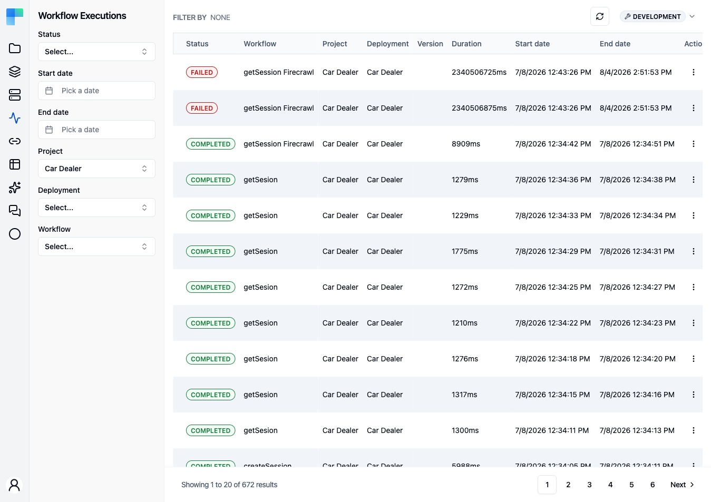
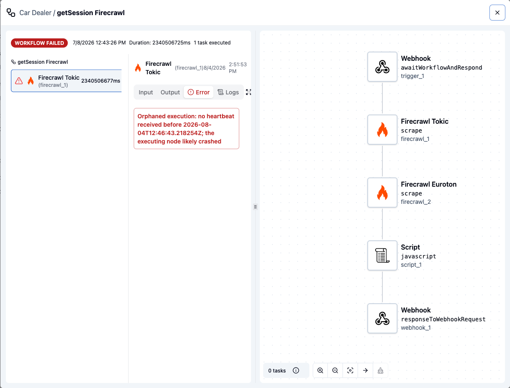

After a project is deployed and executed, its workflow activity appears here-allowing you to review how your automation
is performing and explore the details of each execution.

## The executions table

Each run is one row:

| Column | What it shows |
|---|---|
| **Status** | The run's job status: `CREATED`, `STARTED`, `COMPLETED`, `FAILED`, or `STOPPED`. `STOPPED` covers a run interrupted at any point, whether or not it had started. All five are offered by the filter below. |
| **Workflow** | The workflow that ran. Nested rows for a subflow show **Subflow** instead. |
| **Project** | The project the workflow belongs to. |
| **Deployment** | The project deployment the run belongs to. |
| **Version** | The published project version the deployment is on. |
| **Duration** | How long the run took. |
| **Start date** / **End date** | When the run started and finished. |
| **Actions** | The per-row **⋮** menu. |

## Filter Executions

Executions can be narrowed by any combination of these filters:

| Filter | Narrows the list to |
|---|---|
| **Environment** | Runs from deployments in one environment |
| **Status** | Runs in one execution state |
| **Start date** / **End date** | Runs that began or ended within a date range |
| **Project** | Runs belonging to one project |
| **Deployment** | Runs from one project deployment |
| **Workflow** | Runs of one workflow |

The **Status** filter offers `STARTED`, `COMPLETED`, `CREATED`, `STOPPED`, and `FAILED`. The
**Environment** selector in the left sidebar header scopes the whole list, and is available on Enterprise
Edition only - a Community Edition instance works in a single environment and shows no selector.

Use the **Refresh** button in the page header to reload the executions list with the latest runs.

## Actions on a run

From a row's **⋮** menu:

- **View** - open the execution detail described below.
- **Stop** - cancel a run that is still going. The item is disabled unless the run's status is
  `STARTED`.

## What the detail view shows

The detail opens as two panes:

- **Left** - the run's task list, one entry per task with its status. Selecting a task shows its
  **Input** and **Output**, and the error for a failed task. A task that ran a subflow is navigable
  through a breadcrumb back to its parent.
- **Right** - the workflow rendered read-only on the canvas, so the selected task is visible in the
  context of the whole workflow.

<Callout type="warn">
    Task inputs and outputs are recorded verbatim. They are serialized to JSON and stored as-is, with
    no redaction of sensitive values - a password, token, or customer record that a task receives or
    returns is readable in that task's Input and Output panels by anyone who can open the execution.
    Treat the execution history as carrying the same sensitivity as the data flowing through the
    workflow, and keep secrets in connections, whose parameters are never returned in the clear.
</Callout>

## Execution Details - Completed

<Steps>
<Step>

Click on the desired execution to view its details.

</Step>
<Step>

In the newly opened panel, you can inspect the input and output of each workflow component.

</Step>
</Steps>

## Execution Details - Failed

<Steps>
<Step>

Click on the desired execution to view its details.

</Step>
<Step>

In the newly opened panel, you can inspect the input and output of each workflow component.

</Step>
<Step>

If the execution fails, you’ll see which component encountered the error, along with a detailed message explaining what went wrong.

</Step>
</Steps>

## Retention

> **Coming soon.** Execution retention is on the upcoming release track and is not yet enforced in the latest released version of ByteChef.

Execution records are kept indefinitely unless a retention window is configured. When one is, a
sweep runs every six hours per tenant and deletes runs that finished before the window - the job
row, its task outputs, its stored context, and its `CURRENT_EXECUTION` data storage. Retention
applies to *finished* runs of every outcome; there is no separate window for failures. Subflow
child runs are left to their parent.

| Property | Purpose |
|---|---|
| `bytechef.workflow.execution.retention.enabled` | Turns the sweep off. Defaults to on. |
| `bytechef.workflow.execution.retention.default-retention-days` | The window, in days, when the tenant's plan does not set one. Unset means no purging. |

Deleting a run deletes its history - export anything you need for audit or analytics before the
window elapses.

## Reading executions programmatically

> **Coming soon.** The public executions endpoints are on the upcoming release track and are not yet available in the latest released version of ByteChef.

The same records are readable through the Workflow Executions API: `GET
/workflow-executions` for the filtered page, and `GET /workflow-executions/{id}` for one run
including its inputs, outputs, error, and task executions.
