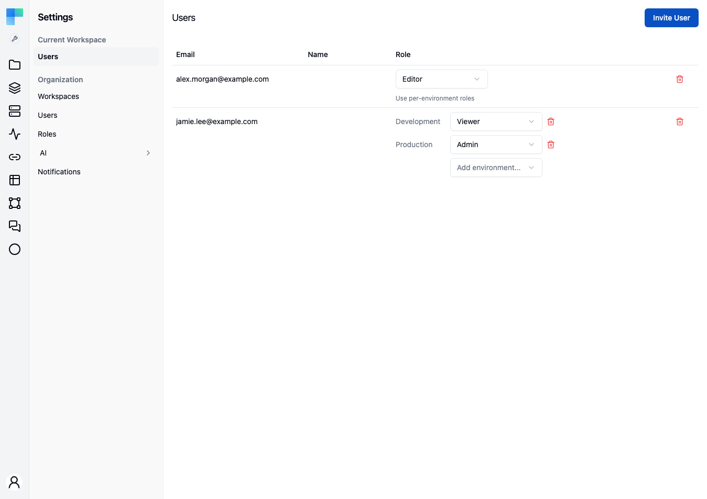

**Settings → Current Workspace → Users** manages membership of the **one workspace you are currently
in**. It is a different list from the organization-level [Users](/platform/settings/users) page, and
the difference is worth keeping straight:

| | Organization Users | Workspace Users (this page) |
|---|---|---|
| Scope | Every account in the deployment | Members of the current workspace |
| Grants | The organization authority (`ROLE_ADMIN` / `ROLE_USER`) | The workspace role (Admin / Editor / Viewer, or a custom role) |
| Who can open it | The organization admin | Anyone holding `WORKSPACE_MEMBER_MANAGE` on this workspace in at least one environment |
| Removing someone | Deletes the account outright | Removes them from this workspace only; the account survives |

The gate is deliberately the **scope**, not the organization admin authority: a workspace admin who is
not an organization admin is exactly the person this page exists for. Without that scope in any
environment the page renders "You do not have permission to manage members of this workspace." and
no controls.

Holding the scope in only some environments gives a partial view. You can change or remove roles in
those environments. **Invite User**, the workspace-wide role dropdown and the **remove** button all
need the scope in every environment, so they stay hidden or disabled.

---

## The members table

| Column | Description |
|---|---|
| **Email** | The member's email address. |
| **Name** | First and last name, when set. |
| **Role** | For a member with a workspace-wide role, a dropdown listing the built-in workspace roles plus every custom role. Custom roles are tenant-global and defined on **Settings → Roles**. For a member with per-environment roles, one dropdown per environment. Changes apply immediately. |
| *(actions)* | A **remove** (trash) button. |

An organization admin appears in the list with the role **Admin - inherited from tenant admin**, shown
as text rather than a dropdown, and with no remove button. That access comes from the organization
authority, not from a membership row, so revoking it is an organization-level act performed on the
[organization Users](/platform/settings/users) page.

## Add a member

**Invite User** opens a dialog with two tabs:

- **Invite by email** - enter an **Email** and pick a **Role**. "They receive a link on which they set
  their own password. If they already have an account, it is reused."
- **Add existing user** - pick someone from a dropdown of accounts that are not already members, and a
  **Role**. "Adds someone who already has a ByteChef account. No email is sent and no seat is
  consumed." This tab appears **only for organization admins**, because listing every account in the
  deployment exposes the whole organization's user list. A workspace admin who is not an organization
  admin uses the invite tab instead - inviting an address that already has an account reuses it and
  consumes no extra seat.

## Per-environment roles

A member holds either one workspace-wide role or a role per environment. Environments without a role
are denied. See [Per-environment roles](/platform/settings/users#per-environment-roles) for the model.

- **Switch a member to per-environment roles** - under their role dropdown, click **Use
  per-environment roles** and choose the first environment. A member with a built-in role keeps it there; a member with a
  custom role starts as Viewer. The
  hint warns: "They will lose access to every other environment until you grant it."
- **Grant another environment** - pick it from **Add environment...**. It starts as Viewer; change it
  with that environment's dropdown.
- **Remove an environment role** - click the trash icon beside it and confirm. The member loses access
  to that environment, and their other environment roles are unchanged. If it is their only
  environment role, the confirmation says so instead: they keep that role in **every** environment. That
  option is offered only when you hold `WORKSPACE_MEMBER_MANAGE` in every environment.

You can edit a member's role in an environment only where you hold `WORKSPACE_MEMBER_MANAGE`
yourself. The other environment dropdowns are disabled.

## Remove a member

Click the **remove** (trash) icon on the row. The member loses access to everything in this workspace
at once; their account and their membership of other workspaces are untouched.

Some removals and role changes are refused - removing the last admin, demoting yourself, or acting on
an inherited entry. The reason is shown as an inline message above the table rather than as a toast,
so it stays beside the control you just used.

## See also

- [Users](/platform/settings/users) - organization membership and the role model the workspace roles
  sit inside.
- [Workspaces](/platform/settings/workspaces) - creating the workspaces this page assigns people to.
