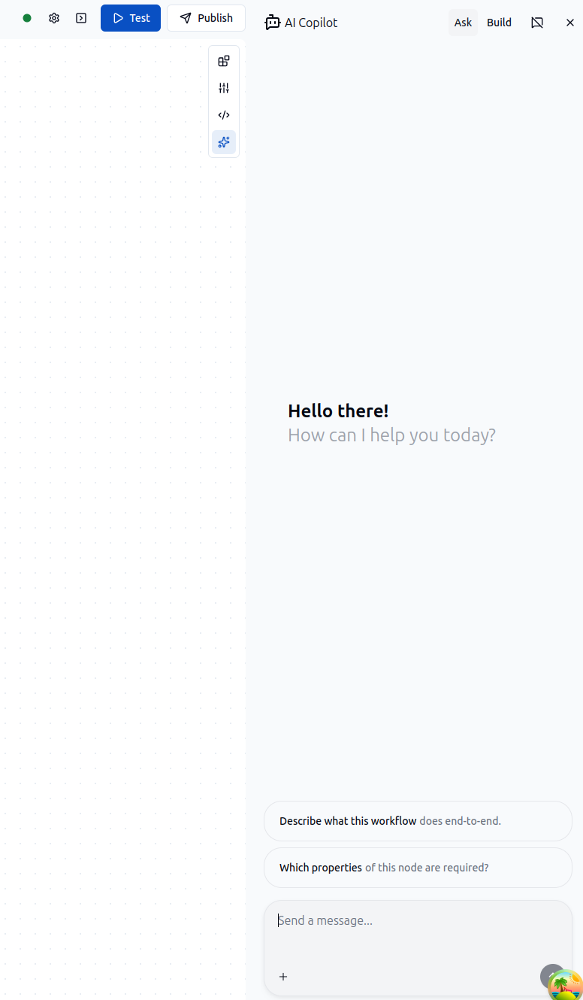

# AI Copilot



The AI Copilot is an AI assistant embedded in the ByteChef workflow editor. It helps you understand, design, and build automation workflows without leaving the editor.

Copilot is available in two modes: **Ask** and **Build**.

---

## Accessing Copilot

The Copilot panel opens from the workflow editor toolbar. Click the **AI Copilot** button (sparkle icon) to toggle it. Use the **Ask** / **Build** toggle at the top of the panel to switch modes.

Copilot is also available in the **Code Editor** for generating code blocks in JavaScript, Python, and Ruby.

---

## Ask Mode

Ask mode is a read-only assistant for exploring and understanding workflows.

**Both modes share:**
- Full context of the current workflow definition
- The last execution error on the workflow
- Read-only access to component and task definitions

**Ask mode additionally:**
- Searches the internet for relevant information (via Firecrawl, if configured)
- Queries the ByteChef documentation knowledge base
- Suggests when to switch to Build mode for making changes
- Cannot modify the workflow

Use Ask mode to get explanations, debug errors, research components, or plan changes before building.

---

## Build Mode

Build mode has full access to create and modify workflows on your behalf.

**Build mode can:**
- Create new workflows or update existing ones
- Search and configure components and actions
- Validate task configurations before applying them
- Validate the complete workflow after building
- Deploy the workflow directly from the conversation

Build mode follows a structured process: discover the right components → configure them → pre-validate → build → validate the full workflow → deploy. It will fix any validation errors before proceeding.

---

## Enabling Copilot

Copilot is disabled by default. Set the following environment variables to enable it:

### OpenAI (default provider)

```bash
BYTECHEF_AI_COPILOT_ENABLED=true
BYTECHEF_AI_COPILOT_PROVIDER=OPENAI
BYTECHEF_AI_COPILOT_OPENAI_API_KEY=sk-...
```

Optional tuning:

```bash
BYTECHEF_AI_COPILOT_OPENAI_CHAT_OPTIONS_MODEL=gpt-5.2
BYTECHEF_AI_COPILOT_OPENAI_CHAT_OPTIONS_TEMPERATURE=0.5
BYTECHEF_AI_COPILOT_OPENAI_EMBEDDING_OPTIONS_MODEL=text-embedding-3-small
```

### Anthropic

```bash
BYTECHEF_AI_COPILOT_ENABLED=true
BYTECHEF_AI_COPILOT_PROVIDER=ANTHROPIC
BYTECHEF_AI_COPILOT_ANTHROPIC_API_KEY=sk-ant-...
BYTECHEF_AI_COPILOT_ANTHROPIC_CHAT_OPTIONS_MODEL=claude-opus-4-6
```

> Embeddings for the knowledge base always use OpenAI. When using the Anthropic provider, `BYTECHEF_AI_COPILOT_OPENAI_API_KEY` is still required for embeddings.

### All Copilot Variables

| Environment Variable | Description | Default |
|---|---|---|
| `BYTECHEF_AI_COPILOT_ENABLED` | Enable or disable Copilot | `false` |
| `BYTECHEF_AI_COPILOT_PROVIDER` | AI provider (`OPENAI`, `ANTHROPIC`) | `OPENAI` |
| `BYTECHEF_AI_COPILOT_OPENAI_API_KEY` | OpenAI API key | - |
| `BYTECHEF_AI_COPILOT_OPENAI_CHAT_OPTIONS_MODEL` | OpenAI chat model | `gpt-5.2` |
| `BYTECHEF_AI_COPILOT_OPENAI_CHAT_OPTIONS_TEMPERATURE` | OpenAI temperature | `0.5` |
| `BYTECHEF_AI_COPILOT_OPENAI_EMBEDDING_OPTIONS_MODEL` | OpenAI embedding model | `text-embedding-3-small` |
| `BYTECHEF_AI_COPILOT_ANTHROPIC_API_KEY` | Anthropic API key | - |
| `BYTECHEF_AI_COPILOT_ANTHROPIC_CHAT_OPTIONS_MODEL` | Anthropic chat model | - |
| `BYTECHEF_AI_COPILOT_ANTHROPIC_CHAT_OPTIONS_TEMPERATURE` | Anthropic temperature | `0.5` |
