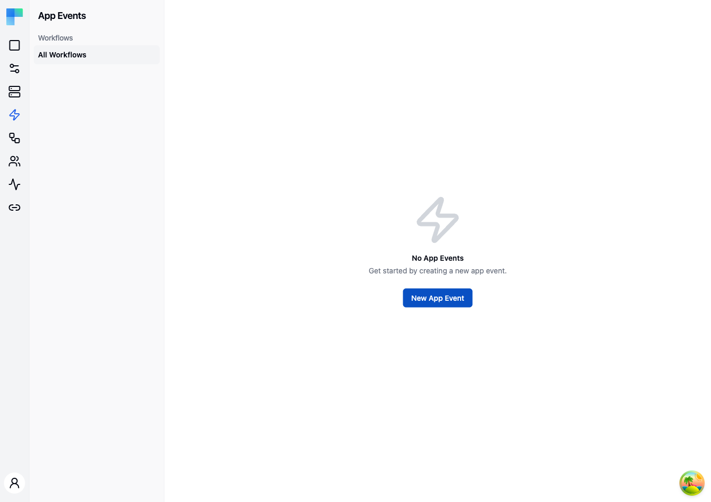

---

App Events are named events that originate in **your application** (e.g. `user.signed_up`, `order.placed`, `record.updated`). You declare them here with a JSON schema for their payload, and workflows subscribe to them via an **App Event trigger**.

The flow is intentionally one-way: an App Event is the contract, and any number of workflows can listen for it.

App Events don't return a result. To run a single workflow and get its answer back in the response, use a [Request trigger](/platform/embedded/build/request-triggers) instead.

## Key Features

| Feature | Description |
|---|---|
| Named contract | Each event has a name and a JSON schema describing its payload. |
| Many-to-many | Any number of workflows (across any integrations) can carry an App Event trigger. |
| Workflow filtering | Filter the App Events list by the workflows that subscribe to them. |
| Environment awareness | Events fire against the environment specified in the request header. |

---

## How to Use

Managing App Events - creating, editing, deleting and listing them, in the UI or through the admin API - requires a tenant admin.

### Creating an App Event

1. Click **New App Event** in the top-right corner.
2. Enter a **Name** (this is the event identifier you'll use when firing the event).
3. Enter the event's **Schema** as JSON - the structure of the payload your application will send. It documents the event's contract (see the note under [Firing an App Event](#firing-an-app-event-from-your-application) about payload delivery).
4. Click **Save**.

<!-- TODO screenshot: New App Event dialog showing the Name field and the JSON Schema code editor pre-filled with an example payload -->

Note that you do **not** select workflows here. Workflows opt in to receive an event by adding an App Event trigger and picking this event's name (see below).

### Subscribing a workflow to an App Event

1. Open a workflow in the integration editor.
2. Add the **App Event** trigger (component: "App Event", trigger: "New Event").
3. In the trigger's properties, select the App Event Id you want to subscribe to from the dropdown - it lists every App Event defined on this page.
4. Save and publish the integration.

> **The selected App Event Id does not filter the fan-out yet.** The fire endpoint takes no event name, so **every** enabled workflow of the connected user that carries an App Event trigger starts - regardless of which App Event Id its trigger has selected. Treat the selection (and the schema) as the documented contract for the event, not as a runtime filter, and give a workflow its own conditional logic if it must ignore some events.

### Firing an App Event from your application

`POST` to the embedded API with the end user's JWT:

```http
POST /api/embedded/v1/app-events HTTP/1.1
Host: your-bytechef-host.example.com
Authorization: Bearer <end-user JWT>
X-Environment: DEVELOPMENT
```

The connected user is identified by the JWT `sub` claim. ByteChef starts an execution for every enabled workflow of that user that carries an **App Event** trigger, in the environment named by `X-Environment`: the workflows of their integration instances and the [automations](/platform/embedded/build/automation-hub#copies-and-references) they activated, copies and references alike.

To fire the event from your own server instead, use your API Key and name the connected user in the path:

```http
POST /api/embedded/v1/{externalUserId}/app-events HTTP/1.1
Host: your-bytechef-host.example.com
Authorization: Bearer <API Key>
X-Environment: DEVELOPMENT
```

Both routes start the same workflows. See the [backend](/openapi/backend/embedded-webhook-app-event-trigger) and [frontend](/openapi/frontend/embedded-webhook-app-event-trigger) API reference.

Send the event's payload as the request body. ByteChef reads it once and delivers it to every workflow the event starts: the body becomes the **App Event** trigger's output, so later steps read its properties as variables. Shape it to match the event's schema. The response has no body; if some workflows could not be started, the others still run and the response is a `500` problem detail whose `failedWorkflows` lists the uuids that were not started.

### Filtering App Events

Use the left sidebar to filter by workflow. Select "All Workflows" to view every App Event, or click a specific workflow to see only the events it subscribes to.

### Managing App Events

- **Edit** - update the event name or schema.
- **Delete** - remove the App Event. Any trigger that had selected it is left with no selection.

---

## Example use cases

- **User signup** - your app fires `user.signed_up`; workflows sync the new user to the customer's CRM and Mailchimp.
- **Order placed** - your app fires `order.placed`; workflows create an invoice in the customer's accounting tool and post to Slack.
- **Record updated** - your app fires `record.updated`; workflows sync the change to whatever third-party store the customer has connected.

## Related

- [Request Triggers](/platform/embedded/build/request-triggers) - run one workflow and return its result in the response.
- [Automation Code Workflows](/platform/embedded/build/automations/automation-code-workflows) - how automation references join the App Event fan-out.
