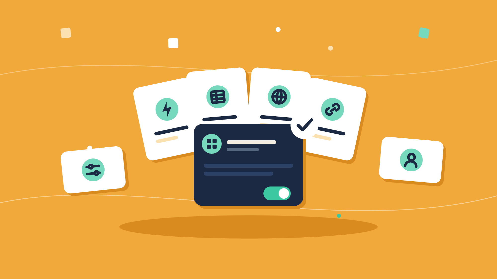

The **Automation Hub** is an end-user surface you drop into your product with one React component. Your connected users see the [automation templates](/platform/embedded/build/automations) you published, activate one in a short wizard, and turn their automations on and off. They do all of this without leaving your app or seeing ByteChef.

It renders in an iframe and has two tabs:

- **Automations** - the template catalog, plus the user's own automations.
- **Connections** - the third-party accounts the user has connected, and the ones you share with every user.


## Before you start

- A Signing Key and a backend that mints end-user JWTs - see [Installing the SDK](/platform/embedded/get-started/initial-setup/installing-the-sdk).
- At least one **published** automation project. The hub lists the templates from each project's last published version; a project that was never published shows no templates. See [Automations](/platform/embedded/build/automations#publishing).
- In production, your app's origin in `BYTECHEF_EMBEDDED_ALLOWED_PARENT_ORIGINS` on the ByteChef server - see [the embed handshake](/platform/embedded/build/automations/automation-workflows#the-embed-handshake).

## Add the hub to your app

```tsx
'use client';
import {AutomationHub} from '@bytechef/embedded';

export function AutomationsPage({jwtToken}: {jwtToken: string}) {
    return (
        <AutomationHub
            baseUrl="https://your-bytechef-host.example.com"
            className="h-[800px] w-full"
            environment="PRODUCTION"
            jwtToken={jwtToken}
            tabs={{connections: true, newWorkflow: false}}
            theme={{borderRadius: '0.5rem', mode: 'light', primaryColor: '#2563eb'}}
        />
    );
}
```

The component renders `automation-hub.html` from your ByteChef host, waits for the page's `EMBED_READY` message, and answers with the props below. When a prop changes later, including a refreshed `jwtToken`, it sends the new values to the iframe without reloading it.

### Props

| Prop | Type | Default | Description |
|---|---|---|---|
| `jwtToken` | `string` | - | **Required.** The connected user's signed token. |
| `baseUrl` | `string` | `https://app.bytechef.io` | Your ByteChef host. |
| `environment` | `'DEVELOPMENT' \| 'STAGING' \| 'PRODUCTION'` | `'PRODUCTION'` | The environment whose catalog and connections the hub shows. |
| `className` | `string` | - | Class for the wrapping element. Give it a height; the iframe fills it. |
| `tabs` | `{automations?, connections?, newWorkflow?}` | all `true` | Which parts of the hub are shown. See [Tabs](#tabs). |
| `connectionDialogAllowed` | `boolean` | `true` | Whether users can create a new connection from the activation wizard and the builder. When `false`, they can only pick existing connections. |
| `editWorkflowAllowed` | `boolean` | `true` | Whether the activation wizard offers **Edit workflow** and **Open in builder**. |
| `includeComponents` | `string[]` | - | Restricts the components offered in the builder to these names. |
| `defaultLayout` | `'grid' \| 'list'` | `'grid'` | The initial catalog layout. |
| `layoutSwitcherAllowed` | `boolean` | `true` | Whether users can switch between grid and list. When `false`, `defaultLayout` always applies. |
| `theme` | `AutomationHubTheme` | - | Colors, font, and radius. See [Theming](#theming). |

The component has no callbacks; everything the user does is saved through the embedded API.

### Tabs

| Key | Controls |
|---|---|
| `automations` | The **Automations** tab: the template catalog and the user's automations. |
| `connections` | The **Connections** tab. |
| `newWorkflow` | The **New Automation** button, which creates a blank automation and opens it in the builder, and the **My Automations** section for automations that do not come from a template. |

The tab bar appears only when both `automations` and `connections` are on. If a user lands on a disabled tab, the hub redirects to the first enabled one. With both off, it shows that no sections are enabled.

## What your users see

### The catalog

Each published template appears as a card with its label, description, and the icons of the components it uses. Users can search by label and filter by **All**, **Active** (they have an automation for the template), or **Enabled**.

A template the user has not activated shows **Use**, which opens the activation wizard. Once activated, the card shows the automation's version, an **Enable** / **Disable** button, and a menu:

- **Settings** - edit the workflow inputs. Shown only when the template has inputs.
- **Customize** - open the user's copy in the builder.
- **Remove** - delete the automation after a confirmation.

**Enable** is unavailable for an automation that has not been published from the builder yet, and for one whose template is gone (see [Needs attention](#needs-attention)). If enabling fails because a connection or a required input is missing, the hub says which and, for an input, opens the settings dialog.

### The activation wizard

The wizard has up to three steps:

1. **Connect** - one account picker per component that needs a connection. **Connect** next to a picker creates a new connection, unless `connectionDialogAllowed` is `false`. Skipped when the template needs no connections.
2. **Configure** - one field per workflow input. Required inputs must be filled. Skipped when the template has no inputs.
3. **Activate** - the hub copies the template for this user, wires the chosen connections into it, publishes and saves the inputs, and turns it on. If any step fails, the copy is removed so the user can try again.

When it finishes the user sees "Your automation is running". With `editWorkflowAllowed`, **Edit workflow** copies the template and opens it in the builder without activating it, and **Open in builder** opens the finished automation.

### The builder

**Customize**, **Edit workflow**, and **New Automation** open the embedded [workflow builder](/platform/embedded/build/automations/automation-workflows) inside the hub, with a back arrow to the catalog. The builder honors the hub's `connectionDialogAllowed` and `includeComponents`. Users publish from the builder header before they can enable the automation.

### Connections

The **Connections** tab lists the user's connections with their name, app, creation date, and a **Shared** badge on the connections you share with every connected user. Users can **Reconnect** (replace the credentials) or **Delete** their own connections; shared connections are read-only. A connection that an enabled automation still uses cannot be deleted.

New connections are created from the wizard or the builder, not from this tab. See [Connections](/platform/embedded/build/connections).

### Needs attention

Automations created from a template that is no longer published, or that need action from the user, appear under **My Automations** with a **Needs attention** badge and a reason, such as a connection to reconnect or an input to fill in.

## Copies and references

An automation a user activates in the hub is a **copy**: the user's own editable workflow, made from the last published version of your template. Publishing a new version of the catalog project does not change existing copies.

The embedded API can also give a user a **reference** instead - an automation that points at your catalog workflow rather than duplicating it. References follow your catalog: when you publish a new project version they move to it, and when you remove the workflow from the project or delete the project they are disabled and marked as needing attention. The hub shows and manages references, but creates only copies; create references with the provision operation in the [API reference](/openapi/frontend/embedded-configuration-connected-user-project-workflow).

## Controlling what appears in the hub

- **Show in Automation Hub.** Each automation project has this switch, on by default. Turn it off for flows you only activate through the API; the project list then shows a **Hidden from hub** badge. The project can still be activated through the API, and `GET /api/embedded/v1/automation/projects` still lists it with `automationHubVisible: false`.
- **Permission expressions.** A project's expression decides which connected users see the project, and a workflow's expression decides which of its templates they see. A user cannot activate a template their expression hides. See [Permission Expressions](/platform/embedded/build/permission-expressions).
- **Publishing.** Only the last published version of a project is in the catalog.

## Theming

`theme` restyles the hub; unset keys keep the default look.

| Key | Effect |
|---|---|
| `mode` | `'dark'` for dark mode; anything else is light. |
| `primaryColor` | Buttons, focus rings, and brand accents. The text color on top of it is chosen for contrast. |
| `fontFamily` | The font. It must be one the iframe can load - a system or web-safe font; your page's `@font-face` rules do not cross the iframe boundary. |
| `borderRadius` | Corner radius, in `px`, `rem`, `em`, or `%`. |
| `surfaceColor` | The page background. |
| `cardColor` | Cards, dialogs, and popovers. |
| `activeBorderColor` | The border of enabled automation cards. |
| `enableColor` / `disableColor` | The **Enable** and **Disable** buttons. |
| `onAccentColor` | Text on accent-colored surfaces. |
| `segmentColor` | The selected item in segmented controls. |
| `cssVariables` | Any other CSS custom property, as `{'--name': 'value'}`. |

Colors are hex values or any value the browser accepts as a CSS color. The same theme applies inside the builder opened from the hub.

## Related

- [Integration Marketplace](/platform/embedded/build/integration-marketplace) - the embeddable catalog of integrations.
- [Automations](/platform/embedded/build/automations) - authoring and publishing the templates the hub lists.
- [Troubleshooting](/platform/embedded/monitor/troubleshooting#embedding-problems) - a blank iframe or a hub stuck on loading.
