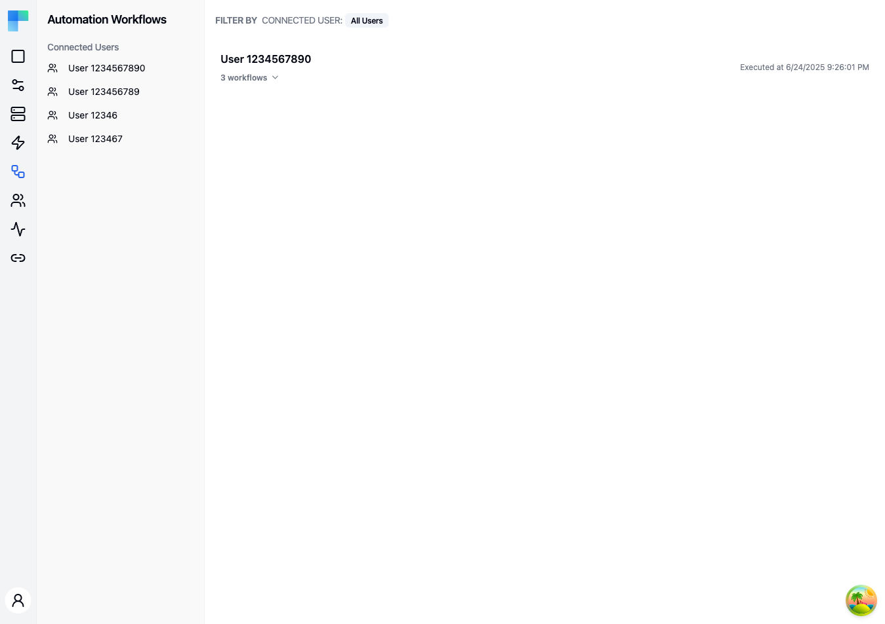

---

> **Feature flag.** Automations are behind a deployment feature flag. The **Automations** entry appears in the Embedded sidebar only where that flag is enabled; without it the pages below are not linked from the UI.

The **Automations** page is the authoring surface for your **workflow templates**. Templates are grouped under **Projects**, organized by **Category** and **Tag**, and made available to end users by publishing the project.

Conceptually:

- A **project** is a logical bundle of related templates (for example, "HubSpot sync" or "Slack notifications").
- A **workflow template** is a workflow definition you author once in your workspace. It is not tied to any specific connected user - it's a reusable blueprint.

Runtime activity for end users lives in [Workflow Executions](/platform/embedded/monitor/workflow-executions); this page is strictly about authoring.

---

## Key Features

| Feature | Description |
|---|---|
| Project CRUD | Create, edit, and delete projects from a single list. |
| Template CRUD | Create a workflow template from scratch or import one from a `.json`/`.yaml`/`.yml` file. |
| Publish | Cut a new project version so its templates become available to connected users. |
| Tags & Categories | Group projects by category (single) and tag (many) for filtering. |
| Category / Tag filter sidebar | Narrow the list with two stacked navs - **Categories** and **Tags** - in the left sidebar. |
| Inline template list | Expand any project row to see its templates, their trigger, the components they use, and the last modified date. |
| Environment scoping | The page reflects projects in the currently selected environment (Development / Staging / Production). |

### Project row

Each project row displays:

- **Name** -- clicking it opens the project's first template in the editor (or expands the template list if the project has none yet).
- **Template count** -- a collapsible trigger; click to expand the template list.
- **Create-template button group** -- a primary "Workflow" button (new from scratch) with a chevron menu containing **Import Workflow**.
- **Tags** -- inline editable; add or remove tags directly from the row.
- **Status badge** -- `DRAFT` while unpublished, `V<n> PUBLISHED` once a version has been cut.
- **Hidden from hub badge** -- shown when the project's **Show in Automation Hub** switch is off.
- **Actions menu** (⋮) -- Publish, New Workflow, Import Workflow, Edit, Delete.

### Template row

Inside an expanded project, each template row shows:

- **Label** (or workflow UUID as fallback).
- **Trigger** -- the first trigger's icon plus a badge with its title.
- **Components** -- icons of the components the template uses.
- **Last modified date**.
- **Actions menu** (⋮) -- Delete.

Clicking a template row opens it in the embedded workflow editor.

---

## How to Use

### Creating a project

1. Click **New Project** in the page header (top right).
2. In the dialog, enter a **Name**, optional **Description**, an optional **Category**, and any **Tags**.
3. Optionally enter a **Permission Expression** to limit which connected users see the project. See [Permission Expressions](/platform/embedded/build/permission-expressions).
4. Leave **Show in Automation Hub** on to list the project in the [Automation Hub](/platform/embedded/build/automation-hub). Turn it off for flows you only activate through the API. The switch is on by default.
5. Submit. The new project appears in the list as a `DRAFT`.

If no projects exist yet, the empty state shows a **Create Project** button that opens the same dialog.

### Adding templates

From any project row you can:

- Click **+ Workflow** to open the new-template dialog. Provide a label and description; the template is created with empty `inputs`, `tasks`, and `triggers`, then opened in the editor.
- Click the chevron next to **+ Workflow** and pick **Import Workflow** to upload a `.json`, `.yaml`, or `.yml` file. The file's contents become the template definition and the template opens in the editor.
- Use the project's ⋮ menu for the same two actions plus **Edit** and **Delete**.

### Editing or deleting a project

Open the project's ⋮ menu and pick **Edit** (reopens the project dialog with current values) or **Delete** (confirms via dialog, then removes the project and its templates).

Deleting a project marks every connected user's reference to its workflows as dangling and disabled, with the reason "The catalog project was deleted". See [Dangling references](/platform/embedded/build/automations/automation-code-workflows#dangling-references).

### Publishing

Open the project's ⋮ menu and pick **Publish**. The badge updates from `DRAFT` to `V<n> PUBLISHED` and that version becomes the release available to connected users.

What publishing does to connected users who already use the project:

- **References** move to the new version. The roll-out runs in the background after the publish is saved, so it can finish a moment after the badge changes. Each reference keeps the user's connections and input values. If the new version needs a connection or an input value the user hasn't supplied, the reference is disabled. Enable it again once they have.
- **References to removed workflows** - a workflow that is no longer in the published version - become dangling and disabled, with the reason "Removed from the catalog project on publish".
- **Copies** are not changed. A connected user's copy keeps running the version they copied.

If the background roll-out fails for a user, their reference catches up the next time it is enabled or provisioned, or on the next publish.

### Filtering

The left sidebar exposes two stacked filters:

- **Categories** -- a single-select list; the default entry is **All Categories**.
- **Tags** -- a single-select list of every tag in use; empty state shows "No defined tags."

Selecting an entry sets `?categoryId=` or `?tagId=` in the URL so the view is shareable and back-button friendly.

### Environment selection

Projects are scoped to the current environment. Switch environments from the selector in the left sidebar (next to the user menu) to see projects in **Development**, **Staging**, or **Production**.

## Related

- [Automation Hub](/platform/embedded/build/automation-hub) - the embeddable catalog where connected users find published projects.
- [Permission Expressions](/platform/embedded/build/permission-expressions) - limit which connected users see a project or workflow.
- [Automation Code Workflows](/platform/embedded/build/automations/automation-code-workflows) - references, provisioning and dangling references.
- [Request Triggers](/platform/embedded/build/request-triggers) - run a connected user's workflow and get its result in the response.
