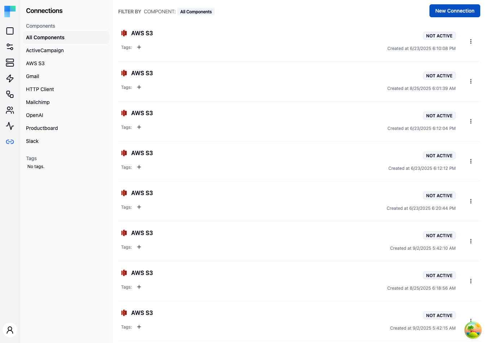

---

## Key Features

| Feature | Description |
|---|---|
| Component filtering | Filter connections by component (third-party service) using the left sidebar. |
| Tag filtering | Organize and filter connections by assigned tags. |
| Environment scoping | Connections are scoped to the current environment (Development, Staging, Production). |
| Status indicator | Each connection shows **Active** / **Not Active** when its credential is valid, or the credential status itself (e.g. `INVALID`) when it is not. |
| Shared connections | Mark a connection shared so every connected user in the environment can use it. |
| Creation date | See when each connection was created. |

### Connection Details

Each connection in the list displays:

- **Component icon** -- the icon of the third-party service.
- **Component name** -- the name of the connected service (e.g., Gmail, Slack, AWS S3).
- **Status** -- **Active** when the credential is valid and something references the connection, **Not Active** when the credential is valid but nothing uses it yet, or the credential status (e.g. `INVALID`) when the credential itself is the problem.
- **Shared** -- a badge shown on connections marked shared.
- **Tags** -- assigned tags for organization.
- **Creation date** -- when the connection was created.

---

## How to Use

### Creating a Connection

1. Click the **New Connection** button in the top-right corner.
2. Select the component (third-party service) you want to connect to.
3. Provide the required authentication credentials (API key, OAuth, etc.).
4. Optionally turn on **Shared Connection** (see [Shared connections](#shared-connections)).
5. Assign tags if desired.
6. Click **Save** to create the connection.

A newly created connection shows **Not Active** until a workflow, integration instance, or test configuration actually references it - the badge reports usage, not reachability.

### Managing Connections

- **Edit** -- change the connection's name, tags, or **Shared Connection** setting. Credentials cannot be changed here.
- **Delete** -- remove a connection (confirmed via an alert dialog). Deletion fails while a workflow still uses the connection.
- **Tag** -- add or remove tags to organize connections.

Only the user who created a connection, or an admin, can edit, tag, or delete it. Anyone else gets an access-denied error.

### Shared connections

Turn on **Shared Connection** in the create or edit dialog to make a connection available to every connected user in the current environment. Shared connections carry a **Shared** badge in the list.

A connected user can select a shared connection in their own workflows, but cannot reconnect or delete it. Only its creator or an admin can change it, and a change applies to every connected user at once. Connections that connected users create themselves are never shared.

### Filtering Connections

Use the left sidebar to filter the connection list:

- **Components** -- the sidebar lists all components that have at least one connection. Click a component name to show only its connections, or select "All Components" to view everything.
- **Tags** -- click a tag to filter by that tag.

### Environment Selection

Connections are scoped to environments. Use the environment selector in the left sidebar header to switch between Development, Staging, and Production. Each environment maintains its own set of connections, allowing you to use different credentials for testing and production.

### Connection Status

| Status | Description |
|---|---|
| Active | The credential is valid and at least one workflow, integration instance, or test configuration uses this connection. |
| Not Active | The credential is valid but nothing references the connection yet. |
| `INVALID` (or another credential status) | The stored credential is missing, expired, or was rejected. The connected user who owns the connection can reconnect it (see below). |

---

## Connections for connected users

### Which connections a connected user sees

A connected user can use the connections they own plus the shared connections in their environment. They own the connections they created and the connections of their integration instances.

The connection list endpoints return only these connections. They take an optional `connectionIds` query parameter that narrows the result to those ids; ids the user is not entitled to are left out.

Assigning a connection the user is not entitled to - for example when a catalog workflow is set up for the user - fails with `400 Bad Request`.

Each returned connection carries two flags:

- **`shared`** - an admin marked the connection shared.
- **`editable`** - the user owns the connection and can reconnect or delete it.

### Frontend endpoints

With a [Signing Key JWT](/openapi/frontend/embedded-configuration-connection), a connected user manages their own connections:

| Method and path | Description |
|---|---|
| `GET /connections` | List every connection the user can use. |
| `GET /components/{componentName}/connections` | List the user's connections for one component. Accepts `connectionIds`. |
| `POST /components/{componentName}/connections` | Create a connection. Returns the new connection id. |
| `DELETE /connections/{id}` | Delete a connection the user owns. |
| `POST /connections/{id}/reauthorize` | Replace the credentials of a connection the user owns, keeping its id. |

Paths are relative to `/api/embedded/v1`.

- **Delete** returns `404` when the connection does not exist or the user does not own it, and `409` with `{"reason": "CONNECTION_IS_USED"}` while a workflow still uses it.
- **Reauthorize** replaces the authorization parameters as a whole: a parameter you leave out is cleared, so send the complete set. Connection-level properties stay unchanged. A successful call marks the credentials valid again. It returns `404` when the user does not own the connection.

The [Automation Hub](/platform/embedded/build/automation-hub#connections) uses these endpoints: its **Reconnect** action opens a **Reconnect &lt;component&gt;** dialog that asks only for the credentials and saves them with **Update credentials**.

