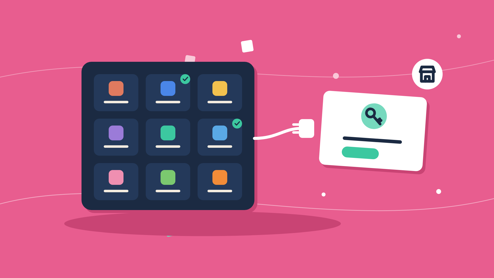

The **Integration Marketplace** is a ready-made catalog page for your integrations. Each card shows an integration your end user can use and whether they have already connected it. **Connect** opens the [Connect dialog](/platform/embedded/get-started/initial-setup/displaying-the-connect-dialog) in your page, and the card switches to **Connected** when the user finishes.

Use it when you want an integrations page without building one. To build your own instead, list the integrations from the embedded API as shown in [Displaying the Connect Dialog](/platform/embedded/get-started/initial-setup/displaying-the-connect-dialog#2-display-the-connect-dialog-in-your-app).


## Before you start

- A Signing Key and a backend that mints end-user JWTs - see [Installing the SDK](/platform/embedded/get-started/initial-setup/installing-the-sdk).
- At least one live integration: published, with an [instance configuration](/platform/embedded/configure/instance-configurations) that is turned on in the environment. See [Adding an Integration](/platform/embedded/get-started/initial-setup/adding-an-integration).
- In production, your app's origin in `BYTECHEF_EMBEDDED_ALLOWED_PARENT_ORIGINS` on the ByteChef server - see [the embed handshake](/platform/embedded/build/automations/automation-workflows#the-embed-handshake).

## Add the marketplace to your app

```tsx
'use client';
import {IntegrationMarketplace} from '@bytechef/embedded';

export function IntegrationsPage({jwtToken}: {jwtToken: string}) {
    return (
        <IntegrationMarketplace
            baseUrl="https://your-bytechef-host.example.com"
            className="h-[700px] w-full"
            environment="PRODUCTION"
            jwtToken={jwtToken}
            onConnectDialogClose={() => console.log('Connect dialog closed')}
            theme={{mode: 'light', primaryColor: '#2563eb'}}
        />
    );
}
```

### Props

| Prop | Type | Default | Description |
|---|---|---|---|
| `jwtToken` | `string` | - | **Required.** The connected user's signed token. |
| `baseUrl` | `string` | `https://app.bytechef.io` | Your ByteChef host. |
| `environment` | `'DEVELOPMENT' \| 'STAGING' \| 'PRODUCTION'` | `'PRODUCTION'` | The environment whose integrations are listed. |
| `className` | `string` | - | Class for the wrapping element. Give it a height; the iframe fills it. |
| `theme` | `object` | - | The same keys as the [Automation Hub theme](/platform/embedded/build/automation-hub#theming). `mode` also applies to the Connect dialog. |
| `mapObjectFields` | `MapObjectFieldsType` | - | Field-mapping callbacks passed to the Connect dialog. See [Displaying the Connect Dialog](/platform/embedded/get-started/initial-setup/displaying-the-connect-dialog). |
| `onConnectDialogClose` | `() => void` | - | Called each time the user closes the Connect dialog. |

When `jwtToken` or another prop changes after the iframe has loaded, the component sends the new values to it without reloading.

## Which integrations appear

The catalog lists the integrations that have an enabled instance configuration in the selected environment, filtered by each integration's [permission expression](/platform/embedded/build/permission-expressions) for the current user. An integration the user already has an instance of shows **Connected**; the others show **Connect**. When there are none, the page says no integrations are available yet.

## How connecting works

The catalog runs in an iframe, but the Connect dialog opens in **your** page, not inside the iframe. When the user clicks **Connect**, the iframe asks your page to open the dialog for that integration, and the `IntegrationMarketplace` component does so. That is what lets you pass `mapObjectFields`: it is made of functions, and a function cannot be sent into an iframe.

When the dialog closes, the component tells the iframe to refresh, so a newly connected or disconnected integration shows its new state straight away, and then calls `onConnectDialogClose`.

The component only acts on requests from its own iframe on your ByteChef host, and the iframe only sends them to the page that initialized it.

## Related

- [Automation Hub](/platform/embedded/build/automation-hub) - the embeddable catalog of automation templates.
- [Integrations](/platform/embedded/build/integrations) - authoring the integrations this page lists.
- [Troubleshooting](/platform/embedded/monitor/troubleshooting#embedding-problems) - a blank iframe or a page stuck on loading.
