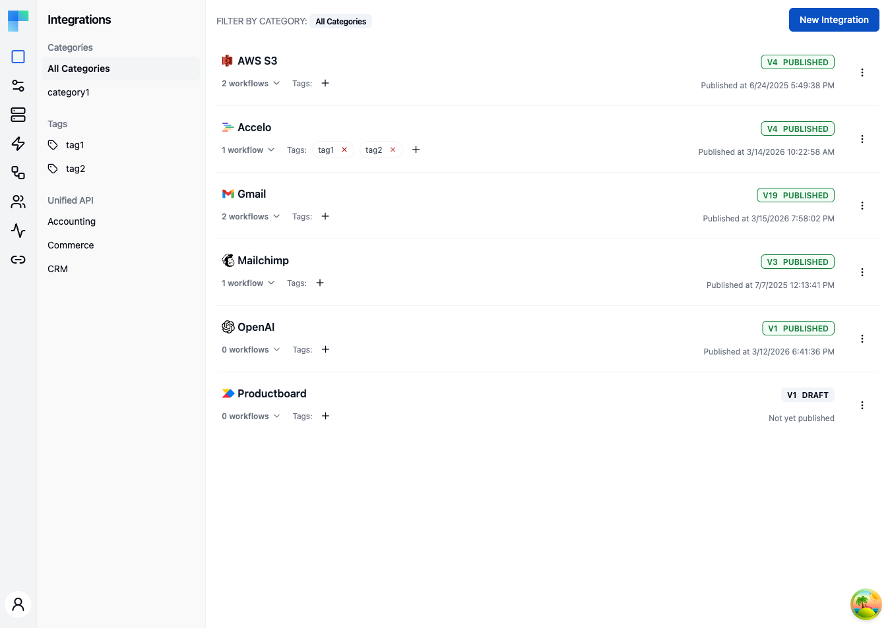

---

> **Integrations are authored in Development.** The **Integrations** entry appears in the Embedded sidebar only while the **Development** environment is selected. You author and publish there, then activate a published version in Staging or Production through an [Integration Configuration](/platform/embedded/configure/instance-configurations).

## Key Features

| Feature | Description |
|---|---|
| Categories | Organize integrations by category for easy discovery. The left sidebar lists all available categories. |
| Tags | Assign tags to integrations for flexible grouping and filtering. |
| Unified API *(feature-flagged)* | When the Unified API feature flag is enabled in your deployment, filter integrations by Unified API category (Accounting, Commerce, CRM). |
| Versioning | Each integration tracks versions with a status of DRAFT or PUBLISHED. |
| Workflow count | The integration card shows how many workflows belong to that integration. |
| Publish date | Displays when the integration was last published, or "Not yet published" for drafts. |
| Permission expression | An optional SpEL expression that restricts which connected users can see the integration (and, per workflow, which workflows). |

### Integration Card Details

Each integration in the list displays:

- **Icon and name** -- the component icon and integration name, linking to the workflow editor.
- **Workflow count** -- the number of workflows contained in the integration, expandable to view the list.
- **Tags** -- assigned tags shown as badges; click to add or remove tags.
- **Version badge** -- shows the current version number and status (e.g., `V1 PUBLISHED` or `V2 DRAFT`).
- **Last published date** -- timestamp of the most recent publish, or a "Not yet published" notice.

---

## How to Use

### Creating an Integration

1. Click the **New Integration** button in the top-right corner of the Integrations page.
2. In the dialog, select the component (third-party service) you want to integrate with.
3. Provide a name, an optional **Permission Expression**, and optional category and tags.
4. Click **Save**. ByteChef creates the integration with a default workflow and opens the workflow editor.

### Managing Integrations

Use the three-dot menu on each integration card to:

| Action | Description |
|---|---|
| Edit | Update the integration name, category, or tags. |
| View Workflows | Open the workflow editor for this integration. |
| New Workflow | Add another workflow to the integration. |
| Publish | Publish the current draft version, making it available to connected users. |
| Import Workflow | Import a workflow from a JSON or YAML file. |
| Delete | Permanently delete the integration and all its workflows. |

### Filtering Integrations

Use the left sidebar to filter the integration list:

- **Categories** -- click a category name to show only integrations in that category, or select "All Categories" to view everything.
- **Tags** -- click a tag to filter by that tag.
- **Unified API** -- when the Unified API feature flag is enabled in your deployment, filter by Accounting, Commerce, or CRM to find integrations that support unified API access. Hidden otherwise.

### Publishing an Integration

Publishing creates a new version of the integration that can be deployed to connected users through Instance Configurations. The version number increments with each publish. Only published versions can be activated in production environments.

### Restricting who sees an integration

By default every active integration is offered to every connected user. To scope an integration to a subset of your users, set a **Permission Expression** - an optional [SpEL](https://docs.spring.io/spring-framework/reference/core/expressions.html) expression evaluated against the calling connected user. When the expression evaluates to `true`, the integration is visible to that user; otherwise it is hidden. Leaving it blank makes the integration visible to everyone.

The expression is evaluated against the connected user's attributes - `email`, `name`, `externalId`, `environment`, and any custom `metadata` your backend attached with `PATCH /api/embedded/v1/me` or `PATCH /api/embedded/v1/{externalUserId}`. (Metadata does not come from JWT claims; the JWT contributes only the `sub` claim, which becomes `externalId`.) Metadata values are stored as strings. For example:

```text
metadata['plan'] == 'pro'
email.endsWith('@acme.com')
```

Permission expressions apply at two levels:

- **Integration level** - set in the integration's create/edit dialog. Controls whether the entire integration (all of its workflows) is offered to the user.
- **Workflow level** - set per workflow from the integration's workflow list. Controls whether that single workflow is offered, even when the parent integration is visible.

Both filters are fail-closed: an expression that errors or evaluates to `false` hides the resource. See **[Permission Expressions](/platform/embedded/build/permission-expressions)** for the full reference.

---

## AI Copilot

> **Coming soon.** The AI Copilot is on the upcoming release track and is not yet available in the latest released version of ByteChef.

The integration workflow editor carries the [AI Copilot](/platform/automation/build/ai-copilot) panel on par with the automation project editor - an integration-scoped assistant with **Ask** and **Build** modes for understanding and building the current integration's workflows. Copilot is an Enterprise Edition feature and is disabled by default.
