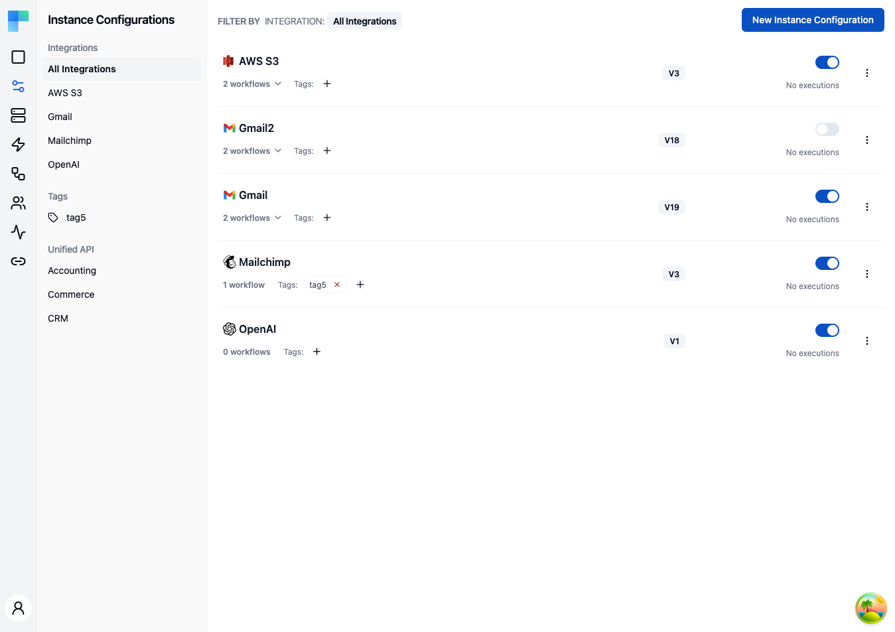

---

## Key Features

| Feature | Description |
|---|---|
| Environment scoping | Each configuration is tied to an environment (Development, Staging, Production). Switch environments from the selector in the left sidebar. |
| Integration filtering | Filter configurations by integration using the left sidebar. |
| Tag filtering | Filter configurations by tag for quick access. |
| Unified API filtering *(feature-flagged)* | When the Unified API feature flag is enabled in your deployment, filter by Unified API category (Accounting, Commerce, CRM). |
| Enable/Disable toggle | Activate or deactivate a configuration without deleting it. |
| Version selection | Choose which published version of an integration to deploy. |

### Configuration Details

Each configuration in the list displays:

- **Integration name** -- the name and icon of the underlying integration.
- **Workflow count** -- number of workflows included in this configuration.
- **Version** -- the published integration version deployed by this configuration.
- **Tags** -- assigned tags for organization and filtering.
- **Enabled/Disabled status** -- whether the configuration is currently active.

---

## How to Use

### Creating a Configuration

Click the **New Instance Configuration** button in the top-right corner to open a multi-step wizard. The wizard shows a step indicator at the top and **Next** / **Previous** buttons; the steps that appear depend on the integration you pick:

1. **Basic** -- choose the integration from a combobox, pick the published **version** to deploy, and assign optional **tags**.
2. **OAuth2 Connection** *(only when the integration's component authenticates via OAuth2)* -- authorize the connection, choosing between a predefined OAuth app and your own OAuth credentials.
3. **Workflows** -- for each workflow in the integration, enable or disable it and set its per-workflow connections and input values.
4. Click **Save** on the final step to create the configuration.

<!-- TODO screenshot: The New Instance Configuration wizard on the Workflows step, showing the step indicator (Basic / OAuth2 Connection / Workflows) and the per-workflow enable toggles with connection and input fields -->

### Internal-only workflow inputs

A workflow input can carry an `internalOnly` flag, declared on the input in the workflow definition. The editor's **Edit Input** dialog has no checkbox for it, so set it by editing the workflow definition and bringing it in with **Import Workflow**.

- **`internalOnly: true`** - the connect dialog filters the input out, so it is never shown to the connected user. Use it for values you set yourself (an account ID, a default that should not be end-user editable).
- **`internalOnly` absent or `false`** *(default)* - the input is collected from the connected user in the [connect dialog](/platform/embedded/get-started/quick-start#7-render-the-connect-dialog).

The flag is enforced by the React SDK, which drops internal-only inputs from the forms it renders. Existing inputs carry no flag and so are end-user-facing.

### Managing Configurations

Each configuration row carries an **Enabled** switch and an ellipsis (⋮) menu:

- **Enable/Disable** -- flip the switch on the row to control whether the configuration's workflows execute.
- **Edit** -- reopens the wizard to update tags, connections, or workflow settings.
- **Update Integration Version** -- upgrade the configuration to a newer published version of the integration.
- **Delete** -- remove the configuration entirely (confirmed via an alert dialog).

Expand a configuration row to see its workflows. Each workflow has its own enable/disable switch and an **Edit** action that opens the **Edit Workflow** dialog, where you set that workflow's per-configuration input values and connections.

### Filtering Configurations

Use the left sidebar to narrow the list:

- **Integrations** -- select a specific integration to show only its configurations, or choose "All Integrations" to see everything.
- **Tags** -- click a tag to filter by that tag.
- **Unified API** -- when the Unified API feature flag is enabled, filter by Accounting, Commerce, or CRM category. Hidden otherwise.

### Environment Selection

Configurations are scoped to environments. Use the environment selector in the left sidebar header to switch between Development, Staging, and Production. Each environment maintains its own set of configurations independently.
