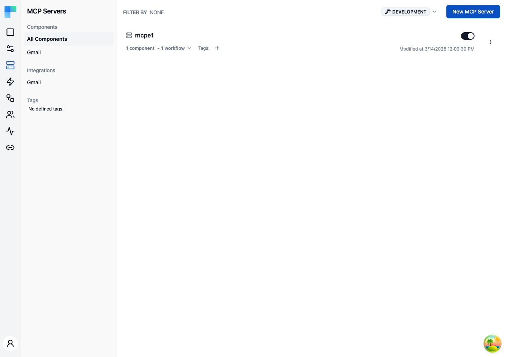

---

## Key Features

| Feature | Description |
|---|---|
| Component filtering | Filter MCP servers by the components they expose using the left sidebar. |
| Integration filtering | Filter by the integrations associated with the server. |
| Tag filtering | Organize and filter servers by assigned tags. |
| Environment selector | Choose the environment (e.g., Development) in the left sidebar header. |
| Enable/Disable toggle | Activate or deactivate an MCP server without removing it. |

### MCP Server Details

Each server in the list displays:

- **Name** -- the server name.
- **Component tool count** -- how many component actions the server exposes as MCP tools, across all of its components.
- **Workflow tool count** -- how many workflows the server exposes; each workflow becomes one tool.
- **Tags** -- assigned tags shown as badges.
- **Enabled/Disabled status** -- whether the server is currently active.
- **Last modified date** -- when the server was last updated.

---

## How to Use

### Creating an MCP Server

1. Click the **New MCP Server** button in the top-right corner.
2. Provide a **Name** for the server.
3. Optionally toggle **Require authentication** (on by default for a new server) and **Enforce tool authorization**. The second depends on the first: turning **Require authentication** off disables **Enforce tool authorization** and clears it, because there is no caller identity to authorize against.
4. Click **Save** to create the server.

The server is created empty - you add the components and workflows it exposes from the server row afterward (see below). Assign tags inline on the server row once it exists.

<!-- TODO screenshot: New MCP Server dialog showing the Name field and the Require authentication / Enforce tool authorization toggles -->

### Adding components and workflows to a server

Open the server row's ellipsis (⋮) menu:

- **Add Component** -- opens a two-step dialog: **Select Component** (pick the third-party component) then **Select Tools from &lt;component&gt;** (choose which of its actions are exposed as tools, and configure each tool's parameters).
- **Add Workflows** -- pick an integration instance configuration, then the workflows within it to expose. Only workflows carrying a **New Workflow Call** trigger are eligible; a configuration with none shows "No tool-eligible workflows found".

For each exposed component action, you choose which parameters you fix yourself and which the connected agent fills at call time, using the `fromAi(...)` expression - the same mechanism as attaching tools to an AI Agent. See [Supplying tool parameters with fromAi](/platform/automation/build/workflows/ai/agent#supplying-tool-parameters-with-fromai) for the syntax.

<!-- TODO screenshot: Add Component dialog on the Select Tools step, showing the list of the component's actions with per-tool selection and the tool properties popover -->

### Enabling and disabling individual tools

Expand a server row, then expand one of its components to see the tools it exposes. Each tool has a switch, a **Configure** button that opens the tool's parameters, and a **Delete** button.

- **Switch on** - the tool is offered to agents.
- **Switch off** - the tool is not offered to any agent and cannot be called, whatever a connected user has enabled for themselves.

The switch applies to the whole server, for every connected user. When you edit a component's tools, each tool keeps its switch state; newly added tools start switched on.

### Managing MCP Servers

Each server row has an **Enabled** switch and an ellipsis (⋮) menu:

- **Enable/Disable** -- flip the switch on the row to control availability.
- **Edit** -- update the server name and authentication toggles.
- **Delete** -- remove the server (confirmed via an alert dialog).

Tags are edited inline on the server row.

Creating, editing and deleting MCP servers and the workflows they expose requires a tenant admin. Connected users can only switch tools and workflows on or off, and set workflow inputs, for their own integration instances (see [Which tools a user's agent sees](#which-tools-a-users-agent-sees)).

### Filtering MCP Servers

Use the left sidebar to filter the server list:

- **Components** -- select a component name to show only servers that expose that component.
- **Integrations** -- filter by integration.
- **Tags** -- click a tag to filter by that tag.

### Environment Selection

Use the environment selector in the left sidebar header to switch between environments. MCP server configurations are scoped per environment.

---

## Connecting to a server

Each server is reachable at `/api/embedded/{secretKey}/mcp`. A request selects the environment with the `X-Environment` header; the tools it sees are scoped to that environment.

### Authentication

The **Require authentication** toggle (set when creating or editing the server) controls what a request must present:

- **On** (the default for newly created servers) - the request's `Authorization` header must carry one of:
  - A ByteChef-signed JWT minted with the tenant's signing key. The JWT's `kid` header identifies the tenant and its `sub` claim carries the external user id.
  - A JWT issued by the tenant's configured external identity provider, via OAuth2 federation.

  Either credential resolves the caller to a ConnectedUser.
- **Off** - the endpoint serves the request using the URL secret alone. No credential is required and no ConnectedUser is resolved, so a tool that needs a connection returns a setup URL instead of executing.

Servers created before this setting existed default to off, so they keep working unchanged.

### When a tool needs the user's account

A tool that needs a connection does not run until the ConnectedUser has connected that integration in the request's environment. Until then, calling it returns a `connection_required` result instead:

```json
{
  "error": "connection_required",
  "message": "The googleMail integration is not connected for this user. To connect, visit: ...",
  "setupUrl": "https://your-bytechef-host.example.com/connect.html?token=..."
}
```

The message asks the agent to show the link to the user as a markdown link labelled **Connect &lt;component&gt;** rather than as the raw URL. A host that renders tool results itself can read `setupUrl` directly, for example to show a Connect button.

`setupUrl` opens ByteChef's hosted connect page, which shows the same [Connect dialog](/platform/embedded/get-started/initial-setup/displaying-the-connect-dialog) your app uses. Its token identifies the user, the integration and the environment, and is valid for 10 minutes. An expired link shows **Link Expired**, and the next call to the tool returns a fresh one. When the user closes the dialog, the page tells them they can close the tab and return to the application that sent them there.

### Which tools a user's agent sees

Tools you switched off on the server are never listed. A workflow tool is listed only while its workflow is enabled in the instance configuration.

Before a user connects an integration, the server lists every remaining tool it exposes for that integration, and each one returns `connection_required` when called.

Once the user has connected, the server lists only the tools that user has enabled. Tools start disabled. The user enables them on the **Tools** tab of the Connect dialog, which lists the server's component tools and workflow tools for that integration. The tab appears only when an MCP server exposes something for the integration.

To switch a server's tools off for a single user, use the **MCP Servers** tab in [Connected Users](/platform/embedded/monitor/connected-users#user-details).

### Workflow tool runs

Calling a workflow tool starts a run of the workflow and waits up to 300 seconds for it to finish. If it does not finish in time, the tool call fails with an error saying the job did not finish within that time.

When the run finishes, the tool returns the workflow's output. A failed run returns its error. A run that stops before it finishes returns its `jobId` and a `status`:

| Status | Meaning |
|---|---|
| `approval_required` | The run is paused waiting for a human approval decision. |
| `suspended` | The run is paused and resumes later on its own. |
| `stopped` | The run was stopped before it finished. |

### Tenant scoping

A session only exposes the tenant's own workflows, connections, and execution history.
