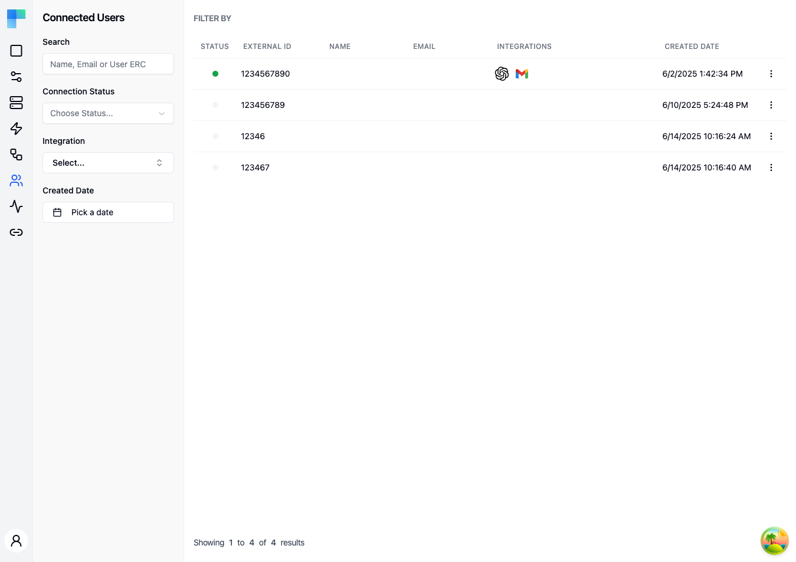

This page covers the ByteChef console view. For how a Connected User record comes into existence and how your backend attaches a name, email, or its own metadata to it, see [Syncing Connected Users](/platform/embedded/get-started/initial-setup/syncing-connected-users-programmatically).

---

## Key Features

| Feature | Description |
|---|---|
| User table | A paginated table of all connected users with key details. |
| Search | Search by name, email, or **External Id** - the unique identifier your application assigns to each user (also referred to as "User ERC" in the search placeholder). |
| Status filtering | Filter by connection status (Valid or Invalid). |
| Integration filtering | Filter by specific integration to find users of a particular service. |
| Date range filtering | Filter by the date range when users were created. |
| Pagination | Navigate through large user lists with page controls. |

### Table Columns

| Column | Description |
|---|---|
| Status | Connection credential status indicator -- green for Valid, gray for Invalid. |
| External Id | The unique identifier your application assigns to the user (this is the `sub` claim of the JWT you sign with your Signing Key). |
| Name | The user's display name. |
| Email | The user's email address. |
| Integrations | Icons representing which integrations the user has connected. |
| Created Date | When the connected user record was created. |

---

## How to Use

### Viewing Connected Users

1. Navigate to the **Connected Users** page from the Embedded sidebar.
2. The table displays all connected users for the current environment.
3. Click on a user row to open a detail sheet with full information about their connections and integrations.

### Filtering Users

Use the left sidebar filters to narrow the user list:

- **Search** -- enter a name, email address, or External Id (User ERC) to find specific users.
- **Connection Status** -- select "Valid" or "Invalid" to filter by credential status.
- **Integration** -- select an integration to show only users who have connected that service.
- **Created Date** -- pick a date range to filter users by when they were created.

Click **Filter** to apply the selected filters.

### User Details

Click on a connected user row to open a side sheet. At the top is a **Profile** header card with the user's ID, name, email, external ID, and account metadata, followed by three tabs:

1. **Integrations** tab (default) -- every integration the user has connected, with the integration's status and the workflows enabled for each integration instance. Use this tab to inspect and manage the connect-flow side of the relationship.
2. **MCP Servers** tab -- the MCP servers this user has access to. Each entry shows the server and lets you enable or disable it for the user, so you can control which component tool sets are exposed to that user's AI agents. Shows "No MCP servers expose this user's integrations." when none apply.
3. **Automation Workflows** tab -- the automation workflows associated with this user across all projects they have access to, listed flat with the workflow label, the version currently in use for this user, and the last execution date (or "No executions" if it hasn't run yet). The tab shows "No automation workflows." when nothing is associated.

The sheet header also carries actions for the user:

- **Enable / Disable** -- a button that toggles the user's active state. A disabled connected user cannot start executions; the button label flips between **Enable** and **Disable** based on the current state.
- **Delete** -- opens a confirmation dialog that removes the connected user and their integration instances.

The sheet stays open across outside clicks (only the close button or the **Escape** key dismisses it), so you can keep it open while navigating other UI.

<!-- TODO screenshot: Connected user detail side sheet open, showing the Profile header card and the Integrations / MCP Servers / Automation Workflows tabs, plus the Enable/Disable and Delete actions in the sheet header -->

### Row actions menu

Each table row has an ellipsis (⋮) menu with the same three actions available without opening the sheet:

- **Open** -- opens the detail sheet for that user.
- **Enable / Disable** -- toggles the user's active state.
- **Delete** -- removes the user record along with their integration instances (the workflows they had enabled stop executing). A confirmation dialog guards the action.

### Environment Selection

Connected users are scoped to the current environment. Use the environment selector in the left sidebar header, beside the ByteChef name, to switch between Development, Staging, and Production to see users in each environment.
