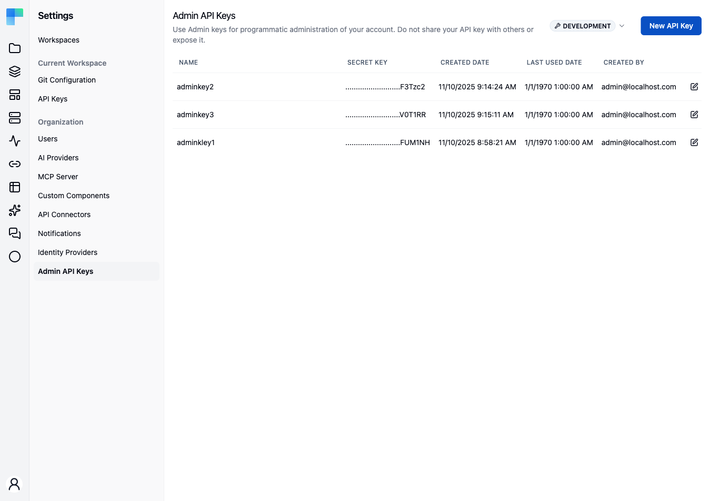

<EEBadge />

An **Admin API key** is scoped to your account and a single environment. Use it for programmatic administration and as the Bearer credential for the [management MCP server](/platform/settings/mcp-server).

It is also the intended credential for the account-wide `/api/platform/v1` API - see the [Custom Components API](/openapi/custom-components). Those operations act on the whole tenant rather than one workspace or environment.

<Callout type="warn" title="Coming soon">
  Enforcing that - rejecting a workspace or embedded API key on `/api/platform/v1` - is on the upcoming release track. In the latest released version any API key valid for the environment authenticates there, and access is decided by the owning user's admin authority alone.
</Callout>

<Callout title="Availability">
    Admin API keys are Enterprise Edition, behind the `ff-1024` feature flag. When the flag is off, the page is hidden from the Settings sidebar.
</Callout>

ByteChef issues a second kind of key as well: workspace API keys, scoped to a workspace *and* an environment, for the [automation public API](/platform/automation/settings/api-keys). Both pages share the same layout, dialogs, and actions; they differ only in scope and where they live in Settings.

---

## The page

**Settings → Admin API Keys** is headed "Use Admin keys for programmatic administration of your account. Do not share your API key with others or expose it.", with an **Environment** selector and - once at least one key exists - a **New API Key** button.

With no keys yet, the body shows an empty state titled **No API Keys** with the message "Get started by creating a new API key." and a **New API Key** button.



| Column | Description |
|---|---|
| **Name** | The label you gave the key. |
| **Secret Key** | A masked preview - the full secret is shown only once, at creation. |
| **Created Date** | When the key was created. |
| **Last Used Date** | When the key last authenticated a request. |
| **Created By** | Who created it. |

Each row ends with an **edit** (pencil) and a **delete** (trash) icon.

## Environments

Every key is bound to the environment active in the **Environment** selector at the moment it is created. Keys created against one environment do not authenticate calls made against another. Switching the selector re-lists the keys for that environment.

## Create a key

1. Confirm the **Environment** selector is set to the environment the key should be bound to.
2. Click **New API Key**.
3. In the **Create API Key** dialog, enter a **Name** of at least 2 characters.
4. Click **Create API Key**.

The dialog switches to the **Save your API Key** view and shows the full secret exactly once:

> Please save this secret key somewhere safe and accessible. For security reasons, you won't be able to view it again through your ByteChef account. If you lose this secret key, you'll need to generate a new one.

5. Click **Copy** - a "The secret API key is copied." confirmation appears - store the secret somewhere safe, then click **Done**.

The key appears in the table showing only its masked preview from this point on.

{/* TODO screenshot: Create API Key dialog in the "Save your API Key" state - the read-only secret field, the Copy button, the one-time-reveal warning text, and the Done button */}

## Rename a key

Click the **edit** (pencil) icon, change the **Name** in the **Edit API Key** dialog, and click **Save**. Only the name changes; the secret is unaffected.

## Revoke a key

Deleting a key is how you revoke it - there is no enable/disable toggle.

Click the **delete** (trash) icon and confirm in the **Are you absolutely sure?** dialog ("This action cannot be undone. This will permanently delete the API key."). Any client presenting the deleted key is rejected immediately. Keys are independent, so deleting one client's key does not affect any other.

Creation and deletion are recorded in the [audit log](/platform/settings/audit-events) as `API_KEY_CREATED` and `API_KEY_DELETED`.

## Using a key with the management MCP server

An Admin API key is the default credential for the [management MCP server](/platform/settings/mcp-server). When the server's **Require authentication** setting is on, send the key as a Bearer header on every request:

```
Authorization: Bearer <your-api-key>
```

The key is bound to an environment, so requests must target the same one via the `X-ENVIRONMENT` header. That header defaults to `PRODUCTION` when omitted, and an unrecognised value is rejected as bad credentials rather than falling back.

Because the key is tied to your account, the assistant acts with your permissions - and you can revoke a single client by deleting its key, without touching the server URL or the other clients. See [MCP Server](/platform/settings/mcp-server) for the full setup.
