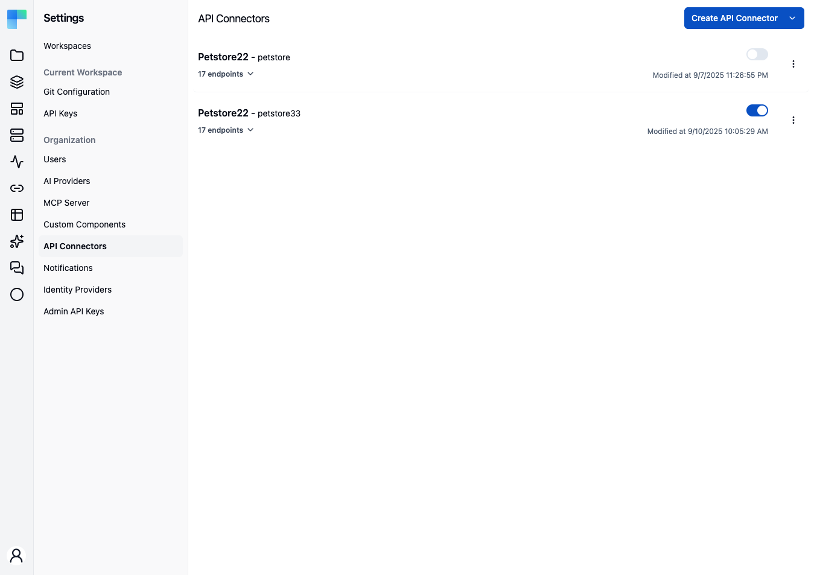
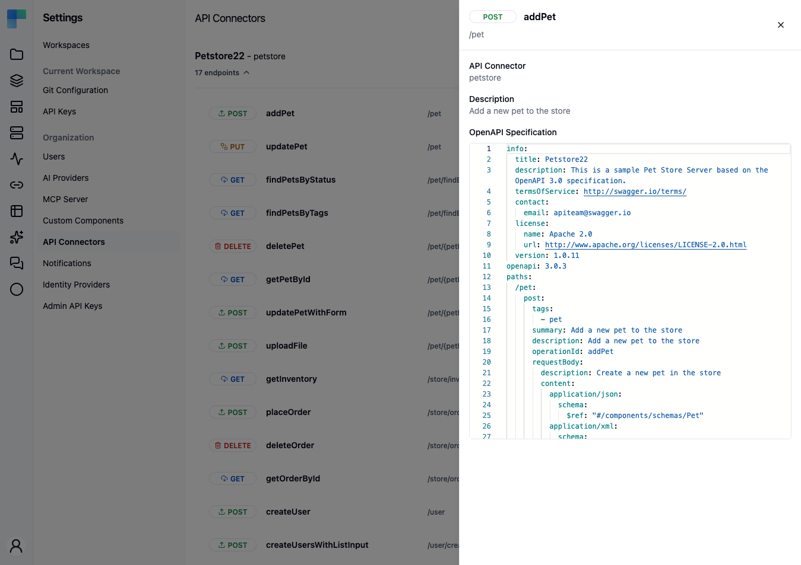
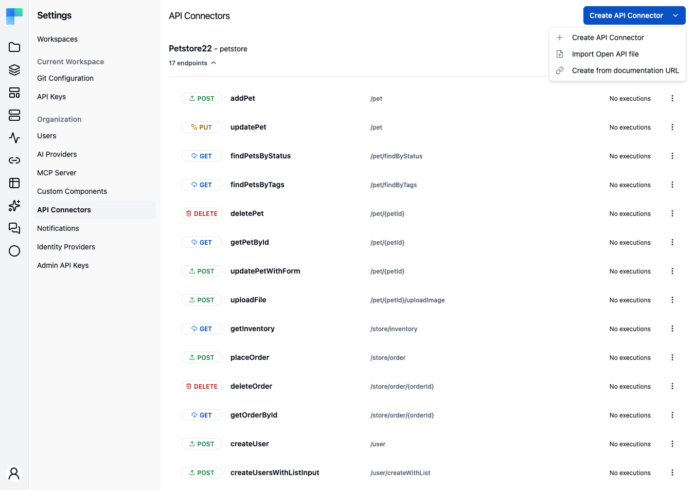

<EEBadge />

An **API connector** turns a REST API into a first-class ByteChef component - one action per endpoint, typed inputs and outputs - without writing or building any code. You describe or import the API's endpoints, ByteChef stores the resulting OpenAPI specification, and once enabled the connector appears in the workflow editor like any built-in component.

Unlike a [custom component](/platform/settings/components/custom-components), an API connector has no source you maintain: the component definition is derived from the stored specification, and you manage the whole thing from the UI.

<Callout title="Availability">
    API connectors are an Enterprise Edition feature, behind the `ff-207` feature flag. Creating, editing, enabling, and deleting connectors requires the `ADMIN` authority - the check sits on the facade and the service, so it applies to every caller.
</Callout>

---

## The specification is the source of truth

Each connector is one row plus two stored blobs: the OpenAPI document you supplied, and a component definition derived from it. Endpoints are not stored as rows - they are re-derived from the specification on every read, with each endpoint's id computed from its `path:method` pair. Editing the specification is therefore the only way to change a connector's endpoints.

Connector names are the runtime registry's lookup key, so uniqueness is enforced for every write path.

## Where connectors live

**Settings → Components** opens on the **Custom Components** list, with an **API Connectors** tab alongside it. Each connector row shows:

| Element | Meaning |
|---|---|
| **Title - name** | The connector's display title and machine name. Hover the title for its description. |
| **Endpoint count** | `N endpoints` - a collapsible toggle. Click the chevron to expand the endpoint list inline. |
| **Enable/disable switch** | Turns the connector on or off. |
| **Modified date** | When the connector last changed. |
| **Ellipsis menu** | **Edit**, **Edit YAML**, and **Delete**. |

### Inspecting endpoints

Expand a row to list the connector's endpoints. Each endpoint row shows an HTTP-method badge, the endpoint name, its path, and the last execution date (or **No executions**).

Click an endpoint to open its **detail panel** - a side sheet showing the method badge and endpoint name, the endpoint **path**, the parent **API Connector** name, the endpoint **description** when present, and the **OpenAPI Specification** for that endpoint rendered read-only in a YAML editor.

Each endpoint row also has its own ellipsis menu holding a single **Edit** item, which is **disabled** and titled *"Edit workflow (coming soon)"*. Editing an endpoint today means editing the connector's specification - through **Edit** or **Edit YAML** on the connector row, below.

<Callout title="Unparseable specifications degrade, they don't break the page">
    If a stored specification cannot be parsed, the connector lists with zero endpoints rather than failing the whole connectors query. A connector showing no endpoints when you expect some is a signal to open **Edit YAML** and check the document.
</Callout>

## Creating a connector

Every connector is created from the **Create API Connector** dropdown in the page header. With the API-connector feature enabled it offers three routes:

| Menu item | Route | Use when |
|---|---|---|
| **Create API Connector** | Manual builder | You want to define endpoints by hand - no spec or docs to start from. |
| **Import Open API file** | OpenAPI import | You already have an OpenAPI 3.x file (`.yml` / `.yaml`). |
| **Create from documentation URL** | AI-assisted | You only have a link to the API's documentation and want AI to generate the spec. |

All three open a step-based wizard with **Previous** / **Cancel** on the left and **Next** on the right, labeled **Save** on the final step. A progress bar shows the current step. All three converge on the same **Review** step, so an imported or AI-generated connector can be edited by hand before it is saved.

### Route 1 - Manual

Steps: **Basic Info → Define Endpoints → Review**.

1. On **Basic Info**, fill in the **Name** (the connector's machine name, required, e.g. `my-api-connector`), optionally an **Icon** (`.svg` upload), and the **Base URL** (e.g. `https://api.example.com/v1`).
2. Click **Next** to reach **Define Endpoints**.
3. Click **Add Endpoint** to open the endpoint editor, which has two tabs:
   - **Form** - structured fields:

     | Field | Notes |
     |---|---|
     | **Method** | `GET`, `POST`, `PUT`, `PATCH`, `DELETE`, or `HEAD`. |
     | **Path** | The endpoint path, e.g. `/users/{id}` (required). |
     | **Operation ID** | A unique identifier for the endpoint, e.g. `getUserById` (required). |
     | **Summary** | Short one-line label. |
     | **Description** | Longer description. |
     | **Parameters** | Query, path, and header parameters with type and required flag. |
     | **Request Body** | Content type, schema, required flag. |
     | **Responses** | Status code, description, content type, and schema per response. |

   - **YAML** - edit the same endpoint directly as OpenAPI YAML.
4. Click **Add** (or **Update** when editing) to save the endpoint. Repeat per endpoint. Click a row to edit it, or the trash icon to remove it.
5. Click **Next** to reach **Review**, confirm the name, base URL, and endpoint list - you can still remove endpoints here - then click **Save**.

{/* TODO screenshot: the manual Define Endpoints step with the Add/Edit Endpoint dialog open on its Form tab, showing Method, Path, Operation ID, Summary, Description, and the Parameters / Request Body / Responses sections */}

<Callout title="What the visual editor round-trips">
    Regenerating the specification from the visual model is a merge, not a rewrite: top-level sections such as `components` and `securitySchemes`, and per-operation `tags`, `security`, and `x-*` extensions all survive. Body and response schemas and parameter schemas ride along as opaque JSON, so `$ref`s round-trip. Two things are lossy - HTTP methods outside `DELETE`, `GET`, `HEAD`, `PATCH`, `POST`, `PUT`, and cookie parameters, both of which drop from the visual model. The per-endpoint **YAML** tab is the escape hatch for either.
</Callout>

### Route 2 - Import Open API File

Steps: **Import File → Review**.

1. On **Import File**, fill in the **Name** (required), optionally an **Icon**, and upload the **OpenAPI Specification** (`.yml` or `.yaml`, required).
2. Click **Next** to review the parsed endpoints and the generated specification.
3. Click **Save**.

An import upserts **by name**: importing under a name that already exists replaces that connector's specification rather than creating a second one.

### Route 3 - Create from documentation URL (AI-assisted)

Steps: **Basic Info → Select Endpoints → Review**. This route uses AI to read the documentation and generate an OpenAPI specification.

1. On **Basic Info**, fill in:
   - **Name** - the connector's machine name (required).
   - **Icon** - optional `.svg` upload.
   - **Documentation URL** - the URL to analyze (required; must start with `http://` or `https://`).
   - **Endpoint Instructions (Optional)** - free-text guidance on which endpoints you need, e.g. *"Only authentication and user management endpoints"*.
   - **Crawl linked documentation pages** - a checkbox; when ticked, ByteChef follows linked pages. Enter the maximum number of pages to crawl, between **2 and 50**.
2. Click **Generate**. The generation job runs asynchronously behind a **Generating OpenAPI specification…** spinner. It typically takes under a minute and **times out after 5 minutes**. While it runs, the left button becomes **Cancel Generation**.
3. When generation completes, the wizard advances to **Select Endpoints**. Discovered endpoints are grouped by resource and all start selected. Use the checkboxes, or the **Select All** / **Deselect All** buttons; the counter reads *"N of M endpoints selected"*, and at least one must stay selected.
4. Click **Next** to reach **Review**, then **Save**. Only the selected endpoints are included.

{/* TODO screenshot: the AI route's Select Endpoints step - endpoints grouped by resource with checkboxes, the "N of M endpoints selected" counter, and the Select All / Deselect All buttons */}

<Callout type="warn">
    The AI route generates a specification by reading the documentation you point at. Review the generated spec and endpoint list before saving - treat it as a draft to verify, not a guaranteed-correct connector.
</Callout>

## Editing a connector

Two entries in the row's ellipsis menu, for two different jobs:

- **Edit** opens the full **Edit API Connector** wizard - the same **Basic Info → Define Endpoints → Review** flow as the manual route, hydrated from the stored specification. This is the rename-safe path.
- **Edit YAML** opens a dialog with a disabled **Name** field, an **Icon** uploader, and the **Open API Specification** editor, for replacing the document wholesale.

{/* TODO screenshot: the Edit API Connector wizard on its Define Endpoints step, hydrated from an existing connector's specification */}

Two conflicts are reported as typed errors rather than silent overwrites:

| Error | Cause |
|---|---|
| `API_CONNECTOR_NAME_ALREADY_EXISTS` | The new name is already taken by another connector. |
| `API_CONNECTOR_VERSION_CONFLICT` | Someone else changed the connector since you loaded it. Reload and reapply your edit. |

## Enabling a connector

Each row has an **enable/disable switch**. Only **enabled** connectors are registered as usable components - a disabled connector is stored but does not appear in the workflow editor.

Once enabled, the connector behaves like any built-in component: open a workflow, add the connector, and each endpoint is available as an action with typed inputs and outputs.

## Deleting a connector

Choose **Delete** from the row's ellipsis menu and confirm in the **Are you absolutely sure?** dialog. Deletion is permanent and removes the connector as a usable component, so migrate any workflow that references it first. Deleting a connector also releases both of its stored blobs.

### Cleaning up orphaned files

An import stores its blobs before the connector row commits, so a failed import can leave files behind. The **`deleteOrphanedApiConnectorFiles`** admin mutation sweeps those historical orphans and reports how many it removed. It is deliberately manual rather than automatic, because an in-flight import legitimately has blobs with no row yet.

## See also

- [Custom components](/platform/settings/components/custom-components) - when you need code rather than a specification.
- [Component Visibility](/platform/settings/components/component-visibility) - connectors can be switched off tenant-wide like any built-in component.
