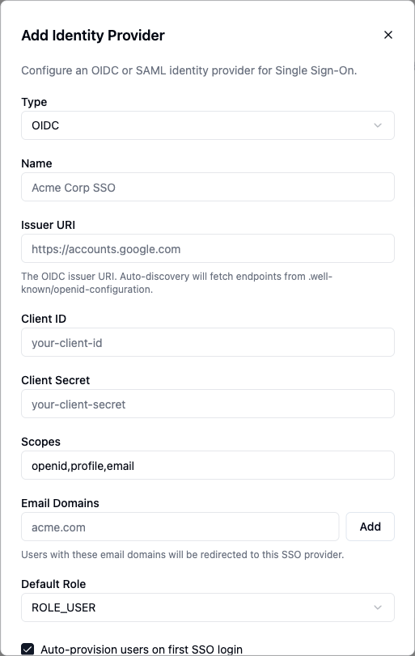

<EEBadge />

Enterprise SSO replaces ByteChef's local user store with your existing identity provider, so identity, group membership, and de-provisioning are managed in one place rather than in a second directory kept in sync by hand.

<Callout title="Availability">
    External identity provider federation is an Enterprise Edition feature, enabled with `bytechef.security.sso.enabled` (`BYTECHEF_SECURITY_SSO_ENABLED`). The **Settings → Identity Providers** page is behind the `ff-1040` feature flag and requires the `ADMIN` authority. Community Edition ships local email/password login, plus optional [social login](#social-login) with Google and GitHub.
</Callout>

---

## Protocols

Both protocols are first-class:

- **SAML 2.0** - assertion-based SSO, typical of ADFS, Shibboleth, and other large-enterprise IdPs.
- **OIDC / OAuth 2.0** - for OIDC-native IdPs such as Okta, Auth0, Google Workspace, Keycloak, and Azure AD / Entra ID.

If your IdP advertises a SAML metadata URL or an OIDC discovery document, it will plug in.

Providers are registered at runtime - metadata URLs, client IDs, secrets, and attribute mappings are all admin-editable without a redeploy. That matters most for multi-tenant deployments where each tenant brings its own IdP, and for onboarding a new identity domain without an outage window.

## The providers list

**Settings → Identity Providers** lists configured providers with these columns: **Name**, **Type**, **Issuer / Metadata URI**, **Domains**, **Status**, **Enforced**, and **MCP**, plus per-row edit and delete actions. **Add Identity Provider** opens the configuration dialog.

## Configuring a provider

The dialog is titled **Add Identity Provider** (or **Edit Identity Provider**) and adapts to the selected **Type**:

| Field | Applies to | Purpose |
|---|---|---|
| **Type** | Both | `OIDC` or `SAML`. Fixed once created - the selector is disabled on edit. |
| **Name** | Both | Display name for the provider, e.g. `Acme Corp SSO`. |
| **Issuer URI** | OIDC | Issuer whose `.well-known/openid-configuration` is auto-discovered, e.g. `https://accounts.google.com`. |
| **Client ID** / **Client Secret** | OIDC | OAuth client credentials. The secret can be left blank on edit to keep the current one. |
| **Scopes** | OIDC | Requested scopes, e.g. `openid,profile,email`. |
| **Metadata URI** | SAML | IdP metadata URL used to auto-configure endpoints and certificates. |
| **Signing Certificate** | SAML | Optional PEM certificate, when not carried in the metadata. |
| **NameID Format** | SAML | Optional NameID format - Email Address, Persistent, Transient, Unspecified, or the metadata default. |
| **Email Domains** | Both | Domains that route users to this provider at login, added and removed as chips. |
| **Default Role** | Both | `ROLE_USER` or `ROLE_ADMIN` granted to users arriving from this provider. |

Four checkboxes control behavior:

- **Auto-provision users on first SSO login**
- **Enforce SSO (block password login for matching domains)**
- **Enabled**
- **Require MFA (policy only)** - with an **MFA Method** selector (TOTP or Email). This is a policy flag; enforcement is planned for a future release and the selector is disabled.

For SAML, editing a saved provider exposes a **Download SP Metadata** button to hand to your IdP.

### Using a provider for MCP endpoints

OIDC providers additionally expose three per-surface toggles:

- **Use for embedded MCP servers** - advertise this provider as the authorization server for embedded MCP endpoints, so MCP clients authenticate directly against it.
- **Use for automation MCP servers** - trust this provider's tokens on the automation MCP endpoint.
- **Use for management MCP servers** - trust this provider's tokens on the management MCP endpoint.

Enabling any of them reveals two more settings:

- **Require token audience to match the MCP endpoint** - reject tokens whose audience does not include this tenant's MCP URL. Enable this when the identity provider is shared across tenants.
- **Groups Claim** (default `groups`) plus a group-to-authority mapping table - map the provider's group claim values, e.g. `idp-group` → `ROLE_SALES`, to ByteChef authorities used for MCP tool authorization.

## What gets federated

- **Authentication** - your IdP performs the login; ByteChef trusts the assertion or ID token.
- **Identity attributes** - email, display name, and, configurably, group membership.
- **Group-to-role mapping** - IdP group claims map onto ByteChef [roles](/platform/settings/users#roles-and-permissions), so adding a new hire to an IdP group grants the corresponding ByteChef permissions automatically.

## What does not get federated

Service-account credentials - the API keys, OAuth tokens, and basic-auth secrets that workflows use - stay in ByteChef's encrypted [connection](/platform/settings/connections) storage. SSO governs **human** identities, not machine credentials.

## Migrating from local accounts

Existing local accounts are matched by email. Once SSO is live, tick **Enforce SSO** on the provider to block password login for its email domains, so users cannot fall back to a local password.

---

## Social login

<Callout type="warn" title="Coming soon">
    Social login is on the upcoming release track and is not yet available in the latest released version of ByteChef.
</Callout>

In addition to local email/password, users can sign in with **Google** or **GitHub**. Enable it with `bytechef.security.social-login.enabled` (`BYTECHEF_SECURITY_SOCIAL_LOGIN_ENABLED`) and supply each provider's client id and secret. This is separate from the IdP federation above - social login targets Community Edition and small teams, where a full IdP is overkill.

## Two-factor authentication

<Callout type="warn" title="Coming soon">
    Two-factor authentication is on the upcoming release track and is not yet available in the latest released version of ByteChef.
</Callout>

For local accounts, ByteChef can require a time-based one-time password (TOTP) as a second factor at sign-in, enabled with `bytechef.security.two-factor-authentication.enabled` (`BYTECHEF_SECURITY_TWO_FACTOR_AUTHENTICATION_ENABLED`). Users register an authenticator app and enter the rotating code after their password.
