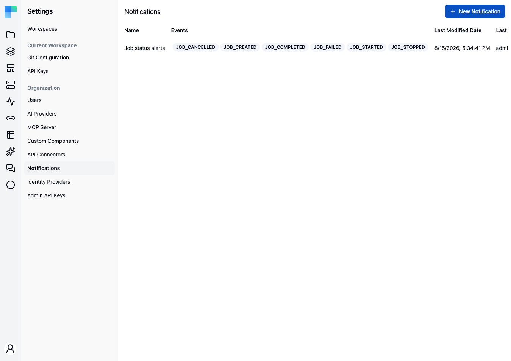

A **notification** is a rule that says *"when a job reaches this status, tell this address"*. Each rule
names one or more job lifecycle events and one delivery target. When a workflow run hits one of those
events, every notification subscribed to it fires.

**Settings → Notifications** requires the `ADMIN` authority. Unlike most of the Settings area, the page
is available in both Community and Enterprise Edition.

---

## The page

The header reads **Notifications**, with a **New Notification** button. With no rules yet, the body
shows an empty state titled **No Notifications** with the message "You do not have any Notifications
created yet."

| Column | Description |
|---|---|
| **Name** | The label you gave the rule. |
| **Events** | The subscribed events, one badge each. |
| **Last Modified Date** | When the rule last changed. |
| **Last Modified By** | Who changed it. |
| **Actions** | An **edit** (pencil) and a **delete** (trash) button. |

## Create a notification

1. Click **New Notification**. The **Create Notification** dialog opens, described as "Define
   notification parameters."
2. Enter a **Name** — required, up to 256 characters.
3. Pick one or more **Events** from the multi-select. At least one is required.
4. Choose a **Type**.
5. Fill in the type's one delivery field.
6. Click **Save**.

Editing works the same way: the pencil icon reopens the dialog, titled **Edit Notification**, with the
current values loaded.

## Events

Events are job lifecycle transitions. The full set:

| Event | Fires when |
|---|---|
| `JOB_CREATED` | A run has been created but not started. |
| `JOB_STARTED` | A run has started executing. |
| `JOB_COMPLETED` | A run finished successfully. |
| `JOB_FAILED` | A run failed. |
| `JOB_CANCELLED` | A run was cancelled before it ever started. |
| `JOB_STOPPED` | A run was stopped mid-execution. |

The list is not per-workspace or per-project: a notification subscribes to an event across the whole
deployment. `JOB_STOPPED` has no email content defined, so subscribing to it records the interest but
sends nothing.

## Delivery types

| Type | Field | Notes |
|---|---|---|
| **EMAIL** | **Email** — the recipient address. | The default and the only type available out of the box. Requires a mail host to be configured; without one the send is skipped with a warning. |
| **WEBHOOK** | **Webhook URL** | *Coming soon.* Behind the `ff-1132` feature flag, and not functional in the latest released version: selecting it stores the URL, but the webhook transport delivers nothing. |

<Callout type="warn" title="Coming soon">
    A **Slack** delivery type, HMAC signing for webhook payloads, and per-workspace scoping of a
    notification are on the upcoming release track and are not yet available in the latest released
    version of ByteChef.
</Callout>

Email subject and body come from the platform's message bundle, parameterised with the workflow's
label and the job id. There is no per-notification template.

## Delete a notification

Click the **delete** (trash) icon on the row and confirm in the **Delete &lt;name&gt; notification?** dialog
("This action cannot be undone."). The rule stops firing immediately; runs already in flight are
unaffected.

## See also

- [Workflow Executions](/platform/automation/monitor/workflow-executions) — the run history a notification points you at.
