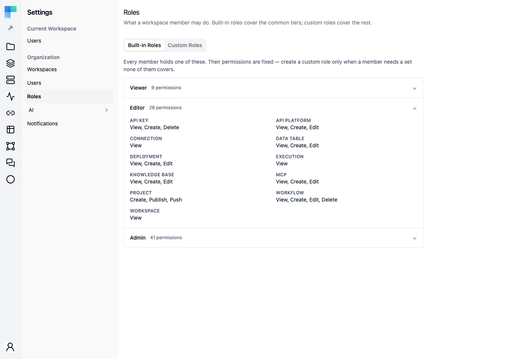
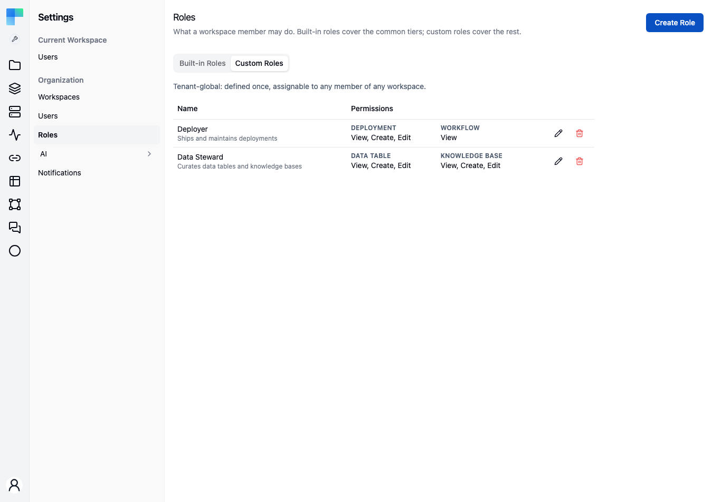
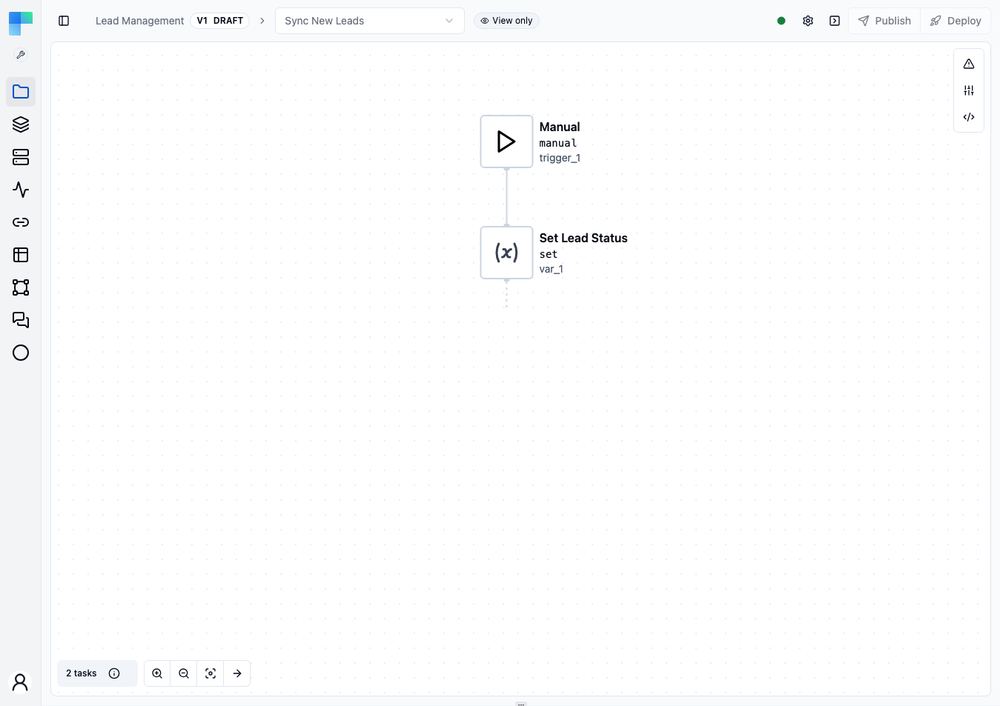

Organization membership is managed from **Settings → Users**. From this page an administrator invites new people by email and removes people who should no longer have access. In Enterprise Edition the same page assigns each account an organization role and changes it later.

<Callout title="Availability">
    The page is available in both editions and requires the `ADMIN` authority, so non-admins cannot open it. Listing, inviting and removing users work the same either way. **Roles are Enterprise Edition only**: Community Edition has a single level of access, so every account is an administrator and the role controls described below are not rendered there.
</Callout>

---

## The Users page

The header reads **Users**, described as "Manage organization users: invite or delete users.", with an **Invite User** button on the right. Below it, existing users are listed:

| Column | Description |
|---|---|
| **Email** | The user's email address. |
| **Name** | First and last name, when set. |
| **Role** | The organization authority, shown verbatim - `ROLE_ADMIN` or `ROLE_USER`. Every Community Edition account reads `ROLE_ADMIN`. |
| **Status** | **Active** when the account is activated, **Pending** otherwise. |
| *(actions)* | Per-row **edit** (pencil) and **delete** (trash) buttons. The edit button is Enterprise Edition only - it exists to change a role, and Community Edition has none to change. |

When there are more users than fit on one page, pagination controls appear in the footer. If no users match, the table shows **No users found.**

## Invite a user

1. Click **Invite User**. The dialog explains: "Enter the user email. A strong password is pre-generated according to the security rules. This password will be included in the invitation email."
2. Enter the **Email** address.
3. A **Password** is generated for you and shown read-only. **Regenerate** produces a different one. The rule beneath the field states it: "Password must be at least 8 characters and include at least 1 uppercase letter and 1 number."
4. Choose a **Role**. The options come from the organization's configured authorities; the first one is preselected. This step is Enterprise Edition only - Community Edition shows no **Role** field and invites every account as an administrator.
5. Click **Invite**.

The **Invite** button stays disabled until an email address is set *and* the generated password satisfies the password rules; in Enterprise Edition a role must be chosen too. An invalid role is rejected before any account row is created, so a bad request cannot leave an orphaned user behind.

<Callout type="warn" title="The temporary password travels by email">
    The generated password is both shown to the administrator and sent to the invitee in the invitation email, alongside an activation link. Treat it as a one-time credential: tell the new user to change it in [Profile → Change password](/platform/your-account/profile) once they are in.
</Callout>

The invitation email carries a link to `/activate?key=…`. Until the invitee follows it the account is **not activated**, so it shows **Pending** in the table; following the link flips it to **Active**. Inviting an email address that already has an account is rejected.

An invited account occupies a seat against the deployment's member quota from the moment the invitation is sent, not from the moment it is claimed.

## Change a user's role

<Callout title="Enterprise Edition">
    Community Edition does not render the **edit** action. It exists only to change a role, and every Community Edition account is already an administrator.
</Callout>

1. Click the **edit** (pencil) icon on the user's row to open the **Edit User** dialog, described as "Change the user role."
2. The dialog shows the selected **User** (their email) and a **Role** dropdown set to their current role.
3. Pick a new **Role** and click **Save**.

Only the organization role is editable here - email and name are not. Workspace roles are managed separately, per workspace.

## Remove a user

Click the **delete** (trash) icon on the row and confirm. The confirmation warns that the action cannot be undone. Removing a user revokes their access to the organization.

## What differs between editions

Community Edition has one level of access. There is nothing to assign, so the controls that would assign it are absent rather than disabled:

| | Community Edition | Enterprise Edition |
|---|---|---|
| List, invite, remove users | Yes | Yes |
| **Role** field in the invite dialog | Not shown - invites as administrator | Choose from the configured authorities |
| **Role** column in the table | Always `ROLE_ADMIN` | The account's authority |
| **edit** action / **Edit User** dialog | Not shown | Change the role |
| Workspace roles and permission scopes | Not available | See below |

The workspace role model below - roles, permission scopes and per-workspace membership - is Enterprise Edition throughout, and each section carries the badge.

---

## Roles and permissions

<EEBadge />

<Callout type="warn" title="Coming soon">
    Role-based access control is on the upcoming release track and is not yet available in the latest released version of ByteChef.
</Callout>

ByteChef separates two things that are easy to confuse:

- The **organization role** (`ROLE_ADMIN` / `ROLE_USER`) - the authority assigned on this page. It governs the administrative surfaces: Settings pages, user management, licensing.
- The **workspace role** - assigned per workspace, and what governs day-to-day work on projects, workflows, connections, and data.

Permissions are scoped to **workspaces**. There are no per-project roles and no per-resource ACLs: a user can be an admin in one workspace, an editor in another, and have no access at all to a third.

### The built-in workspace roles

<EEBadge />

| Role | Rank |
|---|---|
| **Admin** | Most privileged. Holds every scope, including the destructive deletes and workspace administration. |
| **Editor** | Everything Viewer has, plus creating, publishing and pushing projects; creating and editing workflows, deployments, data tables, knowledge bases, MCP servers and API collections; managing API keys; and deleting workflows. |
| **Viewer** | Read-only. |

The roles are ranked rather than enumerated: a role is granted every permission scope whose declared minimum role it is at least as privileged as, so `VIEWER ⊆ EDITOR ⊆ ADMIN` holds by construction. Adding a scope means declaring its minimum role once, not editing three role definitions.

The built-in roles are listed on **Settings → Roles**, which organization admins can open. Its **Built-in Roles** tab comes first and shows each role with a count of its permissions. Expand a role to see them, grouped by module. The **Custom Roles** tab is next to it.

### Permission scopes

<EEBadge />

Scopes are contributed per module at startup rather than listed in a central enum. The built-in set and its minimum role:

| Scope | Minimum role |
|---|---|
| `WORKSPACE_VIEW` | Viewer |
| `WORKSPACE_MANAGE`, `WORKSPACE_MEMBER_MANAGE` | Admin |
| `PROJECT_CREATE`, `PROJECT_PUBLISH`, `PROJECT_PUSH` | Editor |
| `PROJECT_SETTINGS`, `PROJECT_DELETE`, `PROJECT_PULL` | Admin |
| `WORKFLOW_VIEW` | Viewer |
| `WORKFLOW_CREATE`, `WORKFLOW_EDIT`, `WORKFLOW_DELETE` | Editor |
| `DEPLOYMENT_VIEW` | Viewer |
| `DEPLOYMENT_CREATE`, `DEPLOYMENT_EDIT` | Editor |
| `DEPLOYMENT_DELETE` | Admin |
| `EXECUTION_VIEW` | Viewer |
| `EXECUTION_DELETE` | Admin |
| `CONNECTION_VIEW` | Viewer |
| `CONNECTION_CREATE` | Editor |
| `CONNECTION_EDIT`, `CONNECTION_DELETE` | Admin |
| `DATA_TABLE_VIEW`, `KNOWLEDGE_BASE_VIEW`, `MCP_VIEW`, `API_PLATFORM_VIEW` | Viewer |
| `DATA_TABLE_CREATE`, `DATA_TABLE_EDIT` | Editor |
| `DATA_TABLE_DELETE` | Admin |
| `KNOWLEDGE_BASE_CREATE`, `KNOWLEDGE_BASE_EDIT` | Editor |
| `KNOWLEDGE_BASE_DELETE` | Admin |
| `MCP_CREATE`, `MCP_EDIT` | Editor |
| `MCP_DELETE` | Admin |
| `API_PLATFORM_CREATE`, `API_PLATFORM_EDIT` | Editor |
| `API_PLATFORM_DELETE` | Admin |
| `API_KEY_VIEW`, `API_KEY_CREATE`, `API_KEY_DELETE` | Editor |

Declaring the same scope name with two different minimum roles fails the application at startup rather than silently picking one.

### Custom roles

<EEBadge />

A custom role is a named set of permission scopes, for a member who needs a combination no built-in role covers. Custom roles are **tenant-global**: a role is defined once and can be assigned to any member of any workspace.

Custom roles are managed on the **Custom Roles** tab of **Settings → Roles**. Creating, editing and deleting them is reserved for organization admins. **Create Role** asks for a **Name**, an optional **Description**, and at least one scope from **Permissions**, grouped by module.

- **Deleting** a role asks for confirmation. It fails while the role is still assigned to any workspace member, so reassign those members first.
- **Changing a role's permissions** takes effect for every member who holds it, on their next request. Nobody has to sign out and back in. Changing only the name or description leaves permissions untouched.

### Per-environment roles

<EEBadge />

A member holds **either** one workspace-wide role **or** a separate role for each [environment](/platform/automation/deploy/environments): Development, Staging and Production. A custom role can also be assigned per environment.

- A **workspace-wide role** applies in all three environments. This is the default when a member is added.
- With **per-environment roles**, the member has only the roles listed for them. They are denied in any environment without a role.

Switching between the two follows these rules:

| Action | Result |
|---|---|
| Give a workspace-wide member a role in one environment | The member switches to per-environment roles. Their workspace-wide role is removed, so they lose access to the other environments until they are granted roles there. |
| Remove one environment role while others remain | The member is denied in that environment. Their other environment roles are unchanged. |
| Remove the member's **last** environment role | That role becomes their workspace-wide role, so they hold it in every environment. |

The same page enforces who may make each change:
- Adding, inviting or removing a member, and changing a workspace-wide role, need `WORKSPACE_MEMBER_MANAGE` in **every** environment.
- Setting or removing a single environment's role needs it only in **that** environment.
- Removing the last environment role widens the member to every environment, so it also needs the scope in every environment.

Per-environment roles are assigned on **Settings → Current Workspace → [Users](/platform/automation/settings/users)**.

### Permissions follow the selected environment

<EEBadge />

What a member can do depends on the environment currently chosen in the sidebar's [environment selector](/platform/automation/deploy/environments#choosing-an-environment). The app checks the member's permissions for that environment and shows or hides controls to match. Switching environments re-evaluates them.

For example, take a member who is **Viewer** in Development and **Admin** in Production. They see admin controls only while Production is selected. With Development selected, the same pages are read-only.

Workflows are the exception. Workflows are built in Development, so creating, editing and deleting a workflow is checked against the member's role in Development, whichever environment is selected. The member above opens workflows read-only in every environment.

The server applies the same rule. A request about a specific resource, such as a deployment, is checked against the member's role in that resource's environment. A request that names an environment is checked against the role in that environment. Organization admins are not subject to per-environment roles: they hold every scope in every environment.

### The workflow editor without Workflow Edit

<EEBadge />

A member without `WORKFLOW_EDIT`, such as a Viewer, can still open a workflow. The editor opens read-only, with a **View only** badge next to the breadcrumb:

- Nodes, their properties, code editors, and workflow inputs and outputs can be opened and inspected, but not changed.
- The **Test** button, node tests and script runs are not offered.
- The workflow menus show **Edit**, **Share**, **Duplicate** and **Delete** only when the member holds the scope each needs: `WORKFLOW_EDIT` for Edit and Share, `WORKFLOW_CREATE` for Duplicate, and `WORKFLOW_DELETE` for Delete.
- In the [AI Copilot](/platform/automation/build/ai-copilot) panel, **Build** mode is unavailable and the panel switches to **Ask** mode.

Hiding these controls is for convenience only. The server enforces the same rules: saving the workflow, saving node parameters, workflow test runs, node tests, script runs and test configuration all require `WORKFLOW_EDIT`, and other calls are refused.

### Notable permission rules

<EEBadge />

Most actions need the scope their name suggests. These are the ones that are easy to get wrong:

| Action | Requires | Built-in role |
|---|---|---|
| Delete a deployment | `DEPLOYMENT_DELETE` | Admin |
| Delete execution logs | `EXECUTION_DELETE` | Admin |
| Delete an MCP server | `MCP_DELETE` | Admin |
| Delete an API collection | `API_PLATFORM_DELETE` | Admin |
| Delete a data table | `DATA_TABLE_DELETE` | Admin |
| Delete a knowledge base | `KNOWLEDGE_BASE_DELETE` | Admin |
| Edit (rename, retag) or delete a connection | `CONNECTION_EDIT` / `CONNECTION_DELETE` | Admin |
| Enable, disable or update a deployment; stop or restart a job | `DEPLOYMENT_EDIT` | Editor |
| Create, import or duplicate a workflow | `WORKFLOW_CREATE` | Editor |
| Delete a workflow | `WORKFLOW_DELETE` | Editor |
| Create a connection | `CONNECTION_CREATE` in the connection's environment | Editor |
| Publish a project, pushing it when Git sync is enabled | `PROJECT_PUBLISH` and `WORKFLOW_EDIT`, plus `PROJECT_PUSH` to push | Editor |
| Deploy a project | `DEPLOYMENT_CREATE`, plus `WORKFLOW_EDIT` in the environment deployed to | Editor |
| Pull a project from Git | `PROJECT_PULL`, `PROJECT_PUBLISH` and `WORKFLOW_EDIT`, plus `WORKFLOW_EDIT` and `WORKFLOW_CREATE` in Development to overwrite and add workflows | Admin |
| Configure the Git repository or a project's branch | `WORKSPACE_MANAGE` | Admin |
| Deploy a code workflow through the public API | `PROJECT_CREATE` and `PROJECT_PUBLISH` | Editor |
| Delete a workspace | Organization admin | - |

See [Git Configuration](/platform/automation/settings/git-configuration#required-permissions) for the full Git breakdown.

### Denied actions

<EEBadge />

A request the member lacks permission for is refused. The REST API returns HTTP **403**, and GraphQL returns an error of type `FORBIDDEN`. In the app, the refusal shows as an **Access denied** message, and the member stays signed in.

### Managing workspace membership

<EEBadge />

Workspace membership has two surfaces. The current workspace's members are managed on its own page, **Settings → Current Workspace → [Users](/platform/automation/settings/users)**. To reach *another* workspace's members without switching to it, use **Settings → [Workspaces](/platform/settings/workspaces)**: each workspace row's **⋮** menu has a **Members** entry that opens the **Workspace Members** dialog. The dialog lists members with **User**, **Role**, and **Added** columns. An admin changes a member's role inline through the **Role** dropdown, removes a member with the trash action, and adds one through the **Add user** row - search by email, pick a role, confirm. The role dropdown is derived from the server-side role enum, so a role added server-side appears without a client change.

The Workspaces page is open only to organization admins. In the dialog, a member with per-environment roles has one row per environment, labelled with the role and the environment it applies in. Those rows are read-only, as are inherited organization-admin entries; per-environment roles are changed on the workspace's own Users page. Removing a user at the workspace level revokes their access to every project in that workspace at once.

### Federated identity

<EEBadge />

If you federate authentication through an external identity provider, group claims can drive workspace roles automatically. See [Identity Providers](/platform/settings/identity-providers).

### What gets logged

<EEBadge />

Membership and role changes are recorded in the [audit log](/platform/settings/audit-events) as `WORKSPACE_USER_ADDED`, `WORKSPACE_USER_REMOVED`, `WORKSPACE_USER_ROLE_UPDATED`, `WORKSPACE_USER_ENVIRONMENT_ROLE_UPDATED`, and `WORKSPACE_USER_ENVIRONMENT_ROLE_REMOVED`; custom roles as `CUSTOM_ROLE_CREATED`, `CUSTOM_ROLE_UPDATED`, and `CUSTOM_ROLE_DELETED`; account lifecycle as `USER_CREATED`, `USER_ACTIVATED`, `USER_PASSWORD_CHANGED`, and `USER_DELETED`.

## See also

- [Workspace Users](/platform/automation/settings/users) - the per-workspace membership view.
- [Identity Providers](/platform/settings/identity-providers) - federating identities instead of inviting local accounts one by one.
