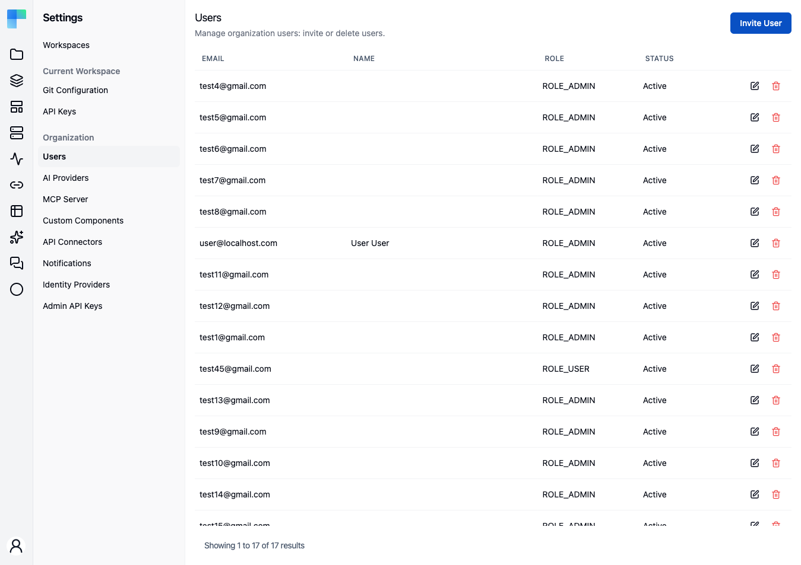
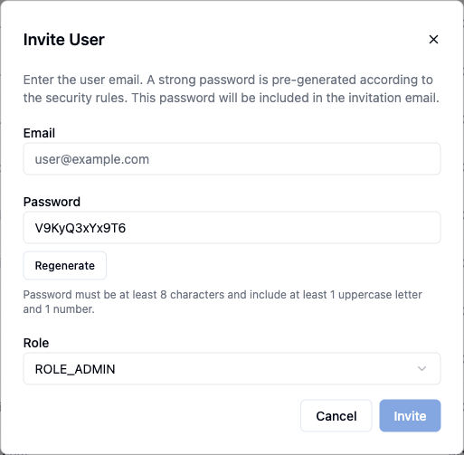

Organization membership is managed from **Settings → Users**. From this page an administrator invites new people by email and removes people who should no longer have access. In Enterprise Edition the same page assigns each account an organization role and changes it later.

<Callout title="Availability">
    The page is available in both editions and requires the `ADMIN` authority, so non-admins cannot open it. Listing, inviting and removing users work the same either way. **Roles are Enterprise Edition only**: Community Edition has a single level of access, so every account is an administrator and the role controls described below are not rendered there.
</Callout>

---

## The Users page

The header reads **Users**, described as "Manage organization users: invite or delete users.", with an **Invite User** button on the right. Below it, existing users are listed:

| Column | Description |
|---|---|
| **Email** | The user's email address. |
| **Name** | First and last name, when set. |
| **Role** | The organization authority, shown verbatim - `ROLE_ADMIN` or `ROLE_USER`. Every Community Edition account reads `ROLE_ADMIN`. |
| **Status** | **Active** when the account is activated, **Pending** otherwise. |
| *(actions)* | Per-row **edit** (pencil) and **delete** (trash) buttons. The edit button is Enterprise Edition only - it exists to change a role, and Community Edition has none to change. |

When there are more users than fit on one page, pagination controls appear in the footer. If no users match, the table shows **No users found.**

## Invite a user

1. Click **Invite User**. The dialog explains: "Enter the user email. A strong password is pre-generated according to the security rules. This password will be included in the invitation email."
2. Enter the **Email** address.
3. A **Password** is generated for you and shown read-only. **Regenerate** produces a different one. The rule beneath the field states it: "Password must be at least 8 characters and include at least 1 uppercase letter and 1 number."
4. Choose a **Role**. The options come from the organization's configured authorities; the first one is preselected. This step is Enterprise Edition only - Community Edition shows no **Role** field and invites every account as an administrator.
5. Click **Invite**.

The **Invite** button stays disabled until an email address is set *and* the generated password satisfies the password rules; in Enterprise Edition a role must be chosen too. An invalid role is rejected before any account row is created, so a bad request cannot leave an orphaned user behind.

<Callout type="warn" title="The temporary password travels by email">
    The generated password is both shown to the administrator and sent to the invitee in the invitation email, alongside an activation link. Treat it as a one-time credential: tell the new user to change it in [Profile → Change password](/platform/your-account/profile) once they are in.
</Callout>

The invitation email carries a link to `/activate?key=…`. Until the invitee follows it the account is **not activated**, so it shows **Pending** in the table; following the link flips it to **Active**. Inviting an email address that already has an account is rejected.

An invited account occupies a seat against the deployment's member quota from the moment the invitation is sent, not from the moment it is claimed.

## Change a user's role

<Callout title="Enterprise Edition">
    Community Edition does not render the **edit** action. It exists only to change a role, and every Community Edition account is already an administrator.
</Callout>

1. Click the **edit** (pencil) icon on the user's row to open the **Edit User** dialog, described as "Change the user role."
2. The dialog shows the selected **User** (their email) and a **Role** dropdown set to their current role.
3. Pick a new **Role** and click **Save**.

Only the organization role is editable here - email and name are not. Workspace roles are managed separately, per workspace.

## Remove a user

Click the **delete** (trash) icon on the row and confirm. The confirmation warns that the action cannot be undone. Removing a user revokes their access to the organization.

## What differs between editions

Community Edition has one level of access. There is nothing to assign, so the controls that would assign it are absent rather than disabled:

| | Community Edition | Enterprise Edition |
|---|---|---|
| List, invite, remove users | Yes | Yes |
| **Role** field in the invite dialog | Not shown - invites as administrator | Choose from the configured authorities |
| **Role** column in the table | Always `ROLE_ADMIN` | The account's authority |
| **edit** action / **Edit User** dialog | Not shown | Change the role |
| Workspace roles and permission scopes | Not available | See below |

The workspace role model below - roles, permission scopes and per-workspace membership - is Enterprise Edition throughout, and each section carries the badge.

---

## Roles and permissions

<EEBadge />

<Callout type="warn" title="Coming soon">
    Role-based access control is on the upcoming release track and is not yet available in the latest released version of ByteChef.
</Callout>

ByteChef separates two things that are easy to confuse:

- The **organization role** (`ROLE_ADMIN` / `ROLE_USER`) - the authority assigned on this page. It governs the administrative surfaces: Settings pages, user management, licensing.
- The **workspace role** - assigned per workspace, and what governs day-to-day work on projects, workflows, connections, and data.

Permissions are scoped to **workspaces**. There are no per-project roles and no per-resource ACLs: a user can be an admin in one workspace, an editor in another, and have no access at all to a third.

### The built-in workspace roles

<EEBadge />

| Role | Rank |
|---|---|
| **Admin** | Most privileged. |
| **Editor** | Everything Viewer has, plus create/edit/delete. |
| **Viewer** | Read-only. |

The roles are ranked rather than enumerated: a role is granted every permission scope whose declared minimum role it is at least as privileged as, so `VIEWER ⊆ EDITOR ⊆ ADMIN` holds by construction. Adding a scope means declaring its minimum role once, not editing three role definitions.

### Permission scopes

<EEBadge />

Scopes are contributed per module at startup rather than listed in a central enum. The built-in set and its minimum role:

| Scope | Minimum role |
|---|---|
| `WORKSPACE_VIEW` | Viewer |
| `WORKSPACE_MANAGE`, `WORKSPACE_MEMBER_MANAGE` | Admin |
| `PROJECT_CREATE` | Editor |
| `PROJECT_SETTINGS`, `PROJECT_DELETE` | Admin |
| `WORKFLOW_VIEW` | Viewer |
| `WORKFLOW_CREATE`, `WORKFLOW_EDIT`, `WORKFLOW_DELETE` | Editor |
| `DEPLOYMENT_VIEW` | Viewer |
| `DEPLOYMENT_PUSH`, `DEPLOYMENT_PULL`, `DEPLOYMENT_EDIT` | Editor |
| `EXECUTION_VIEW` | Viewer |
| `EXECUTION_DELETE` | Editor |
| `CONNECTION_VIEW` | Viewer |
| `CONNECTION_EDIT`, `CONNECTION_DELETE`, `CONNECTION_USE` | Editor |
| `DATA_TABLE_VIEW`, `KNOWLEDGE_BASE_VIEW`, `MCP_VIEW`, `API_KEY_VIEW`, `AI_GATEWAY_VIEW` | Viewer |
| `DATA_TABLE_CREATE`, `DATA_TABLE_EDIT` | Editor |
| `KNOWLEDGE_BASE_CREATE`, `KNOWLEDGE_BASE_EDIT` | Editor |
| `MCP_CREATE`, `MCP_EDIT` | Editor |
| `API_KEY_CREATE`, `API_KEY_DELETE` | Editor |

Declaring the same scope name with two different minimum roles fails the application at startup rather than silently picking one.

### Managing workspace membership

<EEBadge />

Workspace membership has two surfaces. The current workspace's members are managed on its own page, **Settings → Current Workspace → [Users](/platform/automation/settings/users)**. To reach *another* workspace's members without switching to it, use **Settings → [Workspaces](/platform/settings/workspaces)**: each workspace row's **⋮** menu has a **Members** entry that opens the **Workspace Members** dialog. The dialog lists members with **User**, **Role**, and **Added** columns. An admin changes a member's role inline through the **Role** dropdown, removes a member with the trash action, and adds one through the **Add user** row - search by email, pick a role, confirm. The role dropdown is derived from the server-side role enum, so a role added server-side appears without a client change.

Only a workspace **Admin** sees the role dropdown, the remove action, and the add row; everyone else sees the membership list read-only. Removing a user at the workspace level revokes their access to every project in that workspace at once.

{/* TODO screenshot: Workspace Members dialog - the members table with User / Role / Added columns, a role dropdown open on one row showing ADMIN / EDITOR / VIEWER, and the "Add user" row visible */}

### Federated identity

<EEBadge />

If you federate authentication through an external identity provider, group claims can drive workspace roles automatically. See [Identity Providers](/platform/settings/identity-providers).

### What gets logged

<EEBadge />

Membership and role changes are recorded in the [audit log](/platform/settings/audit-events) as `WORKSPACE_USER_ADDED`, `WORKSPACE_USER_REMOVED`, and `WORKSPACE_USER_ROLE_UPDATED`; account lifecycle as `USER_CREATED`, `USER_ACTIVATED`, `USER_PASSWORD_CHANGED`, and `USER_DELETED`.

## See also

- [Workspace Users](/platform/automation/settings/users) - the per-workspace membership view.
- [Identity Providers](/platform/settings/identity-providers) - federating identities instead of inviting local accounts one by one.
