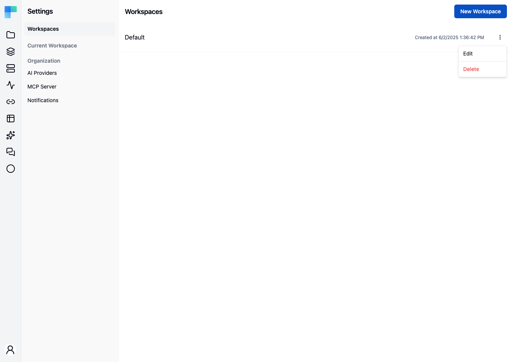

<EEBadge />

A **workspace** is the boundary a team works inside. Projects belong to a workspace; so do the
connections, data tables, knowledge bases, API keys, and MCP servers those projects use. Two
workspaces share nothing, which is what makes them the right unit for separating teams, business
units, or tenants.

Workspaces are administered from **Settings → Workspaces** in the Automation area, which requires
the organization admin authority.

---

## What a workspace scopes

| Owned by the workspace | Notes |
|---|---|
| **Projects and their deployments** | Every project belongs to exactly one workspace. |
| **Connections** | Shared across the workspace's projects rather than owned by one of them. |
| **Data tables** | Workspace-scoped, so a lookup table is defined once and reused by every project. See [Data Tables](/platform/automation/data/data-tables). |
| **Knowledge bases** | Workspace-scoped in the same way. See [Knowledge Base](/platform/automation/data/knowledge-base). |
| **API keys** | Bound to the workspace and to an environment. See [API Keys](/platform/automation/settings/api-keys). |
| **MCP servers** | Bound to the workspace and to an environment. See [MCP Servers](/platform/automation/deploy/mcp-servers). |
| **Members and their roles** | Managed per workspace. See [Workspace Users](/platform/automation/settings/users). |
| **Git configuration** | One repository per workspace. See [Git Configuration](/platform/automation/settings/git-configuration). |
| **AI guardrails policy** | One content policy per workspace. See [Guardrails](/platform/automation/settings/ai-agents/guardrails). |

All three [environments](/platform/automation/deploy/environments) exist inside every workspace -
environments are not a workspace-level choice, and they are not something you model *with*
workspaces.

Settings that are **not** workspace-scoped: identity providers, the license, and the organization
user list are all instance-wide, and the encryption key protecting stored credentials is a single
deployment-level key rather than one per workspace.

---

## Create a workspace

1. Go to **Settings → Workspaces**.
2. Click **New Workspace**.
3. Enter a **Name** and an optional **Description**.
4. Save.

The new workspace starts empty.

## Edit, manage members, or delete

Each row's **⋮** menu offers:

- **Edit** - change the name and description.
- **Delete** - remove the workspace, after a confirmation, because it is not reversible.

<Callout type="warn" title="Coming soon">
    A **Members** entry on the same menu, opening a Workspace Members dialog, plus per-item gating on
    the workspace **Admin** and **Viewer** roles, are on the upcoming release track and are not yet
    available in the latest released version of ByteChef. Until then the whole page is gated on the
    organization admin authority and both menu items are open to whoever can reach it.
</Callout>

---

## Workspace or project?

Both group work, but they draw different lines. A **project** groups workflows that belong to one
initiative and is the unit that gets published and deployed. A **workspace** groups the projects
*and the shared state around them*.

| Situation | Reach for |
|---|---|
| Two teams that should not see each other's work | Separate workspaces |
| One team running several initiatives | Several projects in one workspace |
| Each customer isolated in a multi-tenant deployment | One workspace per tenant |
| Separating Development, Staging, and Production | Neither - use [environments](/platform/automation/deploy/environments) |
| Onboarding an acquired team | A new workspace |

The last two rows are the ones worth internalising. Environments already exist inside every
workspace, and workflow versions are deployed per environment - modelling stages as separate
workspaces loses that, and leaves you copying projects between workspaces by hand.
