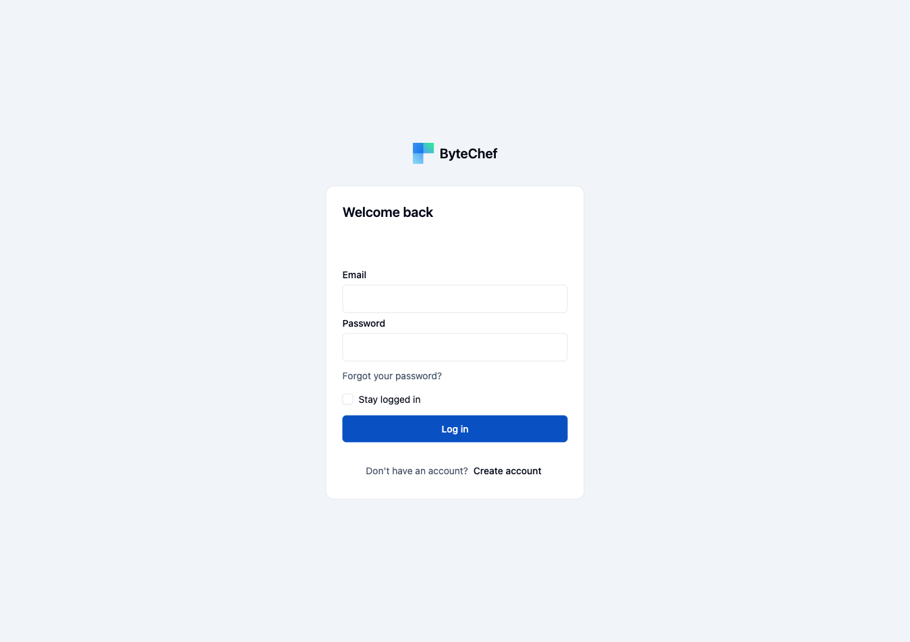

This guide covers running ByteChef locally using Docker. There are two approaches depending on your needs.

## Run ByteChef locally

Two paths, same result. Docker Compose is the fastest; the manual path is for environments where
Compose is unavailable.

<Tabs items={['Docker Compose', 'Docker (manual)']}>
<Tab value="Docker Compose">

The fastest way to run ByteChef locally. This starts both PostgreSQL and ByteChef in a single command.

**Requirement:** [Docker Desktop](https://www.docker.com/products/docker-desktop/)

```bash
curl -O https://raw.githubusercontent.com/bytechefhq/bytechef/master/docker-compose.yml
docker compose -f docker-compose.yml up
```

Once running, open [http://localhost:8080/login](http://localhost:8080/login) and click **Create account** to register the first user and get started.



The Compose file keeps PostgreSQL's data in a named volume, `storage_db`. Everything you build -
workflows, connections, and execution history - lives there, so `docker compose down -v` (note the
`-v`) deletes all of it. Plain `docker compose down` stops the containers and leaves the volume
intact.

The Compose file also sets a fixed encryption key (`BYTECHEF_ENCRYPTION_PROVIDER=property` with
`BYTECHEF_ENCRYPTION_PROPERTY_KEY`) so stored OAuth connection credentials remain decryptable after
you recreate the ByteChef container. Without a stable key, a fresh container cannot read connections
already stored in PostgreSQL.

To point ByteChef at a PostgreSQL server you run yourself instead, override the datasource settings
on the `bytechef` service:

```yaml
services:
  bytechef:
    environment:
      BYTECHEF_DATASOURCE_URL: jdbc:postgresql://your-host:5432/bytechef
      BYTECHEF_DATASOURCE_USERNAME: postgres
      BYTECHEF_DATASOURCE_PASSWORD: your_password
```

</Tab>
<Tab value="Docker (manual)">

If Docker Compose is not available in your environment, start each container manually.

<Steps>
<Step>

**Create the Docker network**

```bash
docker network create -d bridge bytechef_network
```

</Step>
<Step>

**Start the PostgreSQL container**

```bash
docker run --name postgres -d -p 5432:5432 \
    --env POSTGRES_USER=postgres \
    --env POSTGRES_PASSWORD=postgres \
    --hostname postgres \
    --network bytechef_network \
    -v /opt/postgre/data:/var/lib/postgresql/data \
    postgres:15-alpine
```

</Step>
<Step>

**Start the ByteChef container**

```bash
docker run --name bytechef -it -p 8080:8080 \
    --env BYTECHEF_DATASOURCE_URL=jdbc:postgresql://postgres:5432/bytechef \
    --env BYTECHEF_DATASOURCE_USERNAME=postgres \
    --env BYTECHEF_DATASOURCE_PASSWORD=postgres \
    --env BYTECHEF_ENCRYPTION_PROVIDER=property \
    --env BYTECHEF_ENCRYPTION_PROPERTY_KEY=tTB1/UBIbYLuCXVi4PPfzA== \
    --env BYTECHEF_SECURITY_REMEMBER_ME_KEY=e48612ba1fd46fa7089fe9f5085d8d164b53ffb2 \
    --network bytechef_network \
    docker.bytechef.io/bytechef/bytechef:latest
```

> Use the `-d` flag instead of `-it` to run in detached mode.

</Step>
</Steps>

</Tab>
</Tabs>

## Development setup with Docker

This approach is intended for contributors who want to work on the client codebase while running the server in Docker.

The `docker-compose.dev.server.yml` file starts the full development stack including PostgreSQL, pgvector, Redis, Mailpit, and the ByteChef server built from source.

### Prerequisites

- [Docker Desktop](https://www.docker.com/products/docker-desktop/)
- A local clone of the [ByteChef repository](https://github.com/bytechefhq/bytechef)

### Steps

From the project root, run:

```bash
docker compose -f server/docker-compose.dev.server.yml down --rmi local
docker compose -f server/docker-compose.dev.server.yml up -d
```

The first command removes any previously built local images to ensure a clean build. The second command builds and starts all services.

### Services Started

| Service   | Port(s)        | Description                        |
|-----------|----------------|------------------------------------|
| postgres  | 5432           | Main PostgreSQL database           |
| pgvector  | 5433           | PostgreSQL with pgvector extension |
| redis     | 6379           | Redis for message brokering        |
| mailpit   | 1025, 8025     | Local mail server for testing      |
| server-app | 9555          | ByteChef server application        |

The server API is available at [http://localhost:9555](http://localhost:9555) and the Scalar API reference at [http://localhost:9555/scalar](http://localhost:9555/scalar).

### Connecting the Client

Once the server is running, start the client from the `client/` directory:

```bash
npm install
npm run dev
```

The client connects to the backend at `http://127.0.0.1:9555` by default.

## Initial Login Credentials

| Username              | Password |
|-----------------------|----------|
| admin@localhost.com   | admin    |
| user@localhost.com    | user     |

## Troubleshooting

### Port conflicts

The development stack uses ports `5432`, `5433`, `6379`, `1025`, `8025`, and `9555`. If any of these are in use, stop the conflicting service or update the port mapping in `docker-compose.dev.server.yml`.

To check which ports are in use:

```bash
sudo lsof -i -P -n | grep LISTEN
```

### Out of date database schema

If you see `Either revert the changes to the migration, or run repair to update the schema history` on startup, reset the database volumes:

```bash
docker compose -f server/docker-compose.dev.server.yml down -v
```

`-v` removes the database volume, so this discards every workflow, connection, and execution record
in that stack. It is the right move on a development database and the wrong one anywhere else.
