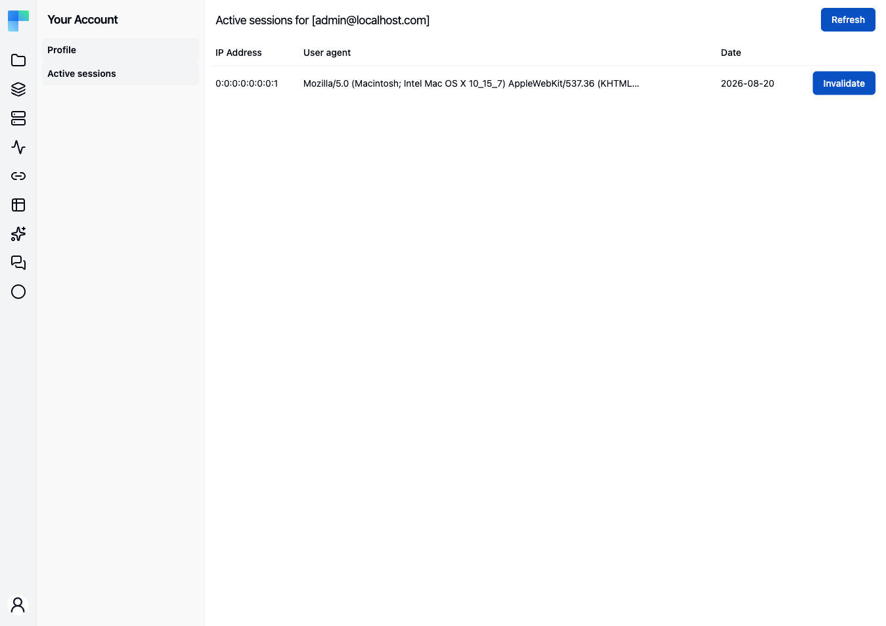

**Your Account → Active sessions** lists the persistent sign-in tokens issued to your account - the
"remember me" credentials that let a browser sign you back in without a password - and lets you
invalidate any of them.

The page is headed **Active sessions for [your login]** and carries a **Refresh** button.

---

## The table

| Column | Description |
|---|---|
| **IP Address** | The address the token was last used from. |
| **User agent** | The browser and platform string that browser sent. |
| **Date** | When the token was issued or last renewed. |

Each row ends with an **Invalidate** button. With nothing to show, the page reads **No active
sessions**.

You only ever see your own tokens. There is no administrator view of another user's sessions.

## Invalidate a session

Click **Invalidate** on the row. A "The session has been invalidated." toast confirms it and the list
reloads; a failure reports "The session could not be invalidated."

<Callout type="warn" title="What invalidating does and does not do">
    Invalidating removes the **remember-me token**, not the live browser session. Someone already
    signed in on that browser stays signed in until they sign out or the session times out - what they
    lose is the automatic sign-in afterwards. This includes the browser you are using right now: you
    can invalidate your own current token and keep working.
</Callout>

Tokens are valid for **31 days** from issue and are renewed as you keep using the browser, so a
browser you have not opened in over a month falls off the list on its own.

If you invalidate a session because you do not recognise it, change your password as well - see
[Profile](/platform/your-account/profile). Invalidating a token does not stop anyone who knows the
password from signing in again.
