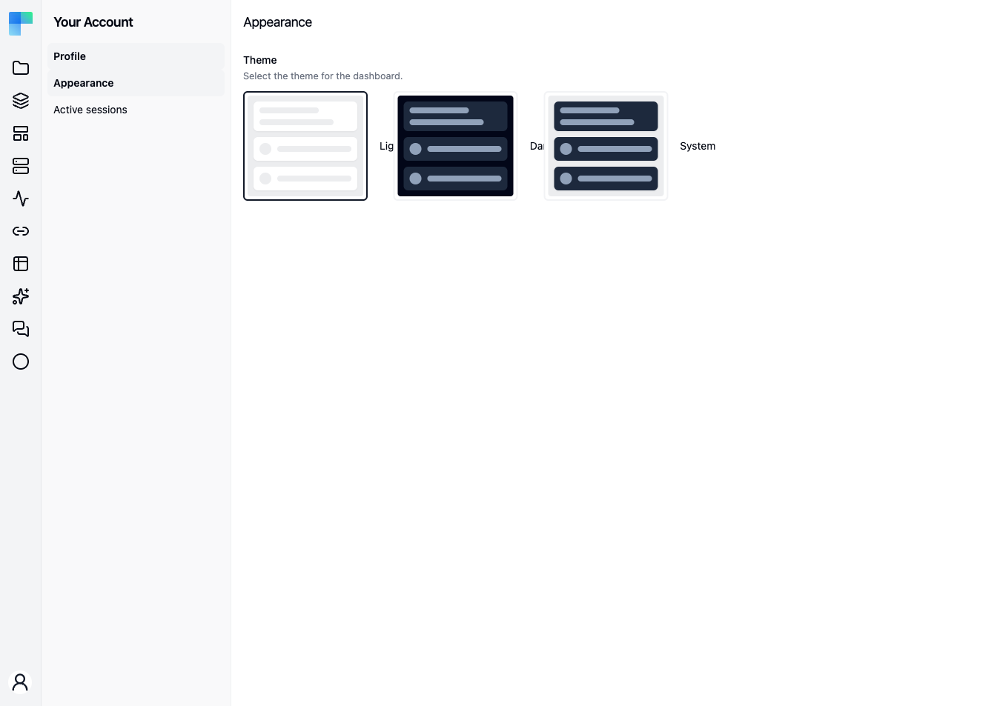

**Your Account → Appearance** carries one setting: the **Theme**, described as "Select the theme for
the dashboard."

---

## The three choices

Three preview cards, each a radio option:

| Choice | Effect |
|---|---|
| **Light** | Always the light palette, whatever the operating system is set to. |
| **Dark** | Always the dark palette. |
| **System** | Follows the operating system's light/dark preference. |

**System** is the default for a fresh browser. Picking a card applies it immediately - there is no
**Save** button.

## Where the choice is stored

The theme is stored in your **browser's local storage**, not on your ByteChef account. Two
consequences worth knowing:

- The choice does not follow you to another browser, another device, or a private window. Set it once
  per browser.
- Clearing site data resets you to **System**.

Under **System**, the operating system's preference is read when the app loads. Changing your OS
between light and dark while a ByteChef tab is already open does not repaint that tab; reload it.
