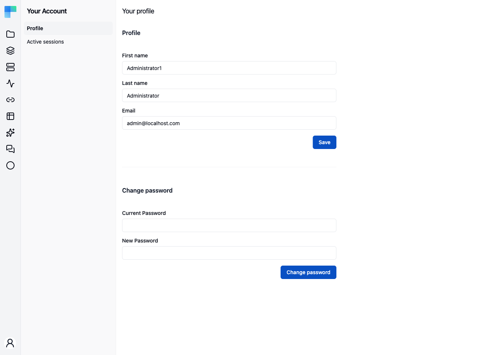

**Your Account → Profile** is where you change the things that belong to you rather than to the
deployment. It is reachable by every signed-in user; nothing on it requires an administrator.

The page is headed **Your profile** and stacks four sections.

---

## Profile

Three fields, all editable:

| Field | Notes |
|---|---|
| **First name** | Required. |
| **Last name** | Required. |
| **Email** | Required, must be a valid address, at most 254 characters. |

Click **Save**; an "Account has been updated." toast confirms it. Changing your email to one another
account already uses is rejected. Your login name is not shown and is not editable here - editing the
email does not change it.

## Change password

Enter your **Current password** and a **New password** and click **Save**. A "Password has been
changed." toast confirms it.

The new password is validated server-side and must be **8 to 100 characters with at least one
uppercase letter and at least one digit**. The form's own check is laxer than that, so a password the
form accepts can still be rejected on save.

There is no "log out other sessions" step attached to a password change - see
[Active Sessions](/platform/your-account/active-sessions) for that.

## Two-Factor Authentication

<Callout type="warn" title="Coming soon">
    Two-factor authentication is on the upcoming release track and is not yet available in the latest
    released version of ByteChef.
</Callout>

Described as "Add an extra layer of security to your account using an authenticator app."

1. Click **Set up 2FA**. The section shows a QR code and the secret in text form, for authenticator
   apps that cannot scan.
2. Scan it, then type the rotating code into the verification field and click **Verify & Enable**.
   **Cancel** abandons the setup.
3. Once enabled, the section reads "Two-factor authentication is enabled." and offers **Disable 2FA**,
   which asks for your password and a current code before turning it off.

## Linked Accounts

<Callout type="warn" title="Coming soon">
    Social login is on the upcoming release track and is not yet available in the latest released
    version of ByteChef.
</Callout>

Described as "Manage external identity providers linked to your account."

With no provider linked, the section offers **Link Google** and **Link GitHub**, each starting that
provider's authorization flow. With one linked, it shows the provider name and the account identifier
it returned, plus an **Unlink** button that confirms first.

**Unlink** is disabled while your account has no password, and the section says so: "Set a password
before unlinking your provider to maintain account access." Set a password in **Change password**
first, or you would be unlinking the only way you can sign in.

This is per-user linking of *your* account. Federating a whole organization's identities is a
different, administrator-level feature - see
[Identity Providers](/platform/settings/identity-providers).
