# ByteChef Feature Mind Map (0_732)

A deep feature map of the `0_732` branch: **263 features** and **1550 subfeatures** across 10 areas, produced by a 12-agent parallel code sweep (client pages/routes, server CE + EE modules, component catalog, GraphQL/REST surfaces, spec archive) with an adversarial completeness pass.

- **MindNode**: import [`feature-mind-map.opml`](./feature-mind-map.opml) (File → Open). The outline below also imports as Markdown.
- Cross-cutting capabilities (MCP, connections, code workflows) intentionally appear under every area that surfaces them.
- `[EE]` marks Enterprise Edition features; unmarked features are CE or CE+EE.

## Overview

```mermaid
mindmap
  root((ByteChef))
    Automation Workspace UI
      Projects List
      Project Detail and Lifecycle
      Visual Workflow Editor Canvas
      Workflow Editor Right Sidebar and Sheets
      Node Properties Panel
      Data Pill Panel
      Workflow Testing and Output Panel
      Cluster Element Editor
      AI Agent Editor
      AI Agent Evals
      Data Stream Editor
      Code Workflow Editor
      Project Deployments
      Workflow Executions View
      Connections Management
      Approval Tasks
      Resume Form Page
      Trigger Form Page
      Data Tables
      Knowledge Bases
      Asset Files
      Context Store
      MCP Servers
      API Collections
      Templates Gallery and Import
      Workspace and Environment Scoping
      Workflow Editor Voice Test Sessions
    AI Hub
      AI Hub Chat Surface
      ASK / BUILD Agent Modes
      Chat Kinds and Routing
      Chats Sidebar, Rail and Home Panel
      Composer
      User Connectors and External MCP Servers
      Chat Tools Autonomous Tool Attachment
      Three-Tier Tool Architecture
      Specialist Subagents AiHubAgentType
      AG-UI Streaming Protocol and Runtime Providers
      Session Memory Redis/JDBC/S3-backed
      Resource Panel and Viewers
      Artifact Generation
      Chat Artifacts and Audit Trail
      Progress Narration
      Workflow Chats
      AI Hub Workspace Settings
      Security and Access Guards
      AI Hub Composer Voice Dictation
    AI Platform and Copilot
      Workflow Editor Copilot Panel
      Copilot Specialist Agents and Subagents
      AI Workflow Description Generation
      AI Property Value Generation Property Copilot
      Agent Skills
      Agent Memories
      AI Providers Settings
      AI LLM Gateway
      AI Observability
      AI Observability Alerting
      AI Data Export and Webhooks
      AI Prompt Management
      AI Evaluation and Scoring
      AI Eval Datasets and Experiments
      AI Gateway Playground
      AI Agent Evals Workflow Agent Testing
      AI Usage Metering
      Speech-to-Text Provider SPI
      Automation MCP Servers Workflows as Tools
      Management MCP Server and Tool Contributor SPI
      MCP Client Component
      Agent Copilot Tool Library
      AI Agent Cluster Elements Chat Memory, Guardrails, RAG
      AI Section Navigation
    Embedded iPaaS
      Integrations Management
      Integration Workflow Editor
      Integration Instance Configurations
      Integration Instances Per-Connected-User
      Connected Users
      Connected User Automations Workflow Projects
      Embedded Workflow Builder White-Label
      App Events
      Embedded MCP Servers
      Embedded AI Copilot and Agent Tools
      Embedded Connections
      Embedded Workflow Executions
      Signing Keys
      Embedded API Keys
      JWT-Based Embedded Auth
      Embedded Public REST API
      Unified API
      Embedded Webhooks
      Code Workflow Loader
      Embedded Frontend SDK React
      Embedded Backend SDKs
      EE Microservice Deployment Support
    Workflow Engine and Runtime
      Atlas Workflow Engine Core
      Job and Task Execution Persistence
      Task Worker
      Workflow Definition and Repositories
      Task Dispatchers Flow Controls
      Trigger Lifecycle and Coordination
      Quartz-based Platform Scheduler
      Inbound Webhook Handling
      Signed File Entry URLs
      Job Execution APIs and Governance
      Workflow Test Execution
      Workflow Validation
      Expression Language and Evaluator
      Message Broker Abstraction
      File Storage Abstraction and Providers
      Data Storage Key-Value Store
      Encryption and Key Management
      Multi-Tenancy
      Error and Exception Model
      GraalVM Polyglot Code Execution
      Core Utility Infrastructure
      EE Distributed Runtime Support
      Job Status Notifications and Event Fan-out
    Connector Catalog
      Component Catalog Overview
      CRM and Sales Connectors
      Marketing and Email Connectors
      Communication and Messaging Connectors
      Project Management and Support Connectors
      Developer Tools Connectors
      AI Service Connectors
      AI Umbrella - LLM Providers
      AI Umbrella - Agent and Agentic AI
      AI Umbrella - Chat Memory Providers
      AI Umbrella - Guardrails
      AI Umbrella - RAG and Vector Stores
      AI Umbrella - Universal AI Actions
      Database and Data Platform Connectors
      File Storage and Cloud Drive Connectors
      E-commerce and Payments Connectors
      Accounting, Finance and PSA Connectors
      HR Connectors
      Productivity, Docs and Scheduling Connectors
      Social, Media and Content Connectors
      Analytics and SEO Connectors
      Web Scraping, Search and Data Enrichment Connectors
      Core HTTP and Code Execution Components
      Core Trigger Components
      Human-in-the-Loop Components
      Data Flow and State Components
      Browser Automation Components
      File Format and Transfer Components
      Helper Component Family
      Trigger Support Across Catalog
      Gaurus Bank Connect Connector
    Platform Services
      Component Definition Registry
      Action / Trigger / Cluster Element Execution
      Component Execution Context
      Component Execution Log Storage
      Connection Management
      OAuth2 Client Support for Connections
      Embedded OAuth2 Authorization Server
      Credential Store Abstraction
      User and Account Management
      API Key Management
      API Security Web Layer
      Tags and Categories
      Notifications
      Mail Service
      GitHub Proxy Client Workflow Templates
      Synchronous Job Execution with Live Streaming
      MCP Server Management Platform Core
      Data Table Storage Engine
      Knowledge Base Engine
      Platform Shared Kernel and API Docs
      Workflow Editor Backend Definitions, Test, Environments
      Projects and Workflow Versioning
      Project Deployments
      Workspaces
      Automation Authorization Model
      Workflow Execution History and Trigger Forms
      Approval Tasks
      Asset Files
      Workspace Data Tables
      Workspace Knowledge Bases
      Global Automation Search
      Automation Connection Glue
      Automation API Documentation
    Enterprise and Microservices
      API Collections API Platform
      Custom Components
      API Connector Builder
      Code Workflows
      Component Policies
      Audit Log
      Context Store
      Workspaces, Custom Roles and Fine-Grained Permissions
      Connection Visibility and Governance
      Project Git Sync
      AI Provider Administration
      Enterprise SSO and Identity Providers
      SCIM 2.0 Provisioning
      Licence Management and Enforcement
      AI Gateway
      AI Observability
      AI Prompt Registry
      AI Evaluation and Agent Evals
      LLM and Tool Usage Metering
      Speech-to-Text Providers
      External Credential Stores
      AWS Cloud Infrastructure Providers
      Multi-Tenancy
      Public API Key Authentication Automation and Embedded
      Microservices Runtime Remote Clients and Discovery
      EE Microservice Applications
      Embedded iPaaS EE Modules owned by another explorer
      AI Hub and AI Copilot Modules owned by another explorer
    Settings, Auth and Administration
      Workspaces Management
      Git Configuration Current Workspace
      Workspace API Keys
      AI Hub Connectors Current Workspace
      Users and Invitations Organization
      Organization Connections
      AI Providers Settings
      Management MCP Server Settings
      Component Policies
      Components Settings Custom Components + API Connectors
      Notifications Settings
      Identity Providers SSO
      Admin API Keys
      License Management
      Audit Events
      OAuth2 Registered Clients
      Account Profile
      Appearance / Theme
      Active Sessions
      Login and MFA Verification
      Registration and Account Activation
      Password Reset Flow
      OAuth2 Consent Page
      Account Error Page
      RBAC Route Authorization
      Feature Flag System
      Environment Selector and Environments Concept
      Global Search Dialog
      Embedded Settings Signing Keys
      Embedded Settings API Keys
      Server Authentication and Security Infrastructure
      First-Run Platform-Type Selection
    Developer Surface and Deployment
      Java Connector SDK
      Connector Scaffolding CLI
      Embedded Frontend SDK
      Automation Chat SDK
      Automation REST API
      Embedded REST API
      Platform REST API
      EE Internal Remote REST
      AI REST APIs
      GraphQL API
      Public Webhook Endpoints
      Signed File-Entry Content URLs
      Public Form and Approval Resume URLs
      MCP Server Endpoints
      OpenAPI Documentation
      Docker Monolith Deployment
      Development Compose Stacks
      Kubernetes Helm Chart
      EE Microservices Deployment
      Observability Endpoints
      CI/CD GitHub Workflows
      Documentation Site
      Design Spec Library
```

## Automation Workspace UI

```mermaid
mindmap
  root((Automation Workspace UI))
    Projects List
      Create project dialog name, description, category, tags
      Filter by category and tag left sidebar nav + filter title
      Import project from exported file file picker + import mu…
      Create project from template entry point
      New Code Workflow dialog feature-flag ff-1039
      Project list item dropdown edit, duplicate, export, delete
      Per-project workflow list with workflow items
      Development-environment guard non-dev environments redire…
    Project Detail and Lifecycle
      Project header breadcrumb, editable project title, workfl…
      Publish popover publish new project version with descript…
      Deploy button jump to deployment creation
      Workflow actions button run/test workflow, stop
      Output button toggle test output panel
      Project version history sheet published versions list
      Settings menu with Project tab duplicate, share, share wi…
      Projects left sidebar project select, workflow list with…
      New/duplicate/import workflow actions
      n8n workflow import converter handleImportN8nWorkflow + u…
      Project share dialog and workflow share dialog share as t…
      Delete project/workflow alert dialogs
    Visual Workflow Editor Canvas
      Auto-layout engine with experimental layout toggle and ho…
      Undo/redo useWorkflowUndoRedo
      Zoom in/out, fit view, clean/tidy layout button
      Lock/unlock node movement
      Sticky notes with color picker StickyNoteNode, useStickyN…
      Node types WorkflowNode, AiAgentNode, PlaceholderNode, Tr…
      Edge types workflow edge, placeholder edge, rounded smoot…
      Node context menu and node dropdown menu delete, duplicat…
      Drag-and-drop component insertion useHandleDrop
      Component/flow-control popover menu on edges and placehol…
      Components filter and search useComponentFiltering, useFi…
      Subflow banner for subflow navigation
      Errors banner for workflow-level errors
      Node actions hint overlay
      Embeddable read-only editor variant EmbeddableWorkflowEdi…
    Workflow Editor Right Sidebar and Sheets
      Components and Flow Controls palette sidebar WorkflowNode…
      Workflow Inputs sheet inputs table, add/edit/delete input…
      Workflow Outputs sheet outputs table, add/edit output dia…
      Workflow Code Editor sheet edit workflow JSON/definition…
      Copilot entry point gated by ai.copilot.enabled + ff-1570
    Node Properties Panel
      Operation/action select CurrentOperationSelect
      Property widgets input, textarea, select, combo box with…
      Property input type switch fixed value vs expression
      TipTap mentions/expression editor data-pill mentions, for…
      fromAi toggle button on properties AI-populated parameters
      Property Copilot button/popover to AI-generate a property…
      JSON schema builder sheet with sample-data-to-schema and…
      Property code editor dialog Monaco editor, language suppo…
      Connection tab pick/create connection for the node, conne…
      Description tab rename node, edit notes/description
      Output tab output schema display, define output via sampl…
      Missing required properties detection and definition fres…
    Data Pill Panel
      Per-node output properties tree with nested pills
      Workflow inputs pills section
      Search/filter across pills
      Pill insertion into the mentions editor with component ic…
    Workflow Testing and Output Panel
      Run workflow with streaming updates useWorkflowTestStream…
      Stop running test
      Test output bottom panel with per-task/trigger execution…
      Workflow test chat panel for chat-trigger workflows useWo…
      Leave-while-running confirmation dialog WorkflowTestRunLe…
    Cluster Element Editor
      Cluster elements canvas with its own nodes/edges labeled…
      Cluster elements workflow editor header
      Root/element node creation utilities
      Per-element property editing via the shared properties pa…
    AI Agent Editor
      Model select field provider/model
      Agent prompt/instructions field
      Tools list add/remove tools, per-tool dropdown menu
      Testing mode with agent testing chat useAiAgentTestingCha…
    AI Agent Evals
      Judges tab judge cards, create judge dialog
      Runs tab eval run list, run progress indicator, run summa…
      Transcript dialog for scenario conversations
    Data Stream Editor
      Source step source component + connection config
      Mapping step with data pills for field mapping
      Destination step
      Test step with test execution
      Step navigation and wizard footer
    Code Workflow Editor
      JavaScript, Python, and Ruby language support CodeWorkflo…
      Language badge in header, save with dirty-state tracking
      Project variant ProjectCodeWorkflowDetail and embedded in…
      New Code Workflow creation dialog from Projects page feat…
    Project Deployments
      Deployment creation dialog basic step project combo box,…
      Enable/disable whole deployment via switch
      Per-workflow enable/disable within a deployment
      Edit deployment workflow dialog inputs + connection mappi…
      Deployment list item dropdown edit, duplicate, update pro…
      Filter by project, tag, environment left sidebar + filter…
      Workflow list item dropdown with static webhook/page URL…
      Environment select in header
    Workflow Executions View
      Filters job status Started/Completed/Created/Stopped/Fail…
      Executions table with status badges
      Execution detail sheet trigger + task execution accordion…
      Read-only workflow panel rendering the executed workflow…
      Subflow execution breadcrumb navigation
      Environment scoping
    Connections Management
      Connection create/edit dialog component selection, author…
      OAuth2 flows authorization code, authorization code + PKC…
      Connection list with component icons, tags, active status
      Filter by component and tag
      Connection parameters view for existing connections
      Connection reassignment dialog reassign owner
      EE visibility scope PRIVATE/WORKSPACE scope badge, promot…
      Environment scoping
    Approval Tasks
      Task cards list with status and priority indicators, over…
      Filters status, priority, assignee with active-filter bad…
      Search and sort menu
      Task detail assignee select, due date picker, status/prio…
      Comments thread on a task
      Create approval task dialog
      Approval form rendering shared/components/approval-form
    Resume Form Page
      Form rendering from server-provided definition
      Submit resumes the suspended workflow execution
    Trigger Form Page
      Dynamic form fields from trigger UI definition renderForm…
      Environment-aware submission defaults to production
      Loading/submitted/error states
    Data Tables
      Create, rename, duplicate, delete data table dialogs
      Tag-based filtering and left sidebar nav on the list page
      Grid with typed cell renderers/editors string, number, bo…
      Add/rename/delete column dialogs
      Row selection with bulk delete rows dialog
      CSV import dialog
      Infinite scroll / bottom loader
      Copilot entry point on the table detail page BUILD-mode d…
      Embeddable variant EmbeddableDataTable
    Knowledge Bases
      Create knowledge base dialog embedding config, edit dialo…
      Tag filtering and left sidebar nav
      Document upload dialog with processing-status polling STA…
      Document list with per-document dropdown delete, tags
      Chunk list per document view, edit chunk dialog, delete c…
      Semantic search tab query + metadata filters, result list
      Ask Copilot entry point with post-turn data refresh
      Embeddable variant EmbeddableKnowledgeBase
    Asset Files
      Drag-and-drop upload zone + upload button with progress
      File list with tag filtering left sidebar
      File detail sheet rename, tags, metadata with deep-link r…
      Delete file with confirm dialog
      Environment scoping with environment select
    Context Store
      Context store list with tags, filter sidebar, create/edit…
      Store detail page listing sources
      Add context source dialog two-stage picker source-capable…
      Source detail dialog and per-source row actions sync, del…
      Sync source status badge and tombstone strategy select sh…
      Ask Copilot entry point with post-turn refresh
      Admin-gated management actions
    MCP Servers
      Create/edit MCP server dialog
      Server list with per-server dropdown edit, enable, delete…
      Add component dialog two-step component selection, then t…
      Component list per server with per-tool properties popove…
      MCP project workflow list attach project workflows as too…
      McpProjectWorkflowDialog for editing workflows-as-tools m…
      Filter by component, project, tag environment select
      Per-server secret-key MCP URL surface
    API Collections
      API collection create/edit dialog project, version, conte…
      Collection list with per-collection dropdown menu
      Endpoint list per collection showing HTTP method and /vve…
      Filter by project, tag, API keys ApiPlatformLeftSidebarNav
      Companion API Clients page for API key management same ap…
    Templates Gallery and Import
      Project templates gallery and workflow templates gallery…
      Template cards with component icons
      Project template detail/import page route /automation/pro…
      Workflow template detail/import with target project combo…
      Shared-template import routes /import/shared/projects/id,…
      Share with Community submission link from project/workflo…
      Connected-components requirement display ComponentRow
    Workspace and Environment Scoping
      Environment select in page headers development/staging/pr…
      Projects page restricted to development environment other…
      Workspace-scoped queries on projects, deployments, tables…
    Workflow Editor Voice Test Sessions
      Voice mode start/stop button in WorkflowTestChatPanel wit…
      Voice-only workflow detection via the browser components…
      VoiceModeLayout full-panel voice UI assistant-ui Realtime…
      Webhook voice adapter createWebhookVoiceAdapter / ByteChe…
      Inline voice-in-chat path via useWorkflowTestVoiceSession…
      BrowserVoiceSession getUserMedia capture, AudioWorklet PC…
      One-shot voice session token endpoint /api/platform/inter…
      Production browser voice-session token endpoint for deplo…
      Reused by AI Hub voice useAiHubVoiceSession and by the ex…
```

### Outline

- **Projects List** — Workspace-scoped project list page (client/src/pages/automation/projects/Projects.tsx) with category/tag left-sidebar filtering, project cards with workflow sub-lists, and a New Project split-button (blank project, from template, import, new code workflow).
    - Create project dialog (name, description, category, tags)
    - Filter by category and tag (left sidebar nav + filter title)
    - Import project from exported file (file picker + import mutation)
    - Create project from template entry point
    - New Code Workflow dialog (feature-flag ff-1039)
    - Project list item dropdown (edit, duplicate, export, delete)
    - Per-project workflow list with workflow items
    - Development-environment guard: non-dev environments redirect to /automation/deployments
    - *Route: /automation/projects*
    - *Git-configuration badge data pulled from EE projectGit queries when available*
- **Project Detail & Lifecycle** — Project workspace page (pages/automation/project/Project.tsx) hosting the workflow editor plus a header with publish, deploy, run/test, settings, and version history controls, and a collapsible projects/workflows left sidebar.
    - Project header (breadcrumb, editable project title, workflow select)
    - Publish popover (publish new project version with description)
    - Deploy button (jump to deployment creation)
    - Workflow actions button (run/test workflow, stop)
    - Output button (toggle test output panel)
    - Project version history sheet (published versions list)
    - Settings menu with Project tab (duplicate, share, share with community, export, pull from Git, Git configuration, project history, delete) and Workflow tab (duplicate, share, share with community, export, delete)
    - Projects left sidebar (project select, workflow list with search/filter, components icons per workflow)
    - New/duplicate/import workflow actions
    - n8n workflow import converter (handleImportN8nWorkflow + useConverterN8nToWorkflow)
    - Project share dialog and workflow share dialog (share as template)
    - Delete project/workflow alert dialogs
    - *Git configuration dialog + pull-from-git are EE (ee/shared projectGit mutations)*
    - *Workflow export downloads via /api/automation/internal/workflows/{id}/export*
    - *Code-workflow projects render ProjectCodeWorkflowDetail instead of the canvas*
- **Visual Workflow Editor Canvas** — React Flow based workflow canvas (client/src/pages/platform/workflow-editor) with auto-layout, node palette, drag-drop, placeholder/ghost nodes for task dispatchers, and undo/redo.
    - Auto-layout engine with experimental layout toggle and horizontal/vertical layout direction persisted per workflow
    - Undo/redo (useWorkflowUndoRedo)
    - Zoom in/out, fit view, clean/tidy layout button
    - Lock/unlock node movement
    - Sticky notes with color picker (StickyNoteNode, useStickyNoteColorsStore)
    - Node types: WorkflowNode, AiAgentNode, PlaceholderNode, TriggerPlaceholderNode, ReadOnly nodes, task-dispatcher ghost nodes (top/left/bottom)
    - Edge types: workflow edge, placeholder edge, rounded smooth-step, labeled branch-case edge with case labels
    - Node context menu and node dropdown menu (delete, duplicate, etc.)
    - Drag-and-drop component insertion (useHandleDrop)
    - Component/flow-control popover menu on edges and placeholders with operation list
    - Components filter and search (useComponentFiltering, useFilteredComponentDefinitions)
    - Subflow banner for subflow navigation
    - Errors banner for workflow-level errors
    - Node actions hint overlay
    - Embeddable read-only editor variant (EmbeddableWorkflowEditor, ReadOnlyWorkflowSheet)
- **Workflow Editor Right Sidebar & Sheets** — Right-rail navigation (WorkflowRightSidebar.tsx) opening the component palette, workflow inputs/outputs sheets, workflow code editor, and Copilot panel.
    - Components & Flow Controls palette sidebar (WorkflowNodesSidebar with tabs)
    - Workflow Inputs sheet: inputs table, add/edit/delete input dialogs, test-value entry per input, component-backed input derivation
    - Workflow Outputs sheet: outputs table, add/edit output dialog, output value display
    - Workflow Code Editor sheet: edit workflow JSON/definition directly
    - Copilot entry point (gated by ai.copilot.enabled + ff-1570)
- **Node Properties Panel** — Workflow node details panel (WorkflowNodeDetailsPanel.tsx) with tabs for properties, connection, description, and output, driving all per-node configuration.
    - Operation/action select (CurrentOperationSelect)
    - Property widgets: input, textarea, select, combo box (with dynamic option lookup), multi-select, array/object editors with add/remove sub-properties, date pickers, dynamic properties
    - Property input type switch (fixed value vs expression)
    - TipTap mentions/expression editor: data-pill mentions, formula mode, function suggestion list with signatures, evaluator function definitions, fromAi() function support
    - fromAi toggle button on properties (AI-populated parameters)
    - Property Copilot button/popover to AI-generate a property value
    - JSON schema builder sheet with sample-data-to-schema and Copilot assist
    - Property code editor dialog: Monaco editor, language support, right panel with input data, connection selection, and test-execution output
    - Connection tab: pick/create connection for the node, connection fieldset, connection note
    - Description tab: rename node, edit notes/description
    - Output tab: output schema display, define output via sample data dialog or schema controls, sample-output Copilot, cluster element test button with test-properties popover
    - Missing required properties detection and definition freshness checks
- **Data Pill Panel** — Expression-building side panel (components/datapills/DataPillPanel.tsx) listing upstream node outputs and workflow inputs as draggable/clickable data pills for insertion into property expressions.
    - Per-node output properties tree with nested pills
    - Workflow inputs pills section
    - Search/filter across pills
    - Pill insertion into the mentions editor with component icons
- **Workflow Testing & Output Panel** — Run/test workflows from the editor header with a streaming test execution and a bottom output panel (WorkflowExecutionsTestOutput.tsx) showing per-task results.
    - Run workflow with streaming updates (useWorkflowTestStream, attach/resume to running test)
    - Stop running test
    - Test output bottom panel with per-task/trigger execution accordion, input/output/logs tabs
    - Workflow test chat panel for chat-trigger workflows (useWorkflowTestChatStore)
    - Leave-while-running confirmation dialog (WorkflowTestRunLeaveDialog)
- **Cluster Element Editor** — Secondary canvas (pages/platform/cluster-element-editor) for editing a component's cluster elements (e.g. AI agent internals) as a nested node graph, opened from the workflow editor (ClusterElementsCanvasDialog).
    - Cluster elements canvas with its own nodes/edges (labeled cluster-element edges)
    - Cluster elements workflow editor header
    - Root/element node creation utilities
    - Per-element property editing via the shared properties panel (ClusterElementContext)
- **AI Agent Editor** — Dedicated editor surface (cluster-element-editor/ai-agent-editor) for AI agent nodes: configuration panel with model selection, prompt field, and tool management, plus an agent testing chat.
    - Model select field (provider/model)
    - Agent prompt/instructions field
    - Tools list: add/remove tools, per-tool dropdown menu
    - Testing mode with agent testing chat (useAiAgentTestingChatStore, useTestingModeStore)
- **AI Agent Evals** — Evaluation harness UI for AI agents (cluster-element-editor/ai-agent-evals) with LLM judges and eval runs producing per-scenario verdicts.
    - Judges tab: judge cards, create judge dialog
    - Runs tab: eval run list, run progress indicator, run summary cards, scenario results table, judge verdict list, run detail
    - Transcript dialog for scenario conversations
- **Data Stream Editor** — Wizard-style editor (cluster-element-editor/data-stream-editor) for data-stream components: configure source, field mapping, destination, and test steps.
    - Source step (source component + connection config)
    - Mapping step with data pills for field mapping
    - Destination step
    - Test step with test execution
    - Step navigation and wizard footer
- **Code Workflow Editor** — Monaco-based source editor (pages/platform/code-workflow) for code-defined workflows attached to a project or integration, with save via GraphQL codeWorkflowSource queries/mutations.
    - JavaScript, Python, and Ruby language support (CodeWorkflowLanguage enum)
    - Language badge in header, save with dirty-state tracking
    - Project variant (ProjectCodeWorkflowDetail) and embedded integration variant (IntegrationCodeWorkflowDetail)
    - New Code Workflow creation dialog from Projects page (feature-flagged ff-1039)
- **Project Deployments** — Deployments page (pages/automation/project-deployments) listing deployed project versions per environment with enable/disable switches and per-workflow management.
    - Deployment creation dialog: basic step (project combo box, project version select, environment, name/description, tags) and workflows step (enable workflows, configure inputs and per-workflow connections)
    - Enable/disable whole deployment via switch
    - Per-workflow enable/disable within a deployment
    - Edit deployment workflow dialog (inputs + connection mapping)
    - Deployment list item dropdown (edit, duplicate, update project version, delete) with confirm alert dialog
    - Filter by project, tag, environment (left sidebar + filter title)
    - Workflow list item dropdown with static webhook/page URL helpers (pageUrl-utils)
    - Environment select in header
- **Workflow Executions View** — Executions history page (pages/automation/workflow-executions) with a filterable, paginated table and a detail sheet showing the full execution tree with per-task input/output.
    - Filters: job status (Started/Completed/Created/Stopped/Failed), start/end date pickers, project, project deployment, workflow, page number
    - Executions table with status badges
    - Execution detail sheet: trigger + task execution accordion, per-task input/output/logs tabs, clipboard copy of payloads
    - Read-only workflow panel rendering the executed workflow graph in the sheet
    - Subflow execution breadcrumb navigation
    - Environment scoping
- **Connections Management** — Connections page (pages/automation/connections) for creating and managing component connections, including OAuth2 flows and EE visibility scopes.
    - Connection create/edit dialog: component selection, authorization type select, connection parameters form, scopes display, redirect URI display, credential store labels
    - OAuth2 flows: authorization code, authorization code + PKCE, implicit (useOAuth2 popup flow)
    - Connection list with component icons, tags, active status
    - Filter by component and tag
    - Connection parameters view for existing connections
    - Connection reassignment dialog (reassign owner)
    - EE visibility scope: PRIVATE/WORKSPACE scope badge, promote-to-workspace / demote-to-private menu items, bulk promote all private connections with per-item failure/skip toast reporting
    - Environment scoping
    - *Visibility features gated by useVisibilityFeatureEnabled (EE only); CE forces PRIVATE server-side*
    - *Creator can demote a workspace connection (orphan-recovery) even without admin role*
- **Approval Tasks** — Human-in-the-loop task inbox (pages/automation/approval-tasks) where workflow approval tasks are listed, filtered, assigned, and completed.
    - Task cards list with status and priority indicators, overdue highlighting
    - Filters: status, priority, assignee with active-filter badges
    - Search and sort menu
    - Task detail: assignee select, due date picker, status/priority editing
    - Comments thread on a task
    - Create approval task dialog
    - Approval form rendering (shared/components/approval-form)
- **Resume Form Page** — Public standalone page (pages/automation/resume-form/ResumeForm.tsx, route /resume/:id) rendering a form to resume a paused/awaiting workflow job.
    - Form rendering from server-provided definition
    - Submit resumes the suspended workflow execution
- **Trigger Form Page** — Public standalone page (pages/automation/trigger-form, routes /form/:workflowExecutionId and /form/:environmentId/:workflowExecutionId) rendering a form-trigger's UI definition and submitting it to start a workflow.
    - Dynamic form fields from trigger UI definition (renderFormField)
    - Environment-aware submission (defaults to production)
    - Loading/submitted/error states
- **Data Tables** — Data table list page (pages/automation/datatables) plus a spreadsheet-like detail grid (pages/automation/datatable) built on react-data-grid with typed columns and inline cell editing.
    - Create, rename, duplicate, delete data table dialogs
    - Tag-based filtering and left sidebar nav on the list page
    - Grid with typed cell renderers/editors: string, number, boolean, date, datetime
    - Add/rename/delete column dialogs
    - Row selection with bulk delete rows dialog
    - CSV import dialog
    - Infinite scroll / bottom loader
    - Copilot entry point on the table detail page (BUILD-mode data_table source with post-turn refresh)
    - Embeddable variant (EmbeddableDataTable)
- **Knowledge Bases** — Knowledge base list (pages/automation/knowledge-bases) and detail page (pages/automation/knowledge-base) managing documents, chunks, and semantic search over embedded content.
    - Create knowledge base dialog (embedding config), edit dialog, delete alert dialog
    - Tag filtering and left sidebar nav
    - Document upload dialog with processing-status polling (STATUS_PROCESSING lifecycle)
    - Document list with per-document dropdown (delete, tags)
    - Chunk list per document: view, edit chunk dialog, delete chunk, multi-select selection bar with bulk delete
    - Semantic search tab: query + metadata filters, result list
    - Ask Copilot entry point with post-turn data refresh
    - Embeddable variant (EmbeddableKnowledgeBase)
- **Asset Files** — Workspace file storage page (pages/automation/asset-files, route /automation/asset-files) for uploading and managing files with tags and a detail sheet.
    - Drag-and-drop upload zone + upload button with progress
    - File list with tag filtering left sidebar
    - File detail sheet (rename, tags, metadata) with deep-link route /asset-files/:fileId
    - Delete file with confirm dialog
    - Environment scoping with environment select
    - *A workspace-files store (useWorkspaceFilesStore) exists but is currently unused elsewhere*
- **Context Store** [EE] — EE pages (pages/automation/context-store, routes /automation/context-stores[/:id] behind EEVersion) managing context stores and their synced sources for AI context retrieval.
    - Context store list with tags, filter sidebar, create/edit form dialog, row actions menu
    - Store detail page listing sources
    - Add context source dialog: two-stage picker (source-capable component, then connection), indexed fields editor, sync cadence picker (cron presets like @daily)
    - Source detail dialog and per-source row actions (sync, delete)
    - Sync source status badge and tombstone strategy select (shared components)
    - Ask Copilot entry point with post-turn refresh
    - Admin-gated management actions
- **MCP Servers** — MCP servers page (pages/automation/mcp-servers) for exposing components and project workflows as MCP tools to external AI clients.
    - Create/edit MCP server dialog
    - Server list with per-server dropdown (edit, enable, delete) and tools content view
    - Add component dialog: two-step (component selection, then tool/action selection)
    - Component list per server with per-tool properties popover and tool dropdown
    - MCP project workflow list: attach project workflows as tools, workflow properties popover showing tool mapping
    - McpProjectWorkflowDialog for editing workflows-as-tools mapping (toolName/toolDescription/per-input fromAi values on McpProjectWorkflow.parameters)
    - Filter by component, project, tag; environment select
    - Per-server secret-key MCP URL surface
    - *Workflows are MCP-exposable only with a workflow/newWorkflowCall trigger; tool mapping lives on McpProjectWorkflow.parameters, not the workflow definition*
- **API Collections** [EE] — EE API Platform page (client/src/ee/pages/automation/api-platform/api-collections, route /automation/api-platform/api-collections behind EEVersion) publishing project workflows as versioned REST API endpoints.
    - API collection create/edit dialog (project, version, context path)
    - Collection list with per-collection dropdown menu
    - Endpoint list per collection showing HTTP method and /v{version}/{contextPath}/{path} URL
    - Filter by project, tag, API keys (ApiPlatformLeftSidebarNav)
    - Companion API Clients page for API key management (same api-platform section)
- **Templates Gallery & Import** — Template browsing (pages/automation/templates) and import pages (pages/automation/template) covering pre-built and community-shared project/workflow templates.
    - Project templates gallery and workflow templates gallery with search bar and category filters (templateCategories constants)
    - Template cards with component icons
    - Project template detail/import page (route /automation/projects/templates/:id and /import/template/projects/:id)
    - Workflow template detail/import with target project combo box and workflow preview SVG
    - Shared-template import routes (/import/shared/projects/:id, /import/shared/workflows/:id)
    - Share with Community submission link from project/workflow settings menus
    - Connected-components requirement display (ComponentRow)
- **Workspace & Environment Scoping** — Cross-cutting UI scoping: current workspace store (pages/automation/stores/useWorkspaceStore) and environment select/badge (shared/components/EnvironmentSelect, EnvironmentBadge) gate what every automation page lists.
    - Environment select in page headers (development/staging/production)
    - Projects page restricted to development environment (others redirect to deployments)
    - Workspace-scoped queries on projects, deployments, tables, knowledge bases, MCP servers, files
    - *Multiple named workspaces management itself is an EE settings page; the store/scoping plumbing is shared*
- **Workflow Editor Voice Test Sessions** — The workflow editor's test chat panel supports realtime voice conversations against a running workflow: browser mic audio is streamed as PCM-16 over a WebSocket to the server, and assistant audio/transcripts stream back. Workflows whose trigger is browser/v1/voiceSession are detected as 'voice-only' and render a dedicated VoiceModeLayout instead of the text chat thread.
    - Voice mode start/stop button in WorkflowTestChatPanel with browser-capability gating (checkVoiceSupport)
    - Voice-only workflow detection via the browser component's browser/v1/voiceSession trigger
    - VoiceModeLayout full-panel voice UI (assistant-ui RealtimeVoiceAdapter) with a 150-second session limit in test mode
    - Webhook voice adapter (createWebhookVoiceAdapter / ByteChefRealtimeVoiceAdapter) for voice-only workflows
    - Inline voice-in-chat path via useWorkflowTestVoiceSession splicing transcripts and assistant text into the SSE chat Thread
    - BrowserVoiceSession: getUserMedia capture, AudioWorklet PCM-16 downsampling, WS binary streaming, PCM16 playback, speaking/volume events
    - One-shot voice session token endpoint /api/platform/internal/workflow-tests/{workflowId}/voice-session-token plus WS endpoint .../wss (WorkflowTestVoiceSessionTokenController/Service)
    - Production browser voice-session token endpoint for deployed workflows (BrowserVoiceSessionTokenController in platform-websocket-webhook-rest)
    - Reused by AI Hub voice (useAiHubVoiceSession) and by the external chat widget SDK (intentional sibling copy in sdks/frontend/automation/chat)
    - *Server side lives in CE modules: components/browser (BrowserVoiceSessionTrigger) and platform-webhook/platform-websocket-webhook-rest (WebhookWebSocketHandler)*
    - *Client: client/src/pages/platform/workflow-editor/components/workflow-test-chat/WorkflowTestChatPanel.tsx, client/src/shared/lib/voice/, client/src/shared/lib/browser-voice/, client/src/shared/hooks/useWorkflowTestVoiceSession.ts*
    - *Voice support requires AudioContext, AudioWorklet, getUserMedia (HTTPS/localhost), and WebSocket; unsupported browsers get a human-readable disabled-button reason*

## AI Hub

```mermaid
mindmap
  root((AI Hub))
    AI Hub Chat Surface
      Chat thread with markdown message rendering AiHubThread,…
      Tool-call rendering in the transcript AiHubToolCallRender…
      Per-task LLM model picker with last-used-model persistenc…
      Environment selector in panel header
      Task title auto-generation TitleGenerationService, genera…
      Message truncation / rewind truncateAiHubChatMessages, us…
      Run cancellation cancelAiHubRun mutation, idempotent with…
      Error boundary wrapping the surface AiHubErrorBoundary
      Retry banner for failed turns AiHubRetryBanner
      Store reset on workspace change useResetAiHubStoresOnWork…
    ASK / BUILD Agent Modes
      Separate Spring AI agents aiHubAskSpringAIAgent / aiHubBu…
      Separate routing agents aiHubAskRoutingAgent / aiHubBuild…
      ASK forbids tool attachment and asset creation prompt tel…
      Per-mode searchable tool catalogs aiHubAskGlobalToolCatal…
      Converter specialist is BUILD-only
    Chat Kinds and Routing
      STANDARD chats — client-supplied random threadId, AG-UI runt…
      WORKFLOW_CHAT chats — UUID threadId, carry workflow_execu…
      Always-new-chat semantics each workflow/agent pick…
      Enum ordinal stability pinned by EnumOrdinalStabilityTest…
    Chats Sidebar, Rail and Home Panel
      Chats sidebar with chat list and switching AiHubChatsSide…
      Collapse button + collapsed rail AiHubChatsSidebarCollaps…
      Home panel AI-provider setup nudge links to /automation/s…
      Live workflow-chat label updates useLiveWorkflowLabel
      Chat deletion deleteAiHubChat, workflow-chat badge in pan…
      Chat status filtering AiHubChatStatus, default ACTIVE
      GraphQL aiHubChats, aiHubChatMessages, createAiHubChat, c…
    Composer
      File attachments with upload hook useAiHubAttachmentUploa…
      Drag-and-drop attachment zone AiHubComposerDropZone
      Connectors menu for enabling per-user connectors on the c…
      Skills menu AiHubSkillsMenu backed by server AiHubSkillsT…
      Resource picker menu for referencing files/workflows/data…
      Referenced resources recorded as chat artifacts recordRef…
    User Connectors and External MCP Servers
      Add-connector dialog AiHubAddConnectorDialog and connecti…
      Per-connector tool enable/disable and tool parameter pres…
      External MCP server registration dialog AiHubAddMcpServer…
      Per-server and per-tool enable toggles setAiHubMcpServerE…
      GraphQL aiHubUserConnectors, aiHubMcpServers, aiHubMcpSer…
    Chat Tools Autonomous Tool Attachment
      Attached tool chips in UI tools/ChatToolChips
      Tool config dialogs ChatToolDialog, ToolConfigDialog and…
      State-visibility read tools so the LLM avoids duplicate a…
      Property option lookup/select tools LookupComponentProper…
      Connection pickers CreateConnectionToolCallback, SelectCo…
      GraphQL bindings surface aiHubChatTools, updateAiHubChatT…
      Metrics bytechef_ai_hub_tool_attach_discovery / _state_vi…
    Three-Tier Tool Architecture
      ASK pinned tools research delegate, openResourceTab, open…
      BUILD pinned tools all subagent delegates Copilot + AI-hu…
      Searchable catalog ASK read project/workflow/component/ta…
      Searchable catalog BUILD project/workflow/component/task/…
      pgvector-backed tool index AiHubPgVectorConfiguration, Mu…
      Catalog tools security-context-rehydration-wrapped ToolSe…
      LazyToolCallingManager + AiHubChatBindingToolCallbackReso…
      openResourceTab is the consolidated type-keyed open-tab t…
    Specialist Subagents AiHubAgentType
      research ResearchConfiguration/ResearchToolCallback — pin…
      data_analyst DataAnalystConfiguration queryDataTable
      image_generator ImageGeneratorConfiguration, GenerateImag…
      slide_builder SlideBuilderConfiguration, CreateSlideDeckT…
      Subagents via SubAgentToolCallback mcp_agent,…
      Copilot specialist delegates registerCopilotSubAgentToolC…
      Subagents also contributed to the management MCP server…
      Delegates forward parent ToolContext wrapped in ProgressR…
    AG-UI Streaming Protocol and Runtime Providers
      SSE chat endpoint POST /internal/ai/chat/ai_hub with serv…
      Client AiHubRuntimeProvider dispatches tool-call results…
      workflowStreamHandler for webhook SSE streams
      In-flight run reattach GET .../threadId/attach and in-fli…
      Run-state store + cleanup useAiHubRunStateStore, AiHubRun…
      NonEmptyMessagesAdvisor / NonEmptyToolCallback guard agai…
      Model usage logging advisor AiHubModelUsageLoggingAdvisor…
    Session Memory Redis/JDBC/S3-backed
      Per-thread conversation transcript persistence SPRING_AI_…
      In-loop advisor ordering so the transcript isnt written t…
      Auto-memory tools agent-managed persistent memory files o…
      Distributed caches on Caffeine/Redis dual backend Webhook…
    Resource Panel and Viewers
      Chart pane AiHubChartPane
      Data table viewer AiHubDataTableViewer
      File viewer + file picker + file content hook AiHubFileVi…
      Knowledge base viewer AiHubKnowledgeBaseViewer
      Workflow viewer AiHubWorkflowViewer with live tab label W…
      Workflow execution viewer AiHubWorkflowExecutionViewer
      Interactive HTML pane for generated HTML artifacts AiHubH…
      Panel open/close toggle in header rightPanelOpen
    Artifact Generation
      Generators Chart, Code, CSV, DOCX, HTML with HtmlArtifact…
      Asset-file tools createBinaryAssetFile, getAssetFileContent,…
      Asset files attributed to the producing surface via the a…
    Chat Artifacts and Audit Trail
      Artifact recorders AiHubChatArtifactRecorderImpl, Workflo…
      Per-chat artifact listing aiHubChatArtifactsByAiHubChat
      Admin-only paginated workspace-wide artifact audit query…
      User reference artifacts FILE/WORKFLOW/DATA_TABLE/KB _REF…
      Audit aspect @AuditAiHub, AiHubAuditAspect, AiHubAuditPub…
      Chat asset-file relationships AiHubChatAssetFile / AiHubT…
    Progress Narration
      Per-subagent progress lines in the transcript SubagentPro…
      Not applied on the MCP surface no AG-UI stream
    Workflow Chats
      Chat-workflow discovery listChatWorkflows tool, useWorksp…
      runChatWorkflow pinned tool with client-coupled SSE/await…
      awaitingInput/resume flow WebhookResumeRegistry maps thre…
      Turn cancellation cancelWorkflowChatTurn, WorkflowChatJob…
      Rate limiting / concurrency guard WorkflowChatGuard — out…
      Attachment promotion into workflow inputs attachment_fail…
      Always-new chat creation per workflow pick manual title…
      Bulk archive of workflow-chat chats
      Metrics bytechef_workflow_chat_turnoutcome syncstreamingr…
    AI Hub Workspace Settings
      aiHubWorkspaceSettings query
      Voice webhook URL configuration Path A workflow-routed vo…
    Security and Access Guards
      Thread-to-user resolution for memory access threadUserIdR…
      AiHubMcpServerUrlGuard validating user-supplied MCP serve…
    AI Hub Composer Voice Dictation
      Start voice input mic button ComposerPrimitive.Dictate
      Stop dictation button with pulsing recording indicator Co…
      Capability gating via thread.capabilities.dictation from…
```

### Outline

- **AI Hub Chat Surface** [EE] — Full-page agent chat at /automation/ai-hub (client/src/pages/automation/ai-hub/AiHub.tsx, AiHubPanel.tsx) backed by the EE ai-hub modules in server/ee/libs/ai/ai-hub (ai-hub-api/-service/-graphql/-rest). Users converse with an LLM agent that can inspect and mutate workspace resources.
    - Chat thread with markdown message rendering (AiHubThread, AiHubMessage, AiHubMessageContent)
    - Tool-call rendering in the transcript (AiHubToolCallRenderer)
    - Per-chat LLM model picker with last-used-model persistence (ModelPicker in AiHubPanel; task override > chat override > workspace default)
    - Environment selector in panel header
    - Chat title auto-generation (TitleGenerationService, generateAiHubChatTitle mutation, kicked off around message-count >= 6; placeholder title until then)
    - Message truncation / rewind (truncateAiHubChatMessages, useTruncateChatMessages)
    - Run cancellation (cancelAiHubRun mutation, idempotent with runId disambiguation)
    - Error boundary wrapping the surface (AiHubErrorBoundary)
    - Retry banner for failed turns (AiHubRetryBanner)
    - Store reset on workspace change (useResetAiHubStoresOnWorkspaceChange)
    - *REST surface AiHubApiController: POST /internal/ai/chat/ai_hub (SSE turn), GET /ai/chat/ai_hub/{threadId}/attach (reconnect to an in-flight run), GET /ai/chat/ai_hub/in-flight (list running turns)*
    - *InFlightAiHubRunRegistry + client inFlightRunClient/useAiHubRunStateStore let a reloaded client re-attach to a still-running turn*
    - *stripLeakedToolMarkup sanitizes model output that leaks tool markup into text*
- **ASK / BUILD Agent Modes** [EE] — Two agent modes selected client-side (useAiHubStore MODE.ASK/MODE.BUILD, default BUILD) and dispatched server-side via the append-only Mode enum crossing the wire in state.mode. ASK is read-only answer-building; BUILD is state-mutating construction with a much larger tool set.
    - Separate Spring AI agents aiHubAskSpringAIAgent / aiHubBuildSpringAIAgent with distinct prompts (prompt_ai_hub_ask.txt / prompt_ai_hub_build.txt)
    - Separate routing agents (aiHubAskRoutingAgent / aiHubBuildRoutingAgent named ai_hub_ask / ai_hub_build)
    - ASK forbids tool attachment and asset creation (prompt tells model to suggest switching to BUILD)
    - Per-mode searchable tool catalogs (aiHubAskGlobalToolCatalog / aiHubBuildGlobalToolCatalog)
    - Converter specialist is BUILD-only
- **Chat Kinds and Routing** [EE] — AiHubChatKind (INT-ordinal enum in ai-hub-api/chat) discriminates ai_hub_chat rows: STANDARD (LLM agent via AG-UI runAgent), WORKFLOW_CHAT (bound to a workflow execution, routed through WebhookBridgeAgent webhook endpoints instead of the LLM), AGENT_CHAT (an AI Agent's generated workflow, bridged the same way). AiHubRoutingAgent looks up the chat by threadId and dispatches.
    - STANDARD chats — client-supplied random threadId, AG-UI runtime
    - WORKFLOW_CHAT chats — UUID threadId, carry workflow_execution_id + project_deployment_id for sidebar grouping
    - Always-new-chat semantics: each workflow/agent pick creates a fresh chat with its own threadId; past chats stay in the list (createWorkflowChatAiHubChat is NOT idempotent)
    - Enum ordinal stability pinned by EnumOrdinalStabilityTest (append-only)
- **Chats Sidebar, Rail and Home Panel** [EE] — Chat management chrome: a collapsible chats sidebar (New Chat / More above the chat list) listing ACTIVE chats, a slim icon rail when collapsed, and a home/landing panel for starting new chats.
    - Chats sidebar with chat list and switching (AiHubChatsSidebar, useChats, useSwitchChat, useAiHubChatsStore)
    - Collapse button + collapsed rail (AiHubChatsSidebarCollapseButton, AiHubChatsSidebarRail)
    - Home panel: AI-provider setup nudge (links to /automation/settings/ai-providers), draft LLM selection, and the composer provider popup's Tasks / Workflow Chats / Agent Chats cascades (AiHubHomePanel, ModelPicker)
    - Live workflow-chat label updates (useLiveWorkflowLabel)
    - Chat deletion (deleteAiHubChat), workflow-chat badge in panel header
    - Chat status filtering (AiHubChatStatus, default ACTIVE)
    - GraphQL: aiHubChats, aiHubChatMessages, createAiHubChat, createWorkflowChatAiHubChat (always-new: each pick inserts a fresh chat), bulkArchiveWorkflowChatAiHubChats
- **Composer** [EE] — The message input area (composer/AiHubComposer, AiHubChatComposer) with attachments, resource references, connector and skills menus.
    - File attachments with upload hook (useAiHubAttachmentUpload) and composer store (useAiHubComposerStore)
    - Drag-and-drop attachment zone (AiHubComposerDropZone)
    - Connectors menu for enabling per-user connectors on the conversation (AiHubConnectorsMenu)
    - Skills menu (AiHubSkillsMenu backed by server AiHubSkillsToolProvider)
    - Resource picker menu for referencing files/workflows/data tables/knowledge bases (resource-picker/ResourcePickerMenu, groupWorkflowsByProject)
    - Referenced resources recorded as chat artifacts (recordReferencedAiHubChatArtifact mutation, useRecordReferencedArtifacts; idempotent, deletable via deleteAiHubChatArtifact for reference kinds only)
- **User Connectors and External MCP Servers** [EE] — Per-user connector management surfaced in the composer context: users add component connectors (with connections) and external MCP servers whose tools become callable in their AI Hub conversations.
    - Add-connector dialog (AiHubAddConnectorDialog) and connection dialog (AiHubConnectConnectionDialog)
    - Per-connector tool enable/disable and tool parameter presets (AiHubConnectorToolPropertiesPopover; setAiHubUserConnectorToolEnabled / setAiHubUserConnectorToolParameters)
    - External MCP server registration dialog (AiHubAddMcpServerDialog; AiHubMcpServer/AiHubMcpServerTool entities, AiHubMcpClientManager, AiHubMcpToolCallbackProvider, URL guard AiHubMcpServerUrlGuard)
    - Per-server and per-tool enable toggles (setAiHubMcpServerEnabled, setAiHubMcpServerToolEnabled)
    - GraphQL: aiHubUserConnectors, aiHubMcpServers, aiHubMcpServerTools, add/remove/toggle mutations
- **Chat Tools (Autonomous Tool Attachment)** [EE] — The agent can attach component actions/triggers to the current chat at runtime as callable tools (AttachChatToolToolCallback / RemoveChatToolToolCallback, AiHubChatToolFacade), with client-side chips and config dialogs for the resulting bindings.
    - Attached tool chips in UI (tools/ChatToolChips)
    - Tool config dialogs (ChatToolDialog, ToolConfigDialog) and cache (useChatToolsCache)
    - State-visibility read tools so the LLM avoids duplicate attaches (listChatTools, listConnectionsForComponent)
    - Property option lookup/select tools (LookupComponentPropertyOptionsToolCallback / SelectComponentPropertyOptionToolCallback with kind ACTION|TRIGGER; selectPropertyOption name and select-property-option marker are client-load-bearing)
    - Connection pickers (CreateConnectionToolCallback, SelectConnectionToolCallback) — BUILD only
    - GraphQL bindings surface: aiHubChatTools, updateAiHubChatToolParameters, removeAiHubChatTool, detachAiHubChatComponent
    - Metrics: bytechef_ai_hub_tool_attach_discovery / _state_visibility / _attach / bytechef_ai_hub_ask_user_question (AiHubToolAttachMetrics)
- **Three-Tier Tool Architecture** [EE] — Tools reach the agents through (1) a pinned static list kept callable every iteration by PinnedToolSearchToolCallingAdvisor, (2) a searchable pgvector tool catalog surfaced via searchTool, and (3) one-shot specialist subagent delegate tools. Wired in AiHubConfiguration.
    - ASK pinned tools: research delegate, openResourceTab, openWorkflowChatTab, getAssetFileContent, listAssetFiles, askUserQuestion, tool/connection state-visibility reads, listAiHubChats, Copilot specialist delegates
    - BUILD pinned tools: all subagent delegates (Copilot + AI-hub-owned + manager, incl. asset_file_agent), openResourceTab (with artifact recorder), openWorkflowChatTab, listChatWorkflows, runChatWorkflow, createConnection, selectConnection, attachChatTool, removeChatTool, askUserQuestion, listAiHubChats, getAssetFileContent, listAssetFiles, plus task tab tools
    - Searchable catalog (ASK): read project/workflow/component/task/task-dispatcher tools + demoted listApiCollections
    - Searchable catalog (BUILD): project/workflow/component/task/task-dispatcher/script/cluster-element tools + demoted createWorkflowChat
    - pgvector-backed tool index (AiHubPgVectorConfiguration, MultiSessionToolIndex, ToolSearchCatalogFeeder, ToolSearchCatalogWarmup)
    - Catalog tools security-context-rehydration-wrapped (ToolSearchAdvisorConfiguration) so @PreAuthorize facades work
    - LazyToolCallingManager + AiHubChatBindingToolCallbackResolver resolve attached chat-tool bindings lazily
    - openResourceTab is the consolidated type-keyed open-tab tool replacing seven per-resource variants (AiHubRuntimeProvider re-dispatches onto legacy client branches)
- **Specialist Subagents (AiHubAgentType)** [EE] — One-shot ChatClients registered as delegate tools, each with its own *Configuration + prompt resource. AiHubAgentType enumerates: AI_HUB_ASK, AI_HUB_BUILD, AI_HUB (fallback), FILES (fallback), RESEARCH, DATA_ANALYST, IMAGE_GENERATOR, SLIDE_BUILDER, WORKFLOW_BUILDER (superseded by buildWorkflow). MCP_AGENT, PROJECT_DEPLOYMENT_AGENT, and API_COLLECTION_AGENT live on the automation-owned AutomationSubAgentType instead.
    - research (ResearchConfiguration/ResearchToolCallback — pinned in both modes)
    - data_analyst (DataAnalystConfiguration; queryDataTable)
    - image_generator (ImageGeneratorConfiguration, GenerateImageToolCallback)
    - slide_builder (SlideBuilderConfiguration, CreateSlideDeckToolCallback)
    - Subagents via SubAgentToolCallback: mcp_agent (MCP project/server lifecycle incl. createMcpProject/listMcpProjectWorkflows/updateMcpProjectWorkflowParameters/createMcpServer/updateMcpServer, prompt_mcp_agent.txt), project_deployment_agent (create/update/toggle/rollback/delete project deployments, promoteWorkflow), api_collection_agent (create/clone/list API collections)
    - Copilot specialist delegates (registerCopilotSubAgentToolCallbacks): authorSkill, context_store_agent, knowledge_base_agent, data_table_agent, configureClusterElement, writeScript, buildWorkflow, debugWorkflowExecution, importWorkflow (BUILD-only), buildCustomComponent, buildCodeWorkflow — each gated on its ChatClient bean (Copilot enable flag independent of AI Hub)
    - Both the subagents and the Copilot specialist delegates are also contributed to the management MCP server (AiHubSubAgentMcpContributorConfiguration) wrapped in WorkspaceScopedSubAgentToolCallback (workspaceId auto-select / workspace_required error; forwards under both AutomationToolInvocationContext and AgentToolInvocationContext workspace-id keys)
    - Delegates forward parent ToolContext; wrapped in ProgressReportingToolCallback on the chat surface only
- **AG-UI Streaming Protocol and Runtime Providers** [EE] — Server streams turns over the AG-UI protocol (AgUiStreamBridge, AiHubChatStreamer) via SSE; the client selects a runtime per chat kind — AiHubRuntimeProvider for STANDARD/TASK (AG-UI runAgent) and a webhook-stream handler for WORKFLOW_CHAT.
    - SSE chat endpoint POST /internal/ai/chat/ai_hub with server-controlled state-key injection (AiHubStateKeys: userId, workspaceId, threadId, environmentId)
    - Client AiHubRuntimeProvider dispatches tool-call results onto UI actions (open tabs, questions, markers)
    - workflowStreamHandler for webhook SSE streams
    - In-flight run reattach (GET .../{threadId}/attach) and in-flight listing endpoint
    - Run-state store + cleanup (useAiHubRunStateStore, AiHubRuntimeProviderCleanup)
    - NonEmptyMessagesAdvisor / NonEmptyToolCallback guard against empty-content protocol violations
    - Model usage logging advisor (AiHubModelUsageLoggingAdvisor) + cost estimation (DefaultCostEstimator, CostEstimationProperties, AiHubToolUsageContextResolver)
- **Session Memory (Redis/JDBC/S3-backed)** [EE] — AiHubSessionMemory wraps Spring AI SessionRepository over the application session backend (bytechef.ai.memory.provider — jdbc default, Redis/S3 options; AutoCloseable so the Redis/S3 client is disposed on shutdown). The SessionMemoryAdvisor runs inside the tool-calling loop and persists the full tool request/response transcript.
    - Per-thread conversation transcript persistence (SPRING_AI_CHAT_MEMORY)
    - In-loop advisor ordering so the transcript isn't written twice by the tool-search advisor
    - Auto-memory tools: agent-managed persistent memory files over DB (AutoMemoryToolsAdvisor with DbMemoryResourceResolver / DbAutoMemoryDirectoryOps / DbMemoryResource, ai_hub_auto_memory_tools_system_prompt.md)
    - Distributed caches on Caffeine/Redis dual backend: WebhookResumeRegistry, WorkflowChatJobRegistry, WorkflowChatGuard, InFlightAiHubRunRegistry
- **Resource Panel and Viewers** [EE] — A right-hand tabbed resource panel (AiHubResourcePanel, useAiHubTabsStore) that the agent opens via openResourceTab and the user browses; each resource type gets a dedicated viewer.
    - Chart pane (AiHubChartPane)
    - Data table viewer (AiHubDataTableViewer)
    - File viewer + file picker + file content hook (AiHubFileViewer, AiHubFilePicker, useFileContent)
    - Knowledge base viewer (AiHubKnowledgeBaseViewer)
    - Workflow viewer (AiHubWorkflowViewer) with live tab label (WorkflowTabLabel)
    - Workflow execution viewer (AiHubWorkflowExecutionViewer)
    - Interactive HTML pane for generated HTML artifacts (AiHubHtmlInteractivePane)
    - Panel open/close toggle in header (rightPanelOpen)
- **Artifact Generation** [EE] — GenerateArtifactToolCallback plus an ArtifactGeneratorRegistry of format-specific generators lets the agent produce downloadable/viewable artifacts stored as asset files.
    - Generators: Chart, Code, CSV, DOCX, HTML (with HtmlArtifactValidator), JSON, Markdown, PPTX
    - Asset-file tools: createBinaryAssetFile (generative one-shots, and also reachable via the asset_file_agent delegate), getAssetFileContent, listAssetFiles (pinned); createAssetFile/createAssetFileFromUrl/updateAssetFileContent/cloneAssetFile behind the asset_file_agent delegate
    - Asset files attributed to the producing surface via the append-only Source enum ordinal (asset_file.generated_by_agent_source)
- **Chat Artifacts and Audit Trail** [EE] — Every notable agent output or user-attached reference is recorded as an AiHubChatArtifact row (kinds/status enums), surfaced in the sidebar and queryable workspace-wide by admins; a separate audit aspect publishes AiHubAuditEvents.
    - Artifact recorders: AiHubChatArtifactRecorderImpl, WorkflowArtifactRecorderImpl, AiHubToolMutationArtifactRecorder
    - Per-chat artifact listing (aiHubChatArtifactsByAiHubChat)
    - Admin-only paginated workspace-wide artifact audit query (aiHubChatArtifacts, with clamped page/size and pageClamped/sizeClamped surfacing)
    - User reference artifacts (FILE/WORKFLOW/DATA_TABLE/KB _REFERENCED) recordable and deletable; agent audit rows are not user-deletable
    - Audit aspect (@AuditAiHub, AiHubAuditAspect, AiHubAuditPublisher)
    - Chat asset-file relationships (AiHubChatAssetFile / AiHubChatAssetFileRelationship)
- **Progress Narration** [EE] — ProgressReportingToolCallback wraps subagent delegates on the chat surface and narrates their inner tool activity into the AG-UI stream via SubagentProgressChannel/SubagentProgressEmitter; the client shows live progress lines.
    - Per-subagent progress lines in the transcript (SubagentProgressLine, useAiHubProgressStore)
    - Not applied on the MCP surface (no AG-UI stream)
- **Workflow Chats** [EE] — Chat conversations bound to deployed chat-trigger workflows: WebhookBridgeAgent routes turns to webhook endpoints (/webhooks/<id> or /webhooks/<id>/sse) instead of the LLM, launched from the AI Hub composer's provider popup (ModelPicker Workflow Chats cascade) — the dedicated Workflow Chats page was removed. Agent Chats is a sibling cascade backed by workspaceChatAgents (deployed AiAgents with a hosted chat trigger, living in hidden __AI_AGENT__ projects that workspaceChatWorkflows filters out); the CE-only /automation/chats page shows the same agents in an Agents group.
    - Chat-workflow discovery (listChatWorkflows tool, useWorkspaceChatWorkflowsQuery, provider-popup cascade); agent discovery via workspaceChatAgents / useWorkspaceChatAgentsQuery
    - runChatWorkflow pinned tool with client-coupled SSE/awaitingInput contract (must stay on the MAIN agent)
    - awaitingInput/resume flow: WebhookResumeRegistry maps threadId to resume URL (Caffeine/Redis cache, get+evict)
    - Turn cancellation (cancelWorkflowChatTurn, WorkflowChatJobRegistry tracking in-flight job ids)
    - Rate limiting / concurrency guard (WorkflowChatGuard — outcomes rate_limited, concurrency_blocked)
    - Attachment promotion into workflow inputs (attachment_failure metric on failure)
    - Always-new chat creation per (workflow) pick; manual titles preserved (bridge bypasses LLM title generator)
    - Bulk archive of workflow-chat chats
    - Metrics: bytechef_workflow_chat_turn{outcome: sync|streaming|resume|rate_limited|concurrency_blocked}, _turn_by_workspace (opt-in workspace tag), _resume{result}, _unreachable{reason}, _attachment_failure{reason}
- **AI Hub Workspace Settings** [EE] — Per-workspace AI Hub settings entity with GraphQL query/mutation; currently carries the voice webhook URL for workflow-routed voice (updateAiHubVoiceWebhookUrl).
    - aiHubWorkspaceSettings query
    - Voice webhook URL configuration (Path A workflow-routed voice)
- **Security and Access Guards** [EE] — WorkspaceAccessGuard (ai-hub-api/security) enforces workspace-scoped ownership on chats/tasks; SecurityContextRehydrator re-establishes tenant + SecurityContext on tool-execution threads so @PreAuthorize facades work on Reactor schedulers; typed exceptions (NotFound/Forbidden/Conflict/TitleGenerationFailed, AuthorshipAlreadyAssigned).
    - Thread-to-user resolution for memory access (threadUserIdResolver)
    - AiHubMcpServerUrlGuard validating user-supplied MCP server URLs
- **AI Hub Composer Voice Dictation** [EE] — The AI Hub chat composer offers browser-native speech-to-text dictation: mic start/stop buttons drive the runtime's WebSpeechDictationAdapter (Web Speech API), transcribing speech into the composer input. Buttons render only when the runtime reports the dictation capability, i.e. the browser supports the Web Speech API.
    - Start voice input mic button (ComposerPrimitive.Dictate)
    - Stop dictation button with pulsing recording indicator (ComposerPrimitive.StopDictation)
    - Capability gating via thread.capabilities.dictation from AiHubRuntimeProvider's WebSpeechDictationAdapter
    - *Distinct from the full realtime voice-session feature — this is text dictation into the composer, not audio conversation*
    - *Client: client/src/pages/automation/ai-hub/composer/AiHubChatComposer.tsx (~lines 406-436); adapter wired in client/src/pages/automation/ai-hub/runtime-providers/AiHubRuntimeProvider.tsx*
    - *Marked EE because AI Hub's backing service is an EE surface (ai-hub-service)*

## AI Platform and Copilot

```mermaid
mindmap
  root((AI Platform and Copilot))
    Workflow Editor Copilot Panel
      ASK / BUILD mode switch ModeSwitch
      Per-turn LLM model picker ModelPicker with per-workspace…
      User-selected provider/model override resolved server-sid…
      Chat surfaces Source enum workflow editor, workflow execu…
      Message edit, reload/regenerate, and run-error surfacing…
      Auto-apply of streamed workflow definitions to the editor…
      Tool-result handler and state-contributor registries useC…
      Suggestion chips per surface SuggestionConfig
      Copilot context state workspace, environment, workflow/no…
    Copilot Specialist Agents and Subagents
      Surface agents WorkflowEditor, WorkflowExecution, CodeEdi…
      Delegate subagent tools buildWorkflow, code_edito…
      AI-hub-owned one-shot subagent prompts also stored here r…
      Interaction tool callbacks askUserQuestion, createConnect…
      Property-option tools lookup/select for actions and trigg…
      Security-context rehydration for tool calls SecurityConte…
      pgvector-backed documentation RAG CopilotVectorStore + En…
      CopilotWorkflowGenerator and CopilotSkillGenerator servic…
      EE automation code-workflow copilot agent with its own AS…
      EE embedded copilot agents workflow editor, workflow exec…
    AI Workflow Description Generation
      Generate-description button in workflow metadata UI
      Prompt built from the workflow definition WorkflowDescrip…
    AI Property Value Generation Property Copilot
      TEXT mode plain value
      FORMULA mode expression generation
      Prompt assembly from node/property context PropertyCopilo…
    Agent Skills
      Skills list with left sidebar, empty state, color-coded i…
      Create by writing instructions createAiSkillFromInstructi…
      Create by uploading a skill archive createAiSkill with Ba…
      Generate a skill with AI from a prompt generateAiSkill mu…
      Skill detail view with file-tree browsing aiSkillFilePath…
      Rename/description edit updateAiSkill and delete AiSkillD…
      Download as .skill archive via REST /api/ai/agent-skills/…
      YAML frontmatter parsing parseFrontmatter
      Skills copilot panel on the skills page AiSkillsPanel, So…
      Skill tool callbacks for agents SkillsTools / ReadSkillsT…
      EE remote client stub for distributed deploys platform-ai…
    Agent Memories
      Memory types USER, FEEDBACK append-only, PROJECT, REFEREN…
      Search by title/description
      View, edit, and delete dialogs MemoryDetailDialog, Memory…
      GraphQL API aiAutoMemories, aiAutoMemory, updateAiAutoMem…
      Markdown frontmatter model AutoMemoryFrontmatter shared w…
      Principal-typed memories AiAutoMemoryPrincipalType
      Page reused inside AI Hub Context via injectable sidebar…
      EE remote client stub platform-ai-auto-memory-remote-clie…
    AI Providers Settings
      Provider list with enable/disable and API-key form AiProv…
      Provider catalog per environment feeding the chat ModelPi…
      useHasEnabledAiProvider hook gating AI UI affordances
      Supported provider enum Anthropic, Azure OpenAI, Groq, Hu…
    AI LLM Gateway
      Workspace provider registry with encrypted API keys and c…
      Model catalog with per-model default routing-policy overr…
      Gateway projects with project API keys Projects page
      Routing policies with 9 strategies round-robin, weighted,…
      Budgets per project/provider/policy — hard block, HTTP 40…
      Rate limiting with pluggable memory or Redis backend and…
      Response caching keyed on normalized request content with…
      Context compression at 85% model-window utilization AiGat…
      Retry with exponential backoff and provider cooldown trac…
      Cost calculation per request AiGatewayCostCalculator, spe…
      Workspace-level gateway settings cache enable/TTL, log re…
      Gateway response headers x-gateway-provider/model/latency…
      Streaming SSE chat completions
      Micrometer metrics trace completed/latency, budget exceed…
    AI Observability
      Hierarchical tracing with parent-child spans from X-ByteC…
      Trace list + trace detail with full request/response payl…
      Session grouping via X-ByteChef-Session-Id session list a…
      Real-time metrics dashboard request volume, error rate, P…
      Request log viewer AiGatewayRequestLog
      Metadata/tag/user-id propagation via X-ByteChef-* headers
      OTLP ingest endpoint POST /api/ai-gateway/v1/otlp/traces…
      Data retention cleanup job AiObservabilityDataCleanupServ…
      Manual trace annotation thumbs up/down, comments from tra…
    AI Observability Alerting
      Alert rules on error rate, latency P95, cost, tokens, req…
      Notification channels webhook, email, Slack channel CRUD…
      Alert history with acknowledgment and resolution tracking
      Alert-triggered metric emission
    AI Data Export and Webhooks
      Export traces, logs, sessions, and prompts in CSV, JSON,…
      Export job dialog with scope/filter/format selection and…
      Webhook subscriptions with HMAC-SHA256 request signing
      Webhook delivery log viewer AiObservabilityWebhookDeliver…
    AI Prompt Management
      Immutable prompt versions on every save
      Environment-based deployment production, staging, develop…
      variable substitution with variable extraction PromptVari…
      One-click rollback to any previous version AiPromptVersio…
      Prompt detail and CRUD dialogs in the client
    AI Evaluation and Scoring
      LLM-as-judge eval rules with sampling rates and custom ru…
      Score configs typed NUMERIC / BOOLEAN / CATEGORICAL AiEva…
      Manual annotation from trace detail thumbs up/down, comme…
      Programmatic scoring API POST /api/ai-gateway/v1/scores
      External scores API POST /traces/id/scores, /spans/id/sco…
      Score analytics and trend charts AiEvalScoreAnalytics, Ai…
    AI Eval Datasets and Experiments
      Dataset CRUD with items and immutable dataset versions
      Public REST create dataset, add item, bulk add, promote i…
      Experiment creation and async execution AiEvalExperimentE…
      Experiment runs with per-item score points and aggregate…
      Experiment comparison view with score deltas AiEvalExperi…
      GraphQL + public REST surfaces for datasets and experimen…
    AI Gateway Playground
      Side-by-side model comparison
      Runs create real traces tagged source=PLAYGROUND visible…
    AI Agent Evals Workflow Agent Testing
      Eval tests bound to a workflow + workflow node
      Scenarios with user message, expected output, persona pro…
      Judges at test and scenario level with configurable type…
      Tool simulations fake a tools response via a response pro…
      Async eval runs per environment with cancel support and p…
      Result file storage AiAgentEvalFileStorage and cleanup li…
      GraphQL API for the full test/scenario/judge/run/result l…
    AI Usage Metering
      LLM usage records with source context and Money cost LlmC…
      Tool usage records wrapping ToolCallbacks ToolCostEstimat…
      Workspace-scoped aggregation tables
    Speech-to-Text Provider SPI
      OpenAI STT CE
      Deepgram STT EE
      ElevenLabs STT EE
    Automation MCP Servers Workflows as Tools
      Workspace MCP server management WorkspaceMcpServer domain…
      MCP projects attaching project workflows as tools McpProj…
      Tool mapping stored on McpProjectWorkflow.parameters tool…
      JSON input schema derived from fromAi expressions at list…
      Merge-semantics parameter updates guarded by MCP_EDIT aut…
      API-key authentication per secret key AutomationMcpServer…
      MCP OAuth resource-server support identity-only JWT with…
      Audit events on MCP project changes McpProjectAuditPublis…
      Ownership resolvers for MCP server/project/workflow/compo…
      Embedded MCP endpoint variant /api/embedded/secretKey/mcp…
    Management MCP Server and Tool Contributor SPI
      Contributor SPI McpServerToolCallbackContributor manageme…
      EE contributes mcp_agent, deployment…
      Optional workspaceId tool input sole workspace auto-selec…
      API-key security configurer for the management endpoint
      MCP server configuration GraphQL module ai-mcp-server-con…
    MCP Client Component
      Call Tool action McpClientCallToolAction
      McpClientTool cluster element so external MCP tools can b…
      Transport selection HTTP SSE or streamable HTTP
    Agent Copilot Tool Library
      CE ProjectTools/ReadProjectTools, ProjectWorkflowTools/Re…
      CE platform-ai-tool ComponentTools, TaskTools, TaskDispat…
      EE data-table callbacks create incl. from CSV, clone, dro…
      EE knowledge-base callbacks list, query, clone, delete, a…
      EE context-store callbacks source CRUD, refresh, enable/d…
      Read/write tool-list split via *ToolCallbacksFactory so A…
      ToolMutationArtifactRecorder for surfacing mutation artif…
      EE CodeWorkflowTools / CustomComponentTools with read-onl…
    AI Agent Cluster Elements Chat Memory, Guardrails, RAG
      Chat memory backends built-in, in-memory, Redis, session,…
      Guardrails cluster elements GuardrailsConstants
      RAG cluster elements
      Chat and Realtime Chat actions AbstractAiAgentChatAction,…
    AI Section Navigation
      Skills + Memories section links
      Gateway sections providers, models, projects, routing, pr…
      Section routing via ?section= query param with providers…
```

### Outline

- **Workflow Editor Copilot Panel** — A slide-out chat panel (client/src/shared/components/copilot/CopilotPanel.tsx) embedded across the workflow editor and related surfaces, streaming AG-UI events from /api/platform/internal/ai/chat/{source} (CopilotApiController in server/ee/libs/ai/ai-copilot/ai-copilot-rest). Gated by the ai.copilot.enabled application flag; core agents live in CE server/libs/ai/ai-copilot but the REST chat surface is EE.
    - ASK / BUILD mode switch (ModeSwitch)
    - Per-turn LLM model picker (ModelPicker) with per-workspace last-used-model persistence and aiDefaultModel fallback
    - User-selected provider/model override resolved server-side via CopilotChatClientResolver + CatalogChatClientResolver (EE)
    - Chat surfaces (Source enum): workflow editor, workflow execution, code editor, cluster element, skills, workflow code editor, JSON schema builder, sample output, context store, knowledge base, data table, code workflow, plus embedded variants (workflow_editor_embedded, workflow_execution_embedded, code_workflow_embedded)
    - Message edit, reload/regenerate, and run-error surfacing in the thread
    - Auto-apply of streamed workflow definitions to the editor (resolveAutoApplyDefinition, extractDefinitionFromMessage, extractScriptFromDefinition)
    - Tool-result handler and state-contributor registries (useCopilotToolResultHandlerRegistry, useCopilotStateContributorRegistry) plus post-turn query-invalidation registry
    - Suggestion chips per surface (SuggestionConfig)
    - Copilot context state: workspace, environment, workflow/node context sent as AG-UI state
    - *Client runtime is assistant-ui external-store based (CopilotRuntimeProvider) over the AG-UI protocol*
    - *AI Gateway fallback for model resolution is present but commented out in CopilotChatClientResolver*
- **Copilot Specialist Agents and Subagents** — The copilot is a family of Spring AI agents (server/libs/ai/ai-copilot/ai-copilot-service/agent) with ASK/BUILD prompt variants per surface, plus specialist subagents exposed to parent agents as delegate tool callbacks (CopilotAgentType enum, ai-copilot-tool).
    - Surface agents: WorkflowEditor, WorkflowExecution, CodeEditor, WorkflowCodeEditor, ClusterElement, Skills, JsonSchemaBuilder, SampleOutput, ContextStore, KnowledgeBase, DataTable, Converter agents (CopilotSpringAIAgent base)
    - Delegate subagent tools: buildWorkflow, writeScript, configureClusterElement, importWorkflow (BUILD-only), debugWorkflowExecution, json_schema_builder_agent, sample_output_agent, context_store_agent, knowledge_base_agent, data_table_agent, authorSkill, buildCustomComponent, buildCodeWorkflow
    - AI-hub-owned one-shot subagent prompts also stored here: research, data_analyst, image_generator, slide_builder
    - Interaction tool callbacks: askUserQuestion, createConnection, selectConnection, listConnectionsForComponent
    - Property-option tools: lookup/select for actions and triggers (Lookup/SelectComponentPropertyOptionToolCallback and per-kind variants)
    - Security-context rehydration for tool calls (SecurityContextRehydrator, RehydrateContextToolCallback)
    - pgvector-backed documentation RAG: CopilotVectorStore + EnvironmentAwareQuestionAnswerAdvisor + vector-store loader
    - CopilotWorkflowGenerator and CopilotSkillGenerator services
    - EE automation code-workflow copilot agent with its own ASK/BUILD prompts (server/ee/libs/automation/automation-ai/automation-ai-copilot)
    - EE embedded copilot agents: workflow editor, workflow execution, code workflow embedded ASK/BUILD (embedded-ai-copilot)
    - *Each surface has prompt_<surface>_ask.txt / prompt_<surface>_build.txt resources*
    - *ToolCallbackContributor SPI lets other modules add tools to copilot agents*
- **AI Workflow Description Generation** [EE] — One-click generation of a workflow description from its definition, exposed as a GraphQL mutation generateWorkflowDescription (server/ee/libs/ai/ai-copilot WorkflowDescriptionCopilotGenerator) with a client button (CopilotGenerateDescriptionButton, useGenerateWorkflowDescription).
    - Generate-description button in workflow metadata UI
    - Prompt built from the workflow definition (WorkflowDescriptionPromptBuilder)
- **AI Property Value Generation (Property Copilot)** [EE] — Generates a property value for a workflow-node field via GraphQL mutation generatePropertyValue (PropertyCopilotGenerator, ai-copilot-graphql), with TEXT and FORMULA modes.
    - TEXT mode (plain value)
    - FORMULA mode (expression generation)
    - Prompt assembly from node/property context (PropertyCopilotPromptBuilder)
- **Agent Skills** — Reusable agent skill packages (instructions + bundled files) managed at /automation/ai/skills, persisted by platform-ai-skill (AiSkill domain, file storage, GraphQL API) and downloadable as .skill archives.
    - Skills list with left sidebar, empty state, color-coded items (getSkillColor)
    - Create by writing instructions (createAiSkillFromInstructions, AiSkillWriteDialog)
    - Create by uploading a skill archive (createAiSkill with Base64 file bytes, AiSkillUploadDialog)
    - Generate a skill with AI from a prompt (generateAiSkill mutation → CopilotSkillGenerator, AiSkillGenerateDialog)
    - Skill detail view with file-tree browsing (aiSkillFilePaths, aiSkillFileContent) and in-place content editing (updateAiSkillContent)
    - Rename/description edit (updateAiSkill) and delete (AiSkillDeleteAlertDialog)
    - Download as .skill archive via REST /api/ai/agent-skills/{id}/download (AiSkillDownloadController)
    - YAML frontmatter parsing (parseFrontmatter)
    - Skills copilot panel on the skills page (AiSkillsPanel, Source.SKILLS) for AI-assisted skill authoring/editing including bundled scripts
    - Skill tool callbacks for agents (SkillsTools / ReadSkillsTools in automation-ai-tool)
    - EE remote client stub for distributed deploys (platform-ai-skill-remote-client)
- **Agent Memories** — Auto-memory store for AI agents at /automation/ai/memories: workspace+environment-scoped memory records written by agents and manageable by users (platform-ai-auto-memory, Memories.tsx).
    - Memory types: USER, FEEDBACK (append-only), PROJECT, REFERENCE — filterable in the UI
    - Search by title/description
    - View, edit, and delete dialogs (MemoryDetailDialog, MemoryEditDialog, MemoryDeleteDialog)
    - GraphQL API: aiAutoMemories, aiAutoMemory, updateAiAutoMemory, deleteAiAutoMemory
    - Markdown frontmatter model (AutoMemoryFrontmatter) shared with the AI Hub memory tools
    - Principal-typed memories (AiAutoMemoryPrincipalType)
    - Page reused inside AI Hub > Context via injectable sidebar nav
    - EE remote client stub (platform-ai-auto-memory-remote-client)
- **AI Providers Settings** [EE] — Admin settings page (client/src/ee/pages/settings/platform/ai-providers) for enabling platform LLM providers and storing their API keys, backed by the platform AiProvider REST API and consumed by the copilot model picker via the aiProviderCatalog / aiDefaultModel GraphQL queries.
    - Provider list with enable/disable and API-key form (AiProviderList, AiProviderForm)
    - Provider catalog per environment feeding the chat ModelPicker
    - useHasEnabledAiProvider hook gating AI UI affordances
    - Supported provider enum: Anthropic, Azure OpenAI, Groq, Hugging Face, Mistral, NVIDIA, OpenAI, Stability, Vertex Gemini, Perplexity, DeepSeek, Ollama
- **AI LLM Gateway** [EE] — EE OpenAI-compatible LLM gateway (server/ee/libs/automation/automation-ai/automation-ai-gateway + platform-ai-gateway) exposing /api/ai-gateway/v1/chat/completions and /embeddings so existing SDKs can route through ByteChef, with routing, cost control, caching, and resilience on the hot path. Managed in the client under /automation/ai/gateway (EE-edition + gateway-enabled gated).
    - Workspace provider registry with encrypted API keys and custom base URLs (Providers page)
    - Model catalog with per-model default routing-policy override and model deployments (Models page)
    - Gateway projects with project API keys (Projects page)
    - Routing policies with 9 strategies: round-robin, weighted, least-cost, least-latency, priority/failover, tag-based, model-affinity, sticky-session, canary
    - Budgets per project/provider/policy — hard (block, HTTP 402) and soft (warn header) modes over daily/weekly/monthly periods
    - Rate limiting with pluggable memory or Redis backend and custom-property dimensions
    - Response caching keyed on normalized request content with configurable TTL
    - Context compression at 85% model-window utilization (AiGatewayContextCompressor)
    - Retry with exponential backoff and provider cooldown tracking (AiGatewayCooldownTracker)
    - Cost calculation per request (AiGatewayCostCalculator, spend summaries)
    - Workspace-level gateway settings (cache enable/TTL, log retention days, PII redaction flag) stored in the platform property store
    - Gateway response headers: x-gateway-provider/model/latency-ms/cache-hit/routing-policy/request-id
    - Streaming (SSE) chat completions
    - Micrometer metrics: trace completed/latency, budget exceeded, rate-limit rejections, alert triggered, webhook delivery
    - *Gated by bytechef.ai.gateway.enabled + EE edition; monolith-only today (no remote-client wiring)*
    - *Split data plane (gateway) / control plane (observability) sharing one DB*
- **AI Observability** [EE] — Control-plane observability over all gateway LLM traffic (automation-ai-observability, platform-ai-observability): hierarchical traces of spans, session grouping, request logs, metrics dashboard, and a client UI (Traces, Sessions, Monitoring sections).
    - Hierarchical tracing with parent-child spans from X-ByteChef-Parent-Span-Id headers; span waterfall view (SpanWaterfall)
    - Trace list + trace detail with full request/response payloads, token counts, latency, cost
    - Session grouping via X-ByteChef-Session-Id; session list and detail views
    - Real-time metrics dashboard: request volume, error rate, P50/P95/P99 latency, cost breakdown charts
    - Request log viewer (AiGatewayRequestLog)
    - Metadata/tag/user-id propagation via X-ByteChef-* headers
    - OTLP ingest endpoint POST /api/ai-gateway/v1/otlp/traces accepting OpenTelemetry protobuf spans (platform-ai-gateway-otlp)
    - Data retention cleanup job (AiObservabilityDataCleanupService); pii_redacted column reserved for future redaction
    - Manual trace annotation (thumbs up/down, comments) from trace detail
- **AI Observability Alerting** [EE] — Threshold-based alert rules over gateway metrics with multi-channel notifications and alert lifecycle tracking (AiObservabilityAlertRule/Event, notification channels; Alerts section in the client).
    - Alert rules on error rate, latency P95, cost, tokens, request volume
    - Notification channels: webhook, email, Slack (channel CRUD dialogs)
    - Alert history with acknowledgment and resolution tracking
    - Alert-triggered metric emission
- **AI Data Export & Webhooks** [EE] — On-demand export jobs and push-based webhook subscriptions for observability data (AiObservabilityExportJob, WebhookSubscription; Exports section).
    - Export traces, logs, sessions, and prompts in CSV, JSON, or JSONL
    - Export job dialog with scope/filter/format selection and job status tracking
    - Webhook subscriptions with HMAC-SHA256 request signing
    - Webhook delivery log viewer (AiObservabilityWebhookDeliveriesDialog)
- **AI Prompt Management** [EE] — Version-controlled prompt registry (platform-ai-prompt, automation-ai-prompt; Prompts section) usable from gateway requests via X-ByteChef-Prompt-Name / X-ByteChef-Prompt-Environment headers.
    - Immutable prompt versions on every save
    - Environment-based deployment: production, staging, development
    - {{variable}} substitution with variable extraction (PromptVariableExtractor)
    - One-click rollback to any previous version (AiPromptVersionDialog)
    - Prompt detail and CRUD dialogs in the client
- **AI Evaluation & Scoring** [EE] — Trace/span scoring platform (automation-ai-eval, platform-ai-eval): LLM-as-judge rules, manual and programmatic scores, score configs, and analytics (Scores section).
    - LLM-as-judge eval rules with sampling rates and custom rubrics (AiEvalRules UI)
    - Score configs typed NUMERIC / BOOLEAN / CATEGORICAL (AiEvalScoreConfigDialog)
    - Manual annotation from trace detail (thumbs up/down, comments)
    - Programmatic scoring API POST /api/ai-gateway/v1/scores
    - External scores API: POST /traces/{id}/scores, /spans/{id}/scores, /scores/batch with Bearer gateway key + workspace header (RAGAS/LangSmith/DeepEval integration); source tags EXTERNAL vs LLM_JUDGE vs API
    - Score analytics and trend charts (AiEvalScoreAnalytics, AiEvalScoreTrendChart)
- **AI Eval Datasets & Experiments** [EE] — Versioned eval datasets and experiments run against them, with run tracking and cross-experiment comparison (platform-ai-eval dataset/experiment modules + automation-ai-eval-dataset/-experiment; Datasets and Experiments sections).
    - Dataset CRUD with items and immutable dataset versions
    - Public REST: create dataset, add item, bulk add, promote items from traces (PromoteFromTraceRequest)
    - Experiment creation and async execution (AiEvalExperimentExecutor) with retry and orphan-run recovery
    - Experiment runs with per-item score points and aggregate score averages
    - Experiment comparison view with score deltas (AiEvalExperimentComparisonFacade)
    - GraphQL + public REST surfaces for datasets and experiments
- **AI Gateway Playground** [EE] — Interactive in-UI prompt testing against gateway providers/models (AiGatewayPlayground, PlaygroundMessageList).
    - Side-by-side model comparison
    - Runs create real traces tagged source=PLAYGROUND visible in observability
- **AI Agent Evals (Workflow Agent Testing)** [EE] — Scenario-based evaluation harness for AI Agent workflow nodes (platform-ai-agent: AiAgentEvalTest/Scenario/Judge/Run/Result; client UI in the cluster-element editor's ai-agent-evals tab).
    - Eval tests bound to a workflow + workflow node
    - Scenarios with user message, expected output, persona prompt, max turns, and repeat count (numberOfRuns)
    - Judges at test and scenario level with configurable type and configuration
    - Tool simulations: fake a tool's response via a response prompt and simulation model
    - Async eval runs per environment with cancel support and per-result transcripts
    - Result file storage (AiAgentEvalFileStorage) and cleanup listener
    - GraphQL API for the full test/scenario/judge/run/result lifecycle
- **AI Usage Metering** [EE] — Per-workspace LLM token/cost usage recording (platform-ai-llm-usage) and tool-call usage metering (platform-ai-tool-usage with MeteredToolCallback wrapper), each with pluggable cost estimators.
    - LLM usage records with source context and Money cost (LlmCostEstimator, NoopLlmCostEstimator default)
    - Tool usage records wrapping ToolCallbacks (ToolCostEstimator)
    - Workspace-scoped aggregation tables
- **Speech-to-Text Provider SPI** — Pluggable STT provider interface (platform-ai-stt-api SttProvider.transcribe) with an OpenAI implementation in CE and Deepgram / ElevenLabs implementations in EE, wired into server-app for voice transcription.
    - OpenAI STT (CE)
    - Deepgram STT (EE)
    - ElevenLabs STT (EE)
- **Automation MCP Servers (Workflows as Tools)** — ByteChef serves MCP servers that expose project workflows as callable MCP tools (automation-ai-mcp, automation-ai-mcp-server): per-server secret-key URLs /api/automation/{secretKey}/mcp (streamable HTTP) plus legacy /sse + /message SSE endpoints.
    - Workspace MCP server management (WorkspaceMcpServer domain, GraphQL CRUD, after-save/before-delete listeners)
    - MCP projects attaching project workflows as tools (McpProject, McpProjectWorkflow, GraphQL facades)
    - Tool mapping stored on McpProjectWorkflow.parameters: toolName, toolDescription, per-input fromAi(...) expressions — never in the workflow definition
    - JSON input schema derived from fromAi expressions at list time (FromAiInputSchemaUtils, AutomationMcpToolFacade); tools require workflow/newWorkflowCall trigger and non-null toolName
    - Merge-semantics parameter updates guarded by MCP_EDIT authorization
    - API-key authentication per secret key (AutomationMcpServerApiKeyAuthenticationProvider + security configurer contributor)
    - MCP OAuth resource-server support: identity-only JWT with the secret key as tenant anchor; conflicting tenant claims rejected (platform-security-web mcp/oauth2)
    - Audit events on MCP project changes (McpProjectAuditPublisher)
    - Ownership resolvers for MCP server/project/workflow/component/tool entities
    - Embedded MCP endpoint variant /api/embedded/{secretKey}/mcp (embedded-ai counterpart)
- **Management MCP Server & Tool Contributor SPI** — A management MCP server at /api/management/{secretKey}/mcp (server/libs/ai/ai-mcp) whose toolset is assembled from McpServerToolCallbackContributor SPI beans (ai-mcp-server-api), keeping the CE server free of EE imports while EE contributes sub-agent delegates.
    - Contributor SPI: McpServerToolCallbackContributor (management) and McpServerWorkspaceToolCallbackContributor (automation workspace server)
    - EE contributes the three subagents (mcp_agent, project_deployment_agent, api_collection_agent) plus the twelve Copilot specialist delegates, all wrapped in WorkspaceScopedSubAgentToolCallback
    - Optional workspaceId tool input: sole workspace auto-selects, multiple returns workspace_required error listing candidates; forwarded under both AutomationToolInvocationContext and AgentToolInvocationContext workspace-id keys, since delegates' inner tools read one or the other
    - API-key security configurer for the management endpoint
    - MCP server configuration GraphQL module (ai-mcp-server-configuration-graphql)
    - *ProgressReportingToolCallback deliberately NOT applied on the MCP surface (no AG-UI stream)*
- **MCP Client Component** — A built-in component (server/libs/modules/components/mcp-client) that connects ByteChef workflows and AI agents to external MCP servers over SSE or streamable-HTTP transports.
    - Call Tool action (McpClientCallToolAction)
    - McpClientTool cluster element so external MCP tools can be attached to AI Agent nodes
    - Transport selection: HTTP SSE or streamable HTTP
- **Agent Copilot Tool Library** — Tool callback libraries that give copilot/AI-hub agents CRUD reach into ByteChef domains: CE automation-ai-tool (projects, workflows, executions, scripts, skills, cluster elements) and EE automation-ai-tool (data tables, knowledge bases, context stores, code workflows, custom components).
    - CE: ProjectTools/ReadProjectTools, ProjectWorkflowTools/ReadProjectWorkflowTools, WorkflowExecutionTools, ScriptTools, SkillsTools/ReadSkillsTools, ClusterElementTools, WorkflowArtifactRecorder
    - CE platform-ai-tool: ComponentTools, TaskTools, TaskDispatcherTools, WorkflowValidatorTools, WorkflowInstructionTools, FirecrawlTools
    - EE data-table callbacks: create (incl. from CSV), clone, drop, add/update/delete rows, add column, query, aggregate, list
    - EE knowledge-base callbacks: list, query, clone, delete, add/delete documents
    - EE context-store callbacks: source CRUD, refresh, enable/disable, search, semantic search, record get, source-component discovery
    - Read/write tool-list split via *ToolCallbacksFactory so ASK agents get read-only lists and BUILD agents get mutations
    - ToolMutationArtifactRecorder for surfacing mutation artifacts to the chat UI
    - EE CodeWorkflowTools / CustomComponentTools with read-only variants
- **AI Agent Cluster Elements (Chat Memory, Guardrails, RAG)** — The AI Agent component family (server/libs/modules/components/ai/agent, referenced from the copilot/tool modules) provides pluggable cluster elements for agent workflow nodes, including realtime chat actions.
    - Chat memory backends: built-in, in-memory, Redis, session, Neo4j
    - Guardrails cluster elements (GuardrailsConstants)
    - RAG cluster elements
    - Chat and Realtime Chat actions (AbstractAiAgentChatAction, AiAgentRealtimeChatAction)
- **AI Section Navigation** — The /automation/ai area has its own left sidebar (AiSidebarNav) splitting Skills/Memories (always visible) from the 17-section LLM Gateway nav, which renders only on EE edition with the gateway feature flag enabled.
    - Skills + Memories section links
    - Gateway sections: providers, models, projects, routing, prompts, settings, budget, rate limits, monitoring, playground, datasets, experiments, traces, sessions, scores, alerts, exports
    - Section routing via ?section= query param with providers as default

## Embedded iPaaS

```mermaid
mindmap
  root((Embedded iPaaS))
    Integrations Management
      Integration list with left-sidebar category/tag filter na…
      Integration create/edit dialog component, name, descripti…
      Integration workflow list per integration
      Per-workflow permission expression field IntegrationWorkf…
      Integration publish dialog with version description
      New integration code-workflow dialog code-defined workflo…
      Integration categories and tags IntegrationCategoryFacade…
      GraphQL schemas integration.graphqls, integration-workflo…
    Integration Workflow Editor
      Integrations left sidebar with workflow list, filter, and…
      Workflow actions button run/test
      Output button sample output panel
      Publish popover per integration
      Workflow/integration tab settings menu
      Breadcrumb + workflow select navigation
    Integration Instance Configurations
      Multi-step configuration dialog basic step integration co…
      Environment selection per configuration
      Enable/disable configuration and individual workflows
      Edit workflow dialog for per-configuration workflow input…
      List with dropdown menu, delete confirmation alert dialog…
    Integration Instances Per-Connected-User
      Get/update/delete integration instance via public API
      Enable/disable instance workflows per connected user
      Component input options lookup for instance configuration
      Per-workflow connection assignment workflow-nodes/node/co…
    Connected Users
      Connected users table with filters environment, credentia…
      Connected user detail sheet profile panel, integrations l…
      Credentials status indicator per user/integration
      Enable/disable and delete connected user delete confirmat…
      connected-user.graphqls GraphQL schema
      Public API /me and /externalUserId endpoints for connecte…
    Connected User Automations Workflow Projects
      Automation workflow projects list with filter sidebar and…
      Automation workflow editor page with project select, work…
      Per-project workflow list items with run/enable state
      Public API CRUD /externalUserId/automation/workflows, ena…
      AI workflow generation endpoints /automation/workflows/ge…
      Workflow template copy endpoint /automation/workflow-temp…
      GraphQL automation-workflow-project.graphqls, connected-u…
      Dedicated task/trigger dispatch pre-send processors for c…
    Embedded Workflow Builder White-Label
      WorkflowBuilder page with header actions, output, publish…
      SDK EmbeddedWorkflowBuilder React component embeds the bu…
      ConnectedUserProjectWorkflowApi public REST endpoints bac…
    App Events
      App events admin page with list, filter title, create/edi…
      Public webhook endpoint to POST app events that fan out t…
      AppEventService with workspace authorization checks
    Embedded MCP Servers
      MCP servers admin page server list, per-server tools cont…
      MCP component dialog component selection step + tool acti…
      MCP integration instance configurations with per-workflow…
      GraphQL schemas embedded-mcp-server, connected-user-mcp-s…
      MCP server OAuth2 + API-key dual authentication EmbeddedM…
      OAuth protected-resource metadata discovery endpoints RFC…
      EmbeddedMcpToolFacade serves tool list/execution
      Public REST controllers for MCP integration instance tool…
      Remote-client stubs for EE microservice deployment
    Embedded AI Copilot and Agent Tools
      Connected-user copilot public endpoint ConnectedUserCopil…
      IntegrationWorkflowTools / ReadIntegrationWorkflowTools
      IntegrationCodeWorkflowTools / ReadIntegrationCodeWorkflo…
      IntegrationWorkflowExecutionTools execution summaries, ta…
      AI workflow generation endpoints in the public configurat…
    Embedded Connections
      Connections list page with filter title and per-connectio…
      Public API /components/componentName/connections global a…
      Connection credential status surfaced on connected users
    Embedded Workflow Executions
      Two tables embedded integration executions and automation…
      Execution detail sheet with workflow panel showing per-ta…
      Filtering by integration, status, date, connected user, e…
      Webhook retry model on execution records WebhookRetryModel
    Signing Keys
      Create signing key returns private key once CreateSigning…
      Signing key list/delete in settings UI
      Per-environment signing keys
      SigningKeyOwnershipResolver permission checks
      JwtTokenService validates JWTs against stored signing keys
    Embedded API Keys
      API key CRUD settings UI client/src/ee/pages/settings/emb…
      EmbeddedApiKeyAuthenticationConverter/Token/Provider filt…
      Security configurer contributor pattern so EE security pl…
    JWT-Based Embedded Auth
      JWT verification against per-environment signing keys
      externalUserId claim maps to ConnectedUser
      Used by frontend SDK ConnectDialog and workflow builder t…
      MCP OAuth2 token path with trusted-issuer resolution as a…
    Embedded Public REST API
      Integrations list/detail and instances endpoints
      Integration instance and instance-workflow management ena…
      Connected user endpoints /me, /externalUserId
      Automation workflow project + workflow CRUD/enable/publis…
      Action execution API ActionApiController — execute a sing…
      Tool API ToolApiController — list/execute tools as LLM fu…
      Webhook trigger APIs RequestTriggerApi per-workflow HTTP…
      OpenAPI grouping via embedded-openapi OpenApiConf…
      Cursor-based pagination infrastructure shared with unifie…
    Unified API
      CRM category Account, Contact, Lead, Opportunity unified…
      Accounting category Account unified model
      Generated OpenAPI controllers per category CrmAccountApiC…
      MapStruct mappers translating provider payloads to unifie…
      Cursor pagination CursorPageable, CursorPageSlice, Cursor…
      Unified error/warning envelope models
    Embedded Webhooks
      RequestTriggerApiController — external systems invoke wor…
      AppEventTriggerApiController — SaaS app posts app events
      Environment-scoped execution EnvironmentModel parameter
    Code Workflow Loader
      IntegrationHandlerClassLoader isolated Java class loading
      IntegrationHandlerPolyglotEngine GraalVM guest-language h…
      GuestSdkClasspath restricting what guest code can see
      Pairs with backend integration-api SDK and NewIntegration…
    Embedded Frontend SDK React
      ConnectDialog with dynamic form rendering, internal-only…
      useOAuth2 hook for OAuth2 authorization flows from the di…
      useExecuteAction and useWorkflowInputOptions hooks dynami…
      EmbeddedWorkflowBuilder iframe embedding component
      Next.js test app with /api/generate-jwt route demonstrati…
      Local dev tooling yalc hot reload, Verdaccio local regist…
    Embedded Backend SDKs
      integration-api Java SDK code-defined integration handlers
      ai-componentkit and ai-componentkit-spring modules
      Parallel automation/project-api SDK for the automation si…
    EE Microservice Deployment Support
      RemoteAppEventServiceClient and sibling remote service cl…
      @ConditionalOnEEVersion gated stubs
      embedded-workflow-coordinator pre-send processors enrich…
```

### Outline

- **Integrations Management** [EE] — Admin UI and server facades for creating and managing white-label integrations (client/src/ee/pages/embedded/integrations, server/ee/libs/embedded/embedded-configuration). An integration wraps a component plus one or more workflows that connected users can enable.
    - Integration list with left-sidebar category/tag filter navigation
    - Integration create/edit dialog (component, name, description, tags, categories)
    - Integration workflow list per integration
    - Per-workflow permission expression field (IntegrationWorkflowPermissionExpressionField)
    - Integration publish dialog with version description
    - New integration code-workflow dialog (code-defined workflows)
    - Integration categories and tags (IntegrationCategoryFacade, IntegrationTagFacade)
    - GraphQL schemas: integration.graphqls, integration-workflow.graphqls, code-workflow.graphqls
    - *Integration detail page has full workflow editor: workflows sidebar, workflow select, publish popover, version history sheet, output button, settings menu with delete dialog*
    - *Versioning: publish creates immutable integration versions; IntegrationVersionHistorySheet shows history*
    - *Facades: IntegrationFacadeImpl, IntegrationWorkflowFacadeImpl, IntegrationCodeWorkflowFacadeImpl in embedded-configuration-service*
- **Integration Workflow Editor** [EE] — Full visual workflow editor mounted inside the Integration detail page (client/src/ee/pages/embedded/integration) reusing the platform workflow editor with integration-specific header, sidebar and publish flow.
    - Integrations left sidebar with workflow list, filter, and integration select
    - Workflow actions button (run/test)
    - Output button (sample output panel)
    - Publish popover per integration
    - Workflow/integration tab settings menu
    - Breadcrumb + workflow select navigation
- **Integration Instance Configurations** [EE] — Admin-defined deployment configurations of an integration per environment (client/src/ee/pages/embedded/integration-instance-configurations; IntegrationInstanceConfigurationFacadeImpl). Defines which workflows are enabled and pre-set connection/input values for connected users.
    - Multi-step configuration dialog: basic step (integration combobox, version select, tags), OAuth2 step, workflows step with per-workflow connections and inputs
    - Environment selection per configuration
    - Enable/disable configuration and individual workflows
    - Edit workflow dialog for per-configuration workflow inputs/connections
    - List with dropdown menu, delete confirmation alert dialog, tag filtering
- **Integration Instances (Per-Connected-User)** [EE] — Runtime instances tying a connected user to an integration configuration with their own connection credentials (IntegrationInstanceFacadeImpl; public REST IntegrationInstanceApi/IntegrationInstanceWorkflowApi). Managed via the public API and Connect dialog rather than an admin page.
    - Get/update/delete integration instance via public API
    - Enable/disable instance workflows per connected user
    - Component input options lookup for instance configuration
    - Per-workflow connection assignment (workflow-nodes/{node}/connections/{key})
- **Connected Users** [EE] — Management of the SaaS product's end users (external users) who use embedded integrations (client/src/ee/pages/embedded/connected-users; embedded-connected-user module with API/GraphQL/REST/service tiers).
    - Connected users table with filters (environment, credentials status, name/date)
    - Connected user detail sheet: profile panel, integrations list, integration workflow list, project workflow list, MCP server list
    - Credentials status indicator per user/integration
    - Enable/disable and delete connected user (delete confirmation dialog)
    - connected-user.graphqls GraphQL schema
    - Public API /me and /{externalUserId} endpoints for connected-user self info
    - *Connected user is keyed by externalUserId supplied by the embedding SaaS app*
    - *Sheet also surfaces the user's connected-user MCP servers with per-tool rows*
- **Connected User Automations (Workflow Projects)** [EE] — Connected users can own their own automation workflow projects, managed in the Automations pages (client/src/ee/pages/embedded/automation-workflows and automation-workflow; AutomationWorkflowProjectFacadeImpl, ConnectedUserProjectFacadeImpl).
    - Automation workflow projects list with filter sidebar and project/workflow dialogs
    - Automation workflow editor page with project select, workflow select, publish popover, version history sheet, settings menu
    - Per-project workflow list items with run/enable state
    - Public API: CRUD /{externalUserId}/automation/workflows, enable, publish
    - AI workflow generation endpoints (/automation/workflows/generate, per-workflow generate)
    - Workflow template copy endpoint (/automation/workflow-templates/{workflowUuid}/copy)
    - GraphQL: automation-workflow-project.graphqls, connected-user-project.graphqls
    - Dedicated task/trigger dispatch pre-send processors for connected-user projects (embedded-workflow-coordinator)
- **Embedded Workflow Builder (White-Label)** [EE] — A standalone workflow builder surface intended to be embedded into the customer's SaaS app for connected users (client/src/ee/pages/embedded/workflow-builder plus EmbeddedWorkflowBuilder component in the frontend SDK).
    - WorkflowBuilder page with header (actions, output, publish popover, skeleton loading)
    - SDK EmbeddedWorkflowBuilder React component embeds the builder via iframe/JWT
    - ConnectedUserProjectWorkflowApi public REST endpoints backing the builder
- **App Events** [EE] — Custom application events the embedding SaaS app can emit to trigger embedded workflows (AppEvent domain/service in embedded-configuration; AppEvents admin page; AppEventTriggerApi public webhook endpoint).
    - App events admin page with list, filter title, create/edit dialog (name + JSON schema)
    - Public webhook endpoint to POST app events that fan out to subscribed workflow triggers (AppEventTriggerApiController in embedded-webhook-public-rest)
    - AppEventService with workspace authorization checks
- **Embedded MCP Servers** [EE] — Exposes integrations and workflows as MCP tool servers for connected users (embedded-ai module: embedded-ai-mcp-api/-service/-graphql/-server; client mcp-servers page). Each connected user gets an MCP endpoint whose tools come from MCP integration instance configurations.
    - MCP servers admin page: server list, per-server tools content, server dialog, sidebar nav
    - MCP component dialog: component selection step + tool (action) selection step with tool properties popover
    - MCP integration instance configurations with per-workflow tool mapping (workflow dialog, properties popover)
    - GraphQL schemas: embedded-mcp-server, connected-user-mcp-server, mcp-integration-instance-configuration(-workflow)
    - MCP server OAuth2 + API-key dual authentication (EmbeddedMcpServerSecurityConfigurer, OAuth2/ApiKey converters and providers)
    - OAuth protected-resource metadata discovery endpoints (RFC 9728 style: EmbeddedMcpProtectedResourceMetadataController, trusted issuer resolver)
    - EmbeddedMcpToolFacade serves tool list/execution
    - Public REST controllers for MCP integration instance tools and workflows
    - Remote-client stubs for EE microservice deployment
- **Embedded AI Copilot and Agent Tools** [EE] — AI assistance for embedded surfaces: EmbeddedCodeWorkflowSpringAIAgent (embedded-ai-copilot) plus agent tool suites over integration workflows, code workflows, and workflow executions (embedded-ai-tool).
    - Connected-user copilot public endpoint (ConnectedUserCopilotApiController)
    - IntegrationWorkflowTools / ReadIntegrationWorkflowTools
    - IntegrationCodeWorkflowTools / ReadIntegrationCodeWorkflowTools
    - IntegrationWorkflowExecutionTools (execution summaries, task/trigger execution info)
    - AI workflow generation endpoints in the public configuration API
- **Embedded Connections** [EE] — Admin view of connections created by connected users (client/src/ee/pages/embedded/connections; ConnectedUserConnectionFacadeImpl; public ConnectionApi). Connections hold per-user auth credentials for integration components.
    - Connections list page with filter title and per-connection list items
    - Public API /components/{componentName}/connections (global and per-externalUserId) for creating connections from the Connect dialog
    - Connection credential status surfaced on connected users
- **Embedded Workflow Executions** [EE] — Execution history viewer for embedded integration and automation workflows (client/src/ee/pages/embedded/workflow-executions; embedded-workflow-execution module with IntegrationWorkflowExecutionFacade and internal REST API).
    - Two tables: embedded (integration) executions and automation (connected-user project) executions
    - Execution detail sheet with workflow panel showing per-task inputs/outputs
    - Filtering by integration, status, date, connected user, environment
    - Webhook retry model on execution records (WebhookRetryModel)
- **Signing Keys** [EE] — Settings page and API for managing public signing keys that verify customer-issued JWTs for embedded authentication (client/src/ee/pages/settings/embedded/signing-keys; embedded-security module: SigningKey domain, SigningKeyService/Facade, SigningKeyApiController).
    - Create signing key returns private key once (CreateSigningKey200ResponseModel)
    - Signing key list/delete in settings UI
    - Per-environment signing keys
    - SigningKeyOwnershipResolver permission checks
    - JwtTokenService validates JWTs against stored signing keys
- **Embedded API Keys** [EE] — Settings page (/embedded/settings/api-keys) for API keys that authenticate server-to-server calls to the embedded public APIs; enforced by EmbeddedApiKeySecurityConfigurer / EmbeddedApiKeyAuthenticationProvider in embedded-security-web.
    - API key CRUD settings UI (client/src/ee/pages/settings/embedded/api-keys)
    - EmbeddedApiKeyAuthenticationConverter/Token/Provider filter chain
    - Security configurer contributor pattern so EE security plugs into the CE chain
- **JWT-Based Embedded Auth** [EE] — Connected-user requests from the customer's frontend are authenticated by JWTs the customer signs with their signing key; JwtTokenServiceImpl verifies tokens and resolves the connected user (embedded-security / embedded-security-web).
    - JWT verification against per-environment signing keys
    - externalUserId claim maps to ConnectedUser
    - Used by frontend SDK ConnectDialog and workflow builder (test app has generate-jwt route)
    - MCP OAuth2 token path with trusted-issuer resolution as an alternative
- **Embedded Public REST API** [EE] — OpenAPI-defined public surface (embedded-configuration-public-rest/openapi.yaml, embedded-execution-public-rest, embedded-webhook-public-rest) consumed by customer backends and the frontend SDK, with parallel /{externalUserId}/... variants for API-key callers acting on behalf of a user.
    - Integrations list/detail and instances endpoints
    - Integration instance and instance-workflow management (enable, inputs, connections)
    - Connected user endpoints (/me, /{externalUserId})
    - Automation workflow project + workflow CRUD/enable/publish/generate/template-copy
    - Action execution API (ActionApiController — execute a single component action)
    - Tool API (ToolApiController — list/execute tools as LLM function definitions, ToolDTO/FunctionModel)
    - Webhook trigger APIs: RequestTriggerApi (per-workflow HTTP trigger) and AppEventTriggerApi
    - OpenAPI grouping via embedded-openapi OpenApiConfiguration
    - Cursor-based pagination infrastructure shared with unified API
- **Unified API** [EE] — Segment-style normalized API layer (embedded-unified) exposing category-standardized models over whatever provider integration the connected user has connected; UnifiedApiFacade routes unified CRUD calls through provider adapters/mappers.
    - CRM category: Account, Contact, Lead, Opportunity unified models with create/update models, lifecycle stage, emails/phones/addresses sub-objects
    - Accounting category: Account unified model
    - Generated OpenAPI controllers per category (CrmAccountApiController, AccountingAccountApiController)
    - MapStruct mappers translating provider payloads to unified models
    - Cursor pagination (CursorPageable, CursorPageSlice, CursorPageableArgumentResolver)
    - Unified error/warning envelope models
    - *Only CRM and Accounting categories exist in the working tree; per-provider adapters live in the unified provider spec fed via component definitions rather than a large adapter directory*
    - *OpenAPI sources under embedded-unified-rest/openapi/v1/crm with schema/parameter components*
- **Embedded Webhooks** [EE] — Public webhook ingestion for embedded workflows (embedded-webhook-public-rest): request-triggered workflow execution and app-event fan-out, both keyed by environment and integration/workflow identifiers.
    - RequestTriggerApiController — external systems invoke workflow HTTP triggers
    - AppEventTriggerApiController — SaaS app posts app events
    - Environment-scoped execution (EnvironmentModel parameter)
- **Code Workflow Loader** [EE] — Loads customer-authored code-defined integrations/workflows at runtime (embedded-code-workflow-loader): IntegrationHandlerLoader with a dedicated classloader for JVM artifacts and a GraalVM polyglot engine for JS/Python/Ruby handlers, sandboxed via GuestSdkClasspath.
    - IntegrationHandlerClassLoader (isolated Java class loading)
    - IntegrationHandlerPolyglotEngine (GraalVM guest-language handlers)
    - GuestSdkClasspath restricting what guest code can see
    - Pairs with backend integration-api SDK and NewIntegrationCodeWorkflowDialog UI
- **Embedded Frontend SDK (React)** [EE] — @bytechef/embedded React SDK (sdks/frontend/embedded) that customers drop into their SaaS UI: a ConnectDialog for end users to connect/configure integrations and an EmbeddedWorkflowBuilder component; ships with a Next.js test app including JWT generation.
    - ConnectDialog with dynamic form rendering, internal-only fields, field mapping (FieldMappingField)
    - useOAuth2 hook for OAuth2 authorization flows from the dialog
    - useExecuteAction and useWorkflowInputOptions hooks (dynamic option loading via public API)
    - EmbeddedWorkflowBuilder iframe embedding component
    - Next.js test app with /api/generate-jwt route demonstrating customer-side JWT minting
    - Local dev tooling: yalc hot reload, Verdaccio local registry, Storybook
- **Embedded Backend SDKs** [EE] — Server-side SDKs under sdks/backend/embedded: integration-api for authoring code-based integrations/workflows loaded by the code workflow loader, and ai-componentkit (+ ai-componentkit-spring) for building AI tool components against embedded integrations.
    - integration-api Java SDK (code-defined integration handlers)
    - ai-componentkit and ai-componentkit-spring modules
    - Parallel automation/project-api SDK for the automation side
- **EE Microservice Deployment Support** [EE] — Remote-client stub modules (embedded-configuration-remote-client/-remote-rest, embedded-connected-user-remote-client, embedded-ai-mcp-remote-client) let embedded services run split across EE microservices, satisfying Spring DI via REST-backed clients.
    - RemoteAppEventServiceClient and sibling remote service clients
    - @ConditionalOnEEVersion gated stubs
    - embedded-workflow-coordinator pre-send processors enrich dispatch metadata (integration and connected-user-project task/trigger dispatchers)

## Workflow Engine and Runtime

```mermaid
mindmap
  root((Workflow Engine and Runtime))
    Atlas Workflow Engine Core
      Job lifecycle create, start, stop, resume, complete, fail
      TaskCoordinator orchestration via StartJobEvent/StopJobEv…
      JobExecutor sequencing of workflow tasks
      TaskCompletionHandler chain
      TaskDispatcher chain with resolver factories
      Error handling via ErrorEvent/TaskExecutionErrorEventList…
      Task progress and status application events
      EE remote client/controller stubs for microservice deploy…
    Job and Task Execution Persistence
      Job repository in-memory and JDBC
      TaskExecution repository with parent/child hierarchy
      Context repository task input/output context stack
      Counter repository used by parallel dispatchers to track…
      JobService / TaskExecutionService / ContextService / Coun…
    Task Worker
      TaskHandler registry and resolver chain
      DefaultTaskHandlerResolver by task type
      TaskDispatcherAdapterTaskHandlerResolver dispatchers runn…
      Dynamic task handler providers
      Task cancellation via CancelControlTaskEvent
      Worker message routes and subscriptions
    Workflow Definition and Repositories
      JSON and YAML workflow mappers
      Classpath workflow repository
      Filesystem workflow repository
      Git workflow repository JGit-based
      JDBC workflow repository
      WorkflowService CRUD
      Workflow reserved-word contributors
      Deferred-evaluation parameter keys
    Task Dispatchers Flow Controls
      Wait for Approval — allows a person to review and approve…
      Branch — executes one and only one branch based on an exp…
      Condition — directs flow based on true/false results of c…
      Each — iterates over each item in a list in parallel no c…
      Fork/Join — executes each branch in parallel as an isolat…
      Loop — loops sequentially over a list of items
      Loop Break — breaks the loop execution
      Map — maps each list item through a task in parallel and…
      Error Handler on-error — runs an error branch with an err…
      Parallel — runs a collection of tasks in parallel without…
      Subflow — starts a new job as a sub-flow of the current j…
      Stop Job terminate — stops a job execution with a specifi…
      Suspend — internal primitive no editor definition that su…
    Trigger Lifecycle and Coordination
      Webhook triggers static and dynamic-registration webhooks
      Polling triggers scheduled poll events
      Listener triggers long-lived listener events
      Dynamic webhook refresh re-register webhooks before expiry
      Schedule triggers cron via TriggerScheduler
      Trigger enable/disable via TriggerLifecycleFacade
      TriggerState persistence e.g., poll cursors, webhook regi…
      TriggerExecution persistence and DTOs
      Trigger cancellation via CancelControlTriggerEvent
      ConnectionLifecycleFacade tying connections to trigger ac…
    Quartz-based Platform Scheduler
      scheduleScheduleTrigger cron pattern + timezone
      schedulePollingTrigger / cancelPollingTrigger
      scheduleDynamicWebhookTriggerRefresh / cancel
      scheduleOneTimeTask delayed job resume at a timestamp
      Connection OAuth2 token refresh scheduler
      Agent schedule scheduler QuartzAgentScheduler
      Alert evaluation scheduler
      Export execution scheduler
    Inbound Webhook Handling
      WebhookTriggerController for /webhooks endpoints
      Sync execution WebhookWorkflowSyncExecutor waits for job…
      Async execution with configurable webhook retry
      WebSocket webhook bridge platform-websocket-webhook-rest,…
      SSE streaming of task output to callers SseStream* classes
      Job resume endpoint JobResumeController with signed JobRe…
      Approval endpoints ApprovalController resolving approve/r…
      Public file entry content endpoint FileEntryController
      Twilio voice callbacks TwimlController, TwilioCallbackCon…
      Callable/Webhook/Suspend TaskExecutionPostOutputProcessors
      Redirect validation for callback URLs
    Signed File Entry URLs
      FileEntryTokens.toSignedToken with TTL
      Signing key derived from EncryptionKey via HMAC domain se…
      Explicit secret override property
      Legacy unsigned-ID acceptance behind signed-url.required…
    Job Execution APIs and Governance
      Job and TaskExecution REST models/controllers
      PrincipalJob mapping job ↔ project/integration owner
      JobPrincipalAccessor registry
      LicenceJobUsage tracking and JobLimitExceededException
      Approval form facade and REST API structured approval for…
      TaskState / TriggerState key-value persistence
      JobCompletionAwaiter for synchronous waits
    Workflow Test Execution
      TestWorkflowExecutor in-process job execution with in-mem…
      Property model hierarchy for test input rendering string,…
      Subflow resolution during test runs SubflowResolver, Pend…
      AI agent test API AiAgentTestFacade
      Test attachments support
    Workflow Validation
      TaskValidator / PropertyValidator / FieldValidator
      DataPillValidator validates $... references between tasks
      Object/array property validators
      GraphQL validation surface platform-workflow-validator-gr…
    Expression Language and Evaluator
      SpEL-based evaluation with MapPropertyAccessor
      Built-in functions add/addAll, atZone, cast, concat, cont…
      Evaluator function definitions/DSL for surfacing function…
      Deferred evaluation of designated parameter keys fromAi e…
    Message Broker Abstraction
      Memory default single-node, in-process
      Redis
      AMQP / RabbitMQ
      JMS
      Kafka
      AWS SQS EE, server/ee/libs/core/message/message-broker/me…
      Message event listeners and broker configurers per role c…
    File Storage Abstraction and Providers
      Base64/JDBC provider stores content inline, type JDBC
      Filesystem provider
      AWS S3 provider EE, file-storage-aws
      TaskFileStorage atlas-file-storage for large task outputs
      TriggerFileStorage, TempFileStorage, SharedTemplateFileSt…
      FileEntry domain object with public content URL support
    Data Storage Key-Value Store
      Scopes CURRENT_EXECUTION, WORKFLOW, PRINCIPAL, ACCOUNT
      JDBC data storage service
      File/filesystem data storage service
      AWS-backed provider ConditionalOnDataStorageProviderAws
      Value wrapper serialization converters
    Encryption and Key Management
      Filesystem-stored encryption key auto-generated
      Property-provided encryption key
      AWS KMS key provider EE, encryption-aws-kms
      EncryptionKey abstraction + InvalidEncryptionKeyException
      Derived keys for signed URLs and approval tokens
    Multi-Tenancy
      TenantContext thread-local with ThreadLocalAccessor propa…
      ConditionalOnSingleTenant / ConditionalOnMultiTenant
      Single-tenant service CE
      Multi-tenant service EE, tenant-multi-service
      Tenant cache-key utilities and tenant ID validation
      TenantKey API-key-style tenant tokens
    Error and Exception Model
      Per-domain ErrorType enums WorkflowErrorType, JobErrorTyp…
      ExecutionError attached to jobs/task executions
      Error events propagated over the message broker
    GraalVM Polyglot Code Execution
      Script actions per language
      Sandboxed polyglot context creation
      Access to task input parameters from scripts
    Core Utility Infrastructure
      IsolatingClassLoader class-loader module
      commons-data converters and commons-util JsonUtils, MapUt…
      REST error handling and API base infrastructure
      GraphQL runtime wiring
    EE Distributed Runtime Support
      Redis-based service discovery discovery-redis, discovery-…
      Remote REST client/controller pattern remote-client, remo…
      AWS cloud integration module cloud-aws
    Job Status Notifications and Event Fan-out
      Email notification on job status JobStatusEmailNotificati…
      Outbound webhook notification on job status WebhookJobSta…
      SSE/WebSocket streaming of task outputs to connected clie…
```

### Outline

- **Atlas Workflow Engine Core** — Distributed workflow engine (server/libs/atlas) built on Spring Boot that orchestrates job and task execution; scales from a single node to many via message-broker decoupling of coordinator and workers.
    - Job lifecycle (create, start, stop, resume, complete, fail)
    - TaskCoordinator orchestration via StartJobEvent/StopJobEvent/ResumeJobEvent
    - JobExecutor sequencing of workflow tasks
    - TaskCompletionHandler chain
    - TaskDispatcher chain with resolver factories
    - Error handling via ErrorEvent/TaskExecutionErrorEventListener
    - Task progress and status application events
    - EE remote client/controller stubs for microservice deployment (server/ee/libs/atlas)
    - *Coordinator, execution and worker are separate modules so they can be deployed as separate EE microservices (coordinator-app, worker-app, execution-app)*
    - *ControlTaskDispatcher and StopJobTaskDispatcherPreSendProcessor support job cancellation control tasks*
- **Job & Task Execution Persistence** — atlas-execution stores Jobs, TaskExecutions, Contexts and Counters with both in-memory and JDBC repository implementations; JobFacade creates and enqueues jobs.
    - Job repository (in-memory and JDBC)
    - TaskExecution repository with parent/child hierarchy
    - Context repository (task input/output context stack)
    - Counter repository (used by parallel dispatchers to track remaining branches)
    - JobService / TaskExecutionService / ContextService / CounterService
    - *In-memory repositories enable embedded/test execution without a database*
    - *Job outputs and webhooks are persisted with converters*
- **Task Worker** — atlas-worker executes individual tasks: TaskWorker consumes task execution events from the message broker, resolves a TaskHandler, executes it, and publishes completion or error events.
    - TaskHandler registry and resolver chain
    - DefaultTaskHandlerResolver (by task type)
    - TaskDispatcherAdapterTaskHandlerResolver (dispatchers running inside worker)
    - Dynamic task handler providers
    - Task cancellation via CancelControlTaskEvent
    - Worker message routes and subscriptions
    - *ConditionalOnWorker allows apps to enable/disable the worker role*
- **Workflow Definition & Repositories** — atlas-configuration models workflows (tasks, inputs, outputs) parsed from JSON or YAML, loaded from pluggable repositories.
    - JSON and YAML workflow mappers
    - Classpath workflow repository
    - Filesystem workflow repository
    - Git workflow repository (JGit-based)
    - JDBC workflow repository
    - WorkflowService CRUD
    - Workflow reserved-word contributors
    - Deferred-evaluation parameter keys
    - *Repository backends selected via ConditionalOnWorkflowRepository{Classpath,Filesystem,Git,Jdbc} properties*
- **Task Dispatchers (Flow Controls)** — Pluggable control-flow constructs in server/libs/modules/task-dispatchers, each with a definition factory that surfaces it in the workflow editor.
    - Wait for Approval — allows a person to review and approve or reject requests (suspends the job until an approval link is resolved)
    - Branch — executes one and only one branch based on an expression value (switch/case semantics)
    - Condition — directs flow based on true/false results of comparisons (boolean/date/number/string operations, raw expression or structured condition arrays)
    - Each — iterates over each item in a list in parallel (no completion-order guarantee)
    - Fork/Join — executes each branch in parallel as an isolated sub-flow; tasks inside a branch run in sequence
    - Loop — loops sequentially over a list of items
    - Loop Break — breaks the loop execution
    - Map — maps each list item through a task in parallel and returns results in source order
    - Error Handler (on-error) — runs an error branch with an error object if the main branch throws
    - Parallel — runs a collection of tasks in parallel without waiting for previous completion
    - Subflow — starts a new job as a sub-flow of the current job; the sub-flow's output becomes the task output
    - Stop Job (terminate) — stops a job execution with a specified status and message
    - Suspend — internal primitive (no editor definition) that suspends a task execution for later resume
    - *Task dispatcher definitions are registered via TaskDispatcherDefinitionRegistry and validated/snapshot-tested with JsonFileAssert*
    - *Dispatchers use the Counter service to detect when all parallel branches complete*
- **Trigger Lifecycle & Coordination** — platform-workflow-coordinator/worker manage trigger enable/disable, execution, and completion: TriggerCoordinator dispatches webhook, poll, and listener events; TriggerWorker executes trigger handlers.
    - Webhook triggers (static and dynamic-registration webhooks)
    - Polling triggers (scheduled poll events)
    - Listener triggers (long-lived listener events)
    - Dynamic webhook refresh (re-register webhooks before expiry)
    - Schedule triggers (cron via TriggerScheduler)
    - Trigger enable/disable via TriggerLifecycleFacade
    - TriggerState persistence (e.g., poll cursors, webhook registrations)
    - TriggerExecution persistence and DTOs
    - Trigger cancellation via CancelControlTriggerEvent
    - ConnectionLifecycleFacade tying connections to trigger activation
    - *TriggerCompletionHandler turns trigger output into a new job via TriggerJobParameterContributor*
- **Quartz-based Platform Scheduler** — platform-scheduler provides a Quartz TriggerScheduler implementing cron schedule triggers, polling trigger intervals, dynamic-webhook refresh jobs, OAuth2 connection token refresh, one-time tasks, and auxiliary schedulers.
    - scheduleScheduleTrigger (cron pattern + timezone)
    - schedulePollingTrigger / cancelPollingTrigger
    - scheduleDynamicWebhookTriggerRefresh / cancel
    - scheduleOneTimeTask (delayed job resume at a timestamp)
    - Connection OAuth2 token refresh scheduler
    - Agent schedule scheduler (QuartzAgentScheduler)
    - Alert evaluation scheduler
    - Export execution scheduler
    - *Jobs run with a system security context (SystemSecurityContextJob)*
- **Inbound Webhook Handling** — platform-webhook exposes public HTTP endpoints that receive external webhook calls, validate them, and start or resume workflow jobs synchronously or asynchronously.
    - WebhookTriggerController for /webhooks endpoints
    - Sync execution (WebhookWorkflowSyncExecutor waits for job output)
    - Async execution with configurable webhook retry
    - WebSocket webhook bridge (platform-websocket-webhook-rest, WebhookWebSocketHandler)
    - SSE streaming of task output to callers (SseStream* classes)
    - Job resume endpoint (JobResumeController with signed JobResumeId)
    - Approval endpoints (ApprovalController resolving approve/reject links)
    - Public file entry content endpoint (FileEntryController)
    - Twilio voice callbacks (TwimlController, TwilioCallbackController, CallSessionRegistry, voice session tokens)
    - Callable/Webhook/Suspend TaskExecutionPostOutputProcessors
    - Redirect validation for callback URLs
    - *Voice-call support includes browser voice session tokens and voice metrics recording*
    - *WebhookAuthorizeHttpRequestContributor keeps webhook endpoints anonymous in Spring Security*
- **Signed File Entry URLs** — file-storage-token-service mints HMAC-SHA256 signed tokens (v1.<exp>.<payload>.<sig>) for public /file-entries/{id}/content URLs, replacing unsigned FileEntry IDs for anything leaving the server.
    - FileEntryTokens.toSignedToken with TTL
    - Signing key derived from EncryptionKey via HMAC domain separation (bytechef-file-storage-signed-url-v1)
    - Explicit secret override property
    - Legacy unsigned-ID acceptance behind signed-url.required flag
    - *Approval links use the same pattern via ApprovalTokens in platform-workflow-execution*
- **Job Execution APIs & Governance** — platform-workflow-execution exposes REST APIs for jobs, task executions and trigger executions, associates jobs with principals (projects/integrations), and enforces licence-based job usage limits.
    - Job and TaskExecution REST models/controllers
    - PrincipalJob mapping (job ↔ project/integration owner)
    - JobPrincipalAccessor registry
    - LicenceJobUsage tracking and JobLimitExceededException
    - Approval form facade and REST API (structured approval forms)
    - TaskState / TriggerState key-value persistence
    - JobCompletionAwaiter for synchronous waits
    - *Job execution errors carry typed error codes (JobErrorType, TaskExecutionErrorType)*
- **Workflow Test Execution** — platform-workflow-test runs workflows in-editor test mode with an embedded in-memory executor, per-property validation models, and AI agent test support.
    - TestWorkflowExecutor (in-process job execution with in-memory repositories)
    - Property model hierarchy for test input rendering (string, number, object, array, dynamic, file entry, options/properties data sources)
    - Subflow resolution during test runs (SubflowResolver, PendingSubflowRequest)
    - AI agent test API (AiAgentTestFacade)
    - Test attachments support
- **Workflow Validation** — platform-workflow-validator validates workflow definitions — task structure, properties, data pills — and exposes validation over GraphQL.
    - TaskValidator / PropertyValidator / FieldValidator
    - DataPillValidator (validates ${...} references between tasks)
    - Object/array property validators
    - GraphQL validation surface (platform-workflow-validator-graphql)
- **Expression Language & Evaluator** — core/evaluator wraps Spring Expression Language (SpelEvaluator) with a custom function library and map property accessor, used to evaluate ${...} expressions in workflow task parameters.
    - SpEL-based evaluation with MapPropertyAccessor
    - Built-in functions: add/addAll, atZone, cast, concat, contains, equalsIgnoreCase, flatten, format, indexOf/lastIndexOf, join, length, minus/plus, now, parse, put/putAll, range, remove, set, size, sort, split, substring, systemProperty, tempDir
    - Evaluator function definitions/DSL for surfacing functions to the editor
    - Deferred evaluation of designated parameter keys (fromAi etc.)
    - *DisplayConditionEvaluator applies the same engine to conditional property visibility*
- **Message Broker Abstraction** — core/message defines a broker-agnostic MessageBroker/MessageRoute/MessageEvent API through which coordinator, workers and webhooks communicate, with pluggable transport implementations.
    - Memory (default single-node, in-process)
    - Redis
    - AMQP / RabbitMQ
    - JMS
    - Kafka
    - AWS SQS (EE, server/ee/libs/core/message/message-broker/message-broker-aws)
    - Message event listeners and broker configurers per role (coordinator, worker, trigger routes)
    - *Broker choice is a deployment property; EE microservices rely on a shared broker for distribution*
- **File Storage Abstraction & Providers** — core/file-storage abstracts binary file persistence behind FileStorageService with multiple providers; platform and atlas layers add purpose-specific facades.
    - Base64/JDBC provider (stores content inline, type "JDBC")
    - Filesystem provider
    - AWS S3 provider (EE, file-storage-aws)
    - TaskFileStorage (atlas-file-storage) for large task outputs
    - TriggerFileStorage, TempFileStorage, SharedTemplateFileStorage facades (platform-file-storage)
    - FileEntry domain object with public content URL support
    - *Provider selected via bytechef.file-storage.provider property*
- **Data Storage (Key-Value Store)** — platform-data-storage gives components and workflows a scoped key-value store with JDBC and file-storage-backed (incl. AWS) implementations.
    - Scopes: CURRENT_EXECUTION, WORKFLOW, PRINCIPAL, ACCOUNT
    - JDBC data storage service
    - File/filesystem data storage service
    - AWS-backed provider (ConditionalOnDataStorageProviderAws)
    - Value wrapper serialization converters
- **Encryption & Key Management** — core/encryption provides AES encryption for secrets (connection credentials etc.) with pluggable key providers.
    - Filesystem-stored encryption key (auto-generated)
    - Property-provided encryption key
    - AWS KMS key provider (EE, encryption-aws-kms)
    - EncryptionKey abstraction + InvalidEncryptionKeyException
    - Derived keys for signed URLs and approval tokens
- **Multi-Tenancy** — core/tenant abstracts tenant resolution: CE ships single-tenant mode; EE adds a multi-tenant service with per-tenant schema/context switching.
    - TenantContext thread-local with ThreadLocalAccessor propagation
    - ConditionalOnSingleTenant / ConditionalOnMultiTenant
    - Single-tenant service (CE)
    - Multi-tenant service (EE, tenant-multi-service)
    - Tenant cache-key utilities and tenant ID validation
    - TenantKey (API-key-style tenant tokens)
- **Error & Exception Model** — core/error and core/exception define the typed error model (ErrorType, ExecutionError, Errorable) and exception hierarchy (AbstractException, ConfigurationException, ExecutionException) used across the engine for structured error reporting.
    - Per-domain ErrorType enums (WorkflowErrorType, JobErrorType, TaskExecutionErrorType, TaskDispatcherDefinitionErrorType)
    - ExecutionError attached to jobs/task executions
    - Error events propagated over the message broker
- **GraalVM Polyglot Code Execution** — The script component's PolyglotEngine executes user-supplied code on GraalVM Polyglot, supporting Java, JavaScript, Python and Ruby inside workflows.
    - Script actions per language
    - Sandboxed polyglot context creation
    - Access to task input parameters from scripts
    - *Engine lives in server/libs/modules/components/script (component area) but is the platform's code-execution capability*
- **Core Utility Infrastructure** — Supporting core modules: isolating class loader for component isolation, commons data/util helpers, shared REST API scaffolding (rest-api/rest-impl), and a GraphQL infrastructure module (graphql-api/impl).
    - IsolatingClassLoader (class-loader module)
    - commons-data converters and commons-util (JsonUtils, MapUtils, ConvertUtils)
    - REST error handling and API base infrastructure
    - GraphQL runtime wiring
- **EE Distributed Runtime Support** [EE] — EE-only core modules enabling microservice deployment: service discovery, remote service invocation, and cloud integration.
    - Redis-based service discovery (discovery-redis, discovery-metadata-api)
    - Remote REST client/controller pattern (remote-client, remote-rest) — e.g., RemoteJobServiceClient/Controller for atlas-execution
    - AWS cloud integration module (cloud-aws)
    - *Remote stubs let EE apps satisfy Spring DI while delegating to other services over REST*
- **Job Status Notifications & Event Fan-out** — Coordinator-side application event listeners fan job/task status out to external channels.
    - Email notification on job status (JobStatusEmailNotificationHandler)
    - Outbound webhook notification on job status (WebhookJobStatusApplicationEventListener)
    - SSE/WebSocket streaming of task outputs to connected clients

## Connector Catalog

```mermaid
mindmap
  root((Connector Catalog))
    Component Catalog Overview
    CRM and Sales Connectors
      active-campaign
      affinity
      agile-crm
      apollo
      attio
      capsule-crm
      copper
      freshsales
      hubspot
      insightly
      keap
      microsoft-dynamics-crm
      nutshell
      pipedrive
      pipeliner
      salesflare
      salesforce
      vtiger
      zoho-crm
      zoominfo
    Marketing and Email Connectors
      acumbamail
      beamer
      brevo
      encharge
      klaviyo
      loops
      mailchimp
      mailerlite
      mautic
      resend
      sendfox
      sendgrid
      vbout
    Communication and Messaging Connectors
      bolna
      contiguity
      discord
      google-chat
      google-meet
      gotify
      infobip
      intercom
      mattermost
      microsoft-teams
      pushover
      rocketchat
      slack
      telegram
      twilio
      whatsapp
      zoom
    Project Management and Support Connectors
      aha
      asana
      clickup
      freshdesk
      jira
      linear
      monday
      nifty
      pagerduty
      productboard
      teamwork
      todoist
      trello
      wrike
      zendesk
      microsoft-to-do
      google-tasks
    Developer Tools Connectors
      bitbucket
      github
      gitlab
      jenkins
      liferay Headless API calls
      petstore OpenAPI sample
      example sample
      property-testing internal test component
    AI Service Connectors
      deepgram
      elevenlabs
      heygen
      wolfram-alpha
      tavily
      scrape-graph-ai
    AI Umbrella - LLM Providers
      amazon-bedrock
      anthropic
      azure-open-ai
      deepseek
      gemini
      groq
      mistral
      nvidia
      ollama
      open-ai
      perplexity
      stability
      router/litellm
      router/nano-gpt
      router/open-router
    AI Umbrella - Agent and Agentic AI
      ai-agent Chat, Realtime Chat
      agentic-ai run agent with workflow tools
      agent/utils shared agent utilities
    AI Umbrella - Chat Memory Providers
      chat-memory-in-memory + session
      chat-memory-builtin + session
      chat-memory-jdbc + session
      chat-memory-redis + session
      chat-memory-aws + session
      chat-memory-cassandra
      chat-memory-mongodb
      chat-memory-neo4j
      chat-memory-vectorstore
      chat-memory-session base
    AI Umbrella - Guardrails
      check-for-violations
      custom
      custom-regex
      jailbreak
      keywords
      llm-pii
      nsfw
      pii
      sanitize-text
      secret-keys
      topical-alignment
      urls
    AI Umbrella - RAG and Vector Stores
      rag-modular
      rag-questionanswer
      vectorstore couchbase
      knowledgebase ByteChef Knowledge Base
      mariaDB
      milvus
      mongodb-atlas
      neo4j
      oracle
      pgvector
      pinecone
      qdrant
      redis
      s3
      typesense
      weaviate
      reader document ingestion
      transformer/splitter
      transformer/enricher
    AI Umbrella - Universal AI Actions
      universal-text AI Text Text Generation ...
      universal-image AI Image Generate Image, analysis
    Database and Data Platform Connectors
      airtable
      aitable
      baserow
      google-bigquery
      mongodb
      mysql
      nocodb
      oracle
      postgresql
      redis
      retable
      snowflake
      supabase
      rabbitmq
    File Storage and Cloud Drive Connectors
      aws-s3
      box
      dropbox
      google-drive
      google-photos
      microsoft-one-drive
      microsoft-share-point
    E-commerce and Payments Connectors
      binance
      shopify
      stripe
      woocommerce
      webflow
    Accounting, Finance and PSA Connectors
      accelo
      myob
      quickbooks
      reckon
      xero
      zoho-books
      zoho-invoice
    HR Connectors
      bamboohr
    Productivity, Docs and Scheduling Connectors
      calcom
      calendly
      coda
      docusign
      google-calendar
      google-contacts
      google-docs
      google-forms
      google-mail
      google-sheets
      google-slides
      google-workspace-admin
      jotform
      microsoft-excel
      microsoft-outlook-365
      notion
      typeform
    Social, Media and Content Connectors
      canva
      devto
      figma
      hacker-news
      linkedin
      reddit
      spotify
      x Twitter
      youtube
      wordpress
      zeplin
      nasa
      dhl shipment tracking
    Analytics and SEO Connectors
      ahrefs
      amplitude
      google-maps
      google-search-console
      mixpanel
      posthog
    Web Scraping, Search and Data Enrichment Connectors
      apify
      brave search
      firecrawl
      hunter
      one-simple-api
      urlscan
      zenrows
    Core HTTP and Code Execution Components
      http-client — makes an HTTP request and returns the respo…
      graphql-client — run a raw query against a GraphQL endpoi…
      script — executes custom code JavaScript, Python, Java, R…
      bash — run arbitrary Bash scripts
      claude-code — chat with Claude Code plus attached MCP too…
      mcp-client — connects to external MCP servers to discover…
    Core Trigger Components
      webhook — inbound webhook triggers with Auto Respond / Va…
      schedule — time triggers every day/week/month, cron, inte…
      chat — actions and triggers for the embeddable chat widget
      form — handles form submissions and requests trigger
      rss — new RSS feed item trigger
      email — sends email via SMTP server
      workflow — triggers and actions for workflow-to-workflow…
      data-table — work with ByteChef Data Tables and react to…
    Human-in-the-Loop Components
      approval — manual intervention approval in workflows
      approval-link — creates approval/disapproval links
      approval-task — approval task assignments for manual appr…
      wait — pause After Time Interval or until On Webhook Call…
    Data Flow and State Components
      data-mapper — configure data mappings between shapes
      data-storage — key/value store per namespace get/put/dele…
      data-stream — transfer large amounts of data efficiently…
      var — sets a value referenceable by other tasks
      map — iterates over a list of items
      logger — log messages at different levels for debugging/m…
      asset-file — upload/download/list/rename/delete workspace…
      file-storage — read/write data in ByteChef internal file…
    Browser Automation Components
      browser incl. Browser Voice Session trigger
      browser-use browser agent
    File Format and Transfer Components
      csv-file — read/write CSV
      json-file — read/write JSON
      xlsx-file — read/write XLS/XLSX
      xml-file — read/write XML
      ods-file — read/write ODS
      filesystem — multiple operations over local files
      ftp — transfer files over FTP and SFTP shared action set
    Helper Component Family
      crypto-helper — cryptographic functions hash, HMAC, sign
      date-helper — date/time manipulation
      image-helper — image manipulation actions
      json-helper — parse/stringify JSON
      jwt-helper — sign and verify JWT tokens
      math-helper — mathematical operations
      merge-helper — combine multiple inputs into one output
      object-helper — operations on objects
      pdf-helper — text-to-PDF and PDF operations
      random-helper — generate random values
      text-helper — text operations
      xml-helper — convert between XML string and object/array
    Trigger Support Across Catalog
      Well-known trigger connectors airtable, asana, box, calen…
    Gaurus Bank Connect Connector
      Get Accounts action
      Get Account Transactions action by IBAN, with date-range/…
      Get External Users action
      Create External User action POST
      Update External User action PUT
      Delete External User action
      Custom Gaurus HmacSHA256 Authorization connection CUSTOM…
      Per-request HMAC-SHA256 request signing canonical string…
      Optional allow-self-signed-certificate connection toggle
```

### Outline

- **Component Catalog Overview** — 183 top-level component directories (185 entries minus README.md and build.gradle.kts) under server/libs/modules/components/, expanding to 331 ComponentHandler classes because umbrella dirs (google, microsoft, zoho, aws, ai) and the ai sub-tree contain many sub-components. All live in server/libs so the catalog itself is CE.
    - *Umbrella dirs: aws (aws-s3), google (17 components + google-commons), microsoft (7 components + microsoft-commons), zoho (zoho-books, zoho-crm, zoho-invoice + zoho-commons), ai (agent, agentic-ai, llm, universal, vectorstore)*
    - *Total ComponentHandler classes found in main sources: 331*
    - *Each component defines actions and optionally triggers plus a connection definition; discovery via @AutoService or Spring @Component for DI-needing handlers*
- **CRM & Sales Connectors** — Connectors for customer relationship management and sales platforms with contact/deal/lead CRUD actions; several (hubspot, pipedrive, salesforce, attio, agile-crm, microsoft-dynamics-crm) also expose triggers.
    - active-campaign
    - affinity
    - agile-crm
    - apollo
    - attio
    - capsule-crm
    - copper
    - freshsales
    - hubspot
    - insightly
    - keap
    - microsoft-dynamics-crm
    - nutshell
    - pipedrive
    - pipeliner
    - salesflare
    - salesforce
    - vtiger
    - zoho-crm
    - zoominfo
    - *Trigger-exposing: agile-crm, attio, hubspot, microsoft-dynamics-crm, pipedrive, salesforce*
- **Marketing & Email Connectors** — Email marketing, campaign, and product-announcement platform connectors (subscriber management, campaigns, transactional email).
    - acumbamail
    - beamer
    - brevo
    - encharge
    - klaviyo
    - loops
    - mailchimp
    - mailerlite
    - mautic
    - resend
    - sendfox
    - sendgrid
    - vbout
    - *Trigger-exposing: beamer (new post), brevo, mailchimp, mailerlite, resend*
- **Communication & Messaging Connectors** — Chat, SMS, voice, video-conferencing and push-notification connectors, including voice-AI calling (bolna) and simple SMS (contiguity).
    - bolna
    - contiguity
    - discord
    - google-chat
    - google-meet
    - gotify
    - infobip
    - intercom
    - mattermost
    - microsoft-teams
    - pushover
    - rocketchat
    - slack
    - telegram
    - twilio
    - whatsapp
    - zoom
    - *Trigger-exposing: bolna (call completed), infobip, microsoft-teams, rocketchat, slack, telegram, twilio, whatsapp*
- **Project Management & Support Connectors** — Issue/task/project tracking and customer-support desk connectors, most with both actions and new-item triggers.
    - aha
    - asana
    - clickup
    - freshdesk
    - jira
    - linear
    - monday
    - nifty
    - pagerduty
    - productboard
    - teamwork
    - todoist
    - trello
    - wrike
    - zendesk
    - microsoft-to-do
    - google-tasks
    - *Trigger-exposing: asana, clickup, jira, linear, monday, nifty, pagerduty, productboard, trello, wrike, zendesk, microsoft-to-do, google-tasks*
- **Developer Tools Connectors** — Source-control, CI, and platform connectors for developer workflows, plus internal sample/test components.
    - bitbucket
    - github
    - gitlab
    - jenkins
    - liferay (Headless API calls)
    - petstore (OpenAPI sample)
    - example (sample)
    - property-testing (internal test component)
    - *Trigger-exposing: bitbucket, github, gitlab, jenkins*
- **AI Service Connectors** — Standalone AI/media-generation SaaS connectors outside the ai/ umbrella: speech-to-text, TTS, avatar video, computation, and AI-native search/scraping.
    - deepgram
    - elevenlabs
    - heygen
    - wolfram-alpha
    - tavily
    - scrape-graph-ai
    - *Trigger-exposing: heygen (video events)*
- **AI Umbrella - LLM Providers** — server/libs/modules/components/ai/llm hosts chat/image/audio-transcription model provider components built on a shared LLM abstraction (ChatModel, ImageModel, AudioTranscriptionModel, LLMModelRegistry).
    - amazon-bedrock
    - anthropic
    - azure-open-ai
    - deepseek
    - gemini
    - groq
    - mistral
    - nvidia
    - ollama
    - open-ai
    - perplexity
    - stability
    - router/litellm
    - router/nano-gpt
    - router/open-router
    - *llm/router subgroup contains LLM-routing gateways: LiteLLM, NanoGPT, OpenRouter*
    - *Shared src provides advisors, converters, and model registry infrastructure*
- **AI Umbrella - Agent & Agentic AI** — ai/agent is the AI Agent component (Chat and Realtime Chat actions) assembled from cluster elements; ai/agentic-ai runs ByteChef workflows-as-tools agentically (AgenticAiToolFacade, AgenticAiRunAction).
    - ai-agent (Chat, Realtime Chat)
    - agentic-ai (run agent with workflow tools)
    - agent/utils (shared agent utilities)
    - *Agent cluster elements (chat memory, guardrails, RAG, tools) plug into the AI Agent*
    - *Handlers needing Spring DI use @Component('name_v1_ComponentHandler') instead of @AutoService*
- **AI Umbrella - Chat Memory Providers** — ai/agent/chat-memory provides pluggable conversation-memory backends for the AI Agent, each as its own sub-component, with parallel *-session variants for session-scoped memory.
    - chat-memory-in-memory (+ session)
    - chat-memory-builtin (+ session)
    - chat-memory-jdbc (+ session)
    - chat-memory-redis (+ session)
    - chat-memory-aws (+ session)
    - chat-memory-cassandra
    - chat-memory-mongodb
    - chat-memory-neo4j
    - chat-memory-vectorstore
    - chat-memory-session (base)
- **AI Umbrella - Guardrails** — ai/agent/guardrails: input/output safety filters attachable to the AI Agent, each a sub-component.
    - check-for-violations
    - custom
    - custom-regex
    - jailbreak
    - keywords
    - llm-pii
    - nsfw
    - pii
    - sanitize-text
    - secret-keys
    - topical-alignment
    - urls
- **AI Umbrella - RAG & Vector Stores** — ai/agent/rag supplies RAG pipelines (rag-modular, rag-questionanswer); ai/vectorstore hosts vector-database components plus document reader and transformer (splitter/enricher) elements, including ByteChef's own knowledgebase store.
    - rag-modular
    - rag-questionanswer
    - vectorstore: couchbase
    - knowledgebase (ByteChef Knowledge Base)
    - mariaDB
    - milvus
    - mongodb-atlas
    - neo4j
    - oracle
    - pgvector
    - pinecone
    - qdrant
    - redis
    - s3
    - typesense
    - weaviate
    - reader (document ingestion)
    - transformer/splitter
    - transformer/enricher
- **AI Umbrella - Universal AI Actions** — ai/universal provides provider-agnostic AI actions: AI Text (text generation, classification, etc.) and AI Image (image analysis and generation) that pick a model by ID across providers.
    - universal-text (AI Text: Text Generation ...)
    - universal-image (AI Image: Generate Image, analysis)
- **Database & Data Platform Connectors** — Relational, NoSQL, warehouse, spreadsheet-database and message-broker connectors with query/CRUD actions.
    - airtable
    - aitable
    - baserow
    - google-bigquery
    - mongodb
    - mysql
    - nocodb
    - oracle
    - postgresql
    - redis
    - retable
    - snowflake
    - supabase
    - rabbitmq
    - *Trigger-exposing: airtable, mongodb, rabbitmq (message consumption)*
- **File Storage & Cloud Drive Connectors** — Cloud object storage and consumer/enterprise drive connectors for upload/download/list/share operations.
    - aws-s3
    - box
    - dropbox
    - google-drive
    - google-photos
    - microsoft-one-drive
    - microsoft-share-point
    - *Trigger-exposing: box, google-drive, microsoft-one-drive, microsoft-share-point*
- **E-commerce & Payments Connectors** — Online-store, payment, and crypto-exchange connectors with order/product/payment actions and order triggers.
    - binance
    - shopify
    - stripe
    - woocommerce
    - webflow
    - *Trigger-exposing: shopify, stripe, woocommerce*
- **Accounting, Finance & PSA Connectors** — Bookkeeping, invoicing and professional-services-automation connectors.
    - accelo
    - myob
    - quickbooks
    - reckon
    - xero
    - zoho-books
    - zoho-invoice
    - *Trigger-exposing: reckon, xero*
- **HR Connectors** — Human-resources platform connectors for employee data and time-off workflows.
    - bamboohr
    - *Trigger-exposing: bamboohr*
- **Productivity, Docs & Scheduling Connectors** — Office suites, note/doc tools, e-signature, form builders and meeting-scheduling connectors — the Google Workspace and Microsoft 365 families live under the google/ and microsoft/ umbrella dirs.
    - calcom
    - calendly
    - coda
    - docusign
    - google-calendar
    - google-contacts
    - google-docs
    - google-forms
    - google-mail
    - google-sheets
    - google-slides
    - google-workspace-admin
    - jotform
    - microsoft-excel
    - microsoft-outlook-365
    - notion
    - typeform
    - *Trigger-exposing: calcom, calendly, google-calendar, google-forms, google-mail, google-sheets, jotform, microsoft-excel, microsoft-outlook-365, notion, typeform*
- **Social, Media & Content Connectors** — Social networks, media platforms, design tools and content/community APIs.
    - canva
    - devto
    - figma
    - hacker-news
    - linkedin
    - reddit
    - spotify
    - x (Twitter)
    - youtube
    - wordpress
    - zeplin
    - nasa
    - dhl (shipment tracking)
    - *Trigger-exposing: figma, linkedin, wordpress, x, youtube, zeplin*
- **Analytics & SEO Connectors** — Product-analytics and search/SEO data connectors.
    - ahrefs
    - amplitude
    - google-maps
    - google-search-console
    - mixpanel
    - posthog
- **Web Scraping, Search & Data Enrichment Connectors** — Web scraping/crawling, web search, URL scanning and lead-enrichment API connectors.
    - apify
    - brave (search)
    - firecrawl
    - hunter
    - one-simple-api
    - urlscan
    - zenrows
- **Core HTTP & Code Execution Components** — Generic protocol clients and polyglot code runners that let workflows call any API or run arbitrary code.
    - http-client — makes an HTTP request and returns the response data
    - graphql-client — run a raw query against a GraphQL endpoint
    - script — executes custom code (JavaScript, Python, Java, R, Ruby via GraalVM)
    - bash — run arbitrary Bash scripts
    - claude-code — chat with Claude Code plus attached MCP tools
    - mcp-client — connects to external MCP servers to discover and call their tools
- **Core Trigger Components** — Platform-native workflow entry points: inbound webhooks, cron-style schedules, chat-widget events, and workflow-to-workflow invocation.
    - webhook — inbound webhook triggers with Auto Respond / Validate and Respond / Await Workflow and Respond modes
    - schedule — time triggers (every day/week/month, cron, interval)
    - chat — actions and triggers for the embeddable chat widget
    - form — handles form submissions and requests (trigger)
    - rss — new RSS feed item trigger
    - email — sends email via SMTP server
    - workflow — triggers and actions for workflow-to-workflow communication (newWorkflowCall powers MCP workflows-as-tools)
    - data-table — work with ByteChef Data Tables and react to row-change triggers
- **Human-in-the-Loop Components** — Manual-intervention primitives that pause workflow execution for human decisions.
    - approval — manual intervention approval in workflows
    - approval-link — creates approval/disapproval links
    - approval-task — approval task assignments for manual approval workflows
    - wait — pause After Time Interval or until On Webhook Call (with timeout)
- **Data Flow & State Components** — In-workflow data manipulation, persistence and transfer utilities.
    - data-mapper — configure data mappings between shapes
    - data-storage — key/value store per namespace (get/put/delete entries)
    - data-stream — transfer large amounts of data efficiently (stream source/destination)
    - var — sets a value referenceable by other tasks
    - map — iterates over a list of items
    - logger — log messages at different levels for debugging/monitoring
    - asset-file — upload/download/list/rename/delete workspace asset files
    - file-storage — read/write data in ByteChef internal file storage
- **Browser Automation Components** — Agentic web-browsing components: 'browser' includes actions plus a Browser Voice Session trigger that runs a workflow for a voice session; 'browser-use' is an autonomous browser agent with configurable result output.
    - browser (incl. Browser Voice Session trigger)
    - browser-use (browser agent)
- **File Format & Transfer Components** — Read/write structured file formats and move files over filesystem or FTP/SFTP.
    - csv-file — read/write CSV
    - json-file — read/write JSON
    - xlsx-file — read/write XLS/XLSX
    - xml-file — read/write XML
    - ods-file — read/write ODS
    - filesystem — multiple operations over local files
    - ftp — transfer files over FTP and SFTP (shared action set)
- **Helper Component Family** — Stateless utility components for common data transformations, one per domain.
    - crypto-helper — cryptographic functions (hash, HMAC, sign)
    - date-helper — date/time manipulation
    - image-helper — image manipulation actions
    - json-helper — parse/stringify JSON
    - jwt-helper — sign and verify JWT tokens
    - math-helper — mathematical operations
    - merge-helper — combine multiple inputs into one output
    - object-helper — operations on objects
    - pdf-helper — text-to-PDF and PDF operations
    - random-helper — generate random values
    - text-helper — text operations
    - xml-helper — convert between XML string and object/array
- **Trigger Support Across Catalog** — About 75 components ship *Trigger classes; the catalog mixes webhook-based and polling triggers alongside the core schedule/webhook/chat/form/rss/workflow trigger components.
    - Well-known trigger connectors: airtable, asana, box, calendly, clickup, github, gitlab, google-calendar, google-drive, google-mail, google-sheets, hubspot, jira, linear, mailchimp, monday, notion, pipedrive, salesforce, shopify, slack, stripe, telegram, trello, twilio, typeform, whatsapp, woocommerce, wordpress, xero, zendesk
    - *Full trigger list observed via *Trigger.java scan: agile-crm, airtable, asana, attio, bamboohr, beamer, bitbucket, bolna, box, brevo, browser, calcom, calendly, chat, clickup, data-table, example, figma, form, github, gitlab, google-calendar/drive/forms/mail/sheets/tasks, youtube, heygen, hubspot, infobip, jenkins, jira, jotform, linear, linkedin, mailchimp, mailerlite, microsoft-dynamics-crm/excel/one-drive/outlook-365/share-point/teams/to-do, monday, mongodb, nifty, notion, pagerduty, pipedrive, productboard, rabbitmq, reckon, resend, rocketchat, rss, salesforce, schedule, shopify, slack, stripe, telegram, trello, twilio, typeform, webhook, whatsapp, woocommerce, wordpress, workflow, wrike, x, xero, zendesk, zeplin*
- **Gaurus Bank Connect Connector** — OpenAPI-generated component (component name 'gaurus', title 'Bank Connect') integrating the Gaurus Bank Connect PSD2/open-banking API at bankconnect.gaurus.hr, exposing bank account and external-user operations. Registered in the component catalog via settings.gradle.kts:417.
    - Get Accounts action
    - Get Account Transactions action (by IBAN, with date-range/lastTransactionId filtering)
    - Get External Users action
    - Create External User action (POST)
    - Update External User action (PUT)
    - Delete External User action
    - Custom 'Gaurus HmacSHA256 Authorization' connection (CUSTOM auth type with clientId/clientSecret)
    - Per-request HMAC-SHA256 request signing (canonical string over method/path/query/body, timestamped)
    - Optional allow-self-signed-certificate connection toggle
    - *Hand-written GaurusComponentHandler overrides every action's perform() to build and sign HTTP requests itself instead of using the generic OpenAPI perform path*
    - *Transactions endpoint enforces max 7-day date range per the bundled openapi.yaml*
    - *Files: /home/user/bytechef/server/libs/modules/components/gaurus/ (AbstractGaurusComponentHandler.java, GaurusComponentHandler.java, openapi.yaml)*

## Platform Services

```mermaid
mindmap
  root((Platform Services))
    Component Definition Registry
      ServiceLoader @AutoService and Spring @Component handler…
      Build-time component index with stub-backed list view
      On-demand single-component loading via recorded provider…
      ComponentDefinitionService / ComponentDefinitionFacade lo…
      UnifiedApiDefinitionService for unified-API category comp…
    Action / Trigger / Cluster Element Execution
      Action perform with connection parameter resolution
      Trigger enable/disable, poll, webhook validate/refresh, l…
      Dynamic load-time properties and property options via loo…
      Output schema / sample output computation
      Connection definition service OAuth2 authorization URL ge…
      Cluster element model AI agent function types model, tool…
      Multiple-connections tool/output/resume functions for AI…
    Component Execution Context
      ContextFactory producing action/trigger/cluster-element c…
      HttpClientExecutor for component context.http calls
      FileEntry read/write with Jackson deserialization
      InMemoryDataStorage for sync/test execution
      EditorTempFileStorage and editor log writer for workflow-…
    Component Execution Log Storage
      LogEntry domain and file-storage-backed persistence
      GraphQL log retrieval
      Editor log reader platform-configuration EditorLogFileSto…
    Connection Management
      Connection CRUD with encrypted parameters and version
      Connection tags
      Environment-scoped connections environmentId filter
      ConnectionStatus tracking
      Connection visibility model PRIVATE / WORKSPACE / ORGANIZ…
      AI provider connection source AiProviderConnectionReposit…
      Connection credential-store info GraphQL which store back…
      Connection events ConnectionCreatedEvent, ConnectionDelet…
    OAuth2 Client Support for Connections
      Configurable OAuth2 redirect URI
      Predefined OAuth apps platform-supplied clientId/secret p…
      Authorize URL + callback parameter facade for the connect…
    Embedded OAuth2 Authorization Server
      Authorization-server metadata + DCR endpoints
      JDBC RegisteredClient / authorization / consent persisten…
      RSA JWK generation and JWT customization authorities + te…
      Consent page flow
      RegisteredClient management GraphQL RegisteredClientFacade
    Credential Store Abstraction
      CredentialStore SPI with typed stores
      DatabaseCredentialStore default implementation
      Read-only store enforcement
      Credential path resolution for external stores
    User and Account Management
      User CRUD with activation keys and password reset
      Authority/role management AuthorityService
      Persistent tokens for remember-me sessions
      AccountController REST register/activate/change password/…
      SignUpWebhook notification on registration
      UserCallback SPI and user audit publisher
      Multi-tenant account support tenant-aware account tests
    API Key Management
      API key create/list/delete with generated secret
      ApiKey GraphQL controller
      API key audit events
    API Security Web Layer
      ApiKeyAuthenticationFilter + converter for Authorization-…
      TenantAwareApiKeyAuthenticationFilter and MCP API key aut…
      MCP OAuth resource server bearer token resolver, multi-is…
      Tenant-anchored MCP trust secret key doubles as tenant an…
      Protected-resource metadata authentication entry point RF…
      McpDiscoveryAuthenticationFilter for well-known MCP disco…
    Tags and Categories
      Tag service with orphan-safe save semantics
      Category service used by projects
    Notifications
      Notification CRUD REST API NotificationApi, NotificationE…
      Event types JOB_CREATED, JOB_STARTED, JOB_COMPLETED, JOB_…
      Email channel EmailNotificationSender via MailService
      Webhook channel WebhookNotificationSender
      NotificationEventType annotation for handler binding
    Mail Service
      Templated email sending
      Environment-driven SMTP configuration
    GitHub Proxy Client Workflow Templates
      WorkflowTemplateProxyClient listing + fetching templates
      Raw file retrieval via GitHubProxyClient
      Configurable proxy base URL properties
    Synchronous Job Execution with Live Streaming
      InMemoryTaskFileStorage for ephemeral run artifacts
      SseEmitter / WebSocketEmitter registries
      Task-execution post-output processors streaming per-task…
      JobServiceWrapper bridging sync execution to job persiste…
    MCP Server Management Platform Core
      McpServer CRUD + tags + enable/disable via GraphQL
      McpComponent with per-component connection and authority…
      McpTool selection with parameters
      Server-support runtime FilterableMcpAsyncServer/Builder e…
      McpToolAuthorizationEvaluator per-request tool authorizat…
      McpSseProviderRegistry for SSE transport
      McpAppWorkflowEditor — workflow editing exposed as MCP to…
    Data Table Storage Engine
      Typed columns and row CRUD DataTableRowService
      Storage usage tracking + DataTableStorageLimitExceededExc…
      DataTableWebhookEvent + listener dispatching row-change w…
    Knowledge Base Engine
      KnowledgeBase / Document / Chunk / Tag domain + services…
      ETL pipeline KnowledgeBaseDocumentReaderFactory → transfo…
      OCR document reading OcrService SPI, MistralOcrService, N…
      KnowledgeBaseSource component-backed sources with sync ca…
      Document processing worker KnowledgeBaseDocumentProcessWo…
      Storage usage limits KnowledgeBaseStorageLimitExceededExc…
      Vector store metadata service for chunk-level metadata
      Document file storage KnowledgeBaseFileStorage
      Document REST API KnowledgeBaseDocumentApiController
      Audit events KnowledgeBaseAuditPublisher
      Source sync job listener updating source status
    Platform Shared Kernel and API Docs
      @ConditionalOnCEVersion / @ConditionalOnEEVersion edition…
      WorkflowExecutionId encoding of job/trigger references
      Base definition models BaseProperty, BaseOption, BaseHelp…
      Shared OpenAPI components platform-rest/openapi
      SpringDoc grouped API docs OpenApiConfiguration
    Workflow Editor Backend Definitions, Test, Environments
      WorkflowFacade CRUD with WorkflowCacheManager eviction
      WorkflowNodeDynamicPropertiesFacade / WorkflowNodeOptionF…
      WorkflowNodeOutputFacade output schema propagation betwee…
      WorkflowTestConfiguration per-workflow test inputs + conn…
      WebhookTriggerTestFacade for live webhook trigger testing
      WorkflowNodeScriptFacade script test execution
      Environment domain + EnvironmentService + EnvironmentCont…
      ComponentConnection model and connection factories cluste…
      Definition controllers component/action/trigger/cluster-e…
      Workflow schema generator endpoint SchemaGenerator
      Workflow inputs, triggers, control triggers CancelControl…
      Property dynamic key-value service
      OAuth2ApiController exposing redirect URI + predefined ap…
    Projects and Workflow Versioning
      Project CRUD with category and tags
      Draft/published ProjectVersion lifecycle publish creates…
      ProjectWorkflow management add/duplicate/delete workflows…
      Project export/import as zip BoundedZipReader
      Shared templates SharedTemplateService and pre-built temp…
      AiWorkflowGeneratorFacade SPI AI-generated workflows
      Subflow support SubflowResolver, SubflowDataSource, child…
      Project git sync event listener SPI EE provides git-confi…
      Project audit events
    Project Deployments
      Deployment CRUD per environment with tags
      ProjectDeploymentWorkflow enable/disable + inputs
      ProjectDeploymentWorkflowConnection bindings
      Trigger lifecycle management on enable/disable
      Deployment audit events
      Job principal accessor for execution attribution
    Workspaces
      Workspace CRUD WorkspaceService/Facade
      WorkspaceConnection workspace-scoped connection facade +…
      WorkspaceApiKey management with audit events
      WorkspaceRoleType role model
      WorkspaceUserRemovedEvent cleanup hook
    Automation Authorization Model
      AutomationMethodSecurityConfiguration + expression handler
      ResourceOwnershipResolver SPI with per-domain resolvers
      PermissionService scope checks
      ConnectionVisibilityResolver DefaultConnectionVisibilityR…
    Workflow Execution History and Trigger Forms
      WorkflowExecution list/detail REST API with filtering
      TriggerForm API form inputs for form-based triggers
      Webhook retry model
      JobOwnershipResolver for execution access control
      Project task/trigger dispatcher pre-send processors
    Approval Tasks
      ApprovalTask CRUD + approve/reject via GraphQL
      ApprovalTaskCompletionListener resuming jobs on decision
    Asset Files
      Asset file upload/download REST + GraphQL
      AssetFileFormat / AssetFileSource classification
      Asset file tags
      Quota enforcement AssetFileQuotaExceededException
      Orphan blob cleanup scheduler
      Asset file metrics
      Search asset provider integration
    Workspace Data Tables
      Data table create/rename/delete + column schema managemen…
      Row CRUD GraphQL
      Data table tags
      Data table webhooks row-change subscriptions
      DataTableOwnershipResolver authorization
      Search asset provider
    Workspace Knowledge Bases
      Workspace KB CRUD GraphQL
      KB source create/update with filters and generated sync w…
      Document + chunk browsing GraphQL
      KB and document tags
      Source trigger job parameter contributor
      KnowledgeBaseOwnershipResolver authorization
      KB and KB-document search providers
    Global Automation Search
      SearchAssetProvider SPI
      Cross-asset aggregated search GraphQL query
      Typed results per asset type
    Automation Connection Glue
      Connection after-save event listener
    Automation API Documentation
      Grouped OpenAPI definitions for automation APIs
```

### Outline

- **Component Definition Registry** — Central registry (ComponentDefinitionRegistry in platform-component-service) that discovers ComponentHandlers via ServiceLoader and Spring beans, serving component/action/trigger/connection/cluster-element definitions to the rest of the platform. Fully lazy: no handlers load at Spring startup; a build-time component index (META-INF/bytechef/component-index.json, generated by server-app's generateComponentIndex Gradle task) serves the components-list from stubs with zero handlers loaded.
    - ServiceLoader (@AutoService) and Spring (@Component) handler discovery
    - Build-time component index with stub-backed list view
    - On-demand single-component loading via recorded provider class names
    - ComponentDefinitionService / ComponentDefinitionFacade lookups with filtering (actions, triggers, connections, version)
    - UnifiedApiDefinitionService for unified-API category components
    - *When an index is present it is authoritative — components missing from it are invisible; absent/corrupt index falls back to full loading*
    - *First deep read (getComponentDefinitions, first task execution) triggers one-time full load*
- **Action / Trigger / Cluster Element Execution** — Facades and services (ActionDefinitionFacadeImpl, TriggerDefinitionFacadeImpl, ClusterElementDefinitionFacadeImpl, ConnectionDefinitionServiceImpl) that execute component operations: perform actions, poll/webhook triggers, resolve dynamic properties and options, compute output schemas, and apply connection authorization to requests.
    - Action perform with connection parameter resolution
    - Trigger enable/disable, poll, webhook validate/refresh, listener triggers
    - Dynamic (load-time) properties and property options via lookup dependencies
    - Output schema / sample output computation
    - Connection definition service: OAuth2 authorization URL generation, callback/token exchange, ApplyResponse header/query injection
    - Cluster element model: AI agent function types (model, tools, RAG retriever/transformer/augmenter/joiner, guardrails with staged preflight/check/sanitize/mask, vector store, chat memory, session repository, data source, goal)
    - Multiple-connections tool/output/resume functions for AI agents
- **Component Execution Context** — platform-component-context builds the ActionContext/TriggerContext/ClusterElementContext objects handed to components at runtime, including the shared HTTP client executor, file entry handling, JSON/XML utils, logging, and data storage bridges.
    - ContextFactory producing action/trigger/cluster-element contexts
    - HttpClientExecutor for component context.http calls
    - FileEntry read/write with Jackson (de)serialization
    - InMemoryDataStorage for sync/test execution
    - EditorTempFileStorage and editor log writer for workflow-editor test runs
- **Component Execution Log Storage** — platform-component-log persists per-execution component log entries (LogFileStorage writer/reader) and exposes them through a LogFile GraphQL controller for the UI's execution log viewer.
    - LogEntry domain and file-storage-backed persistence
    - GraphQL log retrieval
    - Editor log reader (platform-configuration EditorLogFileStorageReader) for test-run logs
- **Connection Management** — platform-connection stores encrypted connections (component name/version, auth type, parameters) with CRUD, tags, per-environment scoping, and lifecycle events (created/deleted/workflow-paused). ConnectionFacade filters connections by component, connection version, tag, and environment.
    - Connection CRUD with encrypted parameters and version
    - Connection tags
    - Environment-scoped connections (environmentId filter)
    - ConnectionStatus tracking
    - Connection visibility model (PRIVATE / WORKSPACE / ORGANIZATION) — non-PRIVATE reachable only in EE
    - AI provider connection source (AiProviderConnectionRepository) feeding platform AI providers
    - Connection credential-store info GraphQL (which store backs a connection)
    - Connection events: ConnectionCreatedEvent, ConnectionDeletedEvent, ConnectionWorkflowPausedEvent
    - *CE forces visibility to PRIVATE in ConnectionFacadeImpl.create(); promote/demote GraphQL mutations are EE*
    - *bytechef_connection_create metric tagged by visibility*
- **OAuth2 Client Support for Connections** — platform-oauth2 provides OAuth2Service with the platform redirect URI, a list of predefined OAuth apps (ByteChef-hosted client credentials), and predefined-parameter substitution into connection parameters; surfaced via OAuth2ParametersFacade and OAuth2ApiController in platform-configuration.
    - Configurable OAuth2 redirect URI
    - Predefined OAuth apps (platform-supplied clientId/secret per component)
    - Authorize URL + callback parameter facade for the connection dialog
- **Embedded OAuth2 Authorization Server** — platform-oauth2-authorization-server embeds Spring Authorization Server (property-gated by bytechef.oauth2.authorization-server.enabled) primarily to issue tokens for MCP clients: it exposes /.well-known/oauth-authorization-server metadata, Dynamic Client Registration, JDBC-persisted clients/authorizations/consents, a consent page, and reuses ByteChef's form-login session for the authorize endpoint.
    - Authorization-server metadata + DCR endpoints
    - JDBC RegisteredClient / authorization / consent persistence
    - RSA JWK generation and JWT customization (authorities + tenant_id claims)
    - Consent page flow
    - RegisteredClient management GraphQL (RegisteredClientFacade)
    - *Recognizes embedded MCP resource URLs (/api/embedded/{secret}/mcp) when customizing tokens*
    - *Filter chain scoped via securityMatcher so it doesn't shadow /api/** or MCP chains*
- **Credential Store Abstraction** — platform-credential-store defines a pluggable secret backend SPI (CredentialStore, CredentialStoreType, CredentialPathResolver, CredentialSecret) with a database-backed default implementation; supports read-only stores that reject writes (ReadOnlyCredentialStoreException).
    - CredentialStore SPI with typed stores
    - DatabaseCredentialStore default implementation
    - Read-only store enforcement
    - Credential path resolution for external stores
- **User and Account Management** — platform-user manages users, authorities (roles), and persistent remember-me tokens, plus an Account REST surface (registration, activation, password reset, profile) with an optional sign-up webhook and user audit events.
    - User CRUD with activation keys and password reset
    - Authority/role management (AuthorityService)
    - Persistent tokens for remember-me sessions
    - AccountController REST (register/activate/change password/reset)
    - SignUpWebhook notification on registration
    - UserCallback SPI and user audit publisher
    - Multi-tenant account support (tenant-aware account tests)
- **API Key Management** — platform-security stores platform API keys (ApiKey domain with secret, name, last-used, environment) with service/facade, a GraphQL controller for key CRUD, and audit events on key lifecycle.
    - API key create/list/delete with generated secret
    - ApiKey GraphQL controller
    - API key audit events
- **API Security Web Layer** — platform-security-web supplies the servlet filters and authentication machinery for API key auth on public APIs and OAuth2/JWT resource-server auth on MCP endpoints, including multi-issuer and tenant-aware validation.
    - ApiKeyAuthenticationFilter + converter for Authorization-header API keys
    - TenantAwareApiKeyAuthenticationFilter and MCP API key auth (McpApiKey* classes)
    - MCP OAuth resource server: bearer token resolver, multi-issuer JWT decoder, federated issuer authenticator, audience validator
    - Tenant-anchored MCP trust: secret key doubles as tenant anchor; conflicting tenant claim rejected
    - Protected-resource metadata authentication entry point (RFC 9728-style discovery)
    - McpDiscoveryAuthenticationFilter for well-known MCP discovery routes
- **Tags and Categories** — platform-tag and platform-category are shared cross-cutting services: Tag and Category domains with save/list/delete services reused by projects, connections, deployments, data tables, knowledge bases, asset files, and MCP servers.
    - Tag service with orphan-safe save semantics
    - Category service used by projects
- **Notifications** — platform-notification lets users configure notifications bound to job lifecycle events with EMAIL or WEBHOOK delivery. Handlers are discovered via NotificationHandlerRegistry / NotificationSenderRegistry and fired per NotificationEvent type.
    - Notification CRUD REST API (NotificationApi, NotificationEventApi)
    - Event types: JOB_CREATED, JOB_STARTED, JOB_COMPLETED, JOB_FAILED, JOB_CANCELLED, JOB_STOPPED
    - Email channel (EmailNotificationSender via MailService)
    - Webhook channel (WebhookNotificationSender)
    - NotificationEventType annotation for handler binding
- **Mail Service** — platform-mail wraps SMTP email sending (MailService) with a MailEnvironmentPostProcessor that maps ByteChef mail properties into Spring Mail configuration; used for account activation, password reset, and email notifications.
    - Templated email sending
    - Environment-driven SMTP configuration
- **GitHub Proxy Client (Workflow Templates)** — platform-github-proxy-client is a REST client to ByteChef's GitHub proxy service used to fetch community workflow templates (WorkflowTemplate, summaries, authors, file items) that back the template gallery / import-from-template flows.
    - WorkflowTemplateProxyClient listing + fetching templates
    - Raw file retrieval via GitHubProxyClient
    - Configurable proxy base URL properties
- **Synchronous Job Execution with Live Streaming** — platform-job-sync runs workflow jobs synchronously in-process (JobSyncExecutor wrapper, in-memory task file storage) and streams intermediate task output to clients over SSE or WebSocket emitters — the engine behind editor test runs and sync API execution.
    - InMemoryTaskFileStorage for ephemeral run artifacts
    - SseEmitter / WebSocketEmitter registries
    - Task-execution post-output processors streaming per-task output
    - JobServiceWrapper bridging sync execution to job persistence
- **MCP Server Management (Platform Core)** — platform-mcp models user-configured MCP servers built from components: McpServer (with tags, type, environment), McpComponent (component + connection + authorities), and McpTool (selected tool + parameters), all managed via GraphQL controllers and a facade.
    - McpServer CRUD + tags + enable/disable via GraphQL
    - McpComponent with per-component connection and authority list
    - McpTool selection with parameters
    - Server-support runtime: FilterableMcpAsyncServer/Builder exposing only permitted tools
    - McpToolAuthorizationEvaluator per-request tool authorization
    - McpSseProviderRegistry for SSE transport
    - McpAppWorkflowEditor — workflow editing exposed as MCP tools
- **Data Table Storage Engine** — platform-data-table is the execution-side row store for data tables: typed column specs (ColumnType/ColumnSpec), DataTableRowService CRUD, per-workspace storage usage accounting with limit enforcement, and webhook events on row changes.
    - Typed columns and row CRUD (DataTableRowService)
    - Storage usage tracking + DataTableStorageLimitExceededException
    - DataTableWebhookEvent + listener dispatching row-change webhooks
- **Knowledge Base Engine** — platform-knowledge-base implements RAG document management: knowledge bases, documents, chunks, and tags, with a message-driven ETL worker that reads documents (incl. OCR), splits them into overlapping token chunks, embeds them, and writes to the pgvector store; sources support scheduled sync with tombstone strategies.
    - KnowledgeBase / Document / Chunk / Tag domain + services and facades
    - ETL pipeline: KnowledgeBaseDocumentReaderFactory → transformer chain → OverlappingTokenTextSplitter → KnowledgeBaseVectorStoreWriter
    - OCR document reading (OcrService SPI, MistralOcrService, NoOp fallback)
    - KnowledgeBaseSource: component-backed sources with sync cadence, full-replace cadence, TombstoneStrategy, generated sync workflow
    - Document processing worker (KnowledgeBaseDocumentProcessWorker) via message routes with status updates/events
    - Storage usage limits (KnowledgeBaseStorageLimitExceededException)
    - Vector store metadata service for chunk-level metadata
    - Document file storage (KnowledgeBaseFileStorage)
    - Document REST API (KnowledgeBaseDocumentApiController)
    - Audit events (KnowledgeBaseAuditPublisher)
    - Source sync job listener updating source status
- **Platform Shared Kernel and API Docs** — platform-api holds cross-cutting primitives (edition conditionals, WorkflowExecutionId, base property/option models, security utils); platform-rest holds shared OpenAPI component schemas; platform-openapi configures the Scalar API reference groupings for the REST APIs.
    - @ConditionalOnCEVersion / @ConditionalOnEEVersion edition gating annotations
    - WorkflowExecutionId encoding of job/trigger references
    - Base definition models (BaseProperty, BaseOption, BaseHelp, OutputResponse)
    - Shared OpenAPI components (platform-rest/openapi)
    - SpringDoc grouped API docs (OpenApiConfiguration)
- **Workflow Editor Backend (Definitions, Test, Environments)** — platform-configuration is the workflow-editor's server side: workflow CRUD/caching, per-node dynamic properties/options/output resolution, test configurations and node test outputs, webhook trigger testing, script testing, environment management, and the full GraphQL/REST definition surface (components, actions, triggers, cluster elements, task dispatchers, evaluator functions, icons).
    - WorkflowFacade CRUD with WorkflowCacheManager eviction
    - WorkflowNodeDynamicPropertiesFacade / WorkflowNodeOptionFacade (load-time property + option resolution against live connections)
    - WorkflowNodeOutputFacade output schema propagation between nodes
    - WorkflowTestConfiguration (per-workflow test inputs + connections) and WorkflowNodeTestOutput persistence
    - WebhookTriggerTestFacade for live webhook trigger testing
    - WorkflowNodeScriptFacade script test execution
    - Environment domain + EnvironmentService + EnvironmentContext thread-local propagation
    - ComponentConnection model and connection factories (cluster root / cluster element connections)
    - Definition controllers: component/action/trigger/cluster-element/connection/task-dispatcher/evaluator-function, Help, icons (ComponentIconController, IconController)
    - Workflow schema generator endpoint (SchemaGenerator)
    - Workflow inputs, triggers, control triggers (CancelControlTrigger) domain
    - Property (dynamic key-value) service
    - OAuth2ApiController exposing redirect URI + predefined apps
- **Projects and Workflow Versioning** — automation-configuration's Project aggregate: projects hold workflows (ProjectWorkflow), belong to a workspace and category, carry tags, and version via ProjectVersion draft/publish lifecycle; includes import/export (bounded zip reader), templates, and an AI workflow generator hook.
    - Project CRUD with category and tags
    - Draft/published ProjectVersion lifecycle (publish creates new version)
    - ProjectWorkflow management (add/duplicate/delete workflows per version)
    - Project export/import as zip (BoundedZipReader)
    - Shared templates (SharedTemplateService) and pre-built templates (PreBuiltTemplateService, GitHub-proxy backed)
    - AiWorkflowGeneratorFacade SPI (AI-generated workflows)
    - Subflow support (SubflowResolver, SubflowDataSource, child job principal factory)
    - Project git sync event listener SPI (EE provides git-configuration implementation)
    - Project audit events
- **Project Deployments** — ProjectDeployment deploys a published project version to an environment: per-deployment workflow enablement, per-workflow connection bindings and inputs, deployment tags, and enable/disable of triggers; ProjectDeploymentJobPrincipalAccessor ties running jobs back to deployments.
    - Deployment CRUD per environment with tags
    - ProjectDeploymentWorkflow enable/disable + inputs
    - ProjectDeploymentWorkflowConnection bindings
    - Trigger lifecycle management on enable/disable
    - Deployment audit events
    - Job principal accessor for execution attribution
- **Workspaces** — Workspace domain in automation-configuration scopes automation resources (projects, connections, API keys, data tables, knowledge bases): workspace CRUD, workspace-scoped connections, workspace API keys, and workspace roles with a member-removed event.
    - Workspace CRUD (WorkspaceService/Facade)
    - WorkspaceConnection (workspace-scoped connection facade + tags)
    - WorkspaceApiKey management with audit events
    - WorkspaceRoleType role model
    - WorkspaceUserRemovedEvent cleanup hook
- **Automation Authorization Model** — Method-security layer for automation APIs: AutomationPermissionEvaluator with per-resource ownership resolvers (project, workflow, connection, deployment, workspace, API key, data table, knowledge base, job), PermissionScopeType, and a custom security expression root; @SkipAutomationAuthorization escape hatch.
    - AutomationMethodSecurityConfiguration + expression handler
    - ResourceOwnershipResolver SPI with per-domain resolvers
    - PermissionService scope checks
    - ConnectionVisibilityResolver (DefaultConnectionVisibilityResolver in CE)
- **Workflow Execution History and Trigger Forms** — automation-workflow exposes execution history (WorkflowExecutionDTO joining job, tasks, trigger execution, project context) via REST, plus a TriggerForm API serving public form-trigger input forms; coordinator pre-send processors stamp project metadata onto dispatched tasks/triggers.
    - WorkflowExecution list/detail REST API with filtering
    - TriggerForm API (form inputs for form-based triggers)
    - Webhook retry model
    - JobOwnershipResolver for execution access control
    - Project task/trigger dispatcher pre-send processors
- **Approval Tasks** — automation-task implements human-in-the-loop approval tasks: ApprovalTask domain persisted per workflow execution, GraphQL controller for listing/approving/rejecting, and a completion listener that resumes the paused workflow job.
    - ApprovalTask CRUD + approve/reject via GraphQL
    - ApprovalTaskCompletionListener resuming jobs on decision
- **Asset Files** — automation-asset-file is a workspace file library: upload/store files (AssetFileFileStorage), formats and sources, tags, per-workspace quotas, name sanitization, a scheduled orphan-blob cleaner, metrics, REST download and GraphQL management, plus a global-search provider.
    - Asset file upload/download (REST + GraphQL)
    - AssetFileFormat / AssetFileSource classification
    - Asset file tags
    - Quota enforcement (AssetFileQuotaExceededException)
    - Orphan blob cleanup scheduler
    - Asset file metrics
    - Search asset provider integration
- **Workspace Data Tables** — automation-data-table binds the platform data-table engine to workspaces: WorkspaceDataTable configuration with tags and webhooks, full GraphQL surface for tables/rows/tags/webhooks, ownership-based authorization, and a global-search provider.
    - Data table create/rename/delete + column schema management (GraphQL)
    - Row CRUD GraphQL
    - Data table tags
    - Data table webhooks (row-change subscriptions)
    - DataTableOwnershipResolver authorization
    - Search asset provider
- **Workspace Knowledge Bases** — automation-knowledge-base scopes knowledge bases and their sources to workspaces: GraphQL controllers for KBs, documents, chunks, tags, and sources; KnowledgeBaseSourceWorkflowGenerator emits the hidden sync workflow for component-backed sources; document API facade plus search providers for KBs and documents.
    - Workspace KB CRUD (GraphQL)
    - KB source create/update with filters and generated sync workflow
    - Document + chunk browsing GraphQL
    - KB and document tags
    - Source trigger job parameter contributor
    - KnowledgeBaseOwnershipResolver authorization
    - KB and KB-document search providers
- **Global Automation Search** — automation-search provides the global search backend: a SearchAssetProvider SPI aggregated by AutomationSearchFacade over registered providers (projects, workflows, connections, project deployments, data tables, knowledge bases, KB documents, asset files), exposed via GraphQL with typed SearchResult/SearchAssetType.
    - SearchAssetProvider SPI
    - Cross-asset aggregated search GraphQL query
    - Typed results per asset type
- **Automation Connection Glue** — automation-connection contains a ConnectionAfterSaveEventListener that reacts to connection saves on the automation side (e.g., wiring workspace association after creation).
    - Connection after-save event listener
- **Automation API Documentation** — automation-openapi registers the SpringDoc grouped-OpenAPI configuration for the automation REST API surface (projects, deployments, connections, workflows, executions).
    - Grouped OpenAPI definitions for automation APIs

## Enterprise and Microservices

```mermaid
mindmap
  root((Enterprise and Microservices))
    API Collections API Platform
      API collection CRUD with collection version and enabled s…
      API collection endpoints mapped to HTTP method + path GET…
      API clients API keys with create/list/delete and secret i…
      API-key authentication for /api/o/** ApiPlatformApiKeyAut…
      Request routing controller matching collection endpoint p…
      Workspace resolution for incoming API requests ApiPlatfor…
      api-platform component New API Request trigger + Response…
      request component Await Workflow And Respond trigger, Aut…
      Collection and endpoint tagging
      Search integration ApiCollection/ApiEndpoint SearchAssetP…
      Audit events for API collection changes ApiCollectionAudi…
    Custom Components
      Custom component CRUD via public REST API and GraphQL
      Component bundle storage in dedicated file storage Custom…
      Dynamic handler registry CustomComponentDynamicComponentH…
      ComponentHandlerClassLoader for JVM-loaded handlers
      ComponentHandlerPolyglotEngine / ComponentHandlerEspresso…
      Guest bridge sandbox API GuestComponentBridge, GuestHttp,…
      Audit events for custom component lifecycle CustomCompone…
    API Connector Builder
      Manual connector create/update/delete/enable via GraphQL
      OpenAPI specification import importOpenApiSpecification
      AI generation from documentation URL generateFromDocument…
      Async endpoint discovery from docs startDiscoverEndpoints…
      Selective per-endpoint generation startGenerateForEndpoin…
      Generation job lifecycle with PENDING/PROCESSING/COMPLETE…
      Web scraping backends Jsoup and Firecrawl WebScrapeServic…
      OpenAPI spec generator OpenApiGenerator / OpenApiSpecific…
      Connector spec/definition file storage ApiConnectorFileSt…
      Per-connector endpoint tracking including lastExecutionDa…
      Dynamic component handler registry + ComponentDefinitionR…
    Code Workflows
      CodeWorkflowContainer + CodeWorkflow domain with dedicate…
      Automation loader ProjectHandlerLoader with classloader a…
      Embedded loader IntegrationHandlerLoader with the same cl…
      Public REST deployment API ProjectCodeWorkflowApi to push…
      ProjectCodeWorkflow linkage of containers to projects aut…
      code-workflow component executing CodeWorkflowPerformActi…
      CodeWorkflow GraphQL controller CodeWorkflowGraphQlContro…
    Component Policies
      componentPolicies GraphQL query listing every component w…
      updateComponentPolicy mutation admin-only to enable/disab…
    Audit Log
      auditEvents GraphQL query with principal/eventType/date-r…
      auditEventTypes listing
      SpEL-based audit engine SpelAuditEngine and AuditEventCon…
      Permission-change auditing via AOP aspect PermissionAudit…
      Retention job purging old events AuditEventRetentionJob
      Audit correlation support AuditCorrelation
      Event publishers connections, API collections, custom com…
    Context Store
      Context Store CRUD with tags and per-environment stamping…
      Context Store Sources entityName, idField, stored/indexed…
      Source lifecycle statuses BUILDING_PREVIEW, PREVIEW, READ…
      Tombstone strategies PERIODIC_FULL_REPLACE, UPSTREAM_CHAN…
      Dual storage backends Postgres record repository and Clic…
      Semantic search over records via pgvector embeddings Cont…
      Query service with filters/sorts ContextStoreQuery/Filter…
      Sync jobs executed as generated workflows ContextStoreWor…
      context-store component actions Get, Search, Search By St…
      Agent tool integration ContextStoreToolCallbackFacade
      GraphQL management API for stores, sources, and tags
      Audit events on source changes multi-tenant ClickHouse/co…
    Workspaces, Custom Roles and Fine-Grained Permissions
      Workspace CRUD WorkspaceService, WorkspaceApi REST and Ad…
      Workspace users with roles WorkspaceUser, WorkspaceRole,…
      Custom roles with scopes CustomRole, CustomRoleScope, Cus…
      Permission scopes per resource project, workflow, deploym…
      PermissionScopeRegistry + CustomRoleScopeResolver + Works…
      Workspace-user removal cleanup listener and project pre-d…
      EE Environment service multiple environments backing DEVE…
    Connection Visibility and Governance
      promoteConnectionToWorkspace / demoteConnectionToPrivate…
      promoteAllPrivateConnectionsToWorkspace bulk migration wi…
      Organization-level connection facade + GraphQL Organizati…
      Connection reassignment between users ConnectionReassignm…
      ConnectionVisibilityResolverImpl enforcing edition rules
      Connection audit events platform-connection-audit e.g. CO…
      bytechef_connection_create metric tagged by visibility
    Project Git Sync
      Platform-wide Git configuration REST API GitConfiguration…
      Per-project Git configuration ProjectGitConfiguration, in…
      Git sync event listener reacting to project changes
      ProjectGitService pull/push operations
    AI Provider Administration
      AiProvider REST API list/update with API key
      AI provider catalog GraphQL AiProviderCatalogFacade, cata…
      AiDefaultModel selection with stored API keys
    Enterprise SSO and Identity Providers
      Identity provider CRUD GraphQL OIDC issuer/client, SAML m…
      Email-domain matching and login enforcement SsoEnforcemen…
      External-group to authority mapping with default authorit…
      MFA settings per IdP mfaRequired, mfaMethod
      Per-IdP MCP surface toggles mcpAutomation/mcpEmbedded/mcp…
      DynamicClientRegistrationRepository / DynamicRelyingParty…
      SSO discovery endpoint and SAML2 metadata controller
      User management facade + GraphQL UserManagementFacade, Au…
    SCIM 2.0 Provisioning
      ScimUserController and ScimGroupController CRUD + PATCH o…
      SCIM filter expression parser ScimFilterParser
      ServiceProviderConfig endpoint
      Bearer-token authentication filter for the SCIM surface
    Licence Management and Enforcement
      uploadLicence / deleteLicence / licence GraphQL operations
      Ed25519 signature verification and licence file parsing
      Licence status with holder, expiry, feature list, allowed…
      LicenceEnforcementHandlerInterceptor blocking @Conditiona…
      LicenceEnforcementInstrumentation + EeGraphQlFieldRegistr…
      Periodic licence check-in task and licence persistence
    AI Gateway
      Workspace AI gateway providers, models, and settings Grap…
      Gateway projects and API keys
      Routing policies with strategies cost-optimized, latency-…
      Budgets with DAILY/WEEKLY/MONTHLY/QUARTERLY/YEARLY period…
      Rate limiting in-memory limiter, rate limit GraphQL config
      Spend summaries and cost estimation LlmCostEstimator, Mon…
      Request logs GraphQL
      Playground for testing models through the gateway
      Chat-completion request/response model incl. tools and to…
      Public REST surface automation-ai-gateway-public-rest ser…
    AI Observability
      Trace / span / session storage with statuses, levels, spa…
      OTLP GenAI span ingestion platform-ai-gateway-otlp OtelGe…
      Alert rules on metrics with conditions and filters alert…
      Notification channels typed configs and notification disp…
      Webhook subscriptions and delivery tracking delivery stat…
      Export jobs formats, scopes, statuses via GraphQL
      Tracing headers propagation and URL validation
    AI Prompt Registry
      Prompt CRUD with variables AiPromptVariable
      Prompt versions and version types
      Per-version metrics AiPromptVersionMetrics and ai-prompt-…
    AI Evaluation and Agent Evals
      Eval datasets and experiments GraphQL
      Score configs, eval rules, eval executions, eval scores
      External score batch ingestion API AiExternalScoreBatchRe…
      Agent eval scenarios, tests, and runs with statuses and a…
      Judges types, scopes and judge verdicts AiAgentJudgeFacto…
      Scenario tool simulations mocked tool responses
      Eval result file storage and pre-delete listeners tied to…
    LLM and Tool Usage Metering
      AiLlmUsage persistence with LlmUsageSource/LlmUsageContext
      Pluggable cost estimators LlmCostEstimator, Noop variants
      AiToolUsage recording via MeteredToolCallback wrapper
    Speech-to-Text Providers
      Deepgram STT provider
      ElevenLabs STT provider
    External Credential Stores
      AWS Secrets Manager credential store
      HashiCorp Vault credential store
      EnvironmentPostProcessor-based property injection at star…
    AWS Cloud Infrastructure Providers
      AWS S3 file storage provider AwsFileStorageService
      AWS KMS-backed encryption key AwsKmsEncryptionKey
      AWS SQS message broker AwsMessageBroker with listener reg…
      AWS trigger scheduler schedule, polling, and dynamic-webh…
      AWS credentials/region providers cloud-aws
    Multi-Tenancy
      MultiTenantService + TenantRepository tenant provisioning…
      tenant-multi-data-config per-tenant schemas/data sources
      tenant-multi-security-config, tenant-multi-pgvector-confi…
      Multi-tenant Quartz job store, driver delegate, and semap…
      RemoteMultiTenantFilter propagating tenant across interna…
      MCP per-tenant OAuth issuer trust resolution and protecte…
    Public API Key Authentication Automation and Embedded
      AutomationApiKeySecurityConfigurer for /api/automation pu…
      EmbeddedApiKeySecurityConfigurer + authentication convert…
      Authorization skip filter for embedded-automation overlap
    Microservices Runtime Remote Clients and Discovery
      Redis service registry, discovery client, and auto-regist…
      LoadBalancedRestClient / DefaultRestClient internal RPC c…
      RemoteServiceAuthenticationFilter securing inter-service…
      Remote client stubs + remote REST controllers per module…
      Spring Cloud config support cloud-config and observabilit…
      Worker discovery utilities routing task handlers to worke…
    EE Microservice Applications
      api-gateway-app - API gateway routing external traffic to…
      ai-copilot-app - AI Copilot service for workflow assistan…
      ai-gateway-app - AI gateway service routing/metering LLM…
      config-server-app - Spring Cloud Config server
      configuration-app - configuration management service proj…
      connection-app - connection management service
      coordinator-app - workflow coordination service Atlas coo…
      execution-app - workflow execution/query service
      scheduler-app - trigger scheduling service
      webhook-app - webhook ingestion service
      worker-app - task execution worker service
      runtime-job-app - standalone runtime job execution app
    Embedded iPaaS EE Modules owned by another explorer
      embedded-configuration integrations, instance configurati…
      embedded-connected-user
      embedded-unified unified API
      embedded-execution / embedded-webhook / embedded-workflow
      embedded-ai copilot, MCP server/service/graphql
      embedded-security + embedded-openapi
      embedded-workflow-builder and app-event components
    AI Hub and AI Copilot Modules owned by another explorer
      ai-hub api/graphql/rest/service
      ai-copilot api/graphql/rest/service
      automation-ai-copilot and automation-ai-tool
```

### Outline

- **API Collections (API Platform)** [EE] — Publish project deployment workflows as versioned REST API collections with endpoints, tags, and API-key clients; inbound requests on /api/o/** are routed by ApiPlatformHandlerController to the mapped workflow and answered synchronously. Backed by automation-api-platform-configuration/-handler plus the api-platform and request EE components.
    - API collection CRUD with collection version and enabled state
    - API collection endpoints mapped to HTTP method + path (GET/POST/PUT/PATCH/DELETE)
    - API clients (API keys) with create/list/delete and secret issuance
    - API-key authentication for /api/o/** (ApiPlatformApiKeyAuthenticationProvider + security configurer contributor)
    - Request routing controller matching collection endpoint paths to project deployment workflows
    - Workspace resolution for incoming API requests (ApiPlatformWorkspaceResolver)
    - api-platform component: New API Request trigger + Response to API Request action
    - request component: Await Workflow And Respond trigger, Auto Respond With HTTP 200 trigger
    - Collection and endpoint tagging
    - Search integration (ApiCollection/ApiEndpoint SearchAssetProviders)
    - Audit events for API collection changes (ApiCollectionAuditPublisher)
    - *Base path constant API_PLATFORM_BASE_PATH = /api/o*
    - *Endpoints referenced by projectDeploymentWorkflow; DTOs join collection + endpoints + tags*
- **Custom Components** [EE] — Upload, manage, and execute tenant-authored custom components at runtime without a server rebuild (platform-custom-component). Handlers are loaded through a Java classloader or a GraalVM polyglot/Espresso sandbox with a guest-host bridge.
    - Custom component CRUD via public REST API and GraphQL
    - Component bundle storage in dedicated file storage (CustomComponentFileStorage)
    - Dynamic handler registry (CustomComponentDynamicComponentHandlerRegistry) so custom components appear in the component registry
    - ComponentHandlerClassLoader for JVM-loaded handlers
    - ComponentHandlerPolyglotEngine / ComponentHandlerEspressoEngine for sandboxed GraalVM execution
    - Guest bridge sandbox API (GuestComponentBridge, GuestHttp, GuestParameters, GuestActionContext, HostBridge)
    - Audit events for custom component lifecycle (CustomComponentAuditPublisher)
- **API Connector Builder** [EE] — Generate new connectors from REST APIs three ways: manual definition, OpenAPI spec import, or AI-assisted generation that scrapes API documentation pages and synthesizes an OpenAPI spec (platform-api-connector). Generated connectors register as live components via a dynamic handler registry.
    - Manual connector create/update/delete/enable via GraphQL
    - OpenAPI specification import (importOpenApiSpecification)
    - AI generation from documentation URL (generateFromDocumentation, userPrompt, maxPages)
    - Async endpoint discovery from docs (startDiscoverEndpoints + endpointDiscoveryStatus polling)
    - Selective per-endpoint generation (startGenerateForEndpoints)
    - Generation job lifecycle with PENDING/PROCESSING/COMPLETED/FAILED/CANCELLED and cancelGenerationJob
    - Web scraping backends: Jsoup and Firecrawl (WebScrapeService implementations) used as an AI tool
    - OpenAPI spec generator (OpenApiGenerator / OpenApiSpecificationGenerator)
    - Connector spec/definition file storage (ApiConnectorFileStorage)
    - Per-connector endpoint tracking including lastExecutionDate
    - Dynamic component handler registry + ComponentDefinitionReader to serve generated connectors
- **Code Workflows** [EE] — Define workflows in code (via the ByteChef SDK) and deploy them as code-workflow containers: platform-code-workflow stores CodeWorkflowContainer/CodeWorkflow entities and files, loaders execute the handlers, and the code-workflow component runs each task via a Perform action.
    - CodeWorkflowContainer + CodeWorkflow domain with dedicated file storage (CodeWorkflowFileStorage)
    - Automation loader: ProjectHandlerLoader with classloader and GraalVM polyglot engines (GuestSdkClasspath)
    - Embedded loader: IntegrationHandlerLoader with the same classloader/polyglot pair
    - Public REST deployment API (ProjectCodeWorkflowApi) to push code workflows into a project/workspace
    - ProjectCodeWorkflow linkage of containers to projects (automation-configuration EE)
    - code-workflow component executing CodeWorkflowPerformAction per task
    - CodeWorkflow GraphQL controller (CodeWorkflowGraphQlController)
- **Component Policies** [EE] — Admin-only tenant-wide enable/disable switches per registry component (platform-component-policy); components without a policy row default to enabled, and a ComponentPolicyVisibilityProvider filters disabled components out of the registry.
    - componentPolicies GraphQL query listing every component with its visibility flag
    - updateComponentPolicy mutation (admin-only) to enable/disable a component tenant-wide
- **Audit Log** [EE] — Persistent audit-event capture and querying (platform-audit): domain modules publish typed audit events which are converted, stored in Postgres, retained per policy, and browsable through an admin GraphQL API with filters.
    - auditEvents GraphQL query with principal/eventType/date-range/data-search filters and paging
    - auditEventTypes listing
    - SpEL-based audit engine (SpelAuditEngine) and AuditEventConverter
    - Permission-change auditing via AOP aspect (PermissionAuditAspect)
    - Retention job purging old events (AuditEventRetentionJob)
    - Audit correlation support (AuditCorrelation)
    - Event publishers: connections, API collections, custom components, custom roles, project users, workspace users, context store sources
- **Context Store** [EE] — Workspace-scoped, environment-stamped operational data stores that continuously sync records from external systems: a source binds a component's ItemReader cluster element + connection + record-shape definition to a sync cadence, records land in Postgres or ClickHouse projections, and workflows/agents query them by field filters or semantic search (platform-context-store + automation-context-store + context-store component).
    - Context Store CRUD with tags and per-environment stamping (contextStoreIdByName env-aware name resolution)
    - Context Store Sources: entityName, idField, stored/indexed/semantic-index fields, cadence, enable/disable, refresh
    - Source lifecycle statuses: BUILDING_PREVIEW, PREVIEW, READY, FAILED, DISABLED
    - Tombstone strategies: PERIODIC_FULL_REPLACE, UPSTREAM_CHANGE_FEED, NONE, plus optional full-replace cadence alongside incremental cadence
    - Dual storage backends: Postgres record repository and ClickHouse projection tables with automatic DDL provisioning and indexed-field diff migration
    - Semantic search over records via pgvector embeddings (ContextStoreSemanticSearchService, semantic batch listener)
    - Query service with filters/sorts (ContextStoreQuery/Filter/Sort)
    - Sync jobs executed as generated workflows (ContextStoreWorkflowGenerator, sync job listener, trigger job parameter contributors)
    - context-store component actions: Get, Search, Search By Store
    - Agent tool integration (ContextStoreToolCallbackFacade)
    - GraphQL management API for stores, sources, and tags
    - Audit events on source changes; multi-tenant ClickHouse/context-store config modules
- **Workspaces, Custom Roles and Fine-Grained Permissions** [EE] — Multi-workspace organization model (automation-configuration EE): workspaces with member management, custom roles composed of scoped permissions, and a permission-scope registry covering every major resource type; CE runs with a single implicit workspace.
    - Workspace CRUD (WorkspaceService, WorkspaceApi REST) and AdminWorkspaceFacade
    - Workspace users with roles (WorkspaceUser, WorkspaceRole, WorkspaceUserGraphQlController)
    - Custom roles with scopes (CustomRole, CustomRoleScope, CustomRoleGraphQlController) and audit events
    - Permission scopes per resource: project, workflow, deployment, connection, data table, knowledge base, MCP, AI gateway, API key, execution, workspace
    - PermissionScopeRegistry + CustomRoleScopeResolver + WorkspaceScopeCacheService
    - Workspace-user removal cleanup listener and project pre-delete listener
    - EE Environment service (multiple environments backing DEVELOPMENT/STAGING/PRODUCTION)
- **Connection Visibility and Governance** [EE] — EE connection sharing model: connections can be PRIVATE, WORKSPACE, or ORGANIZATION scoped, with admin promote/demote, CE-to-EE bulk promotion, cross-workspace organization connection views, and bulk reassignment of connections between owners.
    - promoteConnectionToWorkspace / demoteConnectionToPrivate GraphQL mutations (creator orphan-recovery demote path)
    - promoteAllPrivateConnectionsToWorkspace bulk migration with per-connection failure reporting (BulkPromoteResult with promoted/skipped/failed)
    - Organization-level connection facade + GraphQL (OrganizationConnectionFacade)
    - Connection reassignment between users (ConnectionReassignmentFacade, BulkReassignResult)
    - ConnectionVisibilityResolverImpl enforcing edition rules
    - Connection audit events (platform-connection-audit: e.g. CONNECTION_CREATED)
    - bytechef_connection_create metric tagged by visibility
- **Project Git Sync** [EE] — Two-way Git integration for projects: per-project Git configuration plus a platform-level Git configuration, letting project workflows be synced/pushed to a Git repository (ProjectGitFacade, ProjectGitSyncEventListenerImpl).
    - Platform-wide Git configuration REST API (GitConfigurationApi in platform-configuration EE)
    - Per-project Git configuration (ProjectGitConfiguration, internal + public ProjectGitApi REST)
    - Git sync event listener reacting to project changes
    - ProjectGitService pull/push operations
- **AI Provider Administration** [EE] — Admin management of LLM providers and default models (platform-configuration EE): an AI provider catalog with API-key storage and per-use-case default model selection, exposed via REST and GraphQL.
    - AiProvider REST API (list/update with API key)
    - AI provider catalog GraphQL (AiProviderCatalogFacade, catalog items, default models)
    - AiDefaultModel selection with stored API keys
- **Enterprise SSO and Identity Providers** [EE] — Configurable OIDC and SAML2 single sign-on (platform-user EE + security-sso-config): identity providers are stored per tenant with domain-based enforcement, authority mapping from IdP groups, auto-provisioning, and MFA flags; registrations are resolved dynamically at runtime.
    - Identity provider CRUD GraphQL (OIDC issuer/client, SAML metadata/certificate/nameIdFormat)
    - Email-domain matching and login enforcement (SsoEnforcementFilter, enforced flag)
    - External-group to authority mapping with default authority; autoProvision users on first login
    - MFA settings per IdP (mfaRequired, mfaMethod)
    - Per-IdP MCP surface toggles (mcpAutomation/mcpEmbedded/mcpManagement, validateMcpAudience) feeding MCP OAuth trust
    - DynamicClientRegistrationRepository / DynamicRelyingPartyRegistrationRepository (no restart needed)
    - SSO discovery endpoint and SAML2 metadata controller
    - User management facade + GraphQL (UserManagementFacade, AuthorityFacade)
- **SCIM 2.0 Provisioning** [EE] — SCIM user and group provisioning endpoints (platform-user-scim) secured by a bearer token, letting IdPs create/update/deactivate users and map groups to authorities automatically.
    - ScimUserController and ScimGroupController (CRUD + PATCH operations)
    - SCIM filter expression parser (ScimFilterParser)
    - ServiceProviderConfig endpoint
    - Bearer-token authentication filter for the SCIM surface
- **Licence Management and Enforcement** [EE] — Offline Ed25519-signed licence files govern EE feature access (licence module): admins upload/delete a licence via GraphQL, a check-in task tracks usage, and an HTTP interceptor plus GraphQL instrumentation return 402 LICENCE_REQUIRED for EE endpoints when no active licence exists.
    - uploadLicence / deleteLicence / licence GraphQL operations
    - Ed25519 signature verification and licence file parsing
    - Licence status with holder, expiry, feature list, allowedJobs, maxUsers, currentMonthJobUsage
    - LicenceEnforcementHandlerInterceptor blocking @ConditionalOnEEVersion REST endpoints (HTTP 402)
    - LicenceEnforcementInstrumentation + EeGraphQlFieldRegistry gating EE GraphQL fields
    - Periodic licence check-in task and licence persistence
- **AI Gateway** [EE] — A managed LLM gateway (platform-ai-gateway + automation-ai-gateway + ai-gateway-app): workspace-scoped providers, models, and API keys front chat-completion traffic with pluggable routing strategies, budgets, rate limits, spend tracking, and full request logging.
    - Workspace AI gateway providers, models, and settings (GraphQL CRUD)
    - Gateway projects and API keys
    - Routing policies with strategies: cost-optimized, latency-optimized, intelligent (prompt-complexity scoring)
    - Budgets with DAILY/WEEKLY/MONTHLY/QUARTERLY/YEARLY periods, HARD/SOFT enforcement, alert thresholds, BudgetExceededEvent
    - Rate limiting (in-memory limiter, rate limit GraphQL config)
    - Spend summaries and cost estimation (LlmCostEstimator, Money)
    - Request logs GraphQL
    - Playground for testing models through the gateway
    - Chat-completion request/response model incl. tools and tool choice
    - Public REST surface (automation-ai-gateway-public-rest) served by the ai-gateway-app microservice
- **AI Observability** [EE] — Tracing and monitoring for AI workloads (platform-ai-observability + otlp ingest + automation-ai-observability): sessions, traces, and spans (including OTLP GenAI ingestion) with alert rules, notification channels, webhook subscriptions, and export jobs.
    - Trace / span / session storage with statuses, levels, span types, and tags
    - OTLP GenAI span ingestion (platform-ai-gateway-otlp: OtelGenAiSpan, span batches, resource/span attributes)
    - Alert rules on metrics with conditions and filters; alert events with statuses
    - Notification channels (typed configs) and notification dispatcher
    - Webhook subscriptions and delivery tracking (delivery status, event types)
    - Export jobs (formats, scopes, statuses) via GraphQL
    - Tracing headers propagation and URL validation
- **AI Prompt Registry** [EE] — Versioned prompt management (platform-ai-prompt + automation-ai-prompt): prompts with variables and version types, served with headers for runtime resolution, plus per-version usage metrics exposed over GraphQL.
    - Prompt CRUD with variables (AiPromptVariable)
    - Prompt versions and version types
    - Per-version metrics (AiPromptVersionMetrics) and ai-prompt-metrics GraphQL
- **AI Evaluation and Agent Evals** [EE] — Two evaluation stacks: dataset/experiment-based LLM evals with score configs, rules, executions, and external score ingestion (platform-ai-eval + automation-ai-eval), and agent-level evals with scenarios, tests, tool simulations, and LLM-as-judge verdicts (platform-ai-agent-eval).
    - Eval datasets and experiments (GraphQL)
    - Score configs, eval rules, eval executions, eval scores
    - External score batch ingestion API (AiExternalScoreBatchRequest, workspace boundary checks)
    - Agent eval scenarios, tests, and runs with statuses and async executor
    - Judges (types, scopes) and judge verdicts (AiAgentJudgeFactory LLM-as-judge)
    - Scenario tool simulations (mocked tool responses)
    - Eval result file storage and pre-delete listeners tied to workflows
- **LLM and Tool Usage Metering** [EE] — Records every LLM call's token/cost usage (platform-ai-llm-usage: LlmUsageRecorder with usage source/context and cost estimation) and every agent tool invocation (platform-ai-tool-usage: MeteredToolCallback), feeding spend and analytics surfaces.
    - AiLlmUsage persistence with LlmUsageSource/LlmUsageContext
    - Pluggable cost estimators (LlmCostEstimator, Noop variants)
    - AiToolUsage recording via MeteredToolCallback wrapper
- **Speech-to-Text Providers** [EE] — Pluggable STT providers for voice features: Deepgram (platform-ai-stt-deepgram) and ElevenLabs (platform-ai-stt-elevenlabs) implementations with auto-configuration.
    - Deepgram STT provider
    - ElevenLabs STT provider
- **External Credential Stores** [EE] — Boot-time credential/secret resolution from external vaults (platform-credential-store): AWS Secrets Manager and HashiCorp Vault environment post-processors inject secrets into Spring configuration.
    - AWS Secrets Manager credential store
    - HashiCorp Vault credential store
    - EnvironmentPostProcessor-based property injection at startup
- **AWS Cloud Infrastructure Providers** [EE] — AWS-native alternatives for core infrastructure (core/cloud + encryption/file-storage/message/scheduler EE modules): S3 file storage, KMS encryption keys, SQS message broker, and an EventBridge/AWS-based trigger scheduler.
    - AWS S3 file storage provider (AwsFileStorageService)
    - AWS KMS-backed encryption key (AwsKmsEncryptionKey)
    - AWS SQS message broker (AwsMessageBroker with listener registrar)
    - AWS trigger scheduler: schedule, polling, and dynamic-webhook-refresh listeners plus connection-refresh scheduling (AwsTriggerScheduler, AwsConnectionRefreshScheduler)
    - AWS credentials/region providers (cloud-aws)
- **Multi-Tenancy** [EE] — Multi-tenant runtime support (core/tenant + config/tenant-multi-* + platform-scheduler tenant): tenant provisioning and per-tenant isolation across data sources, security, pgvector, knowledge base, context store, and Quartz scheduling.
    - MultiTenantService + TenantRepository (tenant provisioning/lookup)
    - tenant-multi-data-config (per-tenant schemas/data sources)
    - tenant-multi-security-config, tenant-multi-pgvector-config, tenant-multi-knowledge-base-config, tenant-multi-context-store-config
    - Multi-tenant Quartz job store, driver delegate, and semaphore (platform-scheduler)
    - RemoteMultiTenantFilter propagating tenant across internal service calls
    - MCP per-tenant OAuth issuer trust resolution and protected-resource metadata (platform-security-web-impl: McpTenantIssuerResolver, TenantIdpFederatedIssuerAuthenticator)
- **Public API Key Authentication (Automation and Embedded)** [EE] — API-key security configurer contributors that guard the public automation and embedded REST APIs (automation-security-web-impl, embedded-security-web-impl), authenticating requests via issued API keys.
    - AutomationApiKeySecurityConfigurer for /api/automation public endpoints
    - EmbeddedApiKeySecurityConfigurer + authentication converter for embedded public endpoints
    - Authorization skip filter for embedded-automation overlap
- **Microservices Runtime (Remote Clients and Discovery)** [EE] — The plumbing that lets ByteChef run as distributed EE microservices: Redis-based service discovery/registration, load-balanced internal REST clients, and remote client/controller pairs mirroring platform services (atlas-execution, platform-component/configuration/connection/scheduler/user/notification/data-storage, automation-configuration, workflow worker, task/asset/data-table facades).
    - Redis service registry, discovery client, and auto-registration (core/discovery)
    - LoadBalancedRestClient / DefaultRestClient internal RPC (core/remote)
    - RemoteServiceAuthenticationFilter securing inter-service calls
    - Remote client stubs + remote REST controllers per module (jobs, task executions, triggers, contexts, counters, workflows, schedulers, users, notifications, JDBC data storage, approval tasks, asset files, workspace data tables, AI skills, auto-memory)
    - Spring Cloud config support (cloud-config) and observability-config
    - Worker discovery utilities routing task handlers to worker instances
- **EE Microservice Applications** [EE] — Deployable Spring Boot apps under server/ee/apps that decompose the monolith for distributed EE deployments.
    - api-gateway-app - API gateway routing external traffic to services
    - ai-copilot-app - AI Copilot service for workflow assistance
    - ai-gateway-app - AI gateway service routing/metering LLM model traffic
    - config-server-app - Spring Cloud Config server
    - configuration-app - configuration management service (projects/workflows metadata)
    - connection-app - connection management service
    - coordinator-app - workflow coordination service (Atlas coordinator)
    - execution-app - workflow execution/query service
    - scheduler-app - trigger scheduling service
    - webhook-app - webhook ingestion service
    - worker-app - task execution worker service
    - runtime-job-app - standalone runtime job execution app
- **Embedded iPaaS EE Modules (owned by another explorer)** [EE] — server/ee/libs/embedded contains the embedded iPaaS product surface: integration configuration, connected users, unified API, embedded execution/webhook/workflow, embedded AI (copilot, MCP server), embedded security, openapi, plus the embedded-workflow-builder and app-event EE components. Noted for completeness; detailed inventory belongs to the embedded-area explorer.
    - embedded-configuration (integrations, instance configurations, public REST, GraphQL)
    - embedded-connected-user
    - embedded-unified (unified API)
    - embedded-execution / embedded-webhook / embedded-workflow
    - embedded-ai (copilot, MCP server/service/graphql)
    - embedded-security + embedded-openapi
    - embedded-workflow-builder and app-event components
- **AI Hub and AI Copilot Modules (owned by another explorer)** [EE] — server/ee/libs/ai holds ai-hub (workspace AI hub: chats, tasks, artifacts, MCP servers, schedules) and ai-copilot (workflow-description and property copilots); automation-ai-copilot/automation-ai-tool provide copilot tool wiring. Noted for completeness; detailed inventory belongs to the AI-area explorer.
    - ai-hub (api/graphql/rest/service)
    - ai-copilot (api/graphql/rest/service)
    - automation-ai-copilot and automation-ai-tool

## Settings, Auth and Administration

```mermaid
mindmap
  root((Settings, Auth and Administration))
    Workspaces Management
      Create workspace dialog
      Edit/delete workspace
      Workspace members dialog add/remove users
      Per-workspace role assignment via WorkspaceRole GraphQL e…
      useHasWorkspaceRole gate for member management
    Git Configuration Current Workspace
      Repository URL
      Username/password credentials
    Workspace API Keys
      Create/delete workspace API key
      Environment-scoped key listing
      Secret-handling warning copy
    AI Hub Connectors Current Workspace
      Add connector dialog
      Connect connection dialog
      Add MCP server dialog
      Enable/disable connector
      Per-tool enable toggle connector and MCP tools
      Tool properties popover
      Remove connector / MCP server
    Users and Invitations Organization
      Invite user by email with role selection
      Edit user role
      Delete user confirmation dialog
      Users table with skeleton loading
    Organization Connections
      Organization connection dialog create/edit
      Delete confirmation dialog
      Connections table
    AI Providers Settings
      Provider list
      Per-provider API key/config form
      Enable/disable providers
    Management MCP Server Settings
      Display /api/management/secretKey/mcp URL
      Rotate secret-key URL
      Authentication-required toggle
    Component Policies
      Component Visibility tab allow/deny components
    Components Settings Custom Components + API Connectors
      Custom components list + detail page
      Create custom component dialog
      Upload custom component jar dialog
      Custom component icon field and delete dialog
      API connector list + endpoint detail panel
      API connector create Manual page endpoint editor with YAM…
      API connector create Import page OpenAPI spec upload wiza…
      API connector create AI page doc-URL wizard basic → doc U…
      Edit/delete API connector dialogs
    Notifications Settings
      Notification dialog create/edit
      Delete notification dialog
      Notifications table
      Event-type selection
    Identity Providers SSO
      OIDC provider config issuer URI auto-discovery, client id…
      SAML provider config metadata URL, NameID format selection
      Email-domain mapping for SSO discovery
      Enable MCP SSO per surface embedded/automation/management…
      Delete provider dialog
      SSO enforcement filter SsoEnforcementFilter
      SAML metadata endpoint Saml2MetadataController
      /api/sso/discover and /api/sso/discover-by-name endpoints…
    Admin API Keys
      Create/delete admin API key
      One-time secret display warning
    License Management
      License details view expiresAt etc.
      Upload/replace license key
    Audit Events
      Filter by event type / principal / from-to date / data se…
      Audit event detail sheet
      Dynamic filter title in header
    OAuth2 Registered Clients
      Client table name, clientId, issued-at
      Delete registered client with confirmation
    Account Profile
      Profile details name/email editing
      Password change form
      TOTP MFA enable with QR code, disable requires current pa…
      Linked social accounts view provider, unlink with hasPass…
    Appearance / Theme
      Light / Dark / System radio selection
    Active Sessions
      Session list with refresh
      Invalidate session
      Success/failure toasts
    Login and MFA Verification
      Email/password login
      Google / GitHub OAuth2 login /oauth2/authorization/provid…
      SSO discovery by email domain and by company name EE serv…
      MFA code verification step when mfaRequired
      OAuth2Redirect landing page for social-login callback
      Logout page
    Registration and Account Activation
      Sign-up form
      Activation via emailed key /activate
      Email verification page /verify-email
      AccessControl guard requiresKey/requiresFlow preventing d…
    Password Reset Flow
      Request reset by email /password-reset/init
      Email-sent page flow-guarded
      Set new password with emailed key /password-reset/finish
      Success confirmation
    OAuth2 Consent Page
      Human-readable scope labels
      Per-scope approve checkboxes
      Hidden-form POST back with client_id/state/scopes
    Account Error Page
      Flow-guarded access AccessControl requiresFlow
    RBAC Route Authorization
      AUTHORITIES.ADMIN / AUTHORITIES.USER constants
      EEVersion wrapper gating EE-only routes
      Server-side Authority/UserAuthority model in platform-user
    Feature Flag System
      Server-side local flag override
      PostHog dynamic-import evaluation with onFeatureFlags loa…
      Per-flag loading dedupe
      Settings nav gating ff-1024/ff-207 Components, ff-445 App…
      App-level flags in App.tsx ff-1023, ff-1779, ff-2446, ff-…
    Environment Selector and Environments Concept
      Environment dropdown with badges/tooltips ENVIRONMENT_CON…
      EnvironmentBadge component
      Environment-scoped API keys and deployments
      Route loader redirect based on currentEnvironmentId
    Global Search Dialog
      Typed SearchAssetType grouping
      Keyboard-openable command palette
      Deep links into matched entities
    Embedded Settings Signing Keys
      Create signing key dialog
      Signing key table
      Delete signing key dialog
    Embedded Settings API Keys
      Create/delete embedded API key
    Server Authentication and Security Infrastructure
      Authority/UserAuthority persistence
      Password validator and change/reset services
      Persistent-token session store powering Active Sessions
      EE multi-tenant security config server/ee/libs/config/ten…
      EE SSO config OIDC + SAML dynamic registration
    First-Run Platform-Type Selection
      Radio-card dialog choosing Automation vs Embedded ModeSel…
      Persisted platform-type preference usePlatformTypeStore d…
      Feature-flag gate ff-520 flag off = straight redirect to…
      Re-selecting the current type just closes the dialog swit…
```

### Outline

- **Workspaces Management** [EE] — Admin page (/automation/settings/workspaces) to create, edit, and delete workspaces and manage per-workspace membership via WorkspaceUsersDialog (client/src/ee/pages/settings/automation/workspaces).
    - Create workspace dialog
    - Edit/delete workspace
    - Workspace members dialog (add/remove users)
    - Per-workspace role assignment via WorkspaceRole GraphQL enum (e.g. ADMIN)
    - useHasWorkspaceRole gate for member management
    - *ADMIN authority + EEVersion required*
    - *Workspace roles derived from generated GraphQL enum so new server roles surface automatically*
- **Git Configuration (Current Workspace)** [EE] — Per-workspace git sync settings form storing repository URL, username, and password for workflow git integration (client/src/ee/pages/settings/platform/git-configuration).
    - Repository URL
    - Username/password credentials
    - *Nav item flag-gated by ff-1039*
    - *ADMIN only*
- **Workspace API Keys** [EE] — Manage API keys scoped to the current workspace and selected environment (client/src/ee/pages/settings/automation/workspace-api-keys/WorkspaceApiKeys.tsx); keys are environment-aware via useEnvironmentStore.
    - Create/delete workspace API key
    - Environment-scoped key listing
    - Secret-handling warning copy
    - *Nav gated by ff-1025/ff-1039/ff-4814 (automation) or ff-520 (embedded)*
    - *Distinct from Admin API Keys: workspace keys authorize workspace/environment API usage; admin keys authorize account-level programmatic administration*
- **AI Hub Connectors (Current Workspace)** [EE] — Workspace settings page for wiring connectors and external MCP servers into the AI Hub agent: add connectors, connect connections, toggle per-connector and per-tool enablement, and manage MCP servers and their tools (client/src/pages/automation/ai-hub/context/AiHubConnectors.tsx).
    - Add connector dialog
    - Connect connection dialog
    - Add MCP server dialog
    - Enable/disable connector
    - Per-tool enable toggle (connector and MCP tools)
    - Tool properties popover
    - Remove connector / MCP server
    - *GraphQL mutations: setAiHubUserConnectorEnabled, setAiHubMcpServerToolEnabled, etc.*
    - *Route /automation/settings/ai-hub/connectors under 'AI Hub' subgroup*
- **Users & Invitations (Organization)** [EE] — Admin user management page listing organization users with invite, edit-role, and delete flows (client/src/pages/settings/platform/users; UsersPage, InviteUserDialog, EditUserDialog, DeleteUserAlertDialog).
    - Invite user by email with role selection
    - Edit user role
    - Delete user (confirmation dialog)
    - Users table with skeleton loading
    - *Page component lives in CE dir but route is EEVersion-wrapped and ADMIN-only*
    - *Nav item flag-gated by ff-3900*
- **Organization Connections** [EE] — Admin page for ORGANIZATION-visibility connections shared across workspaces, with create/edit and delete dialogs (client/src/pages/settings/platform/organization-connections).
    - Organization connection dialog (create/edit)
    - Delete confirmation dialog
    - Connections table
    - *Part of the EE connection-visibility model (PRIVATE / WORKSPACE / ORGANIZATION); CE forces PRIVATE server-side in ConnectionFacadeImpl.create()*
- **AI Providers Settings** [EE] — Admin page to configure organization-level AI/LLM provider credentials via AiProviderForm and AiProviderList (client/src/ee/pages/settings/platform/ai-providers).
    - Provider list
    - Per-provider API key/config form
    - Enable/disable providers
- **Management MCP Server Settings** — Settings page exposing the secret-key URL of the management MCP server with a regenerate ('Refresh') action and a 'Require authentication' toggle (client/src/pages/settings/platform/mcp-server/McpServer.tsx, GraphQL managementMcpServerUrl / updateManagementMcpServerAuthenticationRequired).
    - Display /api/management/{secretKey}/mcp URL
    - Rotate secret-key URL
    - Authentication-required toggle
    - *Not EEVersion-wrapped in routes; available to ADMIN and USER*
    - *Server side folds in McpServerToolCallbackContributor beans (EE manager subagents contributed via SPI, keeping CE server EE-import-free)*
- **Component Policies** [EE] — Admin UI controlling which components are visible/usable in the organization, currently a single 'Component Visibility' tab (client/src/ee/pages/settings/platform/component-policies).
    - Component Visibility tab (allow/deny components)
    - *Tabbed layout leaves room for future policy types*
- **Components Settings (Custom Components + API Connectors)** [EE] — Merged Components page with 'custom' and 'api-connectors' tabs plus a New Component menu; legacy /custom-components and /api-connectors paths redirect into it preserving suffixes (client/src/ee/pages/settings/platform/components, routes.tsx redirect components).
    - Custom components list + detail page
    - Create custom component dialog
    - Upload custom component (jar) dialog
    - Custom component icon field and delete dialog
    - API connector list + endpoint detail panel
    - API connector create: Manual page (endpoint editor with YAML editor, parameter list, request-body and response editors)
    - API connector create: Import page (OpenAPI spec upload wizard: import → endpoint selection → review)
    - API connector create: AI page (doc-URL wizard: basic → doc URL → endpoints → review)
    - Edit/delete API connector dialogs
    - *Tabs shown only when both ff-207 (API connectors) and ff-1024 (custom components) are on; each tab individually flag-gated in NewComponentMenu*
    - *Nav item hidden unless ff-1024 or ff-207*
- **Notifications Settings** — Admin page to configure notification channels/rules with create/edit dialog, delete dialog, and table (client/src/pages/settings/platform/notifications; backed by platform-notification server module).
    - Notification dialog (create/edit)
    - Delete notification dialog
    - Notifications table
    - Event-type selection
    - *Not EEVersion-wrapped; ADMIN only*
- **Identity Providers (SSO)** [EE] — Admin CRUD for OIDC and SAML identity providers powering Single Sign-On, including domain-based discovery; server side implemented in server/ee/libs/config/security-sso-config with dynamic client/relying-party registration repositories.
    - OIDC provider config (issuer URI auto-discovery, client id/secret)
    - SAML provider config (metadata URL, NameID format selection)
    - Email-domain mapping for SSO discovery
    - Enable MCP SSO per surface (embedded/automation/management, OIDC only)
    - Delete provider dialog
    - SSO enforcement filter (SsoEnforcementFilter)
    - SAML metadata endpoint (Saml2MetadataController)
    - /api/sso/discover and /api/sso/discover-by-name endpoints used by the login page
    - *Nav flag-gated by ff-1040*
    - *Login page redirects to IdP when the entered email domain matches a configured provider*
- **Admin API Keys** [EE] — Organization-level API keys for programmatic account administration (client/src/ee/pages/settings/platform/admin-api-keys/AdminApiKeys.tsx).
    - Create/delete admin API key
    - One-time secret display warning
    - *Nav flag-gated by ff-1024*
    - *Account-scoped, unlike environment/workspace-scoped Workspace API Keys*
- **License Management** [EE] — Admin page showing current EE license details (expiry date, plan attributes) with a license-file upload flow (client/src/ee/pages/settings/platform/license: LicenseDetails, LicenseUpload).
    - License details view (expiresAt etc.)
    - Upload/replace license key
- **Audit Events** [EE] — Admin audit log viewer with a filter bar (event type, principal, date range, data search), results table, and per-event detail sheet (client/src/ee/pages/settings/platform/audit-events).
    - Filter by event type / principal / from-to date / data search
    - Audit event detail sheet
    - Dynamic filter title in header
- **OAuth2 Registered Clients** [EE] — Admin page listing OAuth2 clients registered with ByteChef's embedded authorization server (typically via Dynamic Client Registration), with delete action (client/src/ee/pages/settings/platform/registered-clients/RegisteredClients.tsx; server: platform-oauth2-authorization-server).
    - Client table (name, clientId, issued-at)
    - Delete registered client with confirmation
    - *Pairs with the public OAuth2 consent page and MCP OAuth (secret key as tenant anchor)*
- **Account Profile** — Your Account > Profile page composed of details, password change, MFA, and linked-accounts sections (client/src/pages/account/settings/AccountProfile.tsx).
    - Profile details (name/email) editing
    - Password change form
    - TOTP MFA enable with QR code, disable requires current password + TOTP code
    - Linked social accounts: view provider, unlink (with hasPassword safety check)
    - *Linked accounts fetched from /api/account/linked-accounts*
    - *MFA via useAccountProfileMfa hook*
- **Appearance / Theme** — Theme selection page (light / dark / system) persisted through the theme provider (client/src/pages/account/settings/Appearance.tsx).
    - Light / Dark / System radio selection
    - *Nav item flag-gated by ff-445*
- **Active Sessions** — Lists the user's persistent login sessions and lets them invalidate individual sessions by series token (client/src/pages/account/settings/Sessions.tsx + useSessionsStore).
    - Session list with refresh
    - Invalidate session
    - Success/failure toasts
- **Login & MFA Verification** — Public login page with email/password, remember-me, Google and GitHub social login buttons, SSO email-domain discovery redirect, and an in-flow TOTP MFA verification step (client/src/pages/account/public/Login.tsx, MfaVerification.tsx).
    - Email/password login
    - Google / GitHub OAuth2 login (/oauth2/authorization/{provider})
    - SSO discovery by email domain and by company name (EE server side)
    - MFA code verification step when mfaRequired
    - OAuth2Redirect landing page for social-login callback
    - Logout page
    - *SSO discovery endpoints served by EE security-sso-config; social login is CE*
- **Registration & Account Activation** — Public registration flow with email verification: Register page, RegisterSuccess/activation page at /activate (requires key + flow), and /verify-email page (client/src/pages/account/public).
    - Sign-up form
    - Activation via emailed key (/activate)
    - Email verification page (/verify-email)
    - AccessControl guard (requiresKey/requiresFlow) preventing direct URL access
- **Password Reset Flow** — Public forgot-password flow: init request, email-sent confirmation, key-guarded finish page, and success page (PasswordResetInit/EmailSent/Finish/Successful in client/src/pages/account/public).
    - Request reset by email (/password-reset/init)
    - Email-sent page (flow-guarded)
    - Set new password with emailed key (/password-reset/finish)
    - Success confirmation
- **OAuth2 Consent Page** — Public consent screen at /oauth2/consent showing the requesting client_id and requested scopes as toggleable checkboxes, submitting approved scopes back to the embedded authorization server (client/src/pages/account/public/OAuth2Consent.tsx).
    - Human-readable scope labels
    - Per-scope approve checkboxes
    - Hidden-form POST back with client_id/state/scopes
    - *Backend is platform-oauth2-authorization-server; clients visible in EE Registered Clients page*
- **Account Error Page** — Flow-guarded /account-error page shown when authentication/account provisioning fails (client/src/pages/account/public/AccountErrorPage.tsx).
    - Flow-guarded access (AccessControl requiresFlow)
- **RBAC Route Authorization** — PrivateRoute wraps every authenticated route with hasAnyAuthorities checks against ADMIN/USER authorities; org-admin pages (Users, Workspaces, Git Config, Notifications, IdPs, License, Audit, Registered Clients, AI Providers, Org Connections) require ADMIN, while most content pages allow ADMIN or USER.
    - AUTHORITIES.ADMIN / AUTHORITIES.USER constants
    - EEVersion wrapper gating EE-only routes
    - Server-side Authority/UserAuthority model in platform-user
    - *Admin API Keys and MCP Server pages are notably ADMIN+USER, not ADMIN-only*
- **Feature Flag System** — Ticket-numbered ff-NNNN flags resolved in useFeatureFlagsStore with precedence: server-provided local flags (application info) first, then cached values, then lazy PostHog lookup (only when analytics enabled), defaulting to false (client/src/shared/stores/useFeatureFlagsStore.tsx).
    - Server-side local flag override
    - PostHog dynamic-import evaluation with onFeatureFlags loaded-signal
    - Per-flag loading dedupe
    - Settings nav gating: ff-1024/ff-207 (Components), ff-445 (Appearance), ff-1039 (Git Config), ff-1025/ff-1039/ff-4814/ff-520 (Workspace API Keys), ff-3900 (Users), ff-1040 (Identity Providers)
    - App-level flags in App.tsx (ff-1023, ff-1779, ff-2446, ff-2311, ff-2396, ff-2894, ff-3955, ff-4855) gating sidebar features
    - *~40 distinct ff-* flags across the client*
    - *Flags default to false when PostHog fails or analytics disabled*
- **Environment Selector & Environments Concept** — Global environment dropdown (EnvironmentSelect) backed by a GraphQL environments query and useEnvironmentStore; environments are preloaded at router bootstrap (loadEnvironments) and drive routing behavior, e.g. /automation/projects redirects to /automation/deployments outside the Development environment.
    - Environment dropdown with badges/tooltips (ENVIRONMENT_CONFIGS)
    - EnvironmentBadge component
    - Environment-scoped API keys and deployments
    - Route loader redirect based on currentEnvironmentId
- **Global Search Dialog** — Cross-entity search dialog grouping results by asset type — projects, workflows, connections, deployments, data tables, knowledge bases and documents, API collections and endpoints — with navigation on select (client/src/components/GlobalSearch/GlobalSearchDialog.tsx; backed by automation-search server module).
    - Typed SearchAssetType grouping
    - Keyboard-openable command palette
    - Deep links into matched entities
- **Embedded Settings: Signing Keys** [EE] — Embedded platform admin page managing signing keys used to authenticate embedded/connected-user JWTs, with create dialog, table, and delete dialog (client/src/ee/pages/settings/embedded/signing-keys).
    - Create signing key dialog
    - Signing key table
    - Delete signing key dialog
- **Embedded Settings: API Keys** [EE] — Embedded platform admin page for embedded-surface API keys (client/src/ee/pages/settings/embedded/api-keys/ApiKeys.tsx), the embedded counterpart to workspace API keys.
    - Create/delete embedded API key
    - *Embedded settings nav also folds in all shared Organization (platformSettingsRoutes) items*
- **Server Authentication & Security Infrastructure** — Supporting server modules: platform-user (accounts, authorities, password validation, registration/activation), platform-security / platform-security-web (auth filters, session handling), security-config and tenant-single/tenant-multi security configs, and platform-oauth2-authorization-server for the embedded OAuth2/OIDC AS.
    - Authority/UserAuthority persistence
    - Password validator and change/reset services
    - Persistent-token session store powering Active Sessions
    - EE multi-tenant security config (server/ee/libs/config/tenant-multi-security-config)
    - EE SSO config (OIDC + SAML dynamic registration)
    - *Dev credentials admin@localhost.com/admin and user@localhost.com/user*
    - *MFA is TOTP-based, verified in login flow and manageable in profile*
- **First-Run Platform-Type Selection** — The root route (Home.tsx) shows a one-time mode-selection dialog letting the user choose between Automation and Embedded platform types; the choice is persisted in usePlatformTypeStore and routes all subsequent visits to /automation or /embedded automatically. Gated behind feature flag ff-520; without the flag the root always redirects to /automation.
    - Radio-card dialog choosing Automation vs Embedded (ModeSelectionDialog with BotIcon/CodeIcon cards)
    - Persisted platform-type preference (usePlatformTypeStore) driving automatic root-route redirect
    - Feature-flag gate ff-520 (flag off = straight redirect to /automation)
    - Re-selecting the current type just closes the dialog; switching navigates to the other mode's root
    - *Client: client/src/pages/home/Home.tsx, client/src/pages/home/components/ModeSelectionDialog.tsx, client/src/pages/home/stores/usePlatformTypeStore.ts*

## Developer Surface and Deployment

```mermaid
mindmap
  root((Developer Surface and Deployment))
    Java Connector SDK
      definition-api fluent DSL component/action/trigger/connec…
      component-api ComponentHandler contract with @AutoService…
      workflow-api
      component-test snapshot testing auto-generated .json defi…
    Connector Scaffolding CLI
      component init openapi --name --openapi-path
      generate_connector.sh / generate_connectors.sh batch scri…
      Run via ./gradlew cli-appbootRun
    Embedded Frontend SDK
      React embed library Vite + TS
      Connect dialog / workflow builder embedding
      Next.js test-apps
      Local registry publish flow Verdaccio
    Automation Chat SDK
      Embeddable chat component
      Modal chat component
      Voice support per chat-widget voice specs
      Resume/awaiting-input support
      Next.js test-app demos
    Automation REST API
      automation-configuration-rest internal, CE
      automation-configuration-public-rest public v1, EE
      automation-workflow-execution-rest
      automation-asset-file-rest
      automation-api-platform-configuration-rest + handler-rest…
      OpenAPI groups automation-internal / automation-public vi…
    Embedded REST API
      embedded-configuration-rest / -public-rest / -remote-rest
      embedded-connected-user-rest
      embedded-execution-public-rest
      embedded-webhook-public-rest
      embedded-unified-rest unified API
      embedded-security-rest signing-key JWT auth
      embedded-workflow-execution-rest
      embedded-openapi OpenAPI groups frontend/internal/public
    Platform REST API
      platform-configuration-rest
      platform-connection-rest
      platform-workflow-execution-rest
      platform-workflow-test-rest
      platform-user-rest
      platform-tag-rest / platform-category-rest
      platform-notification-rest
      platform-knowledge-base-rest
      platform-ai-skill-rest
      platform-rest base
    EE Internal Remote REST
      atlas-execution-remote-rest
      platform-component / -configuration / -connection / -sche…
      platform-workflow execution / task-dispatcher-registry /…
      platform-data-storage-jdbc-remote-rest
      automation/embedded configuration remote-rest
      core remote-rest
    AI REST APIs
      ai-copilot-rest
      ai-hub-rest
      automation-ai-gateway-public-rest LLM gateway public API
      automation-ai-eval-dataset-public-rest
      automation-ai-eval-experiment-public-rest
    GraphQL API
      ai/agent-eval eval tests, scenarios, judges, tool simulat…
      ai/aihub artifact, chat, chat-tool, mcp-server, task, work…
      ai/auto-memory
      ai/skill AI skills CRUD + generate-from-instructions
      automation/ai-gateway models, providers, budgets, rate li…
      automation/configuration workspaces, workspace API keys,…
      automation/context-store
      automation/datatable
      automation/knowledge-base
      automation/approval-task
      automation/asset-files
      automation/search
      auditEvents
      code-workflow + integration-code-workflow code-first work…
      embedded/configuration
      platform ai-providers, api-connector, component-log, comp…
    Public Webhook Endpoints
      Workflow trigger webhook URLs platform-webhook-rest
      platform-websocket-webhook-rest WebSocket delivery
      OAuth2 /callback endpoint
      embedded-webhook-public-rest tenant-scoped webhooks, EE
    Signed File-Entry Content URLs
      FileEntryTokens.toSignedToken minting with TTL
      Legacy unsigned ID acceptance behind signed-url.required…
      Key derivation with domain-separation label, explicit sec…
    Public Form and Approval Resume URLs
      Approval task tokens signed, search-scoped
      Workflow chat resume SSE/awaitingInput contract
    MCP Server Endpoints
      /api/automation/secretKey/mcp
      /api/embedded/secretKey/mcp
      /api/management/secretKey/mcp
      fromAi input mapping on McpProjectWorkflow.parameters
      MCP OAuth2 + API-key auth, audience binding, tool enable/…
    OpenAPI Documentation
      automation-openapi CE
      platform-openapi CE
      embedded-openapi EE
      docs/content/docs/openapi reference pages
    Docker Monolith Deployment
      docker.bytechef.io/bytechef/bytecheflatest image on port…
      postgres16-alpine
      docker-compose.src.yml build-from-source variant
    Development Compose Stacks
      dev infra stack Postgres, Redis, Mailhog
      dev server stack full server in Docker
    Kubernetes Helm Chart
      Deployment + Service + Ingress
      HPA autoscaling
      ConfigMap/Secrets
      Chart tests
    EE Microservices Deployment
      api-gateway-app
      config-server-app lockdown-hardened
      configuration-app
      connection-app
      coordinator-app
      execution-app
      scheduler-app
      webhook-app
      worker-app
      ai-copilot-app
      ai-gateway-app
      runtime-job-app
    Observability Endpoints
      Actuator endpoint exposure incl. /actuator/prometheus
      Micrometer counters bytechef_workflow_chat_*, bytechef_co…
      docs/self-hosting/observability guides
      AI Gateway observability platform traces, sessions, alert…
    CI/CD GitHub Workflows
      build_pull_request.yml — PR CI build
      build_push.yml — push CI build/publish
      claude.yml — Claude Code automation
      claude-code-review.yml — AI code review
    Documentation Site
      Getting Started
      Automation build, connect-data, deploy, monitor, AI Hub,…
      Embedded quickstart, integrations, configurations, connec…
      Developer Guide architecture, build-component, component-…
      Enterprise collaboration-devops, data-knowledge, embedded…
      Self-Hosting configuration, deployment, observability
      Reference components, expressions, flow-controls
      OpenAPI reference
      llms.txt / llms-full.txt exports
      feature-mind-map.md
    Design Spec Library
      AI Gateway llm-api-gateway, observability platform, gaps…
      AI Hub shell + phases 2-17, mothership parity, personal a…
      Copilot sample output, workflow description/JSON-schema,…
      Context Store design, ClickHouse mutable schema, multi-en…
      MCP apikey auth, server API-key OAuth2, embedded OAuth2,…
      Security hardening centralized IDOR authorization, SSRF d…
      Embedded component-defined inputs groups, SDK, EE, permis…
      Code workflows espresso loaders, custom-component sandbox…
      Workflow editor ELK layout phases 1-4 loop, branch, paral…
      Platform connection visibility/audit to EE, credential st…
```

### Outline

- **Java Connector SDK** — Gradle-published SDK under sdks/backend/java providing the fluent component DSL used to author connectors: definition-api (property/trigger/action model), component-api (ComponentHandler contract), workflow-api, and component-test (JSON-definition snapshot test support).
    - definition-api fluent DSL (component/action/trigger/connection builders)
    - component-api ComponentHandler contract with @AutoService discovery
    - workflow-api
    - component-test snapshot testing (auto-generated .json definitions)
    - *Same API that powers the 180+ built-in components in server/libs/modules/components*
    - *Spring-DI component handlers supported via @Component("name_v1_ComponentHandler") for guardrails/RAG/agent utils*
- **Connector Scaffolding CLI** — Picocli-based CLI (cli/cli-app) whose single command family is `component init openapi`, generating a full connector module from an OpenAPI spec (actions, properties, connection) — plus helper scripts bytechef.sh / generate_connector(s).sh for batch generation.
    - component init openapi --name --openapi-path
    - generate_connector.sh / generate_connectors.sh batch scripts
    - Run via ./gradlew :cli-app:bootRun
    - *Command tree in cli/commands/component/init/openapi*
- **Embedded Frontend SDK** [EE] — React SDK (sdks/frontend/embedded/library) for embedding ByteChef into SaaS products: connect dialog, workflow builder, integration configuration for connected users; ships with a Next.js test app and Verdaccio local-publish workflow.
    - React embed library (Vite + TS)
    - Connect dialog / workflow builder embedding
    - Next.js test-apps
    - Local registry publish flow (Verdaccio)
    - *Pairs with embedded-frontend REST group /api/embedded/frontend/v1/***
    - *Component-defined inputs and permission-expressions specs target this SDK*
- **Automation Chat SDK** — React chat SDK (sdks/frontend/automation/chat) built on assistant-ui for embedding workflow-chat conversations as an inline widget or modal, with Zustand state, hooks, and a Next.js demo app.
    - Embeddable chat component
    - Modal chat component
    - Voice support (per chat-widget voice specs)
    - Resume/awaiting-input support
    - Next.js test-app demos
- **Automation REST API** — REST surface for the automation (iPaaS) product: internal API at /api/automation/internal/** and versioned public API at /api/automation/v1/** (automation-configuration-public-rest, EE), covering projects, deployments, workflows, executions, asset files.
    - automation-configuration-rest (internal, CE)
    - automation-configuration-public-rest (public v1, EE)
    - automation-workflow-execution-rest
    - automation-asset-file-rest
    - automation-api-platform-configuration-rest + handler-rest (API Collections, EE)
    - OpenAPI groups automation-internal / automation-public via automation-openapi
- **Embedded REST API** [EE] — EE REST modules for the embedded iPaaS: internal (/api/embedded/internal/**), public (/api/embedded/v1/**), and frontend (/api/embedded/frontend/v1/**) API groups spanning configuration, connected users, executions, webhooks, unified API, and security.
    - embedded-configuration-rest / -public-rest / -remote-rest
    - embedded-connected-user-rest
    - embedded-execution-public-rest
    - embedded-webhook-public-rest
    - embedded-unified-rest (unified API)
    - embedded-security-rest (signing-key JWT auth)
    - embedded-workflow-execution-rest
    - embedded-openapi OpenAPI groups (frontend/internal/public)
- **Platform REST API** — CE REST modules for shared platform services: configuration, connections, workflow execution/test, users, tags, categories, notifications, knowledge base, AI skills, and webhooks; grouped as platform-internal.
    - platform-configuration-rest
    - platform-connection-rest
    - platform-workflow-execution-rest
    - platform-workflow-test-rest
    - platform-user-rest
    - platform-tag-rest / platform-category-rest
    - platform-notification-rest
    - platform-knowledge-base-rest
    - platform-ai-skill-rest
    - platform-rest (base)
- **EE Internal Remote REST** [EE] — *-remote-rest modules exposing internal service-to-service REST endpoints so EE microservices (coordinator, worker, execution, connection, configuration apps) can call each other via remote client stubs.
    - atlas-execution-remote-rest
    - platform-component / -configuration / -connection / -scheduler remote-rest
    - platform-workflow execution / task-dispatcher-registry / worker remote-rest
    - platform-data-storage-jdbc-remote-rest
    - automation/embedded configuration remote-rest
    - core remote-rest
    - *Remote-service auth hardened per 2026-06-21-remote-service-auth-design spec*
- **AI REST APIs** [EE] — EE REST modules for AI surfaces: ai-copilot-rest and ai-hub-rest serve the copilot/AI-Hub chat (AG-UI streaming), and the AI Gateway exposes public REST for gateway proxying plus eval datasets/experiments (external scores API).
    - ai-copilot-rest
    - ai-hub-rest
    - automation-ai-gateway-public-rest (LLM gateway public API)
    - automation-ai-eval-dataset-public-rest
    - automation-ai-eval-experiment-public-rest
- **GraphQL API** — Internal GraphQL API consumed by the client, with operation domains under client/src/graphql covering AI, automation, embedded, platform, audit, and code-workflow features; codegen regenerates a typed middleware client.
    - ai/agent-eval (eval tests, scenarios, judges, tool simulations, runs, transcripts)
    - ai/aihub (artifact, chat, chat-tool, mcp-server, task, workspace-settings)
    - ai/auto-memory
    - ai/skill (AI skills CRUD + generate-from-instructions)
    - automation/ai-gateway (models, providers, budgets, rate limits, routing policies, request logs, spend, prompts, playground, datasets, experiments, eval scores, observability traces/sessions/alerts/webhooks/exports)
    - automation/configuration (workspaces, workspace API keys, MCP projects/servers, connection visibility promote/demote, shared/template import-export, workspace RBAC)
    - automation/context-store
    - automation/datatable
    - automation/knowledge-base
    - automation/approval-task
    - automation/asset-files
    - automation/search
    - auditEvents
    - code-workflow + integration-code-workflow (code-first workflow source CRUD)
    - embedded/configuration
    - platform (ai-providers, api-connector, component-log, component-policy, configuration, connection, copilot, custom-component, license, oauth2, user)
- **Public Webhook Endpoints** — Unauthenticated HTTP endpoints for external callers: workflow webhook trigger URLs (all HTTP methods via WebhookTriggerController), OAuth callback, and websocket-based webhook delivery.
    - Workflow trigger webhook URLs (platform-webhook-rest)
    - platform-websocket-webhook-rest (WebSocket delivery)
    - OAuth2 /callback endpoint
    - embedded-webhook-public-rest (tenant-scoped webhooks, EE)
- **Signed File-Entry Content URLs** — Intentionally unauthenticated /file-entries/{id}/content endpoint serving workflow output files to anonymous callers, secured by HMAC-SHA256 signed tokens (v1.<exp>.<payload>.<sig>) with key derived from the encryption key.
    - FileEntryTokens.toSignedToken minting with TTL
    - Legacy unsigned ID acceptance behind signed-url.required flag
    - Key derivation with domain-separation label, explicit secret override
    - *Spec: 2026-05-18-hmac-signed-file-entry-tokens-design.md*
- **Public Form and Approval Resume URLs** — Public URLs that resume paused workflows: approval-task links with signed tokens and workflow-chat resume endpoints, per the approval-token-signing and chat-widget-resume specs.
    - Approval task tokens (signed, search-scoped)
    - Workflow chat resume (SSE/awaitingInput contract)
    - *Specs: 2026-06-20-approval-token-signing-and-search-scoping, 2026-05-12-automation-chat-widget-resume*
- **MCP Server Endpoints** — Model Context Protocol server URLs exposing workflows as AI tools via per-server secret-key paths for automation, embedded, and management surfaces, with dual SSE/streamable transport and API-key/OAuth2 auth.
    - /api/automation/{secretKey}/mcp
    - /api/embedded/{secretKey}/mcp
    - /api/management/{secretKey}/mcp
    - fromAi input mapping on McpProjectWorkflow.parameters
    - MCP OAuth2 + API-key auth, audience binding, tool enable/disable, optional authentication
    - *Many 2026-07 specs: dual transport, tool authorization, audience binding, optional auth*
- **OpenAPI Documentation** — SpringDoc grouped OpenAPI definitions per API surface: automation-internal/public, platform-internal, and embedded frontend/internal/public groups, plus a docs-site openapi content section rendering the specs.
    - automation-openapi (CE)
    - platform-openapi (CE)
    - embedded-openapi (EE)
    - docs/content/docs/openapi reference pages
- **Docker Monolith Deployment** — Root docker-compose.yml runs the full stack as one bytechef image with Postgres 16; docker-compose.src.yml builds from source.
    - docker.bytechef.io/bytechef/bytechef:latest image on port 8080
    - postgres:16-alpine
    - docker-compose.src.yml (build-from-source variant)
- **Development Compose Stacks** — server/docker-compose.dev.infra.yml starts dev infrastructure (PostgreSQL, Redis, Mailhog) and docker-compose.dev.server.yml runs the whole server in Docker for development.
    - dev infra stack (Postgres, Redis, Mailhog)
    - dev server stack (full server in Docker)
- **Kubernetes Helm Chart** — Single Helm chart (kubernetes/helm/bytechef) deploying the monolith image with deployment, service, ingress, HPA, configmap, secrets, and serviceaccount templates.
    - Deployment + Service + Ingress
    - HPA autoscaling
    - ConfigMap/Secrets
    - Chart tests
    - *Chart deploys the monolith image docker.bytechef.io/bytechef/bytechef; microservice deployment is achieved by running the EE apps rather than a separate chart in-repo*
- **EE Microservices Deployment** [EE] — server/ee/apps provides a distributed deployment topology: api-gateway, config-server, and per-concern services (configuration, connection, coordinator, execution, scheduler, webhook, worker) plus AI services (ai-copilot, ai-gateway) and a runtime-job runner.
    - api-gateway-app
    - config-server-app (lockdown-hardened)
    - configuration-app
    - connection-app
    - coordinator-app
    - execution-app
    - scheduler-app
    - webhook-app
    - worker-app
    - ai-copilot-app
    - ai-gateway-app
    - runtime-job-app
- **Observability Endpoints** — Spring Boot Actuator exposed in server-app config including a Prometheus metrics endpoint; custom business metrics (workflow-chat turns, connection creates) are registered via Micrometer, and docs include a self-hosting observability section.
    - Actuator endpoint exposure incl. /actuator/prometheus
    - Micrometer counters (bytechef_workflow_chat_*, bytechef_connection_create)
    - docs/self-hosting/observability guides
    - AI Gateway observability platform (traces, sessions, alerts, export jobs — EE)
- **CI/CD GitHub Workflows** — Four GitHub Actions workflows: build_pull_request.yml (CI on PRs: gradle check + client check), build_push.yml (CI on push incl. image build/publish), claude.yml (Claude Code agent), and claude-code-review.yml (automated Claude PR review).
    - build_pull_request.yml — PR CI build
    - build_push.yml — push CI build/publish
    - claude.yml — Claude Code automation
    - claude-code-review.yml — AI code review
- **Documentation Site** — Next.js 16 + Fumadocs docs site (docs/) with MDX content, generated component reference, llms.txt/llms-full.txt AI-readable exports, OG image generation, and sitemap.
    - Getting Started
    - Automation (build, connect-data, deploy, monitor, AI Hub, MCP servers, tasks, data tables, knowledge base, API platform, workflow chats, templates, asset files)
    - Embedded (quickstart, integrations, configurations, connections, connected users, app events, field mapping, permission expressions, workflow-builder tools, embedded MCP, white-label execution, tenant-isolated security, ComponentKit)
    - Developer Guide (architecture, build-component, component-specification, generate-component, triggers)
    - Enterprise (collaboration-devops, data-knowledge, embedded-ipaas, extensibility, governance-security, runtime-job-runner, scale-reliability, support-trust)
    - Self-Hosting (configuration, deployment, observability)
    - Reference (components, expressions, flow-controls)
    - OpenAPI reference
    - llms.txt / llms-full.txt exports
    - feature-mind-map.md
- **Design Spec Library** — docs/superpowers/specs holds ~180 dated design specs documenting shipped features — the authoritative evidence trail for AI Hub phases, AI Gateway gaps 1-17, voice, MCP auth, security hardening, ELK layout engine phases, code workflows, and connection visibility.
    - AI Gateway: llm-api-gateway, observability platform, gaps 02-17 (external scores, guardrails, data masking, polyglot SDKs, datasets/experiments, prompt environments/rendering/AB-testing/composition, playground, semantic cache, per-request webhooks, issue clustering, prompt optimizer, S3 payload offload, annotation queues), intelligent routing tiers
    - AI Hub: shell + phases 2-17, mothership parity, tasks (model selection, scheduling, composer resources), voice (path B, TTS, browser tier1, cost/compliance, production readiness, widget), workflow-execution tabs, property-options lookup/select, skill panel + artifact parity, auto-memory resource fork, delegate-to-copilot subagents
    - Copilot: sample output, workflow description/JSON-schema, property copilot, code-editor copilot, connector copilot (Firecrawl), JSON-schema builder, interactive pickers, tool-context rehydration
    - Context Store: design, ClickHouse mutable schema, multi-env, phases 16/17b
    - MCP: apikey auth, server API-key OAuth2, embedded OAuth2, audience binding, tool authorization, tool enable/disable, dual transport, optional auth, management manager-subagents
    - Security hardening: centralized IDOR authorization, SSRF defenses, tenant-id validation, config-server lockdown, approval token signing, phase3 hardening, workspace scoping, permission evaluator, workspace role-to-scope RBAC, permission scope SPI
    - Embedded: component-defined inputs (groups, SDK, EE), permission expressions, field mapping, copilot parity, generate-from-chat, workflow-builder system prompt, component input options endpoint
    - Code workflows: espresso loaders, custom-component sandbox, code-workflow editing (CW-A/B), custom component AI-hub tools (SP-A/B/C), code-workflow AI-hub copilot
    - Workflow editor: ELK layout phases 1-4 (loop, branch, parallel/fork-join, each/map, onerror, cluster roots), sticky notes, multiple triggers, lock node movement, formula autocomplete
    - Platform: connection visibility/audit to EE, credential store + generalization, offline keygen licensing, external IdP tenant anchoring, identity-provider to EE, AI providers as virtual connections, central LLM provider registry, catalog embedding model, agent eval judge templates, storage limits, HMAC signed file tokens, session/S3 chat memory, resumable agent tool calls, durable subflow
    - *Spec filenames double as a shipped-feature changelog from 2026-03 to 2026-07*

