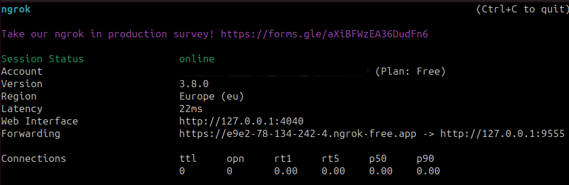
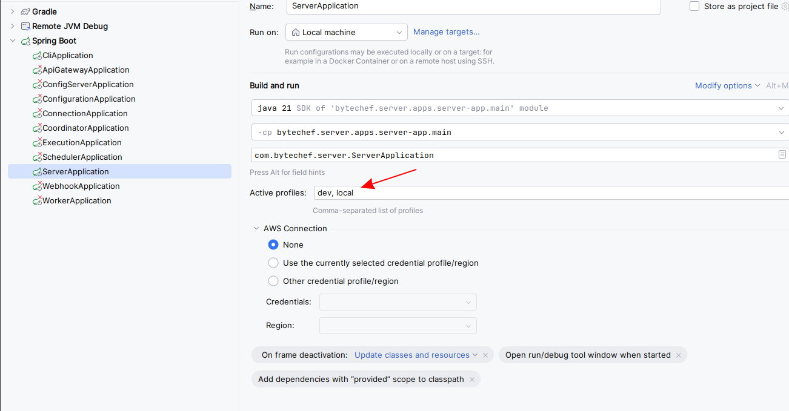

## Download and Set Up ngrok

1. Download ngrok
    - Visit [ngrok's download page](https://ngrok.com/download) and download the appropriate version for your operating system
2. Start ngrok
    - Open a terminal and run the following command to start ngrok:
   ```bash
   ngrok http http://127.0.0.1:9555
   ```
    - Copy the first address listed under "Forwarding". This will be used as your webhook URL.
      

## If You Are Using IntelliJ IDEA

1. Open Bytechef Codebase:
    - Navigate to bytechef/server/apps/server-app/src/main/resources/config.
2. Create Local Configuration:
    - Create a file named `application-local.yml`.
    - Note: `application-local.yml` is optional, git-ignored, and corresponds to the `local` Spring profile. Ensure the `local` profile is activated on Spring Boot startup.
3. Configure Webhook URL:
    - Add the following configuration to `application-local.yml`, replacing `(first address under Forwarding)` with the copied ngrok URL:
   ```
   bytechef:
         webhook-url: (first address under Forwarding)/webhooks/{id}
     ```
4. Activate Local Profile:

- Ensure that the `local` profile is added to active profiles in your IntelliJ configuration.
  

5. Start the ByteChef application.

## If You Are Not Using IntelliJ

1. Set Webhook URL:
    - Open a terminal and paste the following command, replacing (first address under Forwarding) with the copied ngrok URL:
   ```
    export BYTECHEF_WEBHOOK_URL=(first address under Forwarding)/webhooks/{id}
    ```
2. Start the ByteChef application.
