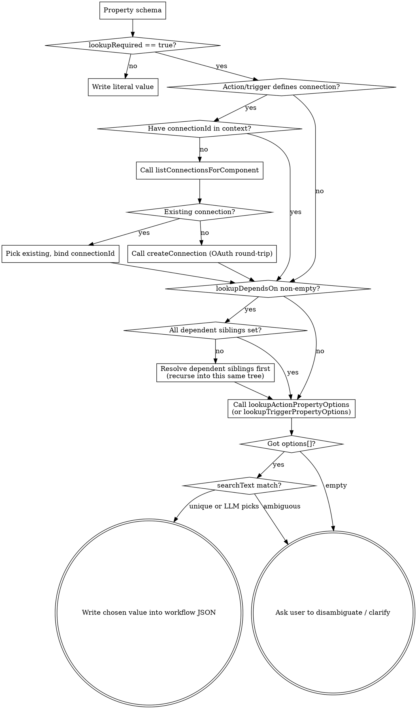

# AI Hub Property Options Lookup — Design Spec

**Date:** 2026-05-23
**Status:** Draft
**Author:** Ivica Cardic
**Related:** `automation-ai-hub`, `mcp-tool-platform`, `platform-component`

## Problem

When AI Hub's `workflow_builder` subagent constructs a workflow from a natural-language prompt like

> "Schedule a 'good morning' message to the Slack channel `standup` every day at 8am"

it writes the literal user-supplied string into the action's `channel` property:

```json
"slack1": {
  "type": "slack/v1/sendChannelMessage",
  "parameters": {
    "channel": "standup",
    "text": "good morning"
  }
}
```

But `slack/v1/sendChannelMessage` defines `channel` as a `string` property that requires a Slack channel **ID** (e.g. `C0123ABCD`), not a name. The action's options function `SlackUtils::getChannelIdOptions` is what the workflow editor calls to populate the dropdown that converts name → ID. The agent does not call it; the agent does not know it exists. The shipped workflow fails at runtime with `channel_not_found`.

The same class of bug exists across every component whose property takes an ID resolved from the connected account: Google Sheets spreadsheet IDs, Notion database IDs, Airtable base IDs, GitHub repo IDs, HubSpot pipeline IDs. It is the single largest correctness gap between an LLM-built ByteChef workflow and one built in the visual editor.

## Goal

Make the workflow_builder subagent reliably resolve dynamic-options properties to their canonical values, by:

1. surfacing per-property metadata (`lookupRequired`, `lookupDependsOn`) so the LLM **knows** a property needs lookup;
2. exposing two new tool callbacks (`lookupActionPropertyOptions`, `lookupTriggerPropertyOptions`) that wrap the existing platform facades; and
3. pinning a system-prompt rule that makes calling those tools mandatory whenever the metadata says so.

## Non-goals

Explicitly out of scope for this iteration:

- **Static options surfacing.** Properties using only inline `.options(option("X"), option("Y"))` are left alone. They already render as inline enums in property descriptions.
- **Cluster element properties.** `ClusterElementDefinitionFacade.executeOptions` exists, but cluster elements (AI tools, RAG, chat-memory) rarely use dynamic options today. Cover in a follow-up if a real case appears.
- **Workflow-load-time placeholder resolution.** No `{{__resolve:standup}}` protocol; connection-first ordering is the chosen flow.
- **Server-side disambiguation / ranking.** Pass-through only. The tool returns whatever the facade returns.
- **Pagination of huge option lists.** Discover the pain in production before adding a `cursor` field.
- **Caching.** No in-process cache. Same lookup repeated in a turn re-calls the facade.
- **Component-author opt-out.** Every property with `OptionsDataSource` is `lookupRequired: true`. No `.lookupOptional()` escape hatch unless a real component proves it's needed.
- **The `workflow_chat` agent.** This spec covers only the `workflow_builder` subagent. `workflow_chat` runs already-built workflows and doesn't set property values.

## Architecture

Three coordinated changes, all additive:

### 1. Property serialization extends with two fields

In `mcp-tool-platform`'s `ToolUtils.generateParametersJson(properties)`, for each property whose runtime type implements `OptionsDataSourceAware` and whose `getOptionsDataSource()` returns non-null, emit two additional JSON fields in the property description:

```json
"channel": {
  "type": "string",
  "title": "Channel ID",
  "description": "ID of the channel, private group, or IM channel to send message to.",
  "required": true,
  "lookupRequired": true,
  "lookupDependsOn": []
}
```

For Google Sheets `sheet` property: `"lookupDependsOn": ["spreadsheetId"]`.

This change benefits every MCP consumer (not just AI Hub) — additive, no existing consumer breaks on the new fields.

The implementers of `OptionsDataSourceAware` that need to be handled by the serializer (verified via grep): `StringProperty`, `IntegerProperty`, `NumberProperty`, `DateProperty`, `DateTimeProperty`, `TimeProperty`, `ArrayProperty`, `ObjectProperty`.

### 2. Two new tool callbacks

Registered on the workflow_builder **subagent** (not the parent ai_hub agent), via `.defaultToolCallbacks(...)` in `WorkflowBuilderConfiguration.workflowBuilderChatClient(...)`. The workflow_builder is the agent that constructs workflow JSON; its existing `defaultTools(componentTools, taskTools, ...)` chain adds Spring AI `@Tool`-annotated bean methods, and `defaultToolCallbacks(...)` composes additional `ToolCallback` instances onto the same chat client. Both follow the established pattern from `ListConnectionsForComponentToolCallback`:

- `LookupActionPropertyOptionsToolCallback` — wraps `ActionDefinitionFacade.executeOptions(componentName, componentVersion, actionName, propertyName, inputParameters, lookupDependsOnPaths, searchText, connectionId)`
- `LookupTriggerPropertyOptionsToolCallback` — wraps `TriggerDefinitionFacade.executeOptions(...)` (symmetric signature)

Both must:

- Resolve `AiHubToolInvocationContext.fromToolContext(toolContext)` for workspaceId/userId/environmentId.
- Rehydrate the user's `SecurityContext` via `SecurityUtils.runAs(user.getLogin(), authorities, action)` before calling the facade, because Reactor scheduler threads don't inherit the HTTP request's principal (same gotcha solved by `ListConnectionsForComponentToolCallback#withUserSecurityContext`).
- Return structured JSON envelopes (success or one of four error envelopes — see Tool Contracts), never throw to the LLM.
- Record one of the standard outcome labels on `AiHubToolAttachMetrics`.

A shared helper class `PropertyOptionsResolver` carries the SecurityContext rehydration and envelope building; the two tool callbacks differ only in which facade they delegate to. The helper lives alongside the two callbacks in `com.bytechef.ee.automation.aihub.tool` (the same package as `ListConnectionsForComponentToolCallback`) so the dependency graph stays inside `automation-ai-hub-service`.

### 3. System-prompt rule

Added to `prompt_workflow_builder.txt`. The file lives in `server/ee/libs/ai/ai-copilot/ai-copilot-service/src/main/resources/` (loaded by both `ai-copilot-service` and `automation-ai-hub-service` via classpath in monolithic deployments). Editing affects both consumers, which is the intended scope — both use the same workflow_builder subagent semantics.

> When a property's schema includes `"lookupRequired": true`, you MUST call `lookupActionPropertyOptions` (or `lookupTriggerPropertyOptions` for trigger properties) before writing a value. Pass the `connectionId` you have already resolved for this component. If the schema also lists `lookupDependsOn`, place values for those siblings first and include them in `inputParameters`. Write the returned `value` into the workflow JSON — never the `label`, never a guess. If the lookup returns an empty list or ambiguous candidates, ask the user to clarify rather than picking.

## Tool Contracts

### Input schema (action variant; trigger variant is identical modulo `actionName` → `triggerName`)

```json
{
  "type": "object",
  "properties": {
    "componentName":    {"type": "string"},
    "componentVersion": {"type": "integer", "description": "Defaults to 1"},
    "actionName":       {"type": "string"},
    "propertyName":     {"type": "string", "description": "Property name. Dotted paths descend into nested children: parent.child for ObjectProperty, arrayProp[].child for ArrayProperty item types, or arrayProp.child when the array has a single object item type."},
    "connectionId":     {"type": "integer", "description": "From listConnectionsForComponent or createConnection. Required when the action defines a connection."},
    "searchText":       {"type": "string", "description": "Optional user-supplied name/keyword (e.g. 'standup'). Some components filter server-side; others ignore."},
    "inputParameters":  {"type": "object",  "description": "Sibling property values already chosen, needed when the property's lookupDependsOn is non-empty (e.g. {\"spreadsheetId\": \"abc\"})."}
  },
  "required": ["componentName", "actionName", "propertyName"]
}
```

### Success envelope

```json
{
  "componentName": "slack",
  "actionName":    "sendChannelMessage",
  "propertyName":  "channel",
  "options": [
    {"label": "standup",    "value": "C0123ABCD"},
    {"label": "standup-eu", "value": "C0987XYZW"}
  ]
}
```

`value` preserves the option's underlying type (string, integer, etc.) as the facade returns it. The system-prompt rule pins "write `value`, never `label`."

### Error envelopes

All errors are structured JSON, never raised as exceptions to the LLM. Four shapes:

**1. Connection required.** Action defines a connection but `connectionId` is null:

```json
{"error": "connection_required",
 "componentName": "slack",
 "hint": "No connectionId supplied. Call listConnectionsForComponent for 'slack' to pick an existing one, or createConnection to make a new one, then retry."}
```

**2. Dependency missing.** Property's `lookupDependsOn` includes a path that isn't present in `inputParameters`:

```json
{"error": "dependency_missing",
 "missing": ["spreadsheetId"],
 "hint": "Place values for these siblings first and include them in inputParameters, then retry."}
```

**3. No options for property.** Property has no `OptionsDataSource` (LLM called the tool unnecessarily):

```json
{"error": "no_options_for_property",
 "hint": "This property does not have dynamic options. Set the value directly per the property's description."}
```

**4. Runtime failure.** Component threw (rate limit, auth, etc.):

```json
{"error": "lookup_failed",
 "reason": "Slack API returned 429: rate_limited",
 "hint": "Surface this to the user; do not invent a value."}
```

Uses the existing `ToolErrors.runtimeFailure(jsonMapper, ToolClass.class, TOOL_NAME, exception)` helper for consistent formatting and log sanitization.

### Connection-less action edge case

For actions whose `ComponentDefinition` does not declare a connection (e.g., a "format date" utility), `connectionId` is allowed to be null and `connection_required` is NOT returned. The tool must inspect the action definition and short-circuit the connection check when the action has no connection requirement.

## Per-property decision tree

The system-prompt rule expects the workflow_builder subagent to run this algorithm for every property it is about to set:



### Invariants the flow makes explicit

- **Dependency ordering is recursive.** If `sheet` depends on `spreadsheetId`, and `spreadsheetId` itself is `lookupRequired`, the agent resolves `spreadsheetId` (which may need its own connection-pick and lookup) before fetching `sheet` options.
- **Connection resolution must precede first lookup.** No `connectionId` ⇒ `connection_required` error envelope ⇒ agent must list/create first. There is no "try lookup without connection" branch.
- **No silent fallback to literal.** If lookup returns empty or ambiguous, the agent's only options are (a) ask the user, or (b) report inability to build. It never writes a guessed value.
- **`searchText` is opportunistic.** The agent passes whatever fragment the user gave, but doesn't treat the result as authoritative when more than one candidate comes back — it asks the user.

## Testing

### Unit tests

Mirror the structure of `ListConnectionsForComponentToolCallbackTest`:

- `LookupActionPropertyOptionsToolCallbackTest`
- `LookupTriggerPropertyOptionsToolCallbackTest`

Each covers:

- Each error envelope: missing required input, no workspace context, `connection_required`, `dependency_missing`, `no_options_for_property`, runtime failure (component throws)
- Happy path: facade returns 2 options → envelope contains both with preserved value types
- `SecurityContext` rehydration: invocation context with userId → facade sees the rehydrated principal; null userId → falls through cleanly
- Connection-less action edge case: action has no connection definition, `connectionId: null`, lookup still succeeds (no spurious `connection_required`)

### Serializer tests

New test class `ToolUtilsGenerateParametersJsonLookupMetadataTest`:

- Property with non-null `OptionsDataSource` and empty `optionsLookupDependsOn` → `lookupRequired: true, lookupDependsOn: []`
- Property with `optionsLookupDependsOn: ["spreadsheetId"]` → both fields populated correctly
- Property with no `OptionsDataSource` → neither field emitted (no regression for non-lookup properties)
- Static-options property (only inline `.options(...)` calls, no `OptionsDataSource`) → neither field emitted (this iteration leaves static options alone)
- All `OptionsDataSourceAware` types covered: `StringProperty`, `IntegerProperty`, `NumberProperty`, `DateProperty`, `DateTimeProperty`, `TimeProperty`, `ArrayProperty`, `ObjectProperty`

### Manual smoke test

Documented in this spec, not automated:

1. Open AI Hub, fresh workspace with one Slack connection bound to a workspace containing a `#standup` channel.
2. Prompt: "Send a 'good morning' message to the slack channel standup every day at 9am"
3. Verify the produced workflow has `"channel": "C<actual_id>"`, not `"channel": "standup"`.
4. Repeat with no Slack connection in the workspace: verify the agent surfaces a `createConnection` step before placing the channel value.
5. Repeat with two `#standup` channels (e.g. via two Slack connections): verify the agent asks the user to disambiguate rather than guessing.

LLM-behavioural test of the system-prompt rule itself is intentionally not automated — those tests are flaky. The rule's effectiveness is measured by the smoke test plus production metrics.

## Metrics

The two tool callbacks emit via the existing `AiHubToolAttachMetrics.recordStateVisibility(tool, outcome)` counter rather than introducing new counter names. The shared counter is `bytechef_ai_hub_tool_attach_state_visibility{tool, outcome}`:

- `tool=lookupActionPropertyOptions` — outcomes: `success`, `empty`, `connection_required`, `dependency_missing`, `no_options_for_property`, `error`
- `tool=lookupTriggerPropertyOptions` — same outcome set

**Implementation note (deviation from the original spec draft):** the original draft proposed two new counter names (`bytechef_ai_hub_tool_lookup_action_property_options`, `bytechef_ai_hub_tool_lookup_trigger_property_options`). During implementation we re-used the existing shared counter with a `tool` tag instead — same dimensional fidelity, fewer counter registrations, consistent with how `listConnectionsForComponent` and the other state-visibility tools report. The `AiHubToolAttachMetrics` Javadoc is updated to document the expanded outcome set.

Per the workspace-cardinality convention from `CLAUDE.md` (workflow-chat metrics section), we do not tag workspace by default. If a deployment with bounded tenants wants per-workspace insight, add a parallel counter the same way `bytechef_workflow_chat_turn_by_workspace` does.

Operational interpretation:

- Spikes in `connection_required` → agents are skipping the listConnections step; the system prompt or action-description wording needs adjustment.
- Spikes in `dependency_missing` → system prompt isn't communicating the dependency invariant well.
- Spikes in `error` → a specific component's options function is broken; tag the log with `componentName` for triage.

## Backwards compatibility

- Adding `lookupRequired` and `lookupDependsOn` to property JSON is additive. MCP consumers ignoring unknown JSON Schema extensions are unaffected.
- The two new tool callbacks are additive registrations; no existing tool changes name or contract.
- No database migrations, no enum changes, no API breaking changes.

## Open questions to verify in implementation

- Does `SlackUtils::getChannelIdOptions` actually honor `searchText` server-side? If not, the tool returns the full channel list and the LLM scans — acceptable for v1 but a candidate for follow-up server-side filtering.
  - **Status: deferred to Task 10 (manual smoke test) — not blocking v1.** The Slack channel-options function is opaque to the tool callback; the LLM-scan fallback works for typical workspaces (<200 channels) but should be measured on the operator's actual workspace.
- What is the runtime cost (ms) of a typical `executeOptions` call from inside a tool-callback round-trip? If it adds notable latency per property, we may want a per-turn cache after all.
  - **Status: deferred — measure after first production rollout.** No in-process cache shipped in v1 (per Non-goals). The metric `bytechef_ai_hub_tool_attach_state_visibility{tool=lookupActionPropertyOptions, outcome=success}` rate plus end-to-end agent turn latency are the operational signals to watch.
- The `inputParameters` shape the LLM passes — does the facade expect Java types (e.g. `Long`) or strings the facade coerces? Verify with an existing dependent-options component (Google Sheets sheet → spreadsheetId).
  - **Status: not verified end-to-end in code; only the gate path is tested with stubbed dependencies.** The facade contract (`ActionDefinitionFacade.executeOptions`) takes `Map<String, ?>` so type coercion is the facade's responsibility, not the tool's. If the LLM passes `inputParameters: {"spreadsheetId": 123}` for what should be a string, the facade's own coercion (or the underlying component's options function) handles it — this matches how the workflow editor already calls `executeOptions`.

## Risks

- **System-prompt rule may be ignored.** LLM compliance with hard rules in long system prompts is not guaranteed. The smoke test and `connection_required` metric will surface drift early.
- **Action definitions without options-marked connections.** Some components may have dynamic options that depend on global config (rare). The spec assumes connection-bound options are the common case; the connection-less edge case is handled but not exhaustively tested across all 180+ components.
- **Spring AI tool schema strictness.** The Spring AI `ToolDefinition` JSON schema validator may reject the optional `inputParameters` object if the LLM passes a non-object. Verify during implementation; fall back to a permissive `Map<String, Object>` deserialize.
- **SecurityContext propagation across subagent boundary.** Parent ai_hub agent invokes the workflow_builder subagent via `WorkflowBuilderToolCallback.call(toolInput, toolContext)`. Tool calls inside the subagent's chain receive a fresh `ToolContext`; the `AiHubToolInvocationContext` from the parent must be forwarded (or re-resolved from `SecurityContext`) for the rehydration helper to work. Verify during Task 5 of the plan; if forwarding is missing, add it to `WorkflowBuilderToolCallback`.
  - **Status: confirmed missing and fixed.** Commit `dd18a31121b` adds `.toolContext(toolContext == null ? Map.of() : toolContext.getContext())` to the subagent's `ChatClient` invocation in `WorkflowBuilderToolCallback`. End-to-end verification still depends on the operator's manual smoke test (Task 10); failure mode is the `"Workspace context unavailable"` error envelope from the lookup tools.
  - **`ResearchToolCallback` has the same gap** (no forwarding). Out of scope for this feature — research subagent does not register any workspace-scoped tools today. Follow-up if/when it does.
